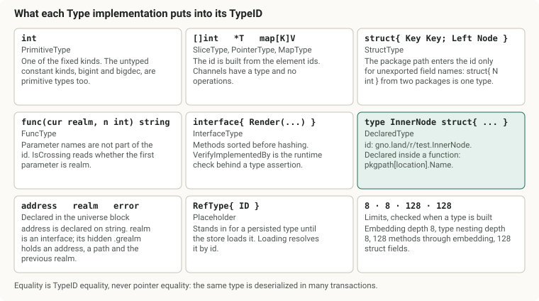
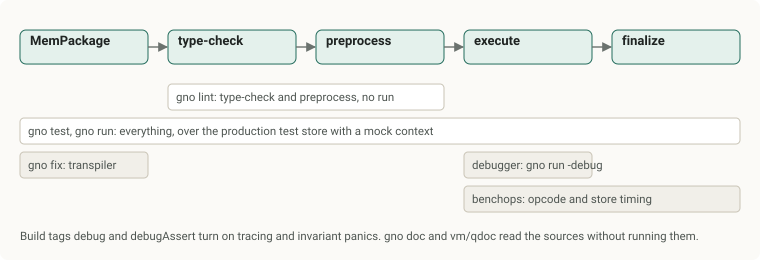

# How the GnoVM works

Measured against [gnolang/gno at a7e4c34b0][gno-tree], 2026-05-24. Every code
link points at that commit, so the line numbers hold.

## TLDR

The GnoVM is a tree-walking interpreter for Gno, a dialect of Go, written in Go.
It parses `.gno` source with Go's own parser, type-checks it with Go's own type
checker, rewrites the syntax tree once so that every name is an index and every
constant is folded, then runs that tree on a stack machine that pops one opcode
at a time. Every value carries its type, every object reachable from a realm's
package variables is written to a key-value store when the realm call returns,
if it is new or changed, and every opcode, allocation and store access is billed
in gas.

## Who this is for

A reader who knows Go and has never opened the GnoVM. Each section states the
rule, shows the code that enforces it, and names the file to open next. Read the
vocabulary once, then the sections in order, since each builds on the one before
it.

## Vocabulary

| Term | Meaning |
| --- | --- |
| Gno | A Go dialect for smart contracts. Goroutines, channels, generics, `unsafe`, `reflect` and any OS or network access are missing. Two builtin types are added, `address` and `realm`, and two untyped constant kinds, `bigint` and `bigdec`. |
| GnoVM | The interpreter, in the Go package [`gnovm/pkg/gnolang`][gnolang-dir]. `gno.land` and the `gno` command both embed it. |
| package path | The import path of a Gno package, such as `gno.land/r/demo/counter`. The letter after the domain says what the package is. |
| realm | A package under `/r/`. Its package-level variables persist between transactions. It has an address and can hold coins. |
| pure package | A package under `/p/`. It has no persistent state and can be imported by anything. |
| ephemeral package | A package under `/e/<address>/run`, created by `gnokey maketx run`. It runs a `main` once and is never stored. |
| standard library | Packages with no domain in the path, `strings` or `chain/runtime`. They live in [`gnovm/stdlibs`][stdlibs-dir]. |
| MemPackage | A package as a list of file names and bodies, the unit that is uploaded, type-checked, run and stored. |
| AST | The syntax tree. Gno keeps its own node types, built from Go's parser output. |
| preprocess | The one-time pass over the AST that resolves every name to a numbered slot, folds constants, computes static types and checks the crossing rules. It is the GnoVM's compiler. |
| block | One scope at runtime: a function call, a loop body, an `if` arm. A block holds a slice of typed values, one per name declared in that scope. |
| typed value | The universal value cell: a type, a value and eight bytes of inline storage for numbers. |
| object | A value with identity that can be persisted on its own: struct, array, map, function, block, package, heap item, bound method. |
| real, unreal | A real object has been assigned a persistent id and saved. An unreal object exists only in memory during the current transaction. |
| store | The layer between the interpreter and the database. It caches objects, types and syntax trees per transaction. |
| gas | The unit in which work is billed. One gas is one nanosecond of reference hardware time. |
| allocator | The per-transaction byte counter that caps memory and charges allocation gas. |
| crossing function | A function whose first parameter is `cur realm`. Calling it as `f(cross(cur), ...)` switches the realm identity. |
| borrow | A temporary switch of the storage realm that happens without an explicit cross, so that a method can write the state it belongs to. |
| finalize | The step at the end of a realm call that walks new and changed objects, assigns ids, saves them and deletes the unreferenced ones. |

## Where the VM sits


Tendermint2 orders transactions into blocks and hands each one to the
application over the ABCI interface. The application is a tm2 `BaseApp` that
verifies the signature and fee, then [routes each message to a handler by its
route string][baseapp-runmsgs]. Messages of the `vm` route reach
[`vmHandler.Process`][handler-process], which dispatches the three message
kinds: [`MsgAddPackage`][msg-addpkg] uploads a package, [`MsgCall`][msg-call]
calls one exported function, and [`MsgRun`][msg-run] uploads a throwaway `main`
package and runs it. Read-only queries such as `vm/qeval` and `vm/qrender` go
through [the handler's query switch][handler-query] instead.

The keeper owns one long-lived [`gno.Store`][keeper-store] and creates one
`gno.Machine` per message. A Machine is the interpreter state: the stacks, the
active package and realm, the allocator, the gas meter, and a `Context` value
that the standard library reads for the block height, the caller and the banker.

The same interpreter runs with no chain at all. `gno test`, `gno run` and the
filetest runner build a Machine over an in-memory store seeded from the
repository's `examples/` and `stdlibs/` directories, with [a mock context
carrying a fixed height, timestamp and caller][test-context].

## Source tree

| Path | What it holds |
| --- | --- |
| [`gnovm/pkg/gnolang`][gnolang-dir] | The VM: syntax tree, types, values, preprocessor, machine, opcodes, realms, store. |
| [`gnovm/stdlibs`][stdlibs-dir] | The standard library as `.gno` source plus Go files for native bindings. |
| [`gnovm/tests/files`][tests-files] | About 1700 filetests: Gno programs with expected output in trailing comments. |
| [`gnovm/tests/stdlibs`][tests-stdlibs] | The `testing` package and overrides that only exist while testing. |
| [`gnovm/pkg/test`][pkg-test] | The test harness: store construction, filetest directives, package loading. |
| [`gnovm/cmd/gno`][cmd-gno] | The `gno` command: `test`, `run`, `lint`, `fmt`, `doc`, `fix`, `repl`, `tool transpile`. |
| [`gnovm/pkg/transpiler`][transpiler-dir] | Gno to Go source translation, used by `gno lint` and `gno fix`. |
| [`gnovm/pkg/doc`][doc-dir] | The `gno doc` engine and the JSON documentation served by `vm/qdoc`. |
| [`gnovm/pkg/packages`][packages-dir], [`gnovm/pkg/gnomod`][gnomod-dir] | Package discovery on disk and the `gnomod.toml` manifest. |
| [`gnovm/pkg/benchops`][benchops-dir] | Optional per-opcode and per-store timing, used to calibrate gas. |
| [`gnovm/cmd/calibrate`][calibrate-dir], [`gnovm/cmd/benchstore`][benchstore-dir] | The benchmarks that produced the gas constants. |
| [`gnovm/adr`][adr-dir] | Design records. The ones worth reading are named at the end. |
| [`gno.land/pkg/sdk/vm`][vm-dir] | The keeper that connects the VM to the chain. |

Inside `gnovm/pkg/gnolang`, the files group by stage:

| Stage | Files |
| --- | --- |
| Source to AST | [`go2gno.go`][go2gno], [`nodes.go`][nodes], [`nodes_location.go`][nodes-location], [`mempackage.go`][mempackage] |
| Type-check | [`gotypecheck.go`][gotypecheck] |
| Preprocess | [`preprocess.go`][preprocess], [`transcribe.go`][transcribe], [`transcribe_b.go`][transcribe-b], [`static_analysis.go`][static-analysis], [`type_check.go`][type-check] |
| Types and values | [`types.go`][types], [`values.go`][values], [`values_conversions.go`][values-conversions], [`uverse.go`][uverse] |
| Execution | [`machine.go`][machine], [`frame.go`][frame], `op_*.go` |
| Persistence | [`ownership.go`][ownership], [`realm.go`][realm], [`store.go`][store], [`package.go`][package-go] |
| Limits | [`alloc.go`][alloc], [`garbage_collector.go`][gc], [`native_gas.go`][native-gas], [`bounded_strings.go`][bounded-strings] |
| Tooling | [`debugger.go`][debugger], [`values_export.go`][values-export], [`gonative.go`][gonative] |


## The life of a package

A package goes through five steps between upload and its first call: it is read
into a MemPackage, type-checked, parsed into the Gno AST, preprocessed, and run
once so that its package-level variables and `init` functions execute. The
result is saved. Later calls load the saved values and skip straight to
execution.


### MemPackage and package paths

A [`MemPackage`][mempackage-std] is a name, a path, a list of files and a type
tag. A file is a name and a body. There are no timestamps, owners or
subdirectories, so the same bytes hash the same everywhere.

The path decides the kind of package. The [regular expression for user
paths][pkgpath-regex] is `<domain>/<letter>/<user>[/<repo>...]`, all lower case,
and the letter is what the predicates test: [`IsRealmPath`][isrealmpath] wants
`r`, [`IsPPackagePath`][isppkgpath] wants `p`, and
[`IsGnoRunPath`][isgnorunpath] wants `e` with a bech32 address for the user and
`run` for the repo. A path with no domain and no dots [is a standard library
path][isstdlib]. A user path whose last segment ends in `_test` is neither a
realm nor a pure package; it is a test overlay that exists only while testing.

Every package carries a `gnomod.toml` naming its module path and the Gno
language version, which is [`0.9` at this commit][gnover]. The manifest can also
mark a package `private`, which forbids other realms from persisting values of
its types, or `draft`, which only genesis may deploy.

A [`MemPackageType`][mptype] says which files the package holds: production
files only, test files too, or filetests. The keeper tags an uploaded package
[`MPUserAll`][keeper-mpuserall] and the store demotes it to production when
running it, so `_test.gno` and `_filetest.gno` files are stored but never
executed on chain.

### Type-checking with Go's type checker

Gno's own parser is deliberately lax. The comment at the top of
[`go2gno.go`][go2gno-comment] says the interpreter may fail at runtime on
invalid code, so a separate static check comes first.
[`TypeCheckMemPackage`][typecheck] feeds the `.gno` files to `go/types`, the
same package `gopls` uses, with an importer that resolves Gno import paths
through the store. Two shims make Go's checker accept Gno:

- A generated file, `.gnobuiltins.gno`, [declares the names Go does not know
  about][gnobuiltins]: `realm`, `address`, `cross`, `revive`, `istypednil`. The
  `realm` interface it declares lists the methods a captured realm value has,
  `Address`, `PkgPath`, `Previous` and the `Is*` classifiers.
- The import path `gnobuiltins/gno0p9` [serves those declarations from
  memory][gnobuiltins-pkg]. It never runs on chain.

The check runs in [three modes][tcmode]: strict for uploads, genesis-strict at
height zero so draft packages can be deployed, and relaxed for `MsgRun` scripts,
which get a manifest generated if they lack one. Checked imports are kept in a
[`TypeCheckCache`][tccache] keyed by path, so a realm importing `strings` does
not re-check the library on every upload.

### Parsing into the Gno syntax tree

[`Go2Gno`][go2gno-fn] walks the `go/ast` tree and builds Gno nodes. The Gno node
types mirror the shapes Go's parser produces, all declared in
[`nodes.go`][nodes-node], plus three additions that matter:

- [`ConstExpr`][constexpr] replaces any expression the preprocessor could
  evaluate. It carries the finished typed value.
- [`constTypeExpr`][consttypeexpr] does the same for type expressions.
- [`RefNode`][refnode] stands in for a syntax node that was persisted. It
  carries only the node's [`Location`][location], which is the package path, the
  file name and the line and column span, and the store loads the real node on
  demand.

Every node embeds [`Attributes`][attributes]: its span, a label, and a private
map of preprocessing flags such as `ATTR_PREPROCESSED`. The span is set once and
[becomes the node's identity][span-once], which is why a syntax node is never
moved or re-parented after parsing.

Nodes that open a scope embed a [`StaticBlock`][staticblock] and satisfy
[`BlockNode`][blocknode]: package, file, function declaration, function literal,
block statement, `for`, `range`, `if` arm, `switch` clause. The static block
records the names declared in that scope, their static types, their sources, and
which of them must live on the heap.

### Preprocessing, the compile step

[`Preprocess`][preprocess-fn] takes a parent block node and a syntax tree and
returns the same tree, rewritten. Nothing executes until this pass has finished,
and a file is preprocessed exactly once. [`PredefineFileSet`][predefine] runs
first over all files of a package because declarations can reference each other
across files in any order. The work is:

1. **Loop variable renaming.** [`initStaticBlocks1`][initsb1] appends `.loopvar`
   to every name declared in a three-clause `for` init, and to its uses, so it
   cannot collide with a same-named declaration in the body. The dot makes the
   name unspellable from source.
2. **Name reservation.** [`initStaticBlocks2`][initsb2] walks every scope and
   reserves a slot for each declared name, in declaration order. Hidden names
   get dots too: [unnamed parameters become `.arg_0`][hidden-args], unnamed
   results become `.res.0`, [each `init` becomes `init.<n>`][init-suffix] so a
   package can have many, and a blank method receiver becomes `.recv`.
3. **Predefinition.** Imports, then types, then functions, then values, [each
   with its dependencies resolved recursively][predefine-order]. [Imports load
   the package value from the store][import-load], and a pure package [may not
   import a realm][p-imports-r]. A `var a, b = 1, a` declaration [is split into
   one declaration per name][split-vardecl]. Types are created empty and sealed
   once their bodies are known, so recursive types work.
4. **The main walk.** [`preprocess1`][preprocess1] uses
   [`Transcribe`][transcribe-fn], a generic visitor that calls back on entering
   a node, on entering a block, and on leaving. On leave, each node is finished:
   - A [`NameExpr` gets a `ValuePath`][nameexpr-leave]: the number of scopes to
     climb and the slot index there. A name that resolves to a constant or a
     builtin [becomes a `ConstExpr`][nameexpr-const]. A name that refers to a
     package [is only legal in a selector][pkg-selector-only].
   - A [`CallExpr`][callexpr-leave] has its function type evaluated. A call to a
     type is a conversion. A call to a crossing function [must carry `cur` or
     `cross(rlm)` first][crossing-arg-check], and `defer f(cross(rlm))` [is
     rejected][defer-cross].
   - A [`SelectorExpr`][selector-leave] is resolved through embedded fields into
     a trail of value paths, and a method on a pointer receiver called on a
     value [gets an address-of inserted][selector-addr].
   - Binary and unary expressions on constants are folded. Untyped constants are
     converted to their context type or their default type.
   - Every function with results [is checked to terminate][analyze] the way Go's
     compiler checks it.
5. **The codas.** Three more walks finish the tree.
   [`codaInitOrderDeps`][coda-initorder] records which package variables each
   declaration reads, including through method bodies.
   [`codaHeapDefinesByUse`][coda-heap] finds every local that is captured by a
   closure or has its address taken and marks its slot as a heap item.
   [`codaPackageSelectors`][coda-pkgsel] rewrites a bare reference to a
   package-level name into a selector on the package itself, so a closure never
   depends on its parent block.

Static evaluation during this pass runs the interpreter itself:
[`evalStaticType`][evalstatictype] and [`evalConst`][evalconst] push the
expression on a Machine and run it in [`StagePre`][stage], the stage in which
untyped conversions are permitted.

When the walk ends, [`SaveBlockNodes`][saveblocknodes] stores every block node
by its location. Block nodes [are not written to the
database][setblocknode-nodb]; on restart the keeper [re-preprocesses every
stored package][preprocess-all] to rebuild them.


### Running the package once

[`runMemPackage`][runmempackage] ties the steps together: sort the files, parse,
create the [`PackageNode`][packagenode] and its [`PackageValue`][packagevalue],
preprocess each file, then [`runFileDecls`][runfiledecls] executes the
package-level variable declarations. The order follows the Go specification:
[Kahn's topological sort over the recorded dependencies, breaking ties by
declaration order with a min-heap][kahn]. A dependency cycle panics with the
chain of names. The design is in [the initialization-order
record][adr-initorder].


Then the package is saved for the first time, [every `init.<n>` function runs in
file order][runinit] with the deployer as the previous realm, and the package is
saved again. Types declared by the package [are stored under their type
id][settype-own], skipping aliases of types that belong elsewhere.

## Types

[`Type`][type-iface] is an interface with a `Kind`, a `TypeID`, a package path
and an element type. Type equality is never pointer equality, because the same
type is deserialized in many transactions; it is [`TypeID`
equality][typeid-comment], a deterministic string.

| Type | Go equivalent | Notes |
| --- | --- | --- |
| [`PrimitiveType`][primitivetype] | `bool`, `string`, the integers, `float32`, `float64` | Also the untyped constant kinds, including `UntypedBigintType` and `UntypedBigdecType`. `DataByteType` is an internal view into a byte array. |
| [`ArrayType`][arraytype], [`SliceType`][slicetype], [`PointerType`][pointertype], [`MapType`][maptype], [`ChanType`][chantype] | the same | Channels have a type but no operations; `OpChanType` panics. |
| [`StructType`][structtype] | `struct{...}` | Carries the declaring package path. The type id [includes the package path only for unexported field names][structtype-id], so `struct{ N int }` from two packages is one type. |
| [`InterfaceType`][interfacetype] | `interface{...}` | Methods are sorted before hashing. [`VerifyImplementedBy`][verifyimpl] is the runtime check behind type assertions. |
| [`FuncType`][functype] | `func(...)` | Parameter names are [not part of the type id][functype-id]. [`IsCrossing`][functype-iscrossing] reads whether the first parameter is `realm`. |
| [`DeclaredType`][declaredtype] | `type T U` | Name, package path, base type, method list. The id is [`pkgpath.Name`][declaredtypeid], or `pkgpath[location].Name` for a type declared inside a function. |
| [`TypeType`][typetype], [`PackageType`][packagetype] | none | A type as a value, a package as a value. |
| [`blockType`][blocktype], [`heapItemType`][heapitemtype], [`tupleType`][tupletype], [`RefType`][reftype] | none | Internal. `RefType` is a type id standing in for a persisted type until loaded. |

Gno adds builtin declared types in [`uverse.go`][uverse]: [`error`][gerror],
[`address`][gaddress] with base `string`, and [`realm`][grealm], an interface
whose concrete implementation is the hidden struct [`.grealm`][gconcreterealm]
holding an address, a package path and a pointer to the previous realm.

Four limits bound adversarial type shapes, each enforced when a type is built:
[embedding depth 8][maxembeddepth], [type nesting depth 8][maxtypedepth], [128
methods through embedding][maxinterfacemethods] and [128 struct
fields][maxstructfields].



Selectors compile to a [`ValuePath`][valuepath]: a kind, a depth and an index.
`VPBlock` climbs `Depth - 1` parent blocks and takes slot `Index`. `VPField`
indexes a struct. `VPValMethod` and `VPPtrMethod` index a declared type's method
list, and the `Deref` variants first dereference a pointer. The preprocessor
computes the trail once with [`findEmbeddedFieldType`][findembedded]; the
runtime follows it with `GetPointerTo`.

## Values and the memory model

Every slot in the VM, a variable, a struct field, an array element, a map key or
value, is a [`TypedValue`][typedvalue]: a type `T`, a value `V`, and eight bytes
`N`. Fixed-size numbers live in `N` and never allocate. The magic value
[`N_Readonly`][nreadonly] in `N` marks a composite value that was read from
another realm's storage and may not be written through.


[`Value`][value-iface] has sixteen implementations. The ones that are also
[`Object`][object-iface] have identity and can be saved on their own.

| Value | Object | Holds |
| --- | --- | --- |
| [`StringValue`][stringvalue] | no | A Go string. |
| [`BigintValue`][bigintvalue], [`BigdecValue`][bigdecvalue] | no | Untyped numeric constants during preprocessing. |
| [`DataByteValue`][databytevalue] | no | One byte of an array stored as `[]byte`. |
| [`PointerValue`][pointervalue] | no | A slot address: a base object plus an index into it. |
| [`ArrayValue`][arrayvalue] | yes | Either a `List` of typed values or `Data` bytes for byte arrays. |
| [`SliceValue`][slicevalue] | no | A window onto an array: base, offset, length, capacity. |
| [`StructValue`][structvalue] | yes | Fields in declaration order. |
| [`FuncValue`][funcvalue] | yes | A function: its type, source location, parent block, captured heap items, and either a body or a native Go body. |
| [`BoundMethodValue`][boundmethodvalue] | yes | A method plus its receiver. |
| [`MapValue`][mapvalue] | yes | A [doubly linked list of entries][maplist] plus a Go map from encoded key to entry. Iteration follows insertion order, so it is deterministic. |
| [`TypeValue`][typevalue] | no | A type used as a value. |
| [`PackageValue`][packagevalue] | yes | A package's block plus one block per file. |
| [`Block`][block] | yes | One scope's slots, its source node, and its parent block. |
| [`RefValue`][refvalue] | no | A persisted object's id and hash, loaded on demand. |
| [`HeapItemValue`][heapitemvalue] | yes | A one-slot box around a value that escaped its block. |

Two of these carry the memory model. A **block** is created for every scope
[with one slot per declared name][newblock], and it is [gone as soon as it is
popped][block-comment]. A **heap item** is what keeps a local alive after that:
the preprocessor marks any variable that is captured by a closure or has its
address taken, `NewBlock` pre-fills that slot with a heap item, and [writes go
into the item, not over it][assigntoblock]. A closure copies the heap items it
needs into [`FuncValue.Captures`][funcvalue-captures] when it is created and
[copies them into a fresh block on every call][docall-captures]. So `&x` is a
pointer whose base is the heap item, and a persisted closure never references
the block it was born in.


Loop variables follow Go 1.22 semantics by the same mechanism. At the end of
each iteration of a three-clause `for`, [the VM replaces every heap item in the
init slots with a new one][loopvar-hiv], so each closure created in the body
holds a different item.

Copying a struct or array [copies its fields into a new object][copy], so value
semantics hold. Copying a value read from another realm [keeps the readonly
mark][copy-readonly]. Pointers, slices, maps, functions and interfaces copy as
references.

A map key is a byte string computed by [`ComputeMapKey`][computemapkey]: the
type id, a colon, then the encoded value, with arrays and structs encoded
recursively. A `NaN` key is never inserted into the index.

## The Machine

[`Machine`][machine-struct] is a handful of stacks and some context:

| Field | Role |
| --- | --- |
| `Ops` | Opcodes waiting to run. The loop pops from the end. |
| `Values` | Operands and results. |
| `Exprs`, `Stmts` | Expressions and statements waiting for their opcode. |
| `Blocks` | The scope stack. The bottom is the package block. |
| `Frames` | One [`Frame`][frame-struct] per call and per loop or switch, recording stack heights to unwind to, the callee, the receiver, deferred calls, and the package and realm to restore. |
| `Package`, `Realm` | The package whose code is running and the realm whose storage is active. They can differ. |
| `Alloc`, `GasMeter`, `Cycles` | The byte budget, the gas meter, and a cycle count for telemetry. |
| `Exception` | The panic being unwound, if any. |
| `Stage` | [`StagePre`, `StageAdd` or `StageRun`][stage]: static evaluation, package initialization, or a normal call. |
| `Context` | Opaque to the VM; the standard library asserts it to an `ExecContext`. |

Machines [come from a `sync.Pool`][machinepool] and must be released. The
constructor [inherits the per-transaction preprocess allocator from the
store][preprocess-alloc] when a sub-machine is spun up by the preprocessor, so
constant folding is billed against the same gas as execution.

### The run loop

[`Run`][run] calls [`runOnce`][runonce], which pops an opcode and dispatches it
in one large switch. Each case charges its gas first, then calls the handler.
The loop exits on `OpHalt`. If a handler raises a Go panic carrying an
[`Exception`][exception], `runOnce` recovers it, `Run` converts it into the
cooperative panic path and loops again, so half a million panicking defers cost
no Go stack, the reason recorded in [the iterative-recovery record][adr-iter].

Opcodes are one byte, [grouped by family][opcodes]:

| Range | Family | Examples |
| --- | --- | --- |
| `0x01`..`0x1D` | control | `OpExec`, `OpPrecall`, `OpCall`, `OpReturn`, `OpDefer`, `OpPanic2`, `OpIfCond`, `OpSwitchClause`, `OpPopBlock` |
| `0x20`..`0x38` | unary and binary | `OpAdd`, `OpEql`, `OpShl`, `OpUneg` |
| `0x40`..`0x52` | expressions | `OpEval`, `OpIndex1`, `OpSelector`, `OpSlice`, `OpRef`, `OpTypeAssert1`, `OpStructLit`, `OpFuncLit`, `OpConvert` |
| `0x70`..`0x78` | type construction | `OpStructType`, `OpFuncType` |
| `0x80`..`0x8E` | assignment | `OpAssign`, `OpDefine`, `OpAddAssign`, `OpInc` |
| `0x90`, `0x91` | declarations | `OpValueDecl`, `OpTypeDecl` |
| `0xD1`..`0xD7` | sticky | `OpBody`, `OpForLoop`, `OpRangeIter`, `OpReturnCallDefers` |

A sticky opcode [stays on the stack when popped][sticky]. `OpForLoop` is pushed
once and re-dispatched every iteration until the loop decides to pop it, which
is how loops run without recursion.

### How one statement runs

Take `x := a + b` inside a function. [`doOpExec`][doopexec] pops the statement
and, for a define, [pushes `OpDefine` and then `OpEval` for the right-hand
side][exec-assign]. Pushes go in reverse, so the last push runs first:

```
Ops:    OpDefine, OpEval(a + b)
```

The expression itself waits on the `Exprs` stack; the notation above shows which
expression each `OpEval` will pick up. [`doOpEval`][doopeval] sees a binary
expression and [pushes the operator and an eval for each side][eval-binary]:

```
Ops:    OpDefine, OpAdd, OpEval(b), OpEval(a)
```

A name [is the fast path][eval-name]: climb `Depth - 1` blocks, read slot
`Index`, push the value. After both, [`doOpAdd`][doopadd] pops `b`, adds it into
`a` in place [with a per-kind switch][addassign], and leaves the result on the
values stack. Floats go through [software floating point][softfloat] so every
node computes the same bits. Finally [`doOpDefine`][doopdefine] pops the result
and assigns it into the block slot, or into the heap item in that slot.

Literals are parsed at evaluation time [into untyped big integers or big
decimals][eval-lit]; the preprocessor has usually already folded them into a
`ConstExpr`, which [is just pushed][eval-const].


### Control flow

Every `for`, `range`, `switch` and function call [pushes a
frame][pushframebasic] so that `break`, `continue` and `return` know how far to
unwind. An `if` does not, it pushes a block and [expands it with the chosen
arm's names][doopifcond]. A `for` loop's block owns a [`bodyStmt`][bodystmt]
that remembers the next statement index, the condition and the post statement,
and the sticky `OpForLoop` [walks that state machine][opforloop]. `range` has
one variant each for [arrays and slices][oprangeiter],
[strings][oprangeiterstring], where each step decodes one rune, and
[maps][oprangeitermap], where each step follows the linked list. A `switch`
[tries clauses and cases one at a time][doopswitchclause], and a type switch
[compares type ids or checks interface implementation][dooptypeswitch]. `break`
and `continue` [pop frames until they find a loop with the right
label][branchstmt]; `goto` [resets the stacks to heights recorded on the body
statement][gotojump].


### Function calls

A call is three opcodes. `OpEval` on a `CallExpr` [pushes `OpPrecall`, then an
eval per argument in reverse, then an eval of the callee][eval-call].
[`doOpPrecall`][doopprecall] peeks the callee below the arguments. A type value
means conversion, so it pushes `OpConvert`. A function or bound method means a
call, so it [pushes a frame][pushframecall] and `OpCall`, adds `OpEnterCrossing`
if the callee is a crossing function, and [installs a fresh
`cur`][installcrossingcur] if the call was written with `cross(rlm)`.

[`doOpCall`][doopcall] creates the callee's block from its source node and
parent block, copies captured heap items in, pops the arguments [with variadic
packing][popcopyargs] and assigns them to the first slots, and initializes named
results to their zero values. A native function [pushes `OpReturn` and
`OpCallNativeBody`][docall-native]; a Gno function pushes `OpBody` with its
statements, plus a synthetic empty `return` when it declares no results.

Return has four flavors [chosen by the preprocessor and the frame][exec-return]:
plain `OpReturn`, `OpReturnAfterCopy` when named results live on the heap,
`OpReturnFromBlock` when a bare `return` reads named results, and, when the
frame holds deferred calls, `OpReturnToBlock` followed by the sticky
`OpReturnCallDefers`. Each [pops the frame, truncates every stack to the heights
the frame recorded, moves the results down, and restores the caller's package
and realm][popframeandreturn]. [`maybeFinalize`][maybefinalize] first checks
whether the returning frame crossed a realm boundary and, if so, finalizes the
realm's transaction.

`defer` [evaluates the function and arguments now][doopdefer] and pushes a
[`Defer`][defer-struct] onto the frame.
[`doOpReturnCallDefers`][doopreturncalldefers] pops them one at a time and runs
each like a call, then continues the return.


### Panics

Two mechanisms raise a panic. Opcode handlers call [`pushPanic`][pushpanic],
which records the exception, unwinds to the last call frame, and pushes
`OpPanic2` and `OpReturnCallDefers` so the defers run first. Go code deep in the
value layer calls [`Machine.Panic`][mpanic] or panics with an `Exception`
directly, and the run loop converts that into the same path. Exceptions [chain
to the previous one][exception-previous] when a defer panics again.

[`Recover`][recover] returns the exception only when called directly by a
deferred function, the Go rule, and clears it. If the defers finish with the
exception still set, `OpReturnCallDefers` [pops the frame and re-raises in the
caller][panic-propagate]. When the unwinding [reaches a realm
boundary][panic-boundary], the transaction aborts with an
[`UnhandledPanicError`][unhandledpanic] unless a [`revive`][revive] frame
catches it. Validator machines render panic values through [a bounded
printer][bounded] that never runs user methods and never emits more than 1024
bytes, so a hostile value cannot make the error message the expensive part.

A [`Stacktrace`][stacktrace] is built from the frames, keeping at most 128 calls
with the middle elided.


## Builtins

The universe block, [`uverse.go`][uverse], is a package named `.uverse` at the
root of every scope chain. It [defines the basic types, `true`, `false`, `nil`
and `iota`][uverse-defs], then the builtin functions: [`append`][uv-append],
[`cap`][uv-cap], [`copy`][uv-copy], [`delete`][uv-delete], [`len`][uv-len],
[`make`][uv-make], [`new`][uv-new], [`print`][uv-print],
[`println`][uv-println], [`panic`][uv-panic], [`recover`][uv-recover], and the
Gno additions [`cross`][uv-cross], [`attach`][uv-attach], which is reserved and
panics, [`istypednil`][uv-istypednil] and [`revive`][uv-revive]. Each is a
`FuncValue` whose body is a Go closure over the Machine, installed by
[`DefineNative`][definenative]; the same mechanism gives `address` and `.grealm`
their methods.

Three hidden names exist for the compiler's own use, [`.cur`, `.origin` and
`cross1`][uverse-hidden]. Their leading dot or reserved spelling means user
source cannot produce them.


## Realms and persistence

### Identities

A realm's id, [`PkgID`][pkgid], is the SHA-256 of its path, [truncated to 20
bytes][hashbytes], with [the top four bits replaced by flags][pkgid-flags]:
standard library, immutable, internal. Immutable covers standard library and
pure packages, whose objects are never reference-counted from other realms.

An object's id, [`ObjectID`][objectid], is a `PkgID` and a counter, `NewTime`.
The package value itself [is always `NewTime` 1][pkg-newtime]. The id has [three
states][objectid-states]: empty before the allocator has seen it, allocated once
the allocator [stamps the realm that created it][stamppkgid] with `NewTime`
still zero, and finalized once [`assignNewObjectID`][assignnewobjectid] takes
the next counter value from the owning realm. Only a finalized object is real.


### Ownership, reference counts, escape

[`ObjectInfo`][objectinfo] is embedded in every object: id, hash, owner id,
modification time, reference count, an escaped flag, the last serialized size,
and transient dirty, deleted and new-real marks.

The rules, stated in [the header of `ownership.go`][ownership-doc]:

- An object with exactly one reference is owned by the object that holds it, and
  its hash is folded into the owner's bytes. A tree of such objects is one
  Merkle chain.
- An object that reaches two references **escapes**: its owner is cleared, it is
  saved on its own, and [its hash is written to the IAVL store][setobject-iavl]
  under its id. Once escaped, always escaped. The separate Merkle index of
  escaped hashes [is a stub at this commit][savenewescaped].
- An object whose count drops to zero is deleted with everything it owned.
- Cycles are not supported; the comment names them for a later phase.


### Every write reports itself

Each assignment into an object goes through [`PointerValue.Assign2`][assign2],
which reads the old child object, writes, reads the new one, and calls
[`Realm.DidUpdate`][didupdate] with the parent, the old child and the new child.
`DidUpdate` marks the parent dirty, increments the new child and marks it
new-real or escaped, decrements the old child and marks it deleted at zero. It
[panics if the parent belongs to another realm][didupdate-pkgid], which is an
invariant, because the write path [checks the readonly rules before the
write][popaspointer2]. With no realm active it still [refuses to mutate a real
object of an immutable package outside package
initialization][didupdate-immutable].

### Finalization

[`FinalizeRealmTransaction`][finalize] runs when a call [returns across a realm
boundary][isrealmboundary], and again after package initialization. In order:

1. [`processNewCreatedMarks`][processnewcreated] walks every object marked
   new-real, assigns ids depth-first, and increments the counts of their
   children, which may make more objects real.
2. [`processNewDeletedMarks`][processnewdeleted] walks objects whose count hit
   zero and decrements their children, recursively.
3. [`processNewEscapedMarks`][processnewescaped] demotes objects that ended the
   transaction with one reference and confirms the rest as escaped.
4. The realm record is saved if its counter moved.
5. [`markDirtyAncestors`][markdirtyancestors] walks up from every changed object
   to the package block, so parent hashes are refreshed. The owner is read from
   the persisted owner id, a fix recorded in [the owner record][adr-owner].
6. [`saveUnsavedObjects`][saveunsaved] writes new and dirty objects, children
   first, after [checking that nothing references a private package's
   types][assertpublic].
7. [`removeDeletedObjects`][removedeleted] deletes the dead ones.
8. Byte deltas per realm are added to the store's storage-diff map, one entry
   per realm touched, since an object [is always saved under the realm that
   allocated it][saveobject-route] even when another realm's code did the
   saving.


### Serialization

[`Store.SetObject`][setobject] does not write the live object. It writes a
[persist copy][copyvaluewithrefs] in which every child object becomes a
[`RefValue`][refvalue] holding the child's id and hash, every declared type
becomes a [`RefType`][reftype] holding its type id, and every syntax node
becomes a [`RefNode`][refnode] holding its location. The copy is
[amino][amino-readme]-encoded, the encoding's SHA-256 [truncated to 20 bytes is
the object's hash][setobject-hash], and `hash || bytes` is written under the key
`oid:<pkgid>:<newtime>`. Amino is tm2's deterministic codec; every persisted
type is [registered with a name such as `/gno.StructValue`][amino-register]. The
[other key prefixes][backend-keys] are `tid:` for types, `pkg:` for package
sources in the IAVL store, `#realm` for the realm record and `pkgidx:` for the
ordered list of packages.

Loading is the reverse and lazy. [`loadObjectSafe`][loadobjectsafe] decodes the
bytes, allocates their size, [resolves `RefType`s to types][filltypes], and
caches the object for the transaction. `RefValue`s stay in place until touched:
[`fillValueTV`][fillvaluetv] swaps a reference for the loaded object the first
time a slot is read. So reading one field of a large realm loads one path
through the object graph, not the graph.

The [`// Realm:` directive][realm-directive] of a filetest prints exactly these
writes. In [`zrealm1.gno`][zrealm1], assigning a struct to a package variable
produces one `c[...:6]` creation carrying the struct's fields and owner, then
`u[...:3]` and `u[...:2]` updates whose diffs show the parent's `RefValue` hash
changing and the package block's modification time moving.


### The store

[`Store`][store-iface] is the interface the interpreter talks to, and
[`defaultStore`][defaultstore] is the only implementation. It sits over two tm2
stores: `baseStore` holds objects, types, realm records and the package index,
and `iavlStore` holds package sources and escaped-object hashes. In gno.land the
base store [is a plain database adapter on `baseKey`][app-mounts] and the IAVL
store is the Merkle tree on `mainKey`. The adapter [commits with no
hash][dbadapter-commit], so only the IAVL contents feed the block's application
hash.

Per transaction the keeper calls [`BeginTransaction`][begintransaction], which
forks the store with fresh object, type and realm caches and a write-log wrapper
around the syntax-node cache; [`Write`][txstore-write] commits only that log.
The base app [creates the forked store at the start of each transaction and
commits it only when the transaction succeeded][app-hooks].

Two more hooks make the store complete: a [`PackageGetter`][packagegetter], used
off-chain to load packages from disk on first import, and a
[`NativeResolver`][nativeresolver], used everywhere to attach Go bodies to
native functions after a `FuncValue` is loaded. Standard library bytes [are
cached at node start and read without I/O gas][stdlib-cache].

[`ClearObjectCache`][clearobjectcache] runs before every message so nothing
leaks between them, and [`GarbageCollectObjectCache`][gcobjectcache] drops
cached objects the last GC cycle did not visit.


## Interrealm: identity and authority

Two questions are separate inside the VM. Who is acting, and whose storage is
being written. [The specification][interrealm-doc] calls them the realm-context
and the realm-storage-context.

### Crossing functions and `cur`

A crossing function is any function whose first parameter has type `realm`, and
[that parameter must be named `cur`][cur-name]. It [may only be declared in a
realm][crossingallowed], or in a test file. To change identity, call it as
`f(cross(cur), args...)`. [`cross`][uv-cross] is a builtin that [checks its
argument is the running frame's own `cur`][cross-body] and returns it; the
preprocessor [requires the argument to be a bare identifier and the position to
be the first argument of a crossing call][cross-shape]. At runtime
[`installCrossingCur`][installcrossingcur] mints a fresh `.grealm` value for the
callee whose `prev` pointer is the caller's `cur`, and stores it on the frame.
Calling the same function as `f(cur, args...)` from within its own realm
[changes nothing][cur-call] and is rejected for a function of another realm.

So `cur` is a linked list of captured identities. [`cur.Previous()`][grealm] is
the unforgeable caller. The older API in `chain/runtime/unsafe`,
[`PreviousRealm` and `CurrentRealm`][unsafe-gno], walks the frame stack
[counting `WithCross` frames][getrealm] and can be fooled from a helper, which
is why the package is named `unsafe`. Realm values [are never
persisted][refuse-persist]; store the address instead.

At the chain root there is no caller frame. [`MsgCall` synthesizes
`pkg.F(.origin, args...)`][call-origin], and `.origin` [lowers to a crossing
call whose `prev` is built from the transaction's signer][build-origin]. A
`main(cur realm)` or `init(cur realm)` is treated as already crossed at frame
minus one, so [the runtime calls it with `.cur`][runfunc-cur].


### Storage borrow

[`PushFrameCall`][pushframecall] decides the storage realm for every call that
is not an explicit cross, in [three rules that stop at the first
match][borrow-rules]:

1. A callable declared in a realm package runs with that realm's storage,
   whatever the receiver.
2. A standard library or pure package method on a receiver that belongs to a
   foreign realm runs with the receiver's realm, so `avl.Tree.Set` can write the
   tree a realm owns.
3. A closure created by a pure package runs with the realm that was active when
   it was created, [stamped on the `FuncValue` at creation][funclit-stamp].

The borrow is what [`isRealmBoundary`][isrealmboundary] and finalization key on,
and it never changes what `cur.Previous()` reports.

### The three write gates

- **Readonly taint.** Reading a field, an element or a package variable that
  lives in another realm [marks the result readonly][selector-readonly], the
  mark survives copies and arguments, and [any write through it
  panics][readonlypanic] with `cannot directly modify readonly tainted object`.
- **Ownership.** A write to a real object [is refused unless the object's realm
  is the active storage realm][isreadonlyby].
- **Construction.** A composite literal, `new` or `make` of a type declared in
  another realm [panics at the allocation site][checkconstruction], so a realm's
  types can only be built by that realm's own constructors.

Together with the borrow rules these close the attack where a caller supplies an
object whose method body runs with the victim's authority. The design and the
attack table are in [the interrealm v2 record][adr-interrealm-v2].

A panic that crosses a realm boundary [aborts the whole
transaction][panic-boundary] rather than being recoverable by the caller,
because the callee's state may be half written. Tests use [`revive`][uv-revive]
to observe such an abort.


## Gas and memory

Gas accrues on one meter from four sources.


**CPU gas.** Each opcode [charges a calibrated constant][opcpu] before its
handler runs, one gas per nanosecond on the reference Xeon. Handlers with
variable work [add a slope][opcpu-slopes]: per parameter on a call, per element
on a literal, per bit on big integer arithmetic. The derivation lives in
[`cmd/calibrate`][calibrate-dir]. Native functions [charge from a table keyed by
package and name][nativegas], with a base plus a slope on the argument length.

**Allocation.** [`Allocator`][allocator] counts bytes against [500 MB per
transaction][maxalloctx] using [the Go size of each value type][alloc-sizes],
and [charges gas from a table indexed by log2 of the size][allocgas]. When the
budget is hit the machine [recounts every reachable object][garbagecollect],
charging [per visit at a rate that grows with heap size][gcvisitgas], and
continues if the recount fits. This is an accounting GC; Go's collector frees
the memory.

**Store gas.** A read that misses the cache charges [amino decode gas per
byte][amino-gas] in the VM store plus [I/O gas at tm2's cache
layer][gas-refactor], where a Merkle read costs a depth-scaled flat fee plus a
per-byte fee, and a cache hit costs nothing. The constants and the reasoning are
in [the gas refactor record][gas-refactor].

**Storage deposit.** Finalization leaves a byte delta per realm. After the
message, [`processStorageDeposit`][processstoragedeposit] locks `delta ×
storage_price` from the caller into the realm's deposit address, or refunds the
same on a negative delta. The default price is [100 ugnot per
byte][storage-price]. This is the one cost that comes back.

Queries run under [their own meter of 3 billion gas and a 1.5 GB
allocator][query-limits] and are never committed.

## Standard library and native functions

A standard library package is `.gno` source [under `gnovm/stdlibs`][stdlibs-dir]
like any other, with two additions. A function declared without a body and
marked `// injected` has a Go implementation in a sibling `.go` file, and
[`misc/genstd`][genstd-dir] generates [`generated.go`][generated], a table of
[45 native bindings at this commit][generated-count] that marshal Gno values to
Go with reflection and back. The store's [native resolver][nativeresolver] looks
a function up in that table by package path and name. A native that needs chain
state takes the Machine and reads [`ExecContext`][execctx] from it: chain id,
height, timestamp, origin caller, the coins sent, a banker and a parameter
store. That is how [`time.Now` returns the block time][time-now].


The packages present at this commit:

```
bufio bytes chain chain/banker chain/params chain/runtime
chain/runtime/unsafe crypto/bech32 crypto/chacha20 crypto/cipher
crypto/ed25519 crypto/sha256 crypto/subtle encoding encoding/base32
encoding/base64 encoding/binary encoding/csv encoding/hex errors hash
hash/adler32 html internal/bytealg io math math/bits math/overflow
math/rand net/url path regexp regexp/syntax sort strconv strings
sys/params time unicode unicode/utf16 unicode/utf8
```

`chain` holds coins, addresses and [`Emit`][emit]. `chain/runtime` holds
[`AssertOriginCall`, `ChainID`, `ChainHeight` and session info][runtime-gno].
`chain/runtime/unsafe` holds the [stack-walking identity
primitives][unsafe-gno]. `chain/banker` gives a realm [four privilege levels
over coins][banker].

Under test, [`gnovm/tests/stdlibs`][tests-stdlibs] overlays a `testing` package
with [`SetRealm`, `SetOriginCaller`, `SkipHeights`, `IssueCoins` and realm
constructors][testing-overrides] that rewrite the mock context.

## How gno.land drives the VM

**Upload.** [`AddPackage`][keeper-addpackage] validates the path, refuses an
existing public package, [type-checks][keeper-typecheck], checks namespace
ownership, moves the attached coins to the package address, [installs a
preprocess allocator][keeper-prealloc] so folding is metered, [runs the package
with save on][keeper-runmempackage], then settles the storage deposit.

**Call.** [`Call`][keeper-call] rejects [a non-crossing
function][keeper-crossing-check], binds the target package to the name `pkg`
in a throwaway `main` package, and [parses a call written as
text][keeper-expr], `pkg.F(cross, arg0, arg1)`, with the arguments converted
from strings. It then [replaces the first argument with `.origin`][call-origin],
evaluates the call, joins the results as strings, and settles the deposit.

**Run.** [`Run`][keeper-run] forces the path to
[`<domain>/e/<caller>/run`][keeper-runpath], type-checks in relaxed mode, [marks
the package private][keeper-runprivate], runs it without saving, then [calls
`main` in a second machine][keeper-runmain].

**Query.** [`withQueryEvalMachine`][keeper-query] forks a throwaway store, loads
the package, parses the expression, [prepends `.cur` when the callee is a
crossing function][maybeinjectcur], and evaluates. `vm/qrender` is the same with
`Render(path)`.

**Restart.** [`Initialize`][keeper-initialize] re-preprocesses every stored
package to rebuild the syntax-node cache, type-checks the standard library into
the permanent cache, and fills the standard library byte cache.

Any Go panic escaping a machine [is turned into an error carrying a bounded
panic message and stack trace][dorecover], except out-of-gas, which is re-raised
for the base app.


## Tooling

- `gno test` [runs `_test.gno` functions and `_filetest.gno` golden
  tests][test-help]. A filetest sets its inputs with `PKGPATH:`, `MAXALLOC:` and
  `SEND:` comments and asserts on `Output:`, `Error:`, `Realm:`, `Events:`,
  `Preprocessed:`, `Stacktrace:`, `Gas:`, `Storage:` and `TypeCheckError:`
  blocks; `-update-golden-tests` rewrites them.
- `gno run` builds a Machine over the [production test store][prodstore] and
  evaluates `main` or `-expr`.
- `gno lint` type-checks and preprocesses without running, per [the lint and
  transpile record][adr-lint].
- `gno fix` rewrites source from older Gno versions through the
  [transpiler][transpiler-dir].
- The [debugger][debugger] steps opcodes with breakpoints, enabled by `gno run
  -debug`.
- [benchops][benchops-dir] times opcodes and store calls when compiled in.
- Build tags `debug` and `debugAssert` [turn on tracing and invariant
  panics][debug-tags].



## Why it is deterministic

Determinism is what lets every validator compute the same state, and the VM
enforces it in the language rather than trusting the program:

- No goroutines, channels or `select`: [the opcodes panic][opgo].
- Floating point runs in [software][softfloat], so the result does not depend on
  the CPU.
- Map iteration follows [insertion order][maplist].
- `time.Now` is [the block timestamp][time-now]; there is no randomness, no
  clock, no network.
- Converting a string to `[]byte` [yields a slice whose capacity equals its
  length][compat-doc], because Go's growth policy is unspecified.
- The Go toolchain [is pinned in the Makefile][makefile-toolchain] so that
  type-check error text, which tests and clients compare, does not drift with
  the compiler.


## What is not built yet

Named in the code as stubs or future work, so a reader does not go looking:

- The Merkle index of escaped objects [is a stub][savenewescaped].
- Object graphs with cycles [are not supported for persistence][ownership-doc].
- [`attach`][uv-attach] panics; `safely` does not exist.
- [`revive`][revive] works only when the machine enables it, which tests do.
- Generics, `reflect`, complex numbers and channels are absent; [the
  compatibility table][compat-doc] lists each library's status.

## Where to read next

Start with [`machine.go`][machine] for the loop and [`op_exec.go`][op-exec] for
statements, then [`realm.go`][realm] for finalization. The filetests under
[`gnovm/tests/files`][tests-files] are the executable specification;
`zrealm*.gno` covers persistence and `zrealm_cross*.gno` covers crossing. The
records that explain the current design are [interrealm v2][adr-interrealm-v2],
[explicit cross][adr-cross], [initialization order][adr-initorder], [iterative
exception recovery][adr-iter], [type persistence by reference][adr-typevalue]
and [the gas refactor][gas-refactor]. The chain-facing documents are [the
interrealm specification][interrealm-doc], [the memory model][memory-model-doc]
and [Go compatibility][compat-doc].

[gno-tree]: https://github.com/gnolang/gno/tree/a7e4c34b0
[gnolang-dir]: https://github.com/gnolang/gno/tree/a7e4c34b0/gnovm/pkg/gnolang
[stdlibs-dir]: https://github.com/gnolang/gno/tree/a7e4c34b0/gnovm/stdlibs
[tests-files]: https://github.com/gnolang/gno/tree/a7e4c34b0/gnovm/tests/files
[tests-stdlibs]: https://github.com/gnolang/gno/tree/a7e4c34b0/gnovm/tests/stdlibs
[pkg-test]: https://github.com/gnolang/gno/tree/a7e4c34b0/gnovm/pkg/test
[cmd-gno]: https://github.com/gnolang/gno/tree/a7e4c34b0/gnovm/cmd/gno
[transpiler-dir]: https://github.com/gnolang/gno/tree/a7e4c34b0/gnovm/pkg/transpiler
[doc-dir]: https://github.com/gnolang/gno/tree/a7e4c34b0/gnovm/pkg/doc
[packages-dir]: https://github.com/gnolang/gno/tree/a7e4c34b0/gnovm/pkg/packages
[gnomod-dir]: https://github.com/gnolang/gno/tree/a7e4c34b0/gnovm/pkg/gnomod
[benchops-dir]: https://github.com/gnolang/gno/tree/a7e4c34b0/gnovm/pkg/benchops
[calibrate-dir]: https://github.com/gnolang/gno/tree/a7e4c34b0/gnovm/cmd/calibrate
[benchstore-dir]: https://github.com/gnolang/gno/tree/a7e4c34b0/gnovm/cmd/benchstore
[adr-dir]: https://github.com/gnolang/gno/tree/a7e4c34b0/gnovm/adr
[vm-dir]: https://github.com/gnolang/gno/tree/a7e4c34b0/gno.land/pkg/sdk/vm
[genstd-dir]: https://github.com/gnolang/gno/tree/a7e4c34b0/misc/genstd

[go2gno]: https://github.com/gnolang/gno/blob/a7e4c34b0/gnovm/pkg/gnolang/go2gno.go
[nodes]: https://github.com/gnolang/gno/blob/a7e4c34b0/gnovm/pkg/gnolang/nodes.go
[nodes-location]: https://github.com/gnolang/gno/blob/a7e4c34b0/gnovm/pkg/gnolang/nodes_location.go
[mempackage]: https://github.com/gnolang/gno/blob/a7e4c34b0/gnovm/pkg/gnolang/mempackage.go
[gotypecheck]: https://github.com/gnolang/gno/blob/a7e4c34b0/gnovm/pkg/gnolang/gotypecheck.go
[preprocess]: https://github.com/gnolang/gno/blob/a7e4c34b0/gnovm/pkg/gnolang/preprocess.go
[transcribe]: https://github.com/gnolang/gno/blob/a7e4c34b0/gnovm/pkg/gnolang/transcribe.go
[transcribe-b]: https://github.com/gnolang/gno/blob/a7e4c34b0/gnovm/pkg/gnolang/transcribe_b.go
[static-analysis]: https://github.com/gnolang/gno/blob/a7e4c34b0/gnovm/pkg/gnolang/static_analysis.go
[type-check]: https://github.com/gnolang/gno/blob/a7e4c34b0/gnovm/pkg/gnolang/type_check.go
[types]: https://github.com/gnolang/gno/blob/a7e4c34b0/gnovm/pkg/gnolang/types.go
[values]: https://github.com/gnolang/gno/blob/a7e4c34b0/gnovm/pkg/gnolang/values.go
[values-conversions]: https://github.com/gnolang/gno/blob/a7e4c34b0/gnovm/pkg/gnolang/values_conversions.go
[uverse]: https://github.com/gnolang/gno/blob/a7e4c34b0/gnovm/pkg/gnolang/uverse.go
[machine]: https://github.com/gnolang/gno/blob/a7e4c34b0/gnovm/pkg/gnolang/machine.go
[frame]: https://github.com/gnolang/gno/blob/a7e4c34b0/gnovm/pkg/gnolang/frame.go
[op-exec]: https://github.com/gnolang/gno/blob/a7e4c34b0/gnovm/pkg/gnolang/op_exec.go
[ownership]: https://github.com/gnolang/gno/blob/a7e4c34b0/gnovm/pkg/gnolang/ownership.go
[realm]: https://github.com/gnolang/gno/blob/a7e4c34b0/gnovm/pkg/gnolang/realm.go
[store]: https://github.com/gnolang/gno/blob/a7e4c34b0/gnovm/pkg/gnolang/store.go
[package-go]: https://github.com/gnolang/gno/blob/a7e4c34b0/gnovm/pkg/gnolang/package.go
[alloc]: https://github.com/gnolang/gno/blob/a7e4c34b0/gnovm/pkg/gnolang/alloc.go
[gc]: https://github.com/gnolang/gno/blob/a7e4c34b0/gnovm/pkg/gnolang/garbage_collector.go
[native-gas]: https://github.com/gnolang/gno/blob/a7e4c34b0/gnovm/pkg/gnolang/native_gas.go
[bounded-strings]: https://github.com/gnolang/gno/blob/a7e4c34b0/gnovm/pkg/gnolang/bounded_strings.go
[debugger]: https://github.com/gnolang/gno/blob/a7e4c34b0/gnovm/pkg/gnolang/debugger.go
[values-export]: https://github.com/gnolang/gno/blob/a7e4c34b0/gnovm/pkg/gnolang/values_export.go
[gonative]: https://github.com/gnolang/gno/blob/a7e4c34b0/gnovm/pkg/gnolang/gonative.go

[baseapp-runmsgs]: https://github.com/gnolang/gno/blob/a7e4c34b0/tm2/pkg/sdk/baseapp.go#L652-L667
[handler-process]: https://github.com/gnolang/gno/blob/a7e4c34b0/gno.land/pkg/sdk/vm/handler.go#L26-L38
[handler-query]: https://github.com/gnolang/gno/blob/a7e4c34b0/gno.land/pkg/sdk/vm/handler.go#L86-L120
[msg-addpkg]: https://github.com/gnolang/gno/blob/a7e4c34b0/gno.land/pkg/sdk/vm/msgs.go#L19-L24
[msg-call]: https://github.com/gnolang/gno/blob/a7e4c34b0/gno.land/pkg/sdk/vm/msgs.go#L102-L109
[msg-run]: https://github.com/gnolang/gno/blob/a7e4c34b0/gno.land/pkg/sdk/vm/msgs.go#L192-L197
[keeper-store]: https://github.com/gnolang/gno/blob/a7e4c34b0/gno.land/pkg/sdk/vm/keeper.go#L105-L109
[test-context]: https://github.com/gnolang/gno/blob/a7e4c34b0/gnovm/pkg/test/test.go#L46-L71
[mempackage-std]: https://github.com/gnolang/gno/blob/a7e4c34b0/tm2/pkg/std/memfile.go#L90-L96
[pkgpath-regex]: https://github.com/gnolang/gno/blob/a7e4c34b0/gnovm/pkg/gnolang/mempackage.go#L48-L53
[isrealmpath]: https://github.com/gnolang/gno/blob/a7e4c34b0/gnovm/pkg/gnolang/mempackage.go#L80-L89
[isppkgpath]: https://github.com/gnolang/gno/blob/a7e4c34b0/gnovm/pkg/gnolang/mempackage.go#L133-L142
[isgnorunpath]: https://github.com/gnolang/gno/blob/a7e4c34b0/gnovm/pkg/gnolang/mempackage.go#L102-L112
[isstdlib]: https://github.com/gnolang/gno/blob/a7e4c34b0/gnovm/pkg/gnolang/mempackage.go#L156-L159
[gnover]: https://github.com/gnolang/gno/blob/a7e4c34b0/gnovm/pkg/gnolang/gnomod.go#L43-L45
[mptype]: https://github.com/gnolang/gno/blob/a7e4c34b0/gnovm/pkg/gnolang/mempackage.go#L445-L455
[keeper-mpuserall]: https://github.com/gnolang/gno/blob/a7e4c34b0/gno.land/pkg/sdk/vm/keeper.go#L604
[go2gno-comment]: https://github.com/gnolang/gno/blob/a7e4c34b0/gnovm/pkg/gnolang/go2gno.go#L15-L26
[typecheck]: https://github.com/gnolang/gno/blob/a7e4c34b0/gnovm/pkg/gnolang/gotypecheck.go#L159-L183
[gnobuiltins]: https://github.com/gnolang/gno/blob/a7e4c34b0/gnovm/pkg/gnolang/gotypecheck.go#L68-L86
[gnobuiltins-pkg]: https://github.com/gnolang/gno/blob/a7e4c34b0/gnovm/pkg/gnolang/gotypecheck.go#L30-L66
[tcmode]: https://github.com/gnolang/gno/blob/a7e4c34b0/gnovm/pkg/gnolang/gotypecheck.go#L113-L119
[tccache]: https://github.com/gnolang/gno/blob/a7e4c34b0/gnovm/pkg/gnolang/gotypecheck.go#L126-L128
[go2gno-fn]: https://github.com/gnolang/gno/blob/a7e4c34b0/gnovm/pkg/gnolang/go2gno.go#L245
[nodes-node]: https://github.com/gnolang/gno/blob/a7e4c34b0/gnovm/pkg/gnolang/nodes.go#L207-L222
[constexpr]: https://github.com/gnolang/gno/blob/a7e4c34b0/gnovm/pkg/gnolang/nodes.go#L586-L593
[consttypeexpr]: https://github.com/gnolang/gno/blob/a7e4c34b0/gnovm/pkg/gnolang/nodes.go#L747-L753
[refnode]: https://github.com/gnolang/gno/blob/a7e4c34b0/gnovm/pkg/gnolang/nodes.go#L1557-L1560
[location]: https://github.com/gnolang/gno/blob/a7e4c34b0/gnovm/pkg/gnolang/nodes_location.go#L273-L277
[attributes]: https://github.com/gnolang/gno/blob/a7e4c34b0/gnovm/pkg/gnolang/nodes.go#L149-L153
[span-once]: https://github.com/gnolang/gno/blob/a7e4c34b0/gnovm/pkg/gnolang/nodes_location.go#L122-L132
[staticblock]: https://github.com/gnolang/gno/blob/a7e4c34b0/gnovm/pkg/gnolang/nodes.go#L1640-L1667
[blocknode]: https://github.com/gnolang/gno/blob/a7e4c34b0/gnovm/pkg/gnolang/nodes.go#L1577-L1618
[preprocess-fn]: https://github.com/gnolang/gno/blob/a7e4c34b0/gnovm/pkg/gnolang/preprocess.go#L671-L730
[predefine]: https://github.com/gnolang/gno/blob/a7e4c34b0/gnovm/pkg/gnolang/preprocess.go#L29-L177
[initsb1]: https://github.com/gnolang/gno/blob/a7e4c34b0/gnovm/pkg/gnolang/preprocess.go#L184-L199
[initsb2]: https://github.com/gnolang/gno/blob/a7e4c34b0/gnovm/pkg/gnolang/preprocess.go#L376-L616
[hidden-args]: https://github.com/gnolang/gno/blob/a7e4c34b0/gnovm/pkg/gnolang/preprocess.go#L486-L506
[init-suffix]: https://github.com/gnolang/gno/blob/a7e4c34b0/gnovm/pkg/gnolang/preprocess.go#L469-L480
[predefine-order]: https://github.com/gnolang/gno/blob/a7e4c34b0/gnovm/pkg/gnolang/preprocess.go#L47-L105
[import-load]: https://github.com/gnolang/gno/blob/a7e4c34b0/gnovm/pkg/gnolang/preprocess.go#L5395-L5400
[p-imports-r]: https://github.com/gnolang/gno/blob/a7e4c34b0/gnovm/pkg/gnolang/preprocess.go#L5389-L5393
[split-vardecl]: https://github.com/gnolang/gno/blob/a7e4c34b0/gnovm/pkg/gnolang/preprocess.go#L117-L170
[preprocess1]: https://github.com/gnolang/gno/blob/a7e4c34b0/gnovm/pkg/gnolang/preprocess.go#L732-L762
[transcribe-fn]: https://github.com/gnolang/gno/blob/a7e4c34b0/gnovm/pkg/gnolang/transcribe.go#L127
[nameexpr-leave]: https://github.com/gnolang/gno/blob/a7e4c34b0/gnovm/pkg/gnolang/preprocess.go#L1338-L1349
[nameexpr-const]: https://github.com/gnolang/gno/blob/a7e4c34b0/gnovm/pkg/gnolang/preprocess.go#L1350-L1379
[pkg-selector-only]: https://github.com/gnolang/gno/blob/a7e4c34b0/gnovm/pkg/gnolang/preprocess.go#L1384-L1393
[callexpr-leave]: https://github.com/gnolang/gno/blob/a7e4c34b0/gnovm/pkg/gnolang/preprocess.go#L1546-L1558
[crossing-arg-check]: https://github.com/gnolang/gno/blob/a7e4c34b0/gnovm/pkg/gnolang/preprocess.go#L1990-L2024
[defer-cross]: https://github.com/gnolang/gno/blob/a7e4c34b0/gnovm/pkg/gnolang/preprocess.go#L2120-L2122
[selector-leave]: https://github.com/gnolang/gno/blob/a7e4c34b0/gnovm/pkg/gnolang/preprocess.go#L2474-L2507
[selector-addr]: https://github.com/gnolang/gno/blob/a7e4c34b0/gnovm/pkg/gnolang/preprocess.go#L2512-L2530
[analyze]: https://github.com/gnolang/gno/blob/a7e4c34b0/gnovm/pkg/gnolang/preprocess.go#L1108-L1115
[coda-initorder]: https://github.com/gnolang/gno/blob/a7e4c34b0/gnovm/pkg/gnolang/preprocess.go#L5917
[coda-heap]: https://github.com/gnolang/gno/blob/a7e4c34b0/gnovm/pkg/gnolang/preprocess.go#L3484-L3599
[coda-pkgsel]: https://github.com/gnolang/gno/blob/a7e4c34b0/gnovm/pkg/gnolang/preprocess.go#L3893-L3939
[evalstatictype]: https://github.com/gnolang/gno/blob/a7e4c34b0/gnovm/pkg/gnolang/preprocess.go#L3999
[evalconst]: https://github.com/gnolang/gno/blob/a7e4c34b0/gnovm/pkg/gnolang/preprocess.go#L4355
[stage]: https://github.com/gnolang/gno/blob/a7e4c34b0/gnovm/pkg/gnolang/context.go#L3-L9
[saveblocknodes]: https://github.com/gnolang/gno/blob/a7e4c34b0/gnovm/pkg/gnolang/preprocess.go#L6260
[setblocknode-nodb]: https://github.com/gnolang/gno/blob/a7e4c34b0/gnovm/pkg/gnolang/store.go#L898-L913
[preprocess-all]: https://github.com/gnolang/gno/blob/a7e4c34b0/gnovm/pkg/gnolang/machine.go#L308-L338
[runmempackage]: https://github.com/gnolang/gno/blob/a7e4c34b0/gnovm/pkg/gnolang/machine.go#L374-L436
[packagenode]: https://github.com/gnolang/gno/blob/a7e4c34b0/gnovm/pkg/gnolang/nodes.go#L1310-L1320
[packagevalue]: https://github.com/gnolang/gno/blob/a7e4c34b0/gnovm/pkg/gnolang/values.go#L822-L839
[runfiledecls]: https://github.com/gnolang/gno/blob/a7e4c34b0/gnovm/pkg/gnolang/machine.go#L670-L820
[kahn]: https://github.com/gnolang/gno/blob/a7e4c34b0/gnovm/pkg/gnolang/machine.go#L736-L806
[adr-initorder]: https://github.com/gnolang/gno/blob/a7e4c34b0/gnovm/adr/pr5247_initialization_order.md
[runinit]: https://github.com/gnolang/gno/blob/a7e4c34b0/gnovm/pkg/gnolang/machine.go#L828-L846
[settype-own]: https://github.com/gnolang/gno/blob/a7e4c34b0/gnovm/pkg/gnolang/machine.go#L868-L881
[type-iface]: https://github.com/gnolang/gno/blob/a7e4c34b0/gnovm/pkg/gnolang/types.go#L20-L30
[typeid-comment]: https://github.com/gnolang/gno/blob/a7e4c34b0/gnovm/pkg/gnolang/types.go#L63-L66
[primitivetype]: https://github.com/gnolang/gno/blob/a7e4c34b0/gnovm/pkg/gnolang/types.go#L107-L132
[arraytype]: https://github.com/gnolang/gno/blob/a7e4c34b0/gnovm/pkg/gnolang/types.go#L525-L531
[slicetype]: https://github.com/gnolang/gno/blob/a7e4c34b0/gnovm/pkg/gnolang/types.go#L568-L573
[pointertype]: https://github.com/gnolang/gno/blob/a7e4c34b0/gnovm/pkg/gnolang/types.go#L610-L614
[maptype]: https://github.com/gnolang/gno/blob/a7e4c34b0/gnovm/pkg/gnolang/types.go#L1394-L1399
[chantype]: https://github.com/gnolang/gno/blob/a7e4c34b0/gnovm/pkg/gnolang/types.go#L1105-L1110
[structtype]: https://github.com/gnolang/gno/blob/a7e4c34b0/gnovm/pkg/gnolang/types.go#L741-L766
[structtype-id]: https://github.com/gnolang/gno/blob/a7e4c34b0/gnovm/pkg/gnolang/types.go#L772-L784
[interfacetype]: https://github.com/gnolang/gno/blob/a7e4c34b0/gnovm/pkg/gnolang/types.go#L935-L946
[verifyimpl]: https://github.com/gnolang/gno/blob/a7e4c34b0/gnovm/pkg/gnolang/types.go#L1060-L1092
[functype]: https://github.com/gnolang/gno/blob/a7e4c34b0/gnovm/pkg/gnolang/types.go#L1160-L1166
[functype-id]: https://github.com/gnolang/gno/blob/a7e4c34b0/gnovm/pkg/gnolang/types.go#L1323-L1337
[functype-iscrossing]: https://github.com/gnolang/gno/blob/a7e4c34b0/gnovm/pkg/gnolang/types.go#L1382-L1389
[declaredtype]: https://github.com/gnolang/gno/blob/a7e4c34b0/gnovm/pkg/gnolang/types.go#L1471-L1479
[declaredtypeid]: https://github.com/gnolang/gno/blob/a7e4c34b0/gnovm/pkg/gnolang/types.go#L2004-L2010
[typetype]: https://github.com/gnolang/gno/blob/a7e4c34b0/gnovm/pkg/gnolang/types.go#L1437-L1438
[packagetype]: https://github.com/gnolang/gno/blob/a7e4c34b0/gnovm/pkg/gnolang/types.go#L896-L903
[blocktype]: https://github.com/gnolang/gno/blob/a7e4c34b0/gnovm/pkg/gnolang/types.go#L2272
[heapitemtype]: https://github.com/gnolang/gno/blob/a7e4c34b0/gnovm/pkg/gnolang/types.go#L2301
[tupletype]: https://github.com/gnolang/gno/blob/a7e4c34b0/gnovm/pkg/gnolang/types.go#L2330-L2334
[reftype]: https://github.com/gnolang/gno/blob/a7e4c34b0/gnovm/pkg/gnolang/types.go#L2384-L2386
[gerror]: https://github.com/gnolang/gno/blob/a7e4c34b0/gnovm/pkg/gnolang/uverse.go#L26-L47
[gaddress]: https://github.com/gnolang/gno/blob/a7e4c34b0/gnovm/pkg/gnolang/uverse.go#L81-L87
[grealm]: https://github.com/gnolang/gno/blob/a7e4c34b0/gnovm/pkg/gnolang/uverse.go#L89-L167
[gconcreterealm]: https://github.com/gnolang/gno/blob/a7e4c34b0/gnovm/pkg/gnolang/uverse.go#L169-L186
[maxembeddepth]: https://github.com/gnolang/gno/blob/a7e4c34b0/gnovm/pkg/gnolang/types.go#L1567-L1575
[maxtypedepth]: https://github.com/gnolang/gno/blob/a7e4c34b0/gnovm/pkg/gnolang/types.go#L1577-L1586
[maxinterfacemethods]: https://github.com/gnolang/gno/blob/a7e4c34b0/gnovm/pkg/gnolang/types.go#L1691-L1697
[maxstructfields]: https://github.com/gnolang/gno/blob/a7e4c34b0/gnovm/pkg/gnolang/types.go#L1699-L1706
[valuepath]: https://github.com/gnolang/gno/blob/a7e4c34b0/gnovm/pkg/gnolang/nodes.go#L2472-L2523
[findembedded]: https://github.com/gnolang/gno/blob/a7e4c34b0/gnovm/pkg/gnolang/types.go#L2951-L2966
[typedvalue]: https://github.com/gnolang/gno/blob/a7e4c34b0/gnovm/pkg/gnolang/values.go#L962-L966
[nreadonly]: https://github.com/gnolang/gno/blob/a7e4c34b0/gnovm/pkg/gnolang/values.go#L968-L980
[value-iface]: https://github.com/gnolang/gno/blob/a7e4c34b0/gnovm/pkg/gnolang/values.go#L19-L56
[object-iface]: https://github.com/gnolang/gno/blob/a7e4c34b0/gnovm/pkg/gnolang/ownership.go#L115-L168
[stringvalue]: https://github.com/gnolang/gno/blob/a7e4c34b0/gnovm/pkg/gnolang/values.go#L85
[bigintvalue]: https://github.com/gnolang/gno/blob/a7e4c34b0/gnovm/pkg/gnolang/values.go#L90-L92
[bigdecvalue]: https://github.com/gnolang/gno/blob/a7e4c34b0/gnovm/pkg/gnolang/values.go#L119-L121
[databytevalue]: https://github.com/gnolang/gno/blob/a7e4c34b0/gnovm/pkg/gnolang/values.go#L153-L157
[pointervalue]: https://github.com/gnolang/gno/blob/a7e4c34b0/gnovm/pkg/gnolang/values.go#L170-L195
[arrayvalue]: https://github.com/gnolang/gno/blob/a7e4c34b0/gnovm/pkg/gnolang/values.go#L249-L253
[slicevalue]: https://github.com/gnolang/gno/blob/a7e4c34b0/gnovm/pkg/gnolang/values.go#L350-L355
[structvalue]: https://github.com/gnolang/gno/blob/a7e4c34b0/gnovm/pkg/gnolang/values.go#L403-L406
[funcvalue]: https://github.com/gnolang/gno/blob/a7e4c34b0/gnovm/pkg/gnolang/values.go#L494-L511
[funcvalue-captures]: https://github.com/gnolang/gno/blob/a7e4c34b0/gnovm/pkg/gnolang/values.go#L502
[boundmethodvalue]: https://github.com/gnolang/gno/blob/a7e4c34b0/gnovm/pkg/gnolang/values.go#L637-L648
[mapvalue]: https://github.com/gnolang/gno/blob/a7e4c34b0/gnovm/pkg/gnolang/values.go#L657-L662
[maplist]: https://github.com/gnolang/gno/blob/a7e4c34b0/gnovm/pkg/gnolang/values.go#L666-L720
[typevalue]: https://github.com/gnolang/gno/blob/a7e4c34b0/gnovm/pkg/gnolang/values.go#L815-L817
[block]: https://github.com/gnolang/gno/blob/a7e4c34b0/gnovm/pkg/gnolang/values.go#L2389-L2396
[block-comment]: https://github.com/gnolang/gno/blob/a7e4c34b0/gnovm/pkg/gnolang/values.go#L2372-L2388
[newblock]: https://github.com/gnolang/gno/blob/a7e4c34b0/gnovm/pkg/gnolang/values.go#L2399-L2422
[assigntoblock]: https://github.com/gnolang/gno/blob/a7e4c34b0/gnovm/pkg/gnolang/values.go#L1741-L1751
[docall-captures]: https://github.com/gnolang/gno/blob/a7e4c34b0/gnovm/pkg/gnolang/op_call.go#L257-L266
[loopvar-hiv]: https://github.com/gnolang/gno/blob/a7e4c34b0/gnovm/pkg/gnolang/op_exec.go#L126-L140
[refvalue]: https://github.com/gnolang/gno/blob/a7e4c34b0/gnovm/pkg/gnolang/values.go#L2630-L2638
[heapitemvalue]: https://github.com/gnolang/gno/blob/a7e4c34b0/gnovm/pkg/gnolang/values.go#L2654-L2665
[copy]: https://github.com/gnolang/gno/blob/a7e4c34b0/gnovm/pkg/gnolang/values.go#L1082-L1099
[copy-readonly]: https://github.com/gnolang/gno/blob/a7e4c34b0/gnovm/pkg/gnolang/values.go#L1090-L1095
[computemapkey]: https://github.com/gnolang/gno/blob/a7e4c34b0/gnovm/pkg/gnolang/values.go#L1591-L1713
[machine-struct]: https://github.com/gnolang/gno/blob/a7e4c34b0/gnovm/pkg/gnolang/machine.go#L27-L57
[frame-struct]: https://github.com/gnolang/gno/blob/a7e4c34b0/gnovm/pkg/gnolang/frame.go#L14-L46
[machinepool]: https://github.com/gnolang/gno/blob/a7e4c34b0/gnovm/pkg/gnolang/machine.go#L109-L124
[preprocess-alloc]: https://github.com/gnolang/gno/blob/a7e4c34b0/gnovm/pkg/gnolang/machine.go#L139-L162
[run]: https://github.com/gnolang/gno/blob/a7e4c34b0/gnovm/pkg/gnolang/machine.go#L1615-L1636
[runonce]: https://github.com/gnolang/gno/blob/a7e4c34b0/gnovm/pkg/gnolang/machine.go#L1641-L1651
[exception]: https://github.com/gnolang/gno/blob/a7e4c34b0/gnovm/pkg/gnolang/frame.go#L263-L269
[exception-previous]: https://github.com/gnolang/gno/blob/a7e4c34b0/gnovm/pkg/gnolang/frame.go#L291-L304
[adr-iter]: https://github.com/gnolang/gno/blob/a7e4c34b0/gnovm/adr/pr5439_iterative_exception_recovery.md
[opcodes]: https://github.com/gnolang/gno/blob/a7e4c34b0/gnovm/pkg/gnolang/machine.go#L1179-L1298
[sticky]: https://github.com/gnolang/gno/blob/a7e4c34b0/gnovm/pkg/gnolang/machine.go#L1980-L1991
[doopexec]: https://github.com/gnolang/gno/blob/a7e4c34b0/gnovm/pkg/gnolang/op_exec.go#L53-L68
[exec-assign]: https://github.com/gnolang/gno/blob/a7e4c34b0/gnovm/pkg/gnolang/op_exec.go#L475-L522
[doopeval]: https://github.com/gnolang/gno/blob/a7e4c34b0/gnovm/pkg/gnolang/op_eval.go#L20-L49
[eval-binary]: https://github.com/gnolang/gno/blob/a7e4c34b0/gnovm/pkg/gnolang/op_eval.go#L229-L246
[eval-name]: https://github.com/gnolang/gno/blob/a7e4c34b0/gnovm/pkg/gnolang/op_eval.go#L28-L48
[doopadd]: https://github.com/gnolang/gno/blob/a7e4c34b0/gnovm/pkg/gnolang/op_binary.go#L184-L216
[addassign]: https://github.com/gnolang/gno/blob/a7e4c34b0/gnovm/pkg/gnolang/op_binary.go#L766-L821
[softfloat]: https://github.com/gnolang/gno/blob/a7e4c34b0/gnovm/pkg/gnolang/internal/softfloat/runtime_softfloat64.go#L1-L11
[doopdefine]: https://github.com/gnolang/gno/blob/a7e4c34b0/gnovm/pkg/gnolang/op_assign.go#L3-L21
[eval-lit]: https://github.com/gnolang/gno/blob/a7e4c34b0/gnovm/pkg/gnolang/op_eval.go#L51-L111
[eval-const]: https://github.com/gnolang/gno/blob/a7e4c34b0/gnovm/pkg/gnolang/op_eval.go#L321-L329
[pushframebasic]: https://github.com/gnolang/gno/blob/a7e4c34b0/gnovm/pkg/gnolang/machine.go#L2196-L2211
[doopifcond]: https://github.com/gnolang/gno/blob/a7e4c34b0/gnovm/pkg/gnolang/op_exec.go#L814-L846
[bodystmt]: https://github.com/gnolang/gno/blob/a7e4c34b0/gnovm/pkg/gnolang/nodes.go#L971-L994
[opforloop]: https://github.com/gnolang/gno/blob/a7e4c34b0/gnovm/pkg/gnolang/op_exec.go#L90-L158
[oprangeiter]: https://github.com/gnolang/gno/blob/a7e4c34b0/gnovm/pkg/gnolang/op_exec.go#L159-L275
[oprangeiterstring]: https://github.com/gnolang/gno/blob/a7e4c34b0/gnovm/pkg/gnolang/op_exec.go#L276-L373
[oprangeitermap]: https://github.com/gnolang/gno/blob/a7e4c34b0/gnovm/pkg/gnolang/op_exec.go#L374-L468
[doopswitchclause]: https://github.com/gnolang/gno/blob/a7e4c34b0/gnovm/pkg/gnolang/op_exec.go#L929-L1020
[dooptypeswitch]: https://github.com/gnolang/gno/blob/a7e4c34b0/gnovm/pkg/gnolang/op_exec.go#L848-L927
[branchstmt]: https://github.com/gnolang/gno/blob/a7e4c34b0/gnovm/pkg/gnolang/op_exec.go#L662-L704
[gotojump]: https://github.com/gnolang/gno/blob/a7e4c34b0/gnovm/pkg/gnolang/op_exec.go#L705-L714
[eval-call]: https://github.com/gnolang/gno/blob/a7e4c34b0/gnovm/pkg/gnolang/op_eval.go#L247-L257
[doopprecall]: https://github.com/gnolang/gno/blob/a7e4c34b0/gnovm/pkg/gnolang/op_call.go#L9-L65
[pushframecall]: https://github.com/gnolang/gno/blob/a7e4c34b0/gnovm/pkg/gnolang/machine.go#L2216-L2387
[installcrossingcur]: https://github.com/gnolang/gno/blob/a7e4c34b0/gnovm/pkg/gnolang/op_call.go#L67-L102
[doopcall]: https://github.com/gnolang/gno/blob/a7e4c34b0/gnovm/pkg/gnolang/op_call.go#L246-L372
[popcopyargs]: https://github.com/gnolang/gno/blob/a7e4c34b0/gnovm/pkg/gnolang/op_call.go#L622-L670
[docall-native]: https://github.com/gnolang/gno/blob/a7e4c34b0/gnovm/pkg/gnolang/op_call.go#L305-L313
[exec-return]: https://github.com/gnolang/gno/blob/a7e4c34b0/gnovm/pkg/gnolang/op_exec.go#L587-L619
[popframeandreturn]: https://github.com/gnolang/gno/blob/a7e4c34b0/gnovm/pkg/gnolang/machine.go#L2440-L2475
[maybefinalize]: https://github.com/gnolang/gno/blob/a7e4c34b0/gnovm/pkg/gnolang/op_call.go#L440-L449
[doopdefer]: https://github.com/gnolang/gno/blob/a7e4c34b0/gnovm/pkg/gnolang/op_call.go#L672-L718
[defer-struct]: https://github.com/gnolang/gno/blob/a7e4c34b0/gnovm/pkg/gnolang/frame.go#L112-L118
[doopreturncalldefers]: https://github.com/gnolang/gno/blob/a7e4c34b0/gnovm/pkg/gnolang/op_call.go#L524-L620
[pushpanic]: https://github.com/gnolang/gno/blob/a7e4c34b0/gnovm/pkg/gnolang/machine.go#L2817-L2840
[mpanic]: https://github.com/gnolang/gno/blob/a7e4c34b0/gnovm/pkg/gnolang/machine.go#L2802-L2815
[recover]: https://github.com/gnolang/gno/blob/a7e4c34b0/gnovm/pkg/gnolang/machine.go#L2842-L2879
[panic-propagate]: https://github.com/gnolang/gno/blob/a7e4c34b0/gnovm/pkg/gnolang/op_call.go#L548-L551
[panic-boundary]: https://github.com/gnolang/gno/blob/a7e4c34b0/gnovm/pkg/gnolang/op_call.go#L532-L547
[unhandledpanic]: https://github.com/gnolang/gno/blob/a7e4c34b0/gnovm/pkg/gnolang/frame.go#L306-L313
[revive]: https://github.com/gnolang/gno/blob/a7e4c34b0/gnovm/pkg/gnolang/uverse.go#L1508
[bounded]: https://github.com/gnolang/gno/blob/a7e4c34b0/gnovm/pkg/gnolang/bounded_strings.go#L11-L45
[stacktrace]: https://github.com/gnolang/gno/blob/a7e4c34b0/gnovm/pkg/gnolang/machine.go#L513-L567
[uverse-defs]: https://github.com/gnolang/gno/blob/a7e4c34b0/gnovm/pkg/gnolang/uverse.go#L523-L547
[uv-append]: https://github.com/gnolang/gno/blob/a7e4c34b0/gnovm/pkg/gnolang/uverse.go#L550
[uv-cap]: https://github.com/gnolang/gno/blob/a7e4c34b0/gnovm/pkg/gnolang/uverse.go#L832
[uv-copy]: https://github.com/gnolang/gno/blob/a7e4c34b0/gnovm/pkg/gnolang/uverse.go#L849
[uv-delete]: https://github.com/gnolang/gno/blob/a7e4c34b0/gnovm/pkg/gnolang/uverse.go#L960
[uv-len]: https://github.com/gnolang/gno/blob/a7e4c34b0/gnovm/pkg/gnolang/uverse.go#L1003
[uv-make]: https://github.com/gnolang/gno/blob/a7e4c34b0/gnovm/pkg/gnolang/uverse.go#L1024
[uv-new]: https://github.com/gnolang/gno/blob/a7e4c34b0/gnovm/pkg/gnolang/uverse.go#L1157
[uv-print]: https://github.com/gnolang/gno/blob/a7e4c34b0/gnovm/pkg/gnolang/uverse.go#L1185
[uv-println]: https://github.com/gnolang/gno/blob/a7e4c34b0/gnovm/pkg/gnolang/uverse.go#L1207
[uv-panic]: https://github.com/gnolang/gno/blob/a7e4c34b0/gnovm/pkg/gnolang/uverse.go#L1228
[uv-recover]: https://github.com/gnolang/gno/blob/a7e4c34b0/gnovm/pkg/gnolang/uverse.go#L1242
[uv-cross]: https://github.com/gnolang/gno/blob/a7e4c34b0/gnovm/pkg/gnolang/uverse.go#L1450-L1464
[uv-attach]: https://github.com/gnolang/gno/blob/a7e4c34b0/gnovm/pkg/gnolang/uverse.go#L1465
[uv-istypednil]: https://github.com/gnolang/gno/blob/a7e4c34b0/gnovm/pkg/gnolang/uverse.go#L1484
[uv-revive]: https://github.com/gnolang/gno/blob/a7e4c34b0/gnovm/pkg/gnolang/uverse.go#L1508
[definenative]: https://github.com/gnolang/gno/blob/a7e4c34b0/gnovm/pkg/gnolang/nodes.go#L1469-L1488
[uverse-hidden]: https://github.com/gnolang/gno/blob/a7e4c34b0/gnovm/pkg/gnolang/uverse.go#L1430-L1432
[pkgid]: https://github.com/gnolang/gno/blob/a7e4c34b0/gnovm/pkg/gnolang/realm.go#L60-L62
[hashbytes]: https://github.com/gnolang/gno/blob/a7e4c34b0/gnovm/pkg/gnolang/hash_image.go#L28-L57
[pkgid-flags]: https://github.com/gnolang/gno/blob/a7e4c34b0/gnovm/pkg/gnolang/realm.go#L87-L118
[objectid]: https://github.com/gnolang/gno/blob/a7e4c34b0/gnovm/pkg/gnolang/ownership.go#L42-L45
[pkg-newtime]: https://github.com/gnolang/gno/blob/a7e4c34b0/gnovm/pkg/gnolang/realm.go#L150-L156
[objectid-states]: https://github.com/gnolang/gno/blob/a7e4c34b0/gnovm/pkg/gnolang/ownership.go#L79-L109
[stamppkgid]: https://github.com/gnolang/gno/blob/a7e4c34b0/gnovm/pkg/gnolang/alloc.go#L442-L446
[assignnewobjectid]: https://github.com/gnolang/gno/blob/a7e4c34b0/gnovm/pkg/gnolang/realm.go#L1925-L1971
[objectinfo]: https://github.com/gnolang/gno/blob/a7e4c34b0/gnovm/pkg/gnolang/ownership.go#L170-L199
[ownership-doc]: https://github.com/gnolang/gno/blob/a7e4c34b0/gnovm/pkg/gnolang/ownership.go#L12-L40
[setobject-iavl]: https://github.com/gnolang/gno/blob/a7e4c34b0/gnovm/pkg/gnolang/store.go#L682-L691
[savenewescaped]: https://github.com/gnolang/gno/blob/a7e4c34b0/gnovm/pkg/gnolang/realm.go#L1051-L1063
[assign2]: https://github.com/gnolang/gno/blob/a7e4c34b0/gnovm/pkg/gnolang/values.go#L215-L232
[didupdate]: https://github.com/gnolang/gno/blob/a7e4c34b0/gnovm/pkg/gnolang/realm.go#L258-L373
[didupdate-pkgid]: https://github.com/gnolang/gno/blob/a7e4c34b0/gnovm/pkg/gnolang/realm.go#L321-L326
[popaspointer2]: https://github.com/gnolang/gno/blob/a7e4c34b0/gnovm/pkg/gnolang/machine.go#L2697-L2763
[didupdate-immutable]: https://github.com/gnolang/gno/blob/a7e4c34b0/gnovm/pkg/gnolang/realm.go#L275-L302
[finalize]: https://github.com/gnolang/gno/blob/a7e4c34b0/gnovm/pkg/gnolang/realm.go#L475-L552
[isrealmboundary]: https://github.com/gnolang/gno/blob/a7e4c34b0/gnovm/pkg/gnolang/op_call.go#L392-L438
[processnewcreated]: https://github.com/gnolang/gno/blob/a7e4c34b0/gnovm/pkg/gnolang/realm.go#L557-L591
[processnewdeleted]: https://github.com/gnolang/gno/blob/a7e4c34b0/gnovm/pkg/gnolang/realm.go#L691-L711
[processnewescaped]: https://github.com/gnolang/gno/blob/a7e4c34b0/gnovm/pkg/gnolang/realm.go#L761-L823
[markdirtyancestors]: https://github.com/gnolang/gno/blob/a7e4c34b0/gnovm/pkg/gnolang/realm.go#L828-L902
[adr-owner]: https://github.com/gnolang/gno/blob/a7e4c34b0/gnovm/adr/pr5285_realm_obj_owner.md
[saveunsaved]: https://github.com/gnolang/gno/blob/a7e4c34b0/gnovm/pkg/gnolang/realm.go#L907-L940
[assertpublic]: https://github.com/gnolang/gno/blob/a7e4c34b0/gnovm/pkg/gnolang/realm.go#L1132-L1140
[removedeleted]: https://github.com/gnolang/gno/blob/a7e4c34b0/gnovm/pkg/gnolang/realm.go#L1080-L1091
[saveobject-route]: https://github.com/gnolang/gno/blob/a7e4c34b0/gnovm/pkg/gnolang/realm.go#L1034-L1045
[setobject]: https://github.com/gnolang/gno/blob/a7e4c34b0/gnovm/pkg/gnolang/store.go#L596-L693
[copyvaluewithrefs]: https://github.com/gnolang/gno/blob/a7e4c34b0/gnovm/pkg/gnolang/realm.go#L1563-L1734
[amino-readme]: https://github.com/gnolang/gno/blob/a7e4c34b0/tm2/pkg/amino/README.md
[setobject-hash]: https://github.com/gnolang/gno/blob/a7e4c34b0/gnovm/pkg/gnolang/store.go#L614-L619
[amino-register]: https://github.com/gnolang/gno/blob/a7e4c34b0/gnovm/pkg/gnolang/package.go#L7-L34
[backend-keys]: https://github.com/gnolang/gno/blob/a7e4c34b0/gnovm/pkg/gnolang/store.go#L1247-L1289
[loadobjectsafe]: https://github.com/gnolang/gno/blob/a7e4c34b0/gnovm/pkg/gnolang/store.go#L512-L579
[filltypes]: https://github.com/gnolang/gno/blob/a7e4c34b0/gnovm/pkg/gnolang/realm.go#L1827-L1909
[fillvaluetv]: https://github.com/gnolang/gno/blob/a7e4c34b0/gnovm/pkg/gnolang/values.go#L2766-L2837
[realm-directive]: https://github.com/gnolang/gno/blob/a7e4c34b0/gnovm/cmd/gno/test.go#L80-L91
[zrealm1]: https://github.com/gnolang/gno/blob/a7e4c34b0/gnovm/tests/files/zrealm1.gno
[store-iface]: https://github.com/gnolang/gno/blob/a7e4c34b0/gnovm/pkg/gnolang/store.go#L41-L93
[defaultstore]: https://github.com/gnolang/gno/blob/a7e4c34b0/gnovm/pkg/gnolang/store.go#L128-L188
[app-mounts]: https://github.com/gnolang/gno/blob/a7e4c34b0/gno.land/pkg/gnoland/app.go#L102-L104
[begintransaction]: https://github.com/gnolang/gno/blob/a7e4c34b0/gnovm/pkg/gnolang/store.go#L230-L278
[txstore-write]: https://github.com/gnolang/gno/blob/a7e4c34b0/gnovm/pkg/gnolang/store.go#L284-L286
[dbadapter-commit]: https://github.com/gnolang/gno/blob/a7e4c34b0/tm2/pkg/store/dbadapter/store.go#L90-L97
[app-hooks]: https://github.com/gnolang/gno/blob/a7e4c34b0/gno.land/pkg/gnoland/app.go#L189-L201
[packagegetter]: https://github.com/gnolang/gno/blob/a7e4c34b0/gnovm/pkg/gnolang/store.go#L29-L36
[nativeresolver]: https://github.com/gnolang/gno/blob/a7e4c34b0/gnovm/stdlibs/stdlibs.go#L43-L52
[stdlib-cache]: https://github.com/gnolang/gno/blob/a7e4c34b0/gnovm/pkg/gnolang/store.go#L518-L525
[clearobjectcache]: https://github.com/gnolang/gno/blob/a7e4c34b0/gnovm/pkg/gnolang/store.go#L1159-L1170
[gcobjectcache]: https://github.com/gnolang/gno/blob/a7e4c34b0/gnovm/pkg/gnolang/store.go#L1172-L1192
[interrealm-doc]: https://github.com/gnolang/gno/blob/a7e4c34b0/docs/resources/gno-interrealm.md
[cur-name]: https://github.com/gnolang/gno/blob/a7e4c34b0/gnovm/pkg/gnolang/preprocess.go#L818-L831
[crossingallowed]: https://github.com/gnolang/gno/blob/a7e4c34b0/gnovm/pkg/gnolang/preprocess.go#L4499
[cross-body]: https://github.com/gnolang/gno/blob/a7e4c34b0/gnovm/pkg/gnolang/uverse.go#L1457-L1463
[cross-shape]: https://github.com/gnolang/gno/blob/a7e4c34b0/gnovm/pkg/gnolang/preprocess.go#L1944-L1964
[cur-call]: https://github.com/gnolang/gno/blob/a7e4c34b0/gnovm/pkg/gnolang/machine.go#L2298-L2321
[unsafe-gno]: https://github.com/gnolang/gno/blob/a7e4c34b0/gnovm/stdlibs/chain/runtime/unsafe/unsafe.gno
[getrealm]: https://github.com/gnolang/gno/blob/a7e4c34b0/gnovm/stdlibs/internal/execctx/realm.go#L9
[refuse-persist]: https://github.com/gnolang/gno/blob/a7e4c34b0/gnovm/pkg/gnolang/uverse.go#L250-L265
[call-origin]: https://github.com/gnolang/gno/blob/a7e4c34b0/gno.land/pkg/sdk/vm/keeper.go#L853-L861
[build-origin]: https://github.com/gnolang/gno/blob/a7e4c34b0/gnovm/pkg/gnolang/uverse.go#L281-L304
[runfunc-cur]: https://github.com/gnolang/gno/blob/a7e4c34b0/gnovm/pkg/gnolang/machine.go#L903-L923
[borrow-rules]: https://github.com/gnolang/gno/blob/a7e4c34b0/gnovm/pkg/gnolang/machine.go#L2323-L2387
[funclit-stamp]: https://github.com/gnolang/gno/blob/a7e4c34b0/gnovm/pkg/gnolang/op_expressions.go#L727-L731
[selector-readonly]: https://github.com/gnolang/gno/blob/a7e4c34b0/gnovm/pkg/gnolang/op_expressions.go#L83-L90
[readonlypanic]: https://github.com/gnolang/gno/blob/a7e4c34b0/gnovm/pkg/gnolang/machine.go#L2629-L2637
[isreadonlyby]: https://github.com/gnolang/gno/blob/a7e4c34b0/gnovm/pkg/gnolang/ownership.go#L441-L536
[checkconstruction]: https://github.com/gnolang/gno/blob/a7e4c34b0/gnovm/pkg/gnolang/alloc.go#L410-L440
[adr-interrealm-v2]: https://github.com/gnolang/gno/blob/a7e4c34b0/gnovm/adr/interrealm_v2.md
[adr-cross]: https://github.com/gnolang/gno/blob/a7e4c34b0/gnovm/adr/pr_cross_explicit.md
[opcpu]: https://github.com/gnolang/gno/blob/a7e4c34b0/gnovm/pkg/gnolang/machine.go#L1371-L1377
[opcpu-slopes]: https://github.com/gnolang/gno/blob/a7e4c34b0/gnovm/pkg/gnolang/machine.go#L1510-L1550
[nativegas]: https://github.com/gnolang/gno/blob/a7e4c34b0/gnovm/pkg/gnolang/native_gas.go#L5-L27
[allocator]: https://github.com/gnolang/gno/blob/a7e4c34b0/gnovm/pkg/gnolang/alloc.go#L13-L33
[maxalloctx]: https://github.com/gnolang/gno/blob/a7e4c34b0/gno.land/pkg/sdk/vm/keeper.go#L49-L53
[alloc-sizes]: https://github.com/gnolang/gno/blob/a7e4c34b0/gnovm/pkg/gnolang/alloc.go#L71-L148
[allocgas]: https://github.com/gnolang/gno/blob/a7e4c34b0/gnovm/pkg/gnolang/alloc.go#L171-L232
[garbagecollect]: https://github.com/gnolang/gno/blob/a7e4c34b0/gnovm/pkg/gnolang/garbage_collector.go#L51-L151
[gcvisitgas]: https://github.com/gnolang/gno/blob/a7e4c34b0/gnovm/pkg/gnolang/garbage_collector.go#L10-L40
[amino-gas]: https://github.com/gnolang/gno/blob/a7e4c34b0/gnovm/pkg/gnolang/store.go#L113-L126
[gas-refactor]: https://github.com/gnolang/gno/blob/a7e4c34b0/gno.land/adr/gas_refactor.md
[processstoragedeposit]: https://github.com/gnolang/gno/blob/a7e4c34b0/gno.land/pkg/sdk/vm/keeper.go#L1516-L1633
[storage-price]: https://github.com/gnolang/gno/blob/a7e4c34b0/docs/resources/storage-deposit.md#L41-L49
[query-limits]: https://github.com/gnolang/gno/blob/a7e4c34b0/gno.land/pkg/sdk/vm/keeper.go#L1322-L1324
[generated]: https://github.com/gnolang/gno/blob/a7e4c34b0/gnovm/stdlibs/generated.go#L22-L31
[generated-count]: https://github.com/gnolang/gno/blob/a7e4c34b0/gnovm/stdlibs/generated.go#L40
[execctx]: https://github.com/gnolang/gno/blob/a7e4c34b0/gnovm/stdlibs/internal/execctx/context.go#L38-L51
[time-now]: https://github.com/gnolang/gno/blob/a7e4c34b0/gnovm/stdlibs/time/time.go#L10-L17
[emit]: https://github.com/gnolang/gno/blob/a7e4c34b0/gnovm/stdlibs/chain/emit_event.gno
[runtime-gno]: https://github.com/gnolang/gno/blob/a7e4c34b0/gnovm/stdlibs/chain/runtime/native.gno
[banker]: https://github.com/gnolang/gno/blob/a7e4c34b0/gnovm/stdlibs/chain/banker/banker.gno
[testing-overrides]: https://github.com/gnolang/gno/blob/a7e4c34b0/gnovm/tests/stdlibs/testing/context_testing.gno
[keeper-addpackage]: https://github.com/gnolang/gno/blob/a7e4c34b0/gno.land/pkg/sdk/vm/keeper.go#L582-L772
[keeper-typecheck]: https://github.com/gnolang/gno/blob/a7e4c34b0/gno.land/pkg/sdk/vm/keeper.go#L636-L649
[keeper-prealloc]: https://github.com/gnolang/gno/blob/a7e4c34b0/gno.land/pkg/sdk/vm/keeper.go#L731-L751
[keeper-runmempackage]: https://github.com/gnolang/gno/blob/a7e4c34b0/gno.land/pkg/sdk/vm/keeper.go#L753
[keeper-call]: https://github.com/gnolang/gno/blob/a7e4c34b0/gno.land/pkg/sdk/vm/keeper.go#L775-L927
[keeper-crossing-check]: https://github.com/gnolang/gno/blob/a7e4c34b0/gno.land/pkg/sdk/vm/keeper.go#L787-L790
[keeper-expr]: https://github.com/gnolang/gno/blob/a7e4c34b0/gno.land/pkg/sdk/vm/keeper.go#L796-L809
[keeper-run]: https://github.com/gnolang/gno/blob/a7e4c34b0/gno.land/pkg/sdk/vm/keeper.go#L1002-L1139
[keeper-runpath]: https://github.com/gnolang/gno/blob/a7e4c34b0/gno.land/pkg/sdk/vm/keeper.go#L1014-L1017
[keeper-runprivate]: https://github.com/gnolang/gno/blob/a7e4c34b0/gno.land/pkg/sdk/vm/keeper.go#L1065-L1070
[keeper-runmain]: https://github.com/gnolang/gno/blob/a7e4c34b0/gno.land/pkg/sdk/vm/keeper.go#L1107-L1120
[keeper-query]: https://github.com/gnolang/gno/blob/a7e4c34b0/gno.land/pkg/sdk/vm/keeper.go#L1322-L1380
[maybeinjectcur]: https://github.com/gnolang/gno/blob/a7e4c34b0/gnovm/pkg/gnolang/machine.go#L935-L978
[keeper-initialize]: https://github.com/gnolang/gno/blob/a7e4c34b0/gno.land/pkg/sdk/vm/keeper.go#L138-L191
[dorecover]: https://github.com/gnolang/gno/blob/a7e4c34b0/gno.land/pkg/sdk/vm/keeper.go#L944-L978
[test-help]: https://github.com/gnolang/gno/blob/a7e4c34b0/gnovm/cmd/gno/test.go#L46-L96
[prodstore]: https://github.com/gnolang/gno/blob/a7e4c34b0/gnovm/pkg/test/imports.go#L54-L76
[adr-lint]: https://github.com/gnolang/gno/blob/a7e4c34b0/gnovm/adr/pr4264_lint_transpile.md
[debug-tags]: https://github.com/gnolang/gno/blob/a7e4c34b0/gnovm/pkg/gnolang/debug.go#L23-L27
[opgo]: https://github.com/gnolang/gno/blob/a7e4c34b0/gnovm/pkg/gnolang/machine.go#L1712-L1715
[compat-doc]: https://github.com/gnolang/gno/blob/a7e4c34b0/docs/resources/go-gno-compatibility.md
[makefile-toolchain]: https://github.com/gnolang/gno/blob/a7e4c34b0/gnovm/Makefile#L18-L22
[memory-model-doc]: https://github.com/gnolang/gno/blob/a7e4c34b0/docs/resources/gno-memory-model.md
[adr-typevalue]: https://github.com/gnolang/gno/blob/a7e4c34b0/gnovm/adr/pr5544_typevalue_ref_persistence.md
