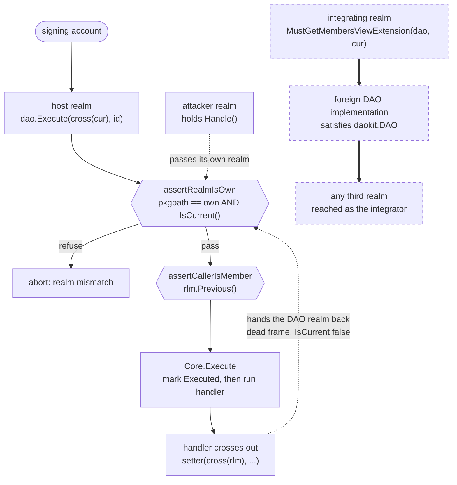

# PR [#65](https://github.com/samouraiworld/gnodaokit/pull/65): feat: republish fork at original paths for topaz-1: avl repoint + svg boundary (Q13 final form)

URL: https://github.com/samouraiworld/gnodaokit/pull/65
Author: zxxma | Base: main | Files: 225 | +26323 -447
Reviewed by: davd-gzl | Model: claude-opus-5 (xhigh, deep) | Commit: 0eb8518 (latest)
Local checkout: `.worktrees/gnodaokit-review-65` (plain clone, PR 65 checked out)

Round 3 (deep). Head advanced 60c4bf0 → 0eb8518, force-pushed: the branch absorbed [#67](https://github.com/samouraiworld/gnodaokit/pull/67), [#68](https://github.com/samouraiworld/gnodaokit/pull/68), [#69](https://github.com/samouraiworld/gnodaokit/pull/69), [#70](https://github.com/samouraiworld/gnodaokit/pull/70), [#71](https://github.com/samouraiworld/gnodaokit/pull/71) and [#72](https://github.com/samouraiworld/gnodaokit/pull/72), all merged into it rather than into `main`, taking the diff from 7 files to 225. Both round-2 blockers are closed and proved closed against real second realms. The avl work is unchanged and stays confirmed. What is new is a permanent exported surface, a 23k-line vendored tree with its own provenance workflow, and a proposal-lifecycle rewrite, none of which any review has seen before this one.

Corrections made before posting, each from a run rather than a re-read. The `recover()` hazard the `Core.Execute` comment names is real: a host realm that recovers keeps the marker, so the finding is the visibility change alone and not the comment. The avl fork is correctly documented as an `f3d5a5d13` snapshot, so what survives is a Nit about the input checks it trails, not a Warning about the description. And `initdao` states its own harness limitation in the file, so the missing-fixture finding was dropped.

**TL;DR:** Publishes the Samourai DAO framework at its original package paths on the launched topaz-1 chain, and carries with it the whole hardening series that was written after the last review: the DAO now refuses to act as anyone but its own realm, the dependency tree is vendored so the build no longer downloads from a live testnet, and the exported API is being settled because it can never change once published.

**Verdict: REQUEST CHANGES** — the caller-identity work is real and holds, but the `daokit.DAO` interface still hands a caller's live realm to whatever implements it, and the new provenance workflow's exemption lets a file under `vendored/p/samcrew/avl/` claim any package path while the job reports green; both freeze on merge (2 Critical, 8 Warnings, 2 Missing tests, 14 Nits, 6 Suggestions).

## Verify first

- [`.github/workflows/vendored-provenance.yml:76-84`](https://github.com/samouraiworld/gnodaokit/blob/0eb8518/.github/workflows/vendored-provenance.yml#L76-L84) — this exemption is the whole trust boundary for 23,519 vendored lines. Check it by adding `vendored/gno.land/p/samcrew/avl/shadow/gnomod.toml` declaring `module = "gno.land/p/samcrew/piechart"` and confirming the job still prints `drift 0`.
- [`gno/p/daokit/daokit.gno:26-43`](https://github.com/samouraiworld/gnodaokit/blob/0eb8518/gno/p/daokit/daokit.gno#L26-L43) — this interface is permanent after publication. Read it next to the member-only example at [`gno/p/basedao/README.md:436`](https://github.com/samouraiworld/gnodaokit/blob/0eb8518/gno/p/basedao/README.md?plain=1#L436) and decide whether a `DAO` method should take a realm at all, given the caller may not own the DAO.
- [`gno/p/basedao/basedao.gno:206`](https://github.com/samouraiworld/gnodaokit/blob/0eb8518/gno/p/basedao/basedao.gno#L206) — run `tests/config_reuse_probe_test.gno` and read the two rendered migration bars; the second DAO's should be 80% and is 60%.

## Summary

The PR is now two things bolted together. The original one is eight avl import repoints plus a two-line svg boundary alias, verified against the launched chain in round 2 and unchanged since. The new one is 21 non-merge commits of hardening: an entry gate that binds every DAO method to the DAO realm's own live realm, an empty-identity guard, a private-extension gate, a proposal-lifecycle rewrite that stops reads from moving proposals, the whole dependency closure vendored at topaz-1's own toolchain ref, and an exported-surface pass done because publication makes every name permanent.

The identity work is correct where it was tested. Both round-2 blockers are closed, and closed properly: `assertRealmIsOwn` cannot be satisfied by a non-host realm, and the fixture realms under [`gno/r/daoidentity/`](https://github.com/samouraiworld/gnodaokit/blob/0eb8518/gno/r/daoidentity/dao/dao.gno#L1) exercise it across genuine boundaries rather than through `testing.SetRealm`. Deleting 22 individual guards turns 21 of them red.

What the gate does not cover is the other direction. It protects a basedao DAO from a caller that supplies a foreign realm. It cannot protect a caller that supplies its own realm to a DAO it does not own, because that is a property of the `daokit.DAO` interface, not of basedao's implementation. The framework's own documented membership recipe does exactly that. Separately, the provenance workflow that guards the vendored tree exempts a path prefix while the compiler resolves packages by their declared module line, so the two disagree about what is exempt.

## Diagram

Where the identity gate holds, and the two places it does not.



The solid path is gated at both steps. The dashed path is Critical 1: nothing on it touches basedao, so `assertRealmIsOwn` never runs.

## Critical (must fix)

- **[integrating realm donates its authority]** [`gno/p/daokit/daokit.gno:26-43`](https://github.com/samouraiworld/gnodaokit/blob/0eb8518/gno/p/daokit/daokit.gno#L26-L43) — every `daokit.DAO` method takes the caller's realm, so a realm that queries a DAO it does not own hands the implementation a capability to act as itself.
  <details><summary>details</summary>

  `assertRealmIsOwn` guards the callee, and only when the callee is a basedao DAO. The interface is satisfiable by any realm, and the framework's own cross-realm membership helper passes the caller's live realm straight into it: [`MustGetMembersViewExtension(dao daokit.DAO, rlm realm)`](https://github.com/samouraiworld/gnodaokit/blob/0eb8518/gno/p/basedao/members_extension.gno#L18-L19) forwards `rlm` to `dao.Extension`, and its doc comment tells the reader to "pass your own cur". A `daokit.DAO` implementation that receives it can `cross(rlm)` into any realm and be seen as the caller.

  Ran it across four realms: an ordinary realm calls the documented recipe against a hostile handle, and a third realm records `gno.land/r/samcrew/authlens/victim` as its caller. Sources and repro in [tests](tests/README.md).

  ```
  === RUN   TestMembersViewRecipeDonatesTheCallersRealm
  	Diff: [+gno.land/r/samcrew/authlens/victim] - the DAO implementation must not be able to act as the victim realm
  --- FAIL: TestMembersViewRecipeDonatesTheCallersRealm (0.00s)
  ```

  The shape cannot be written at the merge-base: `git show b8332969:gno/p/daokit/daokit.gno` declares no realm parameters on the interface, and `MustGetMembersViewExtension` took none. Reachability does not need a hostile counterparty at integration time. The member-only example at [`gno/p/basedao/README.md:436`](https://github.com/samouraiworld/gnodaokit/blob/0eb8518/gno/p/basedao/README.md?plain=1#L436) hands its own `cur` to `dao.Handle()` on a DAO it names as external, and [`ChangeDAOImplementation`](https://github.com/samouraiworld/gnodaokit/blob/0eb8518/gno/p/basedao/migrate.gno#L29-L42) replaces that handle with proposer-authored code through a normal proposal, wired in the demos at [`simple_dao.gno:51`](https://github.com/samouraiworld/gnodaokit/blob/0eb8518/gno/r/daodemo/simple_dao/simple_dao.gno#L51).

  Fix: take the caller's `address` instead of its realm, or move the private lookup off the interface so a public caller passes no realm at all. A doc line cannot close it, because the interface is what third-party implementations conform to, and it is permanent after publication.
  </details>
- **[a vendored file can claim any package path]** [`.github/workflows/vendored-provenance.yml:81`](https://github.com/samouraiworld/gnodaokit/blob/0eb8518/.github/workflows/vendored-provenance.yml#L81) — the byte-comparison exemption is a directory prefix, but the compiler resolves packages by the `module` line in `gnomod.toml`, so anything placed under the exempt prefix can shadow any vendored package while the job reports no drift.
  <details><summary>details</summary>

  Both loops skip `gno.land/p/samcrew/avl/*`, and `discoverPkgsForLocalDeps` in the pinned toolchain resolves a package by its declared module path, first match in lexical order, not by where the directory sits. A directory at `vendored/gno.land/p/samcrew/avl/shadow/` declaring `module = "gno.land/p/samcrew/piechart"` therefore becomes what the build compiles for `p/samcrew/piechart`, and provenance never looks at it.

  Verified end to end at this head: the workflow's own loops report `checked 118 / drift 0`, `gno lint ./gno/...` exits 0 with no output, and `gno test ./gno/p/basedao` is ok. That the shadow is what compiled was proved by dropping a parameter from its `Render`, which broke the real call site with `too many arguments in call to piechart.Render`. The identical directory placed outside the exempt prefix is caught as `MISSING UPSTREAM`.

  The workflow's own comment states the guarantee it is failing to provide: "This job proves that byte-for-byte in BOTH directions, so vendored/ cannot drift from GNOVERSION unnoticed". Fix: decide the exemption on the declared module path rather than the directory, so a package that claims a non-exempt path is compared like any other.
  </details>

## Warnings (should fix)

- **[the migration bar silently drops]** [`gno/p/basedao/basedao.gno:206`](https://github.com/samouraiworld/gnodaokit/blob/0eb8518/gno/p/basedao/basedao.gno#L206) — `New` writes its defaults back into the caller's `Config`, so a second DAO built from the same `Config` reads the first call's leftovers and gets a 60% migration bar instead of 80%.
  <details><summary>details</summary>

  `governanceIsCallerChosen := conf.InitialCondition != nil` is new in this branch and decides whether the migration default may be raised to 0.8. `New` sets `conf.InitialCondition` itself at [`:208`](https://github.com/samouraiworld/gnodaokit/blob/0eb8518/gno/p/basedao/basedao.gno#L208), so on a second call with the same `Config` the flag is already true and the migration condition falls back to the first DAO's default 0.6 threshold, bound to the first DAO's member store. `conf.CallerID` at [`:170`](https://github.com/samouraiworld/gnodaokit/blob/0eb8518/gno/p/basedao/basedao.gno#L170) and `conf.MigrationParamsFn` at [`:227`](https://github.com/samouraiworld/gnodaokit/blob/0eb8518/gno/p/basedao/basedao.gno#L227) are written back too.

  The comment at [`:230-233`](https://github.com/samouraiworld/gnodaokit/blob/0eb8518/gno/p/basedao/basedao.gno#L230-L233) states the opposite invariant three lines above, and names this exact hazard: "New must not mutate its caller's Config, and this closure captures THIS DAO's member store — reusing one Config for a second DAO would otherwise give it a migration condition evaluating the first one's members." Held locally for `migrationCondition`, not for the field it is derived from.

  ```
  === RUN   TestConfigReuseKeepsTheMigrationBar
  	Diff: [-8][+6]0% of members - two DAOs built from one default Config must get the same migration bar
  === RUN   TestConfigReuseDoesNotBindTheFirstDAOsMembers
  should be false - one of four must not carry an action in the second DAO
  ```

  Run on a `git archive` of 0eb8518; see [tests](tests/README.md). The write-backs predate the branch (`git show b8332969:gno/p/basedao/basedao.gno` line 155); the new flag that reads them, and the comment that denies them, do not. `Config` and `New` both freeze at publication, so the zero-value contract cannot be corrected afterwards.
  </details>
- **[the fork's body is never checked]** [`.github/workflows/vendored-provenance.yml:164-177`](https://github.com/samouraiworld/gnodaokit/blob/0eb8518/.github/workflows/vendored-provenance.yml#L164-L177) — the exempt avl fork is verified only by grepping for its `Get` signature, so a change to the read path every member, role and proposal lookup goes through passes every gate.
  <details><summary>details</summary>

  Inserting `if key == "backdoor" { return nil, false }` into [`Tree.Get`](https://github.com/samouraiworld/gnodaokit/blob/0eb8518/vendored/gno.land/p/samcrew/avl/tree.gno#L1) passes all four workflow steps. [`vendored/README.md`](https://github.com/samouraiworld/gnodaokit/blob/0eb8518/vendored/README.md?plain=1#L1) points at `samouraiworld/samcrew-deployer` as the compensating control, but nothing in this repository executes that check, and that repository is private, so a reader of this public repo cannot verify the claim either.

  Fix: pin the fork to a sha and compare against it here, the same way the non-exempt files are compared against upstream.
  </details>
- **[a failed execution reads as a successful one]** [`gno/p/daokit/daokit.gno:137-140`](https://github.com/samouraiworld/gnodaokit/blob/0eb8518/gno/p/daokit/daokit.gno#L137-L140) — `Execute` marks the proposal Executed before running the handler, so a proposal whose action failed renders identically to one that ran.
  <details><summary>details</summary>

  The failing path is the one the comment above those lines names: a host realm that recovers. Ran it, with a host wrapping `Execute` in `recover()` and a duplicate member seeded so the `AddMember` action fails.

  ```
  recover() around Execute -> recovered
  stored status            -> Executed
  detail shows Executed    ->  true
  json says Executed       ->  true
  ```

  The burn itself is pre-existing. Transplanting the merge-base ordering into `Core.Execute` verbatim gives `status after the failed execution: Passed` and `second attempt abort: proposal is not open`, so a burned proposal used to sit visibly stuck in the active list. What this diff changes is that it now reads as done.

  A flag set before and cleared after the handler blocks the same re-entrancy without moving the status write.
  </details>
- **[four render paths abort for any viewer]** [`gno/p/basedao/view_proposal_detail_page.gno:32-34`](https://github.com/samouraiworld/gnodaokit/blob/0eb8518/gno/p/basedao/view_proposal_detail_page.gno#L32-L34) — `proposal/<absent id>`, `proposal/<non-numeric>` and `role/<absent name>` all abort instead of rendering, on the cross-realm handle gnoweb drives.
  <details><summary>details</summary>

  `GetProposal` returns nil at [`proposals.gno:77`](https://github.com/samouraiworld/gnodaokit/blob/0eb8518/gno/p/daokit/proposals.gno#L77) and `ProposalDetailView` reads `proposal.Title` two lines later. [`MuxProposalDetailPage`](https://github.com/samouraiworld/gnodaokit/blob/0eb8518/gno/p/basedao/render.gno#L75-L81) turns a `ParseUint` failure into a panic, and [`RoleInfo`](https://github.com/samouraiworld/gnodaokit/blob/0eb8518/gno/p/basedao/members.gno#L65) panics on an unknown role. `proposal/0` is the worst of them: seqid starts at 1, so the zero id is always absent.

  ```
  PANIC  proposal/999
  PANIC  proposal/abc
  PANIC  proposal/-1
  PANIC  role/nosuchrole
  ```

  All four reproduce unchanged at the merge-base b8332969, so they are not this diff's. Raised because [`7a18b35`](https://github.com/samouraiworld/gnodaokit/commit/7a18b357baf5554c6d915fdc4e2d718de3526709) on this branch is a sweep of exactly this class, titled "a guaranteed render panic", and because publication is immutable. `role/<absent name>` compounds: role names are substituted into rendered prose as links by `RenderWithRolesLinks`, so removing a role leaves live links that now abort.
  </details>
- **[NOTICE names a commit the build does not use]** [`vendored/NOTICE:9`](https://github.com/samouraiworld/gnodaokit/blob/0eb8518/vendored/NOTICE?plain=1#L9) — the attribution file records `2c7f1abe` while the Makefile pins `fc40526`, and 15 vendored files differ between the two.
  <details><summary>details</summary>

  [`NOTICE:19-22`](https://github.com/samouraiworld/gnodaokit/blob/0eb8518/vendored/NOTICE?plain=1#L19-L22) claims CI re-derives the sha on every run; no job reads the file. The pin moved in [`41c6ea3`](https://github.com/samouraiworld/gnodaokit/commit/41c6ea3) and the NOTICE did not follow. Fix: derive it from the Makefile in the provenance job, or drop the claim.
  </details>
- **[the description is a different pull request]** the PR body describes 7 files and +10/−9; the head is 225 files and +26323/−447, and the six pull requests that made the difference were merged into this branch with no reviews.
  <details><summary>details</summary>

  Four specific mismatches. "Retained (the entire remaining diff: 7 files, +10/−9)" against 225 files, or 86 excluding `vendored/`. "Fork logic remains byte-frozen vs #64 — path mechanics only" against re-signatured `daokit.DAO`, `daokit.ActionHandler`, `basedao.Config`, `CallerIDFn`, `MigrateFn` and `SetImplemRaw`. A "CI note (unchanged)" quoting a pin present on neither side and calling the CI retool a follow-up, when the retool landed. A test-plan table of 7 packages when `gno test ./gno/...` now walks 16.

  A maintainer reading only the description approves a path repoint with no API impact. What merges is a breaking API change published to topaz-1 immediately, not revertible by a follow-up. [#67](https://github.com/samouraiworld/gnodaokit/pull/67) through [#72](https://github.com/samouraiworld/gnodaokit/pull/72) all targeted this branch rather than `main`, so merging 65 is the only review gate any of them passes, and nothing in it is separately revertible: [`1eabd78`](https://github.com/samouraiworld/gnodaokit/commit/1eabd78) reverts an earlier commit on the same branch, so `UpdateStatus`'s fate is visible in the commit chain and not in the diff.
  </details>
- **[a documented field is missing from both Config listings]** [`README.md:206-235`](https://github.com/samouraiworld/gnodaokit/blob/0eb8518/README.md?plain=1#L206-L235) — neither README lists `MigrationCondition`, though its own comment tells a caller who sets `InitialCondition` to set it too.
  <details><summary>details</summary>

  The field is at [`basedao.gno:144`](https://github.com/samouraiworld/gnodaokit/blob/0eb8518/gno/p/basedao/basedao.gno#L144); the second listing is [`gno/p/basedao/README.md:281-310`](https://github.com/samouraiworld/gnodaokit/blob/0eb8518/gno/p/basedao/README.md?plain=1#L281-L310). The documented upgrade path sets `InitialCondition`, which is exactly the case where leaving `MigrationCondition` nil makes a takeover no harder than an ordinary action. The doc pass in [`94c3a3a`](https://github.com/samouraiworld/gnodaokit/commit/94c3a3a) ran before [`201a67c`](https://github.com/samouraiworld/gnodaokit/commit/201a67c) added the field.
  </details>
- **[two advertised render paths 404]** [`gno/p/basedao/README.md:186-192`](https://github.com/samouraiworld/gnodaokit/blob/0eb8518/gno/p/basedao/README.md?plain=1#L186-L192) — the path list offers `proposals/1` and `roles`, which return 404; the router registers `proposal/{id}` and `role/{name}`.
  <details><summary>details</summary>

  Probed every listed path through `Render` at this head. Registration is at [`render.gno:31-39`](https://github.com/samouraiworld/gnodaokit/blob/0eb8518/gno/p/basedao/render.gno#L31-L39). Three registered paths are also absent from the list.
  </details>

## Missing Tests

- **[a registered handler can break its own contract silently]** [`gno/p/daokit/action_spoofing_test.gno:26`](https://github.com/samouraiworld/gnodaokit/blob/0eb8518/gno/p/daokit/action_spoofing_test.gno#L26) — all three spoofing tests build their handler inside the test, so nothing drives a foreign payload through a registered built-in handler.
  <details><summary>details</summary>

  Switching a shipped handler to the exact mistake the file and the [SECURITY block on `NewActionHandler`](https://github.com/samouraiworld/gnodaokit/blob/0eb8518/gno/p/daokit/actions.gno#L76-L93) warn against, behaviour-preserving, leaves everything green: `NewAddMemberHandler` asserting `interface{ MemberAddress() address; MemberRoles() []string }` instead of `*ActionAddMember` gives `ok ./gno/p/basedao`, `ok ./gno/p/daokit`, `ok ./gno/r/daoidentity/suite` and all three demos green.

  The test to add drives a payload of a different concrete type carrying the same method set through `dao.Core.Resources.Get(ActionAddMemberKind).Handler.Execute` and requires it to panic.
  </details>
- **[the only worked membership gate is not compiled]** [`gno/p/basedao/README.md:415-441`](https://github.com/samouraiworld/gnodaokit/blob/0eb8518/gno/p/basedao/README.md?plain=1#L415-L441) — the member-only example is a complete `package my_content` block and the framework's only worked authentication example, and `check-readme-examples.sh` does not cover it.
  <details><summary>details</summary>

  The script covers 1 of 19 blocks in the root README and 1 of 17 in this one. Round 2's Warning on this example is resolved in the text: `Post` is crossing, it guards `IsCurrent()`, and it handles pkgpath against address. Nothing compiles it, so the next edit can undo that silently. It is also the example Critical 1 turns on, so it is the block most worth pinning.
  </details>

## Nits

- **[a filename outlives the code]** [`gno/p/daocond/cond_role_treshold.gno`](https://github.com/samouraiworld/gnodaokit/blob/0eb8518/gno/p/daocond/cond_role_treshold.gno#L1) — `treshold` is misspelled in the filename and in the new `cond_role_treshold_test.gno`; every identifier inside is spelled correctly. File names are what `vm/qfile` and gnoweb list, so it freezes too.
- **[a test comment claims more than it checked]** [`gno/r/daoidentity/suite/suite_test.gno:120-122`](https://github.com/samouraiworld/gnodaokit/blob/0eb8518/gno/r/daoidentity/suite/suite_test.gno#L120-L122) — it says swapping the gate and `CallerID` "leaves every other test green"; swapping them in `Propose` alone also reddens `TestInstantExecuteIsSameRealmOnly`.
- **[the fork trails upstream on input checks]** [`vendored/README.md:35-36`](https://github.com/samouraiworld/gnodaokit/blob/0eb8518/vendored/README.md?plain=1#L35-L36) — the fork is correctly documented as upstream `p/nt/avl/v0` at `f3d5a5d13`, but nothing says it also trails `d2737d84e fix(avl): add missing checks`, which landed before the pinned ref.
  <details><summary>details</summary>

  Diffed the fork against upstream at `f3d5a5d13`: every `.gno` file present in both is byte-identical after normalising the module path, so the snapshot claim in `README.md:35-36` and [`equivalence_test.gno:5`](https://github.com/samouraiworld/gnodaokit/blob/0eb8518/vendored/gno.land/p/samcrew/avl/equivalence_test.gno#L5) holds. Diffed the same files against `fc40526`: the `GetByIndex` negative-index panic, the `TraverseByOffset` negative-offset clamp, and the `GetPageWithSize` non-positive page-size panic are all absent from the fork.

  Latent: `Pager.ParseQuery` clamps both parameters and both call sites pass a constant page size. The docs frame the delta as the two-value `Get`, so a reader has no way to know the fork is also behind on input validation while every other vendored file is at `fc40526`.
  </details>
- **[a re-entrancy regression fails as a hang]** [`gno/p/daokit/daokit.gno:137-140`](https://github.com/samouraiworld/gnodaokit/blob/0eb8518/gno/p/daokit/daokit.gno#L137-L140) — moving the executed marker after the handler makes `gno test ./gno/r/daoidentity/suite` run past 200s against a 1.4s baseline, because `TestAProposalCannotReenterItsOwnExecution` recurses unbounded with no gas meter under `gno test`. A depth counter in the fixture would turn the hang into a failure.
- **[a branch nothing can reach]** [`gno/p/basedao/view_proposal_detail_page.gno:53-55`](https://github.com/samouraiworld/gnodaokit/blob/0eb8518/gno/p/basedao/view_proposal_detail_page.gno#L53-L55) — the `Status - Closed 🔴` branch is unreachable; the three statuses are exhaustive.
- **[a comment the same branch made false]** [`gno/p/basedao/view_proposals_page.gno:29-30`](https://github.com/samouraiworld/gnodaokit/blob/0eb8518/gno/p/basedao/view_proposals_page.gno#L29-L30) — it says only `Execute` writes `Status`; `1eabd78` deliberately re-exported `UpdateStatus`, which also does.
- **[two frozen names for one signature]** [`gno/p/basedao/basedao.gno:18`](https://github.com/samouraiworld/gnodaokit/blob/0eb8518/gno/p/basedao/basedao.gno#L18) — `SetImplemRaw` and [`daokit.SetImplemFn`](https://github.com/samouraiworld/gnodaokit/blob/0eb8518/gno/p/daokit/daokit.gno#L46) are both `func(DAO)` and both appear in the same call path. `SetImplemRaw` also no longer carries anything raw: its second parameter went away in this diff.
- **[one organisation's name in a generic package]** [`gno/p/daocond/cond_gnolovedao.gno:24`](https://github.com/samouraiworld/gnodaokit/blob/0eb8518/gno/p/daocond/cond_gnolovedao.gno#L24) — `GnoloveDAOCondThreshold` is exported, is the only condition constructor named after a specific DAO, and is absent from the package README.
- **[a method named after its own return type]** [`gno/p/basedao/members.gno:62`](https://github.com/samouraiworld/gnodaokit/blob/0eb8518/gno/p/basedao/members.gno#L62) — `MembersStore.RoleInfo` and the `RoleInfo` struct share a name. Legal, and frozen.
- **[the boundary guard keys on the alias]** [`.github/workflows/vendored-provenance.yml:147`](https://github.com/samouraiworld/gnodaokit/blob/0eb8518/.github/workflows/vendored-provenance.yml#L147) — renaming the `ntavl` import makes the step print `no ntavl usage found — the alias was removed, which is fine`. Nit rather than Warning because the pin now matches the chain, so the compiler is the real gate: a misuse fails with `assignment mismatch: 2 variables but t.Get returns 1 value`.
- **[a make target that asserts nothing]** [`Makefile:22`](https://github.com/samouraiworld/gnodaokit/blob/0eb8518/Makefile#L22) — `gno-mod-tidy` globs `gno.mod`, of which the repo has zero; all 16 manifests are `gnomod.toml`, so the step and the no-diff check after it are vacuous.
- **[the hermetic guard covers one of four targets]** [`.github/workflows/gno-lint.yml:31`](https://github.com/samouraiworld/gnodaokit/blob/0eb8518/.github/workflows/gno-lint.yml#L31) — the cold `GNOHOME` and the `gno: downloading` grep wrap `make lint` only; `make test`, `make fmt` and `make gno-mod-tidy` run with neither.
- **[`Core` is listed without its third field]** [`README.md:112-115`](https://github.com/samouraiworld/gnodaokit/blob/0eb8518/README.md?plain=1#L112-L115) — the listing omits `Extensions`.
- **[prose the style guide rules out]** em-dashes in added prose at [`README.md:132`](https://github.com/samouraiworld/gnodaokit/blob/0eb8518/README.md?plain=1#L132), `:469`, `:470`, [`gno/p/basedao/README.md:368`](https://github.com/samouraiworld/gnodaokit/blob/0eb8518/gno/p/basedao/README.md?plain=1#L368), `:451`, and [`gno/p/realmid/README.md:24`](https://github.com/samouraiworld/gnodaokit/blob/0eb8518/gno/p/realmid/README.md?plain=1#L24). Not posted, no change needed.

## Suggestions

- **[a method its own doc forbids calling]** [`gno/p/daokit/proposals.gno:130`](https://github.com/samouraiworld/gnodaokit/blob/0eb8518/gno/p/daokit/proposals.gno#L130) — `UpdateStatus` is frozen as a method nothing in the package may call, whose safety rests on two unrelated checks never narrowing.
  <details><summary>details</summary>

  Its own comment says "Nothing in this package calls it", "do not call it while rendering", and "SAFE ONLY BECAUSE Vote and Execute both key on Executed alone. Do not narrow either of those checks without removing this." The only caller in the tree is the deliberate probe at [`dao.gno:199`](https://github.com/samouraiworld/gnodaokit/blob/0eb8518/gno/r/daoidentity/dao/dao.gno#L199). It was removed once and restored by `1eabd78`. Publishing it makes a constraint on [`daokit.gno:98`](https://github.com/samouraiworld/gnodaokit/blob/0eb8518/gno/p/daokit/daokit.gno#L98) and [`:118`](https://github.com/samouraiworld/gnodaokit/blob/0eb8518/gno/p/daokit/daokit.gno#L118) permanent, enforced only by a comment.
  </details>
- **[a package published with no consumer]** [`gno/p/realmid/realmid.gno:9`](https://github.com/samouraiworld/gnodaokit/blob/0eb8518/gno/p/realmid/realmid.gno#L9) — nothing in the tree imports `realmid`, and its own README heads a block "Not for caller authentication".
  <details><summary>details</summary>

  `basedao` imported it at the merge-base and no longer does. `Previous` and `Current` stay exported bare stack walks, frozen at a published path, documented as the wrong tool at [`README.md:21-32`](https://github.com/samouraiworld/gnodaokit/blob/0eb8518/gno/p/realmid/README.md?plain=1#L21-L32). Publishing only `IsPackage` and `IsUser` would leave nothing to reach for by mistake.
  </details>
- **[a vote outside the three values is accepted]** [`gno/p/basedao/basedao.gno:308-310`](https://github.com/samouraiworld/gnodaokit/blob/0eb8518/gno/p/basedao/basedao.gno#L308-L310) — `Vote` checks only the length, so a member who sends `YES` has it stored and counted in the ballot total while every tally reads zero.
  <details><summary>details</summary>

  Confirmed behaviourally at this head: the stored vote is `YES`, `Ballot.Total()` is 1, and `RenderWithVotes` prints `Yes: 0/3`, `No: 0/3`, `Abstain: 0/3`. A realm's `Vote` entry point takes `daocond.Vote` straight off a `MsgCall` argument, so the value is whatever the signer typed.

  Pre-existing: the length cap and the untyped store are both at the merge-base. Raised because [`8c8ef04`](https://github.com/samouraiworld/gnodaokit/commit/8c8ef04) typed the three constants specifically so a misuse is a compile error, and a runtime value cannot be typed after publication.
  </details>
- **[a nil migration bricks the realm]** [`gno/p/basedao/migrate.gno:39-40`](https://github.com/samouraiworld/gnodaokit/blob/0eb8518/gno/p/basedao/migrate.gno#L39-L40) — a `MigrateFn` returning nil installs nil, unrecoverably. Pre-existing; raised because this diff is the validation pass over exactly this function pair, adding the label and nil-function checks beside it.
- **[a mid-flight proposal reads as finished]** [`gno/p/daokit/daokit.gno:137`](https://github.com/samouraiworld/gnodaokit/blob/0eb8518/gno/p/daokit/daokit.gno#L137) — reads taken while the handler runs see the proposal as Executed, listed in history and dropped from active, before its action has happened. Same lines as the Warning above; worth stating in the doc comment even if the ordering stays.
- **[third-party actions on mutable tags]** [`.github/workflows/vendored-provenance.yml:20`](https://github.com/samouraiworld/gnodaokit/blob/0eb8518/.github/workflows/vendored-provenance.yml#L20) — `actions/checkout@v4` and `magnetikonline/action-golang-cache@v5` are mutable references in the workflows that guard the supply chain. Pinning them to shas would match the care the rest of the job takes.

## Verified

Runtime checks CI does not cover, all at 0eb8518 with the toolchain the branch pins.

- The entry gate cannot be satisfied by a realm other than the host. A DAO realm value handed back from a callee carries the right pkgpath but `IsCurrent()` is false; relaying it two realms out does not revive it; crossing under it dies in the VM with `cross: rlm is not the current cur (stale capture or sibling frame)`, from a third realm too.
- Both halves of the gate are load-bearing. Removing the `IsCurrent()` clause reddens the two dead-frame tests; removing the pkgpath comparison reddens six, including all three donation tests. Of 22 guards deleted one at a time across the branch, 21 turn a test red.
- The documented migration path binds correctly. A `MigrateFn` authored in a different realm that calls `basedao.New(conf, rlm)` produces a DAO bound to the host realm, not the migration author's, and the host still drives its DAO afterwards. Run across three real realms.
- All 118 non-exempt vendored files are byte-identical to `gnolang/gno@fc40526`; the only files with no upstream counterpart are the 18 under the avl fork. `vendored/LICENSE.md` is byte-identical to upstream's root LICENSE.
- `make lint`'s hermeticity guard holds: every remote resolution in the pinned toolchain goes through `DownloadPackageToCache`, which prints before fetching, and the cold `GNOHOME` neutralises the warm-cache bypass.
- `check-readme-examples.sh` fails closed against fixture drift, a changed fence, a decoy block and a replaced block; `gno fmt ./gno -w` is a no-op on the tree, so the space-indented fixtures cannot drift through the lint job's no-diff check.
- Both round-2 blockers are closed, each proved from a second realm: a foreign realm can no longer donate its identity to `Propose`, `Vote` or `Execute`, and an empty caller id is rejected at `AddMember` and again at every entry point.
- `gno test ./gno/...` green on all 16 targets; all four CI checks green on this head.

## Open questions

- The diff is past GitHub's own limit: `gh pr diff 65 -R samouraiworld/gnodaokit` returns `HTTP 406: the diff exceeded the maximum number of lines (20000)`. Anchor pre-validation cannot run against it, and a reviewer cannot pull the diff through the API at all. Not posted; it is an argument for the split the description Warning already makes.
- The daoidentity suite shares one package-level DAO across both test files and its `MembersThreshold(0.1)` couples to the accumulated member count, so the fixture has finite headroom before one yes-vote stops carrying. Not measured; not posted because it is a fixture-maintenance note, not a defect.
- `MembersThreshold` accepts a NaN threshold, since `NaN <= 0` and `NaN > 1` are both false, and `Signal` then returns NaN. Reproduces at the merge-base and no call path supplies one. Not posted.
- `gnolovDaoCondThreshold.RenderWithVotes` formats three float64s with `%d`, so every gnolove tally renders as `%!d(float64=0.300000)`. Reproduces at the merge-base. Not posted; the package's only caller is a test.
