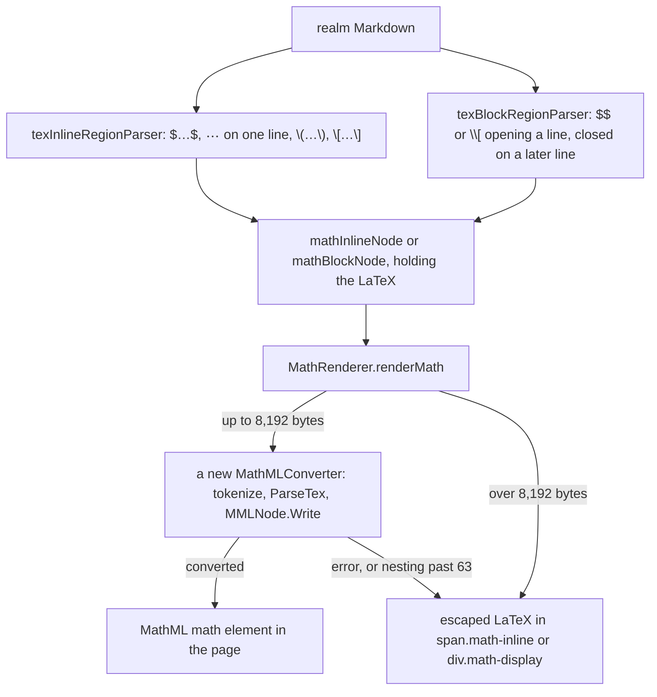

# Math in gnoweb pages: LaTeX turned into MathML on the server

Written by claude-opus-5-5, high effort.
PR: [gnolang/gno#4879](https://github.com/gnolang/gno/pull/4879)

## TLDR

Before, gnoweb showed `$E = mc^2$` in a realm page as typed, dollar signs
included. After, gnoweb converts LaTeX between `$…$`, `$$…$$`, `\\(…\\)` or
`\\[…\\]` into MathML on the server, through a
[Go package](https://github.com/gnolang/gno/blob/0193f6de7/gno.land/pkg/gnoweb/markdown/mathml/mathml.go#L106-L149)
ported from [TreeBlood](https://github.com/Wyatt915/treeblood), and the browser
draws it [natively](https://developer.mozilla.org/en-US/docs/Web/MathML). An
expression over [8,192 bytes](https://github.com/gnolang/gno/blob/0193f6de7/gno.land/pkg/gnoweb/markdown/ext_math.go#L19),
nested [64 levels](https://github.com/gnolang/gno/blob/0193f6de7/gno.land/pkg/gnoweb/markdown/mathml/mathml.go#L11)
deep or failing to convert shows as its escaped LaTeX source.

## What it is for

The [PR description](https://github.com/gnolang/gno/pull/4879) asks for LaTeX
support done entirely on the server. MathML is drawn by the browser itself, so
a page needs neither a front-end plugin nor generated images. A realm author
writes the same TeX that
[GitHub renders](https://docs.github.com/en/get-started/writing-on-github/working-with-advanced-formatting/writing-mathematical-expressions)
in Markdown.

## How it works today

The before state, read at the merge base.

- gnoweb renders a realm's Markdown with one
  [goldmark](https://github.com/yuin/goldmark) instance, built from
  [`NewGnoExtension`](https://github.com/gnolang/gno/blob/87f0357fe/gno.land/pkg/gnoweb/render_config.go#L42)
  and used for every request in
  [`RenderRealm`](https://github.com/gnolang/gno/blob/87f0357fe/gno.land/pkg/gnoweb/render.go#L135-L136).
- [`GnoExtension.Extend`](https://github.com/gnolang/gno/blob/87f0357fe/gno.land/pkg/gnoweb/markdown/ext.go#L67-L97)
  installs gnoweb's own syntax: foreign blocks, columns, alerts, links, forms
  and mentions. None of them reads `$`.
- A `<math>` tag written by hand is raw HTML, which goldmark drops unless the
  node runs with
  [`UnsafeHTML`](https://github.com/gnolang/gno/blob/87f0357fe/gno.land/pkg/gnoweb/app.go#L150-L153).
  The stylesheet already gives `math` elements a
  [monospace font](https://github.com/gnolang/gno/blob/87f0357fe/gno.land/pkg/gnoweb/frontend/css/05-composition.css#L406-L408).

## What the change does

### Before and after, measured

Each row is one Markdown input rendered through goldmark with
`NewGnoExtension()`, the setup the PR's own tests use, once in a merge-base
tree for Before and once in a pull request head tree for After. Neither run
turned on `UnsafeHTML`.

| Markdown input | Before | After |
| --- | --- | --- |
| `$E = mc^2$` | the text `$E = mc^2$` | inline `<math>`: `E`, `=`, `m`, and `c` with a superscript `2` |
| `$$\frac{a}{b}$$` on one line | the text | `<math display="block">` holding an `<mfrac>`, inside the paragraph |
| `$$`, `\frac{a}{b}`, `$$` on three lines | the text `$$\frac{a}{b}$$` | the same block `<math>`, with no paragraph around it |
| `\\(x^2\\)` | the text `\(x^2\)` | inline `<math>` |
| `\\[x^2\\]` | the text `\[x^2\]` | block `<math>` |
| `$5 and $10` | the text | the text, unchanged |
| `a $ 5 fee` | the text | the text, unchanged |
| `costs \$5` | `costs $5` | `costs $5` |
| `$$` never closed, a blank line, `next paragraph` | two paragraphs of text | two paragraphs of text, unchanged |
| `$\text{<b>hi</b>}$` | the text, each tag replaced by `<!-- raw HTML omitted -->` | `<mtext>` holding `&lt;b&gt;hi&lt;/b&gt;`, shown as literal characters |
| `$\class{warn}{x}$` | the text | `<math>` holding `x`; the class name is dropped |
| 63 nested `\sqrt{` | the text | `<math>` |
| 64 nested `\sqrt{` | the text | `` holding the escaped LaTeX |
| `$` + 8,192 bytes + `$` | the text | `<math>` |
| `$` + 8,193 bytes + `$` | the text | `` holding the escaped LaTeX |

`\frac{1}{` and a bare `{` hit the nesting limit at the same depth as `\sqrt{`.

### The path an expression takes

The after state, from Markdown source to the page.

### Finding the math in Markdown

- The inline parser,
  [`texInlineRegionParser.Parse`](https://github.com/gnolang/gno/blob/0193f6de7/gno.land/pkg/gnoweb/markdown/ext_math.go#L93-L154),
  runs on every
  [`\` and `$`](https://github.com/gnolang/gno/blob/0193f6de7/gno.land/pkg/gnoweb/markdown/ext_math.go#L89-L91).
  It takes `$…$` and `\\(…\\)` as inline math, and `$$…$$` and `\\[…\\]` as
  display math when both delimiters sit on one line. An expression may run onto
  [one following line](https://github.com/gnolang/gno/blob/0193f6de7/gno.land/pkg/gnoweb/markdown/ext_math.go#L135-L144).
- A single `$` follows
  [Pandoc's rule](https://pandoc.org/MANUAL.html#extension-tex_math_dollars)
  so prices stay text. The opening `$` must be followed by a
  [non-space](https://github.com/gnolang/gno/blob/0193f6de7/gno.land/pkg/gnoweb/markdown/ext_math.go#L106-L110),
  and
  [`findDollarClose`](https://github.com/gnolang/gno/blob/0193f6de7/gno.land/pkg/gnoweb/markdown/ext_math.go#L169-L183)
  accepts a closing `$` only when no space or escaping backslash precedes it
  and no digit follows it.
- The backslash delimiters are written with
  [two backslashes](https://github.com/gnolang/gno/blob/0193f6de7/gno.land/pkg/gnoweb/markdown/ext_math.go#L46-L53)
  in the Markdown source, `\\(x^2\\)`, the form plain gnoweb already showed as
  `\(x^2\)`.
- The block parser,
  [`texBlockRegionParser.Open`](https://github.com/gnolang/gno/blob/0193f6de7/gno.land/pkg/gnoweb/markdown/ext_math.go#L189-L224),
  opens a block only on a line starting with `$$` or `\\[` whose closing
  delimiter is absent from that line and present on a later line within
  8,192 bytes, checked by
  [`hasClosingLine`](https://github.com/gnolang/gno/blob/0193f6de7/gno.land/pkg/gnoweb/markdown/ext_math.go#L246-L290).
  An opener that never closes stays a paragraph and leaves the rest of the
  page alone.
- `hasClosingLine` stores how far its last scan reached on the parse context,
  [one entry per delimiter kind](https://github.com/gnolang/gno/blob/0193f6de7/gno.land/pkg/gnoweb/markdown/ext_math.go#L259-L272),
  so a page of unclosed openers is scanned once overall rather than once per
  opener.

### Converting LaTeX to MathML

The `mathml` package is a port of TreeBlood, with its MIT licence kept in
[`LICENCE.MD`](https://github.com/gnolang/gno/blob/0193f6de7/gno.land/pkg/gnoweb/markdown/mathml/LICENCE.MD?plain=1#L1-L3).
One conversion runs these steps:

1. [`tokenize`](https://github.com/gnolang/gno/blob/0193f6de7/gno.land/pkg/gnoweb/markdown/mathml/tokenize.go#L439)
   splits the LaTeX into
   [tokens](https://github.com/gnolang/gno/blob/0193f6de7/gno.land/pkg/gnoweb/markdown/mathml/tokenize.go#L26-L51):
   commands, letters, numbers, braces and the rest.
2. [`ParseTex`](https://github.com/gnolang/gno/blob/0193f6de7/gno.land/pkg/gnoweb/markdown/mathml/parse.go#L82)
   builds a tree of
   [`MMLNode`](https://github.com/gnolang/gno/blob/0193f6de7/gno.land/pkg/gnoweb/markdown/mathml/mmlnode.go#L60-L70)
   elements. Commands such as `\frac` go through
   [`ProcessCommand`](https://github.com/gnolang/gno/blob/0193f6de7/gno.land/pkg/gnoweb/markdown/mathml/commands.go#L188),
   environments such as `pmatrix` through
   [`processEnv`](https://github.com/gnolang/gno/blob/0193f6de7/gno.land/pkg/gnoweb/markdown/mathml/environnements.go#L259),
   and a name such as `\alpha` becomes `α` through
   [`symbolTable`](https://github.com/gnolang/gno/blob/0193f6de7/gno.land/pkg/gnoweb/markdown/mathml/symbols.go#L108).
3. [`wrapInMathTag`](https://github.com/gnolang/gno/blob/0193f6de7/gno.land/pkg/gnoweb/markdown/mathml/mathml.go#L151-L188)
   puts the tree in a `<math>` element and keeps the LaTeX source beside it in
   an
   [`<annotation encoding="application/x-tex">`](https://github.com/gnolang/gno/blob/0193f6de7/gno.land/pkg/gnoweb/markdown/mathml/mathml.go#L184-L186).
4. [`MMLNode.Write`](https://github.com/gnolang/gno/blob/0193f6de7/gno.land/pkg/gnoweb/markdown/mathml/mmlnode.go#L168-L232)
   prints the tree as indented markup.

A panic anywhere in these steps is
[recovered](https://github.com/gnolang/gno/blob/0193f6de7/gno.land/pkg/gnoweb/markdown/mathml/mathml.go#L113-L127)
and returned as an error, and
[`renderMath`](https://github.com/gnolang/gno/blob/0193f6de7/gno.land/pkg/gnoweb/markdown/ext_math.go#L367-L382)
then writes the escaped LaTeX instead of the MathML.

### Writing the markup into the page

The renderer
[writes its markup straight to the output](https://github.com/gnolang/gno/blob/0193f6de7/gno.land/pkg/gnoweb/markdown/ext_math.go#L367-L369).
goldmark's raw-HTML filter therefore does not touch it: the measured runs
produced `<math>` with `UnsafeHTML` off. What reaches the page is controlled
by the converter instead.

- Every text and attribute value passes through
  [`writeEscaped`](https://github.com/gnolang/gno/blob/0193f6de7/gno.land/pkg/gnoweb/markdown/mathml/mmlnode.go#L23-L43),
  which escapes `<`, `>`, `"` and a bare `&`, and keeps a well-formed
  [character reference](https://github.com/gnolang/gno/blob/0193f6de7/gno.land/pkg/gnoweb/markdown/mathml/mmlnode.go#L15-L18)
  such as `&OverBrace;`.
- An attribute whose name falls outside letters, digits, `-`, `_` and `:` is
  [skipped](https://github.com/gnolang/gno/blob/0193f6de7/gno.land/pkg/gnoweb/markdown/mathml/mmlnode.go#L190-L193).
- [`\class{name}{x}`](https://github.com/gnolang/gno/blob/0193f6de7/gno.land/pkg/gnoweb/markdown/mathml/commands_defs.go#L132-L139)
  renders `x` and drops `name`, so a page cannot apply the site's own CSS
  classes.
- The fallback escapes the LaTeX with
  [`html.EscapeString`](https://github.com/gnolang/gno/blob/0193f6de7/gno.land/pkg/gnoweb/markdown/ext_math.go#L373-L382).
- Attributes and inline CSS properties are printed in
  [sorted order](https://github.com/gnolang/gno/blob/0193f6de7/gno.land/pkg/gnoweb/markdown/mathml/mmlnode.go#L189-L209),
  so one input always yields the same bytes.

### Limits

The after state. Each limit caps what one expression can cost the server.

| Limit | Value | Past it |
| --- | --- | --- |
| Expression length | [`MaxMathInputLen`](https://github.com/gnolang/gno/blob/0193f6de7/gno.land/pkg/gnoweb/markdown/ext_math.go#L19), 8,192 bytes | [not converted](https://github.com/gnolang/gno/blob/0193f6de7/gno.land/pkg/gnoweb/markdown/ext_math.go#L356); the escaped LaTeX is shown |
| Parser nesting | [`MaxParseDepth`](https://github.com/gnolang/gno/blob/0193f6de7/gno.land/pkg/gnoweb/markdown/mathml/mathml.go#L11), 64 levels, the outermost one included | [`ParseTex` panics](https://github.com/gnolang/gno/blob/0193f6de7/gno.land/pkg/gnoweb/markdown/mathml/parse.go#L85-L89), the panic is recovered, and the escaped LaTeX is shown |
| Indentation | [`maxIndent`](https://github.com/gnolang/gno/blob/0193f6de7/gno.land/pkg/gnoweb/markdown/mathml/mmlnode.go#L13), 16 levels | deeper elements are [indented 16 levels](https://github.com/gnolang/gno/blob/0193f6de7/gno.land/pkg/gnoweb/markdown/mathml/mmlnode.go#L183), so whitespace stops growing with depth |
| Block lookahead | [8,192 bytes](https://github.com/gnolang/gno/blob/0193f6de7/gno.land/pkg/gnoweb/markdown/ext_math.go#L257) past the opening line | the opener stays a paragraph |

### One converter per expression

A `MathMLConverter` holds
[state for the expression it is converting](https://github.com/gnolang/gno/blob/0193f6de7/gno.land/pkg/gnoweb/markdown/mathml/mathml.go#L81-L91),
and gnoweb serves every request from
[one goldmark instance](https://github.com/gnolang/gno/blob/0193f6de7/gno.land/pkg/gnoweb/render.go#L114).
[`renderMath`](https://github.com/gnolang/gno/blob/0193f6de7/gno.land/pkg/gnoweb/markdown/ext_math.go#L356-L359)
therefore builds a new converter for every expression.
[`TestMathConcurrentRender`](https://github.com/gnolang/gno/blob/0193f6de7/gno.land/pkg/gnoweb/markdown/ext_math_test.go#L75-L87)
renders 50 expressions at once, and the race workflow
[runs it under `-race`](https://github.com/gnolang/gno/blob/0193f6de7/.github/workflows/ci-race.yml#L61-L62),
triggered by changes under
[`gno.land/pkg/gnoweb/markdown/`](https://github.com/gnolang/gno/blob/0193f6de7/.github/workflows/ci-race.yml#L29).

### Where math renders

The after state, per gnoweb surface.

| Surface | Math renders | Reason |
| --- | --- | --- |
| Realm pages | yes | [`GnoExtension.Extend`](https://github.com/gnolang/gno/blob/0193f6de7/gno.land/pkg/gnoweb/markdown/ext.go#L94) calls `ExtMath.Extend` |
| `<gno-foreign>` blocks | no | the inner instance, [`buildInnerForeignMarkdown`](https://github.com/gnolang/gno/blob/0193f6de7/gno.land/pkg/gnoweb/markdown/ext_foreign.go#L445-L463), loads no math extension |
| Package documentation | no | the documentation instance, [`docOpts`](https://github.com/gnolang/gno/blob/0193f6de7/gno.land/pkg/gnoweb/render.go#L101-L108), loads no `GnoExtension` |

### Styling, documentation and tests

- The stylesheet gives `math` a
  [font size and a block margin](https://github.com/gnolang/gno/blob/0193f6de7/gno.land/pkg/gnoweb/frontend/css/05-composition.css#L406-L413),
  compiled into `public/main.css`.
- The `r/docs/markdown` realm gains a
  [Mathematics section](https://github.com/gnolang/gno/blob/0193f6de7/examples/quarantined/gno.land/r/docs/markdown/markdown.gno#L917-L1066)
  showing each syntax beside its rendering.
- [16 golden files](https://github.com/gnolang/gno/tree/0193f6de7/gno.land/pkg/gnoweb/markdown/golden/ext_math)
  pin the rendered HTML through gnoweb's existing
  [golden runner](https://github.com/gnolang/gno/blob/0193f6de7/gno.land/pkg/gnoweb/markdown/ext_test.go#L66-L74),
  which walks subdirectories.
  [`mathml_test.go`](https://github.com/gnolang/gno/blob/0193f6de7/gno.land/pkg/gnoweb/markdown/mathml/mathml_test.go#L8)
  tests the converter alone in 93 test functions, and
  [`FuzzMathRender`](https://github.com/gnolang/gno/blob/0193f6de7/gno.land/pkg/gnoweb/markdown/ext_math_test.go#L113-L158)
  fuzzes the extension for script tags, `on…` attributes, `javascript:` URLs
  and output larger than 64 times the input plus 4,096 bytes.

## Concepts

| Term | Meaning here |
| --- | --- |
| LaTeX | The markup mathematicians write formulas in: `\frac{a}{b}` for a fraction, `x^2` for a power, `\alpha` for α. |
| MathML | The [W3C markup for mathematics](https://developer.mozilla.org/en-US/docs/Web/MathML). A browser draws a `<math>` element itself, as it draws a table. |
| Inline and display math | Inline math sits in a line of text, `display="inline"`; display math is a block of its own, `display="block"`. |
| Delimiter | The marks around an expression: `$…$` and `\\(…\\)` for inline, `$$…$$` and `\\[…\\]` for display. |
| Pandoc's dollar rule | The convention, from the [Pandoc document converter](https://pandoc.org/MANUAL.html#extension-tex_math_dollars), that `$` opens math only before a non-space and closes it only after a non-space and before a non-digit. |
| goldmark | The [Go Markdown library](https://github.com/yuin/goldmark) gnoweb renders with; an extension adds parsers that turn text into nodes and renderers that print those nodes. |
| TreeBlood | The open-source Go LaTeX-to-MathML converter the `mathml` package is ported from. |
| Fallback | What a failed or refused expression becomes: its LaTeX, HTML-escaped, in `` or `
`. |

## Review files

[Review files for this PR](https://github.com/samouraiworld/gno-agent-workspace/tree/main/reviews/pr/4xxx/4879-gnoweb-math-extension)
