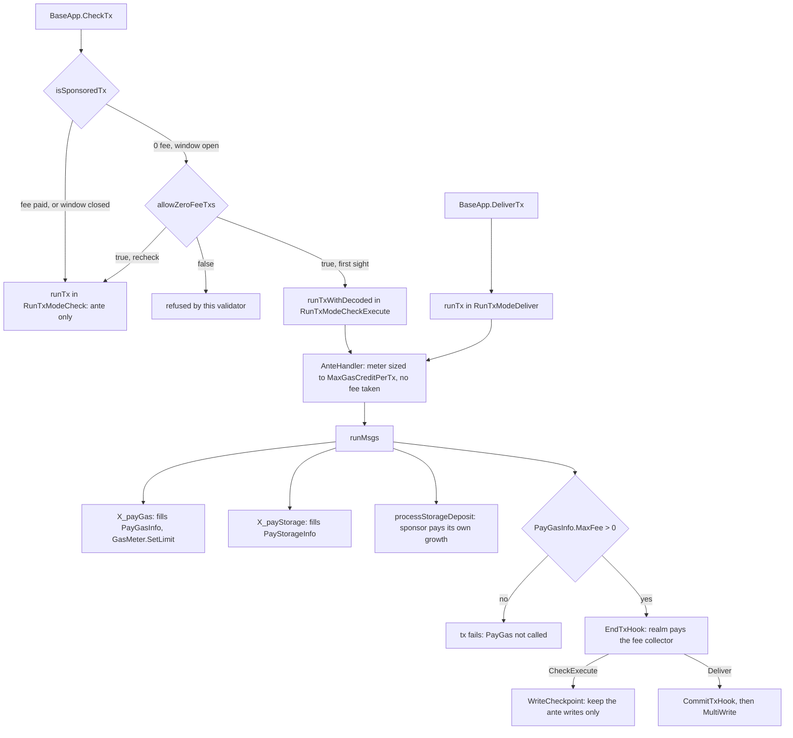

# Realm transaction sponsorship: `runtime.PayGas` and `runtime.PayStorage`

Written by claude-opus-5-5, high effort.
PR: [gnolang/gno#5382](https://github.com/gnolang/gno/pull/5382)

## TLDR

Before, every transaction paid its own way:
[`Tx.ValidateBasic`](https://github.com/gnolang/gno/blob/3cc494ec4/tm2/pkg/std/tx.go#L50)
refused an empty fee, the ante handler
[deducted the fee](https://github.com/gnolang/gno/blob/3cc494ec4/tm2/pkg/sdk/auth/ante.go#L207)
from the first signer, and storage deposits came out of the caller's
`MaxDeposit`. After, a realm can pay for a 0-fee transaction while it runs, by
calling [`runtime.PayGas`](https://github.com/omarsy/gno/blob/1f043ddb1/gnovm/stdlibs/chain/runtime/paygas.gno#L18)
for gas and [`runtime.PayStorage`](https://github.com/omarsy/gno/blob/1f043ddb1/gnovm/stdlibs/chain/runtime/paystorage.gno#L21)
for growth of its own storage. Gas runs on a consensus-set credit window,
`Block.MaxGasCreditPerTx`, and the realm is debited only when the transaction
succeeds. The change exists so a user can act on chain before owning any
ugnot. Both switches ship off: the window is 0 and `allow_zero_fee_txs` is false.

## Before and after

One row per place a transaction's fee is handled. Each cell names the code
that does it, at the merge base for Before and at the pull request head for
After.

| Where | Before | After |
| --- | --- | --- |
| Stateless check | A 0-fee tx is refused as an invalid fee, through [`Tx.ValidateBasic`](https://github.com/gnolang/gno/blob/3cc494ec4/tm2/pkg/std/tx.go#L50) | An empty fee passes, through [`Tx.ValidateBasic`](https://github.com/omarsy/gno/blob/1f043ddb1/tm2/pkg/std/tx.go#L55); the ante refuses it when the window is closed, through [`NewAnteHandler`](https://github.com/omarsy/gno/blob/1f043ddb1/tm2/pkg/sdk/auth/ante.go#L166-L169) |
| Mempool admission | The ante runs alone and checks the fee against the node's minimum gas price, through [`BaseApp.CheckTx`](https://github.com/gnolang/gno/blob/3cc494ec4/tm2/pkg/sdk/baseapp.go#L638) and [`EnsureSufficientMempoolFees`](https://github.com/gnolang/gno/blob/3cc494ec4/tm2/pkg/sdk/auth/ante.go#L85) | A fee-paying tx is unchanged. A 0-fee tx is refused unless the node opted in, then runs the ante and every message on first sight and the ante alone on recheck, through [`BaseApp.CheckTx`](https://github.com/omarsy/gno/blob/1f043ddb1/tm2/pkg/sdk/baseapp.go#L643) |
| Gas limit | The meter is sized to the client's `GasWanted`, through [`SetGasMeter`](https://github.com/gnolang/gno/blob/3cc494ec4/tm2/pkg/sdk/auth/ante.go#L91) | A 0-fee tx's meter is sized to [`MaxGasCreditPerTx`](https://github.com/omarsy/gno/blob/1f043ddb1/tm2/pkg/sdk/auth/ante.go#L122), then shrunk to what `maxFee` buys, through [`X_payGas`](https://github.com/omarsy/gno/blob/1f043ddb1/gnovm/stdlibs/chain/runtime/paygas.go#L61) |
| Fee payment | The first signer pays before any message runs, through [`DeductFees`](https://github.com/gnolang/gno/blob/3cc494ec4/tm2/pkg/sdk/auth/ante.go#L207) | A fee-paying tx is unchanged. For a 0-fee tx the realm pays after the messages succeed, through gno.land's [`EndTxHook`](https://github.com/omarsy/gno/blob/1f043ddb1/gno.land/pkg/gnoland/app.go#L258) |
| End of a transaction | The hook runs after every delivered tx, success or not, returns nothing, and gno.land commits its store there on success, through [`EndTxHook`](https://github.com/gnolang/gno/blob/3cc494ec4/gno.land/pkg/gnoland/app.go#L255) | The hook runs only on success, at delivery and at 0-fee admission, and an error it returns fails the tx, through [`runTxWithDecoded`](https://github.com/omarsy/gno/blob/1f043ddb1/tm2/pkg/sdk/baseapp.go#L1093); the store commit moves to [`CommitTxHook`](https://github.com/omarsy/gno/blob/1f043ddb1/gno.land/pkg/gnoland/app.go#L323), delivery only |
| Nobody paid | No 0-fee tx reaches execution | A 0-fee tx in which no realm called `PayGas` fails in every mode, through [`runTxWithDecoded`](https://github.com/omarsy/gno/blob/1f043ddb1/tm2/pkg/sdk/baseapp.go#L1073) |
| Storage deposit | Growth is charged to the caller's `MaxDeposit`, through [`processStorageDeposit`](https://github.com/gnolang/gno/blob/3cc494ec4/gno.land/pkg/sdk/vm/keeper.go#L2401) | Growth of the sponsor's own storage, in a message that calls the sponsor, is charged to the sponsor within its budget; all other growth stays on the caller, through [`processStorageDeposit`](https://github.com/omarsy/gno/blob/1f043ddb1/gno.land/pkg/sdk/vm/keeper.go#L2454-L2463) |
| Realm code | A realm has no way to pay for its caller | `PayGas` and `PayStorage` record a commitment in a 0-fee tx, do nothing in a fee-paying one, and panic on invalid arguments, through [`X_payGas`](https://github.com/omarsy/gno/blob/1f043ddb1/gnovm/stdlibs/chain/runtime/paygas.go#L13) and [`X_payStorage`](https://github.com/omarsy/gno/blob/1f043ddb1/gnovm/stdlibs/chain/runtime/paystorage.go#L12) |

A realm sponsors by calling the native from a crossing function and passing its
own `cur`. This is the after state, from the pull request's
[`paygas_basic.txtar`](https://github.com/omarsy/gno/blob/1f043ddb1/gno.land/pkg/integration/testdata/paygas_basic.txtar#L47-L50):

```go
func DoWork(cur realm) string {
	runtime.PayGas(1000000, cur) // realm pays up to 1000000 ugnot (1 gnot)
	return "done"
}
```

## How sponsorship works

The after state: the path a 0-fee transaction takes on a chain whose window is
open. A fee-paying transaction takes the left branch at `isSponsoredTx`, and
inside its messages `PayGas` and `PayStorage` do nothing.



- [`isSponsoredTx`](https://github.com/omarsy/gno/blob/1f043ddb1/tm2/pkg/sdk/baseapp.go#L794)
  decides whether a tx runs on the window: its fee is zero and
  `MaxGasCreditPerTx` is above 0.
- [`BaseApp.CheckTx`](https://github.com/omarsy/gno/blob/1f043ddb1/tm2/pkg/sdk/baseapp.go#L662-L667)
  decides the admission mode. A node with `allowZeroFeeTxs` false refuses every
  0-fee tx. A first sighting runs the messages; a recheck after each block runs
  the ante alone.
- The [ante handler](https://github.com/omarsy/gno/blob/1f043ddb1/tm2/pkg/sdk/auth/ante.go#L68)
  decides the budget. For a 0-fee tx it skips the `GasWanted` and minimum gas
  price checks, sizes the meter to the window, refuses admission before block 1,
  and [reports `GasWanted`](https://github.com/omarsy/gno/blob/1f043ddb1/tm2/pkg/sdk/auth/ante.go#L401)
  as the window so block packing counts the worst case.
- [`runTxWithDecoded`](https://github.com/omarsy/gno/blob/1f043ddb1/tm2/pkg/sdk/baseapp.go#L1029-L1032)
  gives each tx one [`PayGasInfo`](https://github.com/omarsy/gno/blob/1f043ddb1/tm2/pkg/sdk/types.go#L25),
  marked eligible for a 0-fee tx anywhere except genesis delivery. After the
  messages it fails a tx no realm paid for, calls `EndTxHook` only on success,
  and at admission keeps the ante writes, so the signer's sequence moves on and
  a second 0-fee tx from the same account is accepted.
- [`X_payGas`](https://github.com/omarsy/gno/blob/1f043ddb1/gnovm/stdlibs/chain/runtime/paygas.go#L13)
  decides the gas limit: `maxFee` times the price's gas unit, divided by its
  ugnot amount, never above the current limit. It panics on a non-positive
  `maxFee`, on anything that is not a top-level `/r/` realm, on a
  [second call](https://github.com/omarsy/gno/blob/1f043ddb1/gnovm/stdlibs/chain/runtime/paygas.go#L35)
  in the tx, and when gas already used exceeds the new limit. Outside an
  eligible tx it returns without recording anything.
- [`X_payStorage`](https://github.com/omarsy/gno/blob/1f043ddb1/gnovm/stdlibs/chain/runtime/paystorage.go#L27)
  records a budget only when the realm calling it is the message's entry: the
  target of a `MsgCall`, or the package a `MsgAddPackage` deploys. A
  `MsgRun` has no entry, so it never sponsors storage.
- [`processStorageDeposit`](https://github.com/omarsy/gno/blob/1f043ddb1/gno.land/pkg/sdk/vm/keeper.go#L2388)
  decides who pays each realm's growth. The sponsor pays for its own storage in
  its own messages, up to the budget left; storage it frees
  [returns to it first](https://github.com/omarsy/gno/blob/1f043ddb1/gno.land/pkg/sdk/vm/keeper.go#L2547),
  up to what it locked earlier in the same tx.
- gno.land's [`EndTxHook`](https://github.com/omarsy/gno/blob/1f043ddb1/gno.land/pkg/gnoland/app.go#L275-L312)
  decides the debit and moves it with
  [`SendCoinsUnrestricted`](https://github.com/omarsy/gno/blob/1f043ddb1/gno.land/pkg/gnoland/app.go#L309)
  from the realm to the fee collector. It runs on a fresh infinite meter, so
  settling costs the tx no gas. An insolvent realm fails the tx, and at
  admission that keeps it out of the mempool.
- [`CommitTxHook`](https://github.com/omarsy/gno/blob/1f043ddb1/gno.land/pkg/gnoland/app.go#L323-L325)
  commits the gno transaction store, for a delivered tx that succeeded only,
  since that store lives outside the cache admission throws away.

The debit, after the change, with the price
[`GasPriceContextKey`](https://github.com/omarsy/gno/blob/1f043ddb1/gno.land/pkg/sdk/vm/keeper.go#L56)
carries, written `Price.Amount` ugnot per `Gas` units:

$$
\text{debit} = \min\left(\text{maxFee},\ \left\lceil \frac{\text{gasUsed} \times \text{Price.Amount}}{\text{Gas}} \right\rceil\right)
$$

The rows below come from a Python mirror of `X_payGas`'s limit and the hook's
debit, run against the mirrored source. Inputs are an example price of 1 ugnot
per 1000 gas and a window of 10,000,000 gas, the value the
[integration harness sets](https://github.com/omarsy/gno/blob/1f043ddb1/gno.land/pkg/integration/testscript_gnoland.go#L293).

| `maxFee`, ugnot | Gas used | Gas limit after `PayGas` | Outcome | Realm debited, ugnot |
| --- | --- | --- | --- | --- |
| 1,000,000 | 2,345,678 | 10,000,000, the window | succeeds | 2,346 |
| 5,000 | 2,345,678 | 5,000,000 | succeeds | 2,346 |
| 2,000 | 2,345,678 | 2,000,000 | runs out of gas and fails | 0 |
| 3 | 2,001 | 3,000 | succeeds | 3, rounded up from 2.001 |

## What a user notices

All of this is per chain, decided by `MaxGasCreditPerTx` in its genesis, and
per node, decided by the `allow_zero_fee_txs` setting of the node the
transaction is first sent to. With either off, a 0-fee transaction is refused
with one of the first two errors in the table below.

- A user holding no ugnot calls a sponsoring realm with `-gas-fee 0ugnot`. The
  user's balance is unchanged and the realm's balance drops by the debit.
- A sponsored transaction that fails costs nobody anything, the user included.
- In a fee-paying transaction `PayGas` and `PayStorage` do nothing, and the
  signer pays exactly as before.
- A transaction cannot call a sponsor's functions twice: a second `PayGas` or
  `PayStorage` in one transaction panics.
- Storage the transaction adds in any realm other than the sponsor still comes
  out of the user's `MaxDeposit`, so a user with no ugnot can only grow the
  sponsor's storage.

A 0-fee transaction is now refused with one of these messages, depending on
the condition, after the change:

| Condition | Error |
| --- | --- |
| Window closed | [`zero-fee transactions require a non-zero Block.MaxGasCreditPerTx`](https://github.com/omarsy/gno/blob/1f043ddb1/tm2/pkg/sdk/auth/ante.go#L168) |
| Node not opted in | [`zero-fee transactions not accepted by this validator`](https://github.com/omarsy/gno/blob/1f043ddb1/tm2/pkg/sdk/baseapp.go#L662) |
| Chain has no committed block yet | [`sponsored transactions are not accepted before the first block`](https://github.com/omarsy/gno/blob/1f043ddb1/tm2/pkg/sdk/auth/ante.go#L85) |
| No realm called `PayGas` | [`PayGas not called in 0-fee transaction`](https://github.com/omarsy/gno/blob/1f043ddb1/tm2/pkg/sdk/baseapp.go#L1073) |
| Sponsor's storage growth over its budget | [`storage deposit exceeds PayStorage budget`](https://github.com/omarsy/gno/blob/1f043ddb1/gno.land/pkg/sdk/vm/keeper.go#L2459) |

Before the change, the same transaction failed in
[`ValidateBasic`](https://github.com/gnolang/gno/blob/3cc494ec4/tm2/pkg/std/tx.go#L51)
with `invalid fee ... amount provided`. Both are `ErrInsufficientFee`.

## Upgrading

- `Block.MaxGasCreditPerTx` is a new consensus parameter,
  [default 0](https://github.com/omarsy/gno/blob/1f043ddb1/tm2/pkg/bft/types/params.go#L75),
  [validated](https://github.com/omarsy/gno/blob/1f043ddb1/tm2/pkg/bft/types/params.go#L137)
  to be at most `Block.MaxGas`. The PR's
  [tm2 ADR](https://github.com/omarsy/gno/blob/1f043ddb1/tm2/adr/pr5382_zero_fee_tx_admission_and_settlement.md?plain=1#L35-L37)
  states that the app reads it from the copy stored at InitChain, so changing
  it takes a chain upgrade.
- `allow_zero_fee_txs` is a new
  [node setting](https://github.com/omarsy/gno/blob/1f043ddb1/tm2/pkg/sdk/config/config.go#L31),
  default false. It changes only what this node admits; delivery ignores it.
- Adding the natives changes the `chain/runtime` stdlib committed at genesis.
  The [gno.land ADR](https://github.com/omarsy/gno/blob/1f043ddb1/gno.land/adr/pr5382_realm_transaction_sponsorship.md?plain=1#L89)
  states the genesis app hash changes and every transaction loading
  `chain/runtime` uses about 3.5K more gas, sponsored or not.
- For tm2 embedders, [`EndTxHook`](https://github.com/omarsy/gno/blob/1f043ddb1/tm2/pkg/sdk/abci.go#L41)
  now returns an error, runs only on success and also runs at 0-fee admission.
  Work that writes outside the cached store belongs in the new
  [`CommitTxHook`](https://github.com/omarsy/gno/blob/1f043ddb1/tm2/pkg/sdk/abci.go#L48).
  Every `GasMeter` must implement
  [`SetLimit`](https://github.com/omarsy/gno/blob/1f043ddb1/tm2/pkg/store/types/gas.go#L248).

## Words used here

| Name | What it is |
| --- | --- |
| `runtime.PayGas(maxFee, rlm)` | [Native](https://github.com/omarsy/gno/blob/1f043ddb1/gnovm/stdlibs/chain/runtime/paygas.gno#L18) committing realm `rlm` to pay this tx's gas, up to `maxFee` ugnot; `rlm.IsCurrent()` must hold. |
| `runtime.PayStorage(maxDeposit, rlm)` | [Native](https://github.com/omarsy/gno/blob/1f043ddb1/gnovm/stdlibs/chain/runtime/paystorage.gno#L21) committing `rlm` to pay deposits for its own storage, up to `maxDeposit` ugnot per tx, in messages that call `rlm`. |
| Credit window | The gas a 0-fee tx may use before and after `PayGas`, equal to `MaxGasCreditPerTx`; `PayGas` may lower it, never raise it. |
| `Block.MaxGasCreditPerTx` | [Consensus parameter](https://github.com/omarsy/gno/blob/1f043ddb1/tm2/pkg/bft/types/params.go#L75) sizing the credit window; 0, the default, turns sponsorship off. |
| `allow_zero_fee_txs` | [Node setting](https://github.com/omarsy/gno/blob/1f043ddb1/tm2/pkg/sdk/config/config.go#L31), `AllowZeroFeeTxs` in Go, deciding whether this node admits 0-fee txs to its mempool; default false. |
| 0-fee tx | A tx whose `Fee.GasFee` is zero; it can run only when the window is above 0. |
| `RunTxModeCheckExecute` | [Run mode](https://github.com/omarsy/gno/blob/1f043ddb1/tm2/pkg/sdk/types.go#L79) used on a 0-fee tx's first `CheckTx`: runs the messages and settlement, keeps only the ante's writes. |
| `PayGasInfo` | [Per-tx record](https://github.com/omarsy/gno/blob/1f043ddb1/tm2/pkg/sdk/types.go#L25) on the SDK context: `Eligible` when the tx is a 0-fee tx outside genesis delivery, `MaxFee` above 0 once a realm called `PayGas`. |
| `PayStorageInfo` | [Per-tx record](https://github.com/omarsy/gno/blob/1f043ddb1/gnovm/stdlibs/internal/execctx/context.go#L112) of the storage sponsor, its budget and what it has locked so far; `Entry` is the realm the current message calls. |
| Entry realm | The realm a message calls: the target of a `MsgCall`, or the package a `MsgAddPackage` deploys; a `MsgRun` has none. |
| Storage deposit | Ugnot locked when a realm's stored bytes grow and released to whoever frees them, through [`processStorageDeposit`](https://github.com/omarsy/gno/blob/1f043ddb1/gno.land/pkg/sdk/vm/keeper.go#L2388). |
| `EndTxHook` | [tm2 hook](https://github.com/omarsy/gno/blob/1f043ddb1/tm2/pkg/sdk/abci.go#L41) run after a successful tx's messages; gno.land debits the gas sponsor there. |
| `CommitTxHook` | [tm2 hook](https://github.com/omarsy/gno/blob/1f043ddb1/tm2/pkg/sdk/abci.go#L48) run only for a delivered tx that succeeded, before its writes are flushed. |
| `GasMeter.SetLimit` | [Meter method](https://github.com/omarsy/gno/blob/1f043ddb1/tm2/pkg/store/types/gas.go#L248) `PayGas` uses to lower the tx's gas limit; an infinite meter ignores it. |
| Gas price | The auth module's current price, `Price.Amount` ugnot per `Gas` units, read from [`GasPriceContextKey`](https://github.com/omarsy/gno/blob/1f043ddb1/gno.land/pkg/sdk/vm/keeper.go#L56-L63); the same price fee-paying txs are checked against. |
