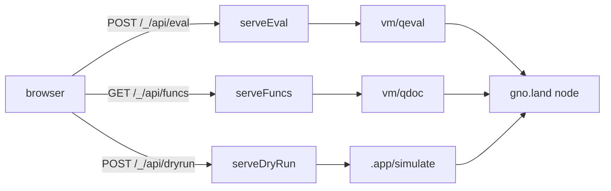

# PR [#5421](https://github.com/gnolang/gno/pull/5421): a playground inside gnoweb

Written by claude-opus-5, effort high.

## TLDR

Today someone who wants to try Gno code opens [play.gno.land](https://play.gno.land), a
separate React and WebAssembly application living in another repository. This pull request
moves that job into [gnoweb](https://github.com/gnolang/gno/tree/master/gno.land/pkg/gnoweb),
the Go server that already renders every gno.land page, so the same binary that serves a realm
also serves an editor for it. Nothing new runs on the visitor's machine and nothing new is
deployed: the code is Go plus plain browser JavaScript compiled ahead of time, and every result
on screen comes from a read-only query the node already answers.

## What a visitor gets

| Where | What it does |
| --- | --- |
| `/_/play` | An editor with file tabs and a Run button, reachable from nowhere else on the site. The contents can be packed into the URL, so a link carries the code. |
| `?run` on a realm page | A scratch pad that writes the `gnokey maketx run` command line for a script, and a Dry Run button that asks the node what the script would do. |
| `?fork` on a package page | Loads every `.gno` file of that package into the editor as tabs. Its button is [commented out of the header](https://github.com/gnolang/gno/blob/4a0e7ff2a/gno.land/pkg/gnoweb/components/layout_header.go#L74-L81) until publishing exists, so the query is reachable only by typing it. |
| `?help` on a realm page | The existing Actions page gains an [expression box](https://github.com/gnolang/gno/blob/4a0e7ff2a/gno.land/pkg/gnoweb/components/views/action.html#L194-L232) with a history list, and an Eval button beside every function that does not take a realm argument. |

## How a click reaches the chain

Three new JSON endpoints stand between the page and the node. Each one wraps a query the node
already exposes, so the browser never talks to the RPC port and the page stays same-origin.

`vm/qeval` evaluates one expression against a deployed package and hands back what it printed.
`vm/qdoc` returns the package documentation, which is where the Eval buttons get their function
list. `.app/simulate` runs a whole transaction and throws the result away, which is what Dry Run
reports.

## The shape of the code

Two self-contained packages, [`feature/playground`](https://github.com/gnolang/gno/blob/4a0e7ff2a/gno.land/pkg/gnoweb/feature/playground/feature.go#L51-L86)
and [`feature/run`](https://github.com/gnolang/gno/blob/4a0e7ff2a/gno.land/pkg/gnoweb/feature/run/feature.go#L21-L47),
each owning its handler, its HTML template, its stylesheet and its browser code. They copy the
layout of `feature/state`, which landed earlier by the same route. Neither imports the `gnoweb`
package: each declares the slice of the chain client it needs as its own interface, and
[a small adapter](https://github.com/gnolang/gno/blob/4a0e7ff2a/gno.land/pkg/gnoweb/handler_http.go#L1152-L1179)
in `gnoweb` fills it in.

## What holds the load down

Every one of these endpoints is open to anyone who can reach the site, so the branch carries
four ceilings. They are worth reading together, because three of them bound one request and the
fourth bounds how many requests one visitor gets.

| Ceiling | Value | What it bounds |
| --- | --- | --- |
| [`maxDecompressedCodeSize`](https://github.com/gnolang/gno/blob/4a0e7ff2a/gno.land/pkg/gnoweb/feature/playground/handler.go#L31) | 1 MiB | Code unpacked out of a shared `/_/play` link. |
| [`maxForkCodeSize`](https://github.com/gnolang/gno/blob/4a0e7ff2a/gno.land/pkg/gnoweb/feature/playground/handler.go#L38) | 1 MiB | Source pulled in by `?fork`, fetched [8 files at a time](https://github.com/gnolang/gno/blob/4a0e7ff2a/gno.land/pkg/gnoweb/feature/playground/handler.go#L34). |
| [`maxEvalBodyBytes`](https://github.com/gnolang/gno/blob/4a0e7ff2a/gno.land/pkg/gnoweb/feature/playground/handler.go#L42) | 1 MiB | The JSON body posted to eval, and to dry run. |
| [the token bucket](https://github.com/gnolang/gno/blob/4a0e7ff2a/gno.land/pkg/gnoweb/feature/playground/ratelimit.go#L14-L17) | 10 at once, one back every 3s | Eval and dry run calls from one address, roughly 20 a minute once the initial ten are spent. |

## A detail that is easy to miss

CodeMirror writes its own `<style>` elements into the page at runtime, and gnoweb's strict
Content Security Policy forbids inline styles. Rather than switching the policy off, each
response now carries [a fresh random nonce](https://github.com/gnolang/gno/blob/4a0e7ff2a/gno.land/pkg/gnoweb/csp.go#L16-L21)
in both the policy header and a `<meta>` tag, and the editor reads the tag and stamps the same
value on the styles it creates. The nonce is generated only under
[strict headers](https://github.com/gnolang/gno/blob/4a0e7ff2a/gno.land/cmd/gnoweb/main.go#L380-L387),
which is the deployed configuration and not the default for a local run.

## Words used here

- **realm**: a package on gno.land that keeps state between calls, addressed under `/r/`.
- **package**: code with no state of its own, addressed under `/p/`.
- **dry run**: asking the node to execute a transaction and report the outcome without recording it.
- **crossing function**: one that takes a realm argument, meaning it can only be called by a
  transaction and never read for free.

## Review files

[reviews/pr/5xxx/5421-builtin-playground-2](https://github.com/samouraiworld/gno-agent-workspace/tree/main/reviews/pr/5xxx/5421-builtin-playground-2)
