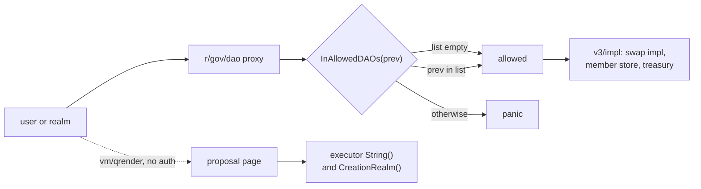

# PR [#6068](https://github.com/gnolang/gno/pull/6068): what the govDAO allowlist change does

Written by claude-opus-5, effort xhigh.

`gno.land/r/gov/dao` is a proxy. It holds the proposals and one list of realm
paths, and it forwards governance calls to whichever implementation realm is
installed. Three operations are gated on that list: replacing the
implementation, mutating the member store, and moving treasury funds. The gate
is one function, and its first line is the subject of this change.

## The gate

After the change, at
[`proxy.gno:231-241`](https://github.com/gnolang/gno/blob/308d5f354ff64dc00183aa0eb76f81ac80f96f70/examples/gno.land/r/gov/dao/proxy.gno#L231-L241)
· [↗](../../../../.worktrees/gno-review-6068/examples/gno.land/r/gov/dao/proxy.gno#L231):

```go
func InAllowedDAOs(pkg string) bool {
	if len(allowedDAOs) == 0 {
		return true // corner case for initialization
	}
	...
}
```

An empty list answers yes to every caller. That is deliberate. A chain's genesis
run has to seed the first members before any DAO exists to authorise the
seeding, so the list starts empty and the gate starts open. `UpdateImpl` closes
it by storing a non-empty list, and `UpdateImpl` is the only writer.

The bug was that the window was not one-way.

## Before and after

Before, at
[`efd21d7e8`](https://github.com/gnolang/gno/blob/efd21d7e8b733c1aee25015988d470baa6d8c16e/examples/gno.land/r/gov/dao/proxy.gno#L153-L155):

```go
	if r.AllowedDAOs != nil {
		allowedDAOs = r.AllowedDAOs
	}
```

After, at
[`proxy.gno:171-217`](https://github.com/gnolang/gno/blob/308d5f354ff64dc00183aa0eb76f81ac80f96f70/examples/gno.land/r/gov/dao/proxy.gno#L171-L217)
· [↗](../../../../.worktrees/gno-review-6068/examples/gno.land/r/gov/dao/proxy.gno#L171), a length test plus a
per-entry check that rejects a blank or space-padded path before anything is
assigned:

```go
	if len(r.AllowedDAOs) != 0 {
		for i, d := range r.AllowedDAOs {
			...
		}
		allowedDAOs = r.AllowedDAOs
	}
```

`nil` and `[]string{}` are different values and the same intent. The documented
way to say "swap the implementation, leave permissions alone" is
`NewUpdateRequest(newDAO, nil)`, and
[`types.gno:287-294`](https://github.com/gnolang/gno/blob/308d5f354ff64dc00183aa0eb76f81ac80f96f70/examples/gno.land/r/gov/dao/types.gno#L287-L294)
· [↗](../../../../.worktrees/gno-review-6068/examples/gno.land/r/gov/dao/types.gno#L287)
turns that `nil` into a non-nil slice of length zero. The old `!= nil` test let
it through, so the documented no-op reopened the gate.

The blank-entry check matters for the same reason the length check does. A user
realm's `PkgPath()` is the empty string, and `InAllowedDAOs` compares whole
strings, so one `""` entry in an otherwise locked list admits every caller whose
previous frame is a user realm.



## The proposal page

The dotted edge is the change's second half. `Render` is reachable by anyone
through `vm/qrender` under a query gas cap of 3,000,000,000, read at
[`keeper.go:52`](https://github.com/gnolang/gno/blob/308d5f354ff64dc00183aa0eb76f81ac80f96f70/gno.land/pkg/sdk/vm/keeper.go#L52)
· [↗](../../../../.worktrees/gno-review-6068/gno.land/pkg/sdk/vm/keeper.go#L52).
Several strings on that page come from the proposal's executor, which is
third-party code dispatched through a public interface. Two of them, the denial
reason and the realm the executor names as its origin, were written into the
page raw and unbounded.

Both are now cut to a fixed size and then escaped, in that order. The order is
the load-bearing part. Escaping runs about
[11,310 gas per byte](https://github.com/gnolang/gno/blob/308d5f354ff64dc00183aa0eb76f81ac80f96f70/examples/gno.land/r/gov/dao/v3/impl/clamp.gno#L6-L8)
· [↗](../../../../.worktrees/gno-review-6068/examples/gno.land/r/gov/dao/v3/impl/clamp.gno#L6),
so escaping first prices the page out of the cap on a large enough value, and
the escapers size their own fence from the string they are handed, so cutting
after escaping can slice off a closing fence. `clampField` at
[`clamp.gno:68-80`](https://github.com/gnolang/gno/blob/308d5f354ff64dc00183aa0eb76f81ac80f96f70/examples/gno.land/r/gov/dao/v3/impl/clamp.gno#L68-L80)
· [↗](../../../../.worktrees/gno-review-6068/examples/gno.land/r/gov/dao/v3/impl/clamp.gno#L68)
does the cut, backing off to a rune boundary and marking the result.

The denial reason is also bounded on the way in, at
[`govdao.gno:173`](https://github.com/gnolang/gno/blob/308d5f354ff64dc00183aa0eb76f81ac80f96f70/examples/gno.land/r/gov/dao/v3/impl/govdao.gno#L173)
· [↗](../../../../.worktrees/gno-review-6068/examples/gno.land/r/gov/dao/v3/impl/govdao.gno#L173),
so the realm stops storing an error larger than it can show. That write is paid
for by whoever executes the proposal, not by whoever wrote the executor.

## The disclosure line

`Executor created in:` names the realm whose code runs if the proposal passes.
Before the change it printed only when the executor also carried a description,
and
[16 production call sites across 7 production realms](https://github.com/gnolang/gno/blob/308d5f354ff64dc00183aa0eb76f81ac80f96f70/examples/gno.land/r/gov/dao/v3/impl/render.gno#L136-L139)
· [↗](../../../../.worktrees/gno-review-6068/examples/gno.land/r/gov/dao/v3/impl/render.gno#L136)
pass an empty description, so voters on those proposals saw nothing. It now
prints on its own line at
[`render.gno:150-153`](https://github.com/gnolang/gno/blob/308d5f354ff64dc00183aa0eb76f81ac80f96f70/examples/gno.land/r/gov/dao/v3/impl/render.gno#L150-L153)
· [↗](../../../../.worktrees/gno-review-6068/examples/gno.land/r/gov/dao/v3/impl/render.gno#L150).

Moving it out of that gate changed how often the executor's own code runs during
a render. Measured on the real render path with an executor whose description is
empty, one proposal-page render:

| sha | `String()` calls | `CreationRealm()` calls |
|---|---|---|
| before, efd21d7e8 | 1 | 0 |
| after, 308d5f354 | 1 | 1 |

The value the executor returns is escaped, so it cannot forge page structure.
What it says is still the executor's own claim, and the realm does not check it.

## Reading order

[`proxy.gno`](https://github.com/gnolang/gno/blob/308d5f354ff64dc00183aa0eb76f81ac80f96f70/examples/gno.land/r/gov/dao/proxy.gno#L157-L223)
· [↗](../../../../.worktrees/gno-review-6068/examples/gno.land/r/gov/dao/proxy.gno#L157)
first, since the gate explains why everything else is worth hardening. Then
[`clamp.gno`](https://github.com/gnolang/gno/blob/308d5f354ff64dc00183aa0eb76f81ac80f96f70/examples/gno.land/r/gov/dao/v3/impl/clamp.gno#L25-L46)
· [↗](../../../../.worktrees/gno-review-6068/examples/gno.land/r/gov/dao/v3/impl/clamp.gno#L25)
for the four bounds and what each one is sized against, then
[`render.gno`](https://github.com/gnolang/gno/blob/308d5f354ff64dc00183aa0eb76f81ac80f96f70/examples/gno.land/r/gov/dao/v3/impl/render.gno#L96-L164)
· [↗](../../../../.worktrees/gno-review-6068/examples/gno.land/r/gov/dao/v3/impl/render.gno#L96)
and its twin
[`StringifyProposal`](https://github.com/gnolang/gno/blob/308d5f354ff64dc00183aa0eb76f81ac80f96f70/examples/gno.land/r/gov/dao/v3/impl/types.gno#L218-L242)
· [↗](../../../../.worktrees/gno-review-6068/examples/gno.land/r/gov/dao/v3/impl/types.gno#L218),
which carries a second copy of the disclosure expression.

Review files: [6068-gov-dao-allowlist-lockdown](https://github.com/samouraiworld/gno-agent-workspace/tree/main/reviews/pr/6xxx/6068-gov-dao-allowlist-lockdown).
