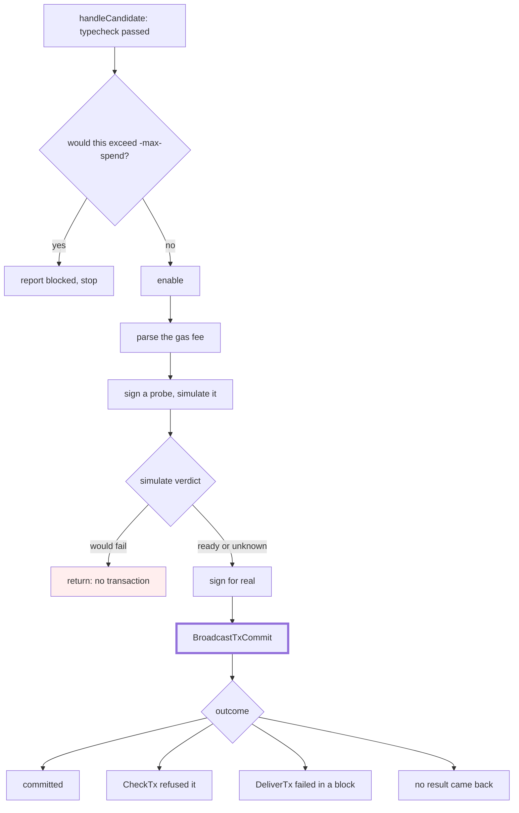

# The spending counter moves to the send

An explainer for [gnolang/gno#6111](https://github.com/gnolang/gno/pull/6111),
written by claude-opus-5.

## TLDR

[gpao](https://github.com/gnolang/gno/tree/master/contribs/gpao) is a daemon
holding a key that approves submitted packages on a chain running the `inert`
submission policy. `-max-spend` caps what one run will pay in gas fees, and the
daemon counted a fee against that cap before it tried to send the approval.
[Four paths inside the send](https://github.com/gnolang/gno/blob/b51a78a8a/contribs/gpao/oracle.go#L772-L825)
return without building a transaction. The counter therefore drifted above the
balance, and the daemon reported itself out of budget while holding every coin
it started with. Well-formed packages came back `blocked`.

The branch moves the count to the statement before the broadcast, and gives it
back for the one refusal a node makes for free.

## Concepts

**Inert submission.** A `MsgAddPackage` parks the code without activating it
when the chain's `CodeSubmissionPolicy` is `inert`. A separate
`MsgEnablePackage` makes the package live, and only an address in the
`PkgApprovers` param can sign it. gpao is the daemon that watches for parked
packages, typechecks each one off-chain, and sends that second message.

**The fee is flat.** In tm2 a gas fee is a single coin fixed at signing time,
not a price times the gas burned. gpao defaults the fee to `1000000ugnot` and
`-max-spend` to `100000000ugnot`, so a run is a hundred approvals, at
[`main.go:29-38`](https://github.com/gnolang/gno/blob/b51a78a8a/contribs/gpao/main.go#L29-L38).

**Two chances to be refused.** A node first runs a transaction through the ante
handler alone, which is `CheckTx`. Only if that passes does the transaction
enter a block, where `DeliverTx` runs the ante again and then the message. The
ante deducts the fee, so where the refusal happens decides whether any money
moved.

**Simulate is not a send.** Before signing for real, gpao asks the node to
execute the enable and report the gas it used. A package whose `init()` panics
passes gpao's own typecheck and then fails that simulation, because verification
preprocesses rather than executes. gpao declines to broadcast a message
the node has already rejected.

## Where the count sat



The count used to happen on the edge into `enable`, at the top. It now happens
one statement before the thick box. Every return between the two points, the
pink one included, used to cost the operator a fee's worth of allowance for a
transaction that was never built.

## What each outcome costs

Measured against an in-memory node at the branch head, one enable per row.

| Outcome | Chain charged | Counted before | Counted after |
| --- | ---: | ---: | ---: |
| Simulate says the enable would fail | 0 | one fee | 0 |
| Gas fee unparseable, or signing failed | 0 | one fee | 0 |
| CheckTx refused it | 0 | one fee | 0 |
| DeliverTx failed inside a block | one fee | one fee | one fee |
| Committed | one fee | one fee | one fee |
| No result came back | unknown | one fee | one fee |

The first row is what every package with a panicking `init()` does, and
resubmitting one is cheap.

The last row is a deliberate over-count. The client reports a lost answer and a
pre-mempool refusal through the same shape, a nil result plus an error. So the
daemon cannot tell a transaction that may have committed from one nobody ever
saw, and counting both stops the run early rather than letting it overspend.

## The one refund

`CheckTx` is the only refusal a node gives for free. Its ante runs against a
scratch copy of the state, which `Commit` throws away and rebuilds from the
committed store, at
[`baseapp.go:1026`](https://github.com/gnolang/gno/blob/b51a78a8a/tm2/pkg/sdk/baseapp.go#L1026). A refusal returns before
even that copy is written, at
[`baseapp.go:917-932`](https://github.com/gnolang/gno/blob/b51a78a8a/tm2/pkg/sdk/baseapp.go#L917-L932).
A `DeliverTx` failure is the opposite: the fee deduction is flushed even when
the message panics or runs out of gas, at
[`baseapp.go:946-950`](https://github.com/gnolang/gno/blob/b51a78a8a/tm2/pkg/sdk/baseapp.go#L946-L950).

So the branch takes the debit before handing the transaction over and gives it
back on that one refusal:

```go
func broadcastWasFree(res *ctypes.ResultBroadcastTxCommit) bool {
	return res != nil && res.CheckTx.IsErr()
}
```

## What did not change

The `-max-spend` check still runs before the enable, so the cap is reached one
approval early rather than one late. A `DeliverTx` failure still costs a full
fee. Nothing new reads or exposes the counter, and the status board still gives
the same `blocked` reason.
