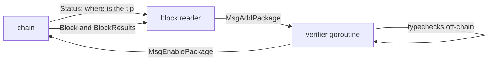

# gpao: the two queries that ran once at startup

Written by claude-opus-5.

## TLDR

[gpao](https://github.com/gnolang/gno/blob/c7ac45512/contribs/gpao/main.go#L1-L11) watches a gno.land chain, typechecks every package submitted with `MsgAddPackage`, and broadcasts an approval for the ones that pass. It asked the node two questions before it started watching, each exactly once. [PR 6115](https://github.com/gnolang/gno/pull/6115) moves both into the polling loop, so a node that is not answering yet costs one poll interval instead of the process or the whole run.

## What the daemon does

The block reader and the verifier are separate goroutines. One follows the chain, the other spends up to [ten seconds](https://github.com/gnolang/gno/blob/c7ac45512/contribs/gpao/main.go#L49) per package typechecking it, so a block carrying many submissions cannot stall chain-following.

## The two questions

**Where is the tip.** With no `-start-height`, gpao begins at whatever height the chain is at. It asked once before the loop and [returned the error](https://github.com/gnolang/gno/blob/2ed70a202/contribs/gpao/oracle.go#L265-L271) when the node did not answer, while [the same `Status` call inside the loop](https://github.com/gnolang/gno/blob/2ed70a202/contribs/gpao/oracle.go#L303-L307) is logged and tried again on the next tick.

**What is the gas ceiling.** Every approval is signed for a gas amount, and the ante handler [refuses a transaction whose `GasWanted` exceeds `Block.MaxGas`](https://github.com/gnolang/gno/blob/c7ac45512/tm2/pkg/sdk/auth/ante.go#L70-L79) rather than clamping it down. So gpao reads the chain's own `Block.MaxGas` and sizes its probe at it. When that query failed, [`defaultBlockMaxGas`](https://github.com/gnolang/gno/blob/c7ac45512/contribs/gpao/oracle.go#L695) stood in, 3,000,000,000, for the rest of the process.

## Why the ceiling is the quiet failure

A probe signed at the fallback is a transaction the node runs and rejects, on any chain whose `Block.MaxGas` sits below 3,000,000,000. [`classifySimulate`](https://github.com/gnolang/gno/blob/c7ac45512/contribs/gpao/oracle.go#L735-L744) reads a rejection as `verdictWillFail`, meaning the message itself is bad, so the approval returns without ever being broadcast. The daemon keeps polling and keeps typechecking, approving nothing, for as long as it runs.

## Before and after

The default poll interval is [one second](https://github.com/gnolang/gno/blob/c7ac45512/contribs/gpao/main.go#L40).

| At startup | master | this branch |
| --- | --- | --- |
| Node up, `-start-height 0` | tip read at process start | tip read at the first poll that answers |
| Node not up, `-start-height 0` | process exits, `failed to query node status` | logged, tried again every poll |
| Node not up, `-start-height N` | ceiling stuck at 3,000,000,000 for the run | ceiling asked every poll until the chain answers |
| Chain reports `Block.MaxGas` of 500,000, late | fallback stands, every approval simulates as a rejection | 500,000 adopted on the first answer |

## Two shapes the change adds

`blockMaxGas` becomes an [`atomic.Int64`](https://github.com/gnolang/gno/blob/c7ac45512/contribs/gpao/oracle.go#L73). It used to be written once before the verifier goroutine started, and starting the goroutine published it; now the block reader writes it while the verifier reads it, so the field needs the atomic. The approval path [loads it once](https://github.com/gnolang/gno/blob/c7ac45512/contribs/gpao/oracle.go#L796), so the probe and the gas amount it sizes cannot straddle a write.

`ceilingKnown` is a [local of the polling loop](https://github.com/gnolang/gno/blob/c7ac45512/contribs/gpao/oracle.go#L266). It separates "the node said nothing" from "the chain answered", the same split `classifySimulate` makes for a simulation. An answer settles the ceiling even when the answer is unusable, such as the `-1` a chain sets to mean no bound at all, where the fallback stands in on purpose.

## What it costs

The tip is read at [the first poll](https://github.com/gnolang/gno/blob/c7ac45512/contribs/gpao/oracle.go#L317-L321) now, so the blocks produced between process start and that poll are no longer caught up. `run` also loses its only failing return, so a typo in `-remote` leaves the process alive and polling rather than exiting.

Review files: [6115-retry-startup-queries](https://github.com/samouraiworld/gno-agent-workspace/tree/main/reviews/pr/6xxx/6115-retry-startup-queries).
