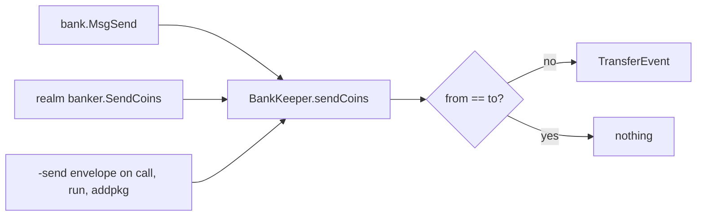

# Bank transfer events for ugnot movements

Generated by claude-opus-5, effort high.

## TLDR

A gno.land node reports what a transaction did through two channels: the message
itself, which anyone can read off the signed transaction, and the event list in
the transaction result. Moving ugnot used to write balances and say nothing in
either channel unless the message happened to describe the move. This change
makes the bank keeper announce every transfer it performs, so a service that
rebuilds account balances by reading transactions can see the moves it could not
see before.

## The problem

Four things move ugnot between accounts on gno.land.

| Move | Visible before this change? |
| --- | --- |
| [`bank.MsgSend`](https://github.com/gnolang/gno/blob/639d06bf2/tm2/pkg/sdk/bank/handler.go#L50) | Yes. Sender, recipient and amount are fields on the message. |
| [`bank.MsgMultiSend`](https://github.com/gnolang/gno/blob/639d06bf2/tm2/pkg/sdk/bank/handler.go#L72) | No, and no transaction can carry one: the type is absent from the [amino registration](https://github.com/gnolang/gno/blob/639d06bf2/tm2/pkg/sdk/bank/package.go#L15-L22), so a node refuses to decode it. Out of scope here. |
| A realm calling [`banker.SendCoins`](https://github.com/gnolang/gno/blob/639d06bf2/gno.land/pkg/sdk/vm/builtins.go#L49-L53) | No. The addresses and the amount are decided while the contract runs. |
| The `-send` envelope on [`maketx call`](https://github.com/gnolang/gno/blob/639d06bf2/gno.land/pkg/sdk/vm/keeper.go#L1212), [`run`](https://github.com/gnolang/gno/blob/639d06bf2/gno.land/pkg/sdk/vm/keeper.go#L1425) and [`addpkg`](https://github.com/gnolang/gno/blob/639d06bf2/gno.land/pkg/sdk/vm/keeper.go#L1047) | Partly. The amount is on the message, and nothing records where the realm forwards it next. |

[GnoScan](https://gnoscan.io) is the service that motivated the change. It builds
its account balance table the way it handles GRC20 tokens, by reading transaction
results and events, so a balance change with no event is a balance change it
never learns about.

## What an event is here

An event in Tendermint2 is an ordinary Go value satisfying the
[`abci.Event`](https://github.com/gnolang/gno/blob/639d06bf2/tm2/pkg/bft/abci/types/types.go#L212-L214)
interface, registered with the amino encoder and appended to a per-transaction
list held on the SDK context. The GnoVM already uses that list for `chain.Emit`
and for its storage deposit notices. This change adds
[one more value](https://github.com/gnolang/gno/blob/639d06bf2/tm2/pkg/sdk/bank/events.go#L8-L12)
to it.

```go
type TransferEvent struct {
	From  string    `json:"from"`
	To    string    `json:"to"`
	Coins std.Coins `json:"coins"`
}
```

## Where it is emitted

Every one-to-one move funnels through one unexported function,
[`BankKeeper.sendCoins`](https://github.com/gnolang/gno/blob/639d06bf2/tm2/pkg/sdk/bank/keeper.go#L173-L196),
so a single emit there covers the message handler, the realm banker and the send
envelope alike.



The `from == to` branch exists for `maketx run`. A run script executes under the
caller's own ephemeral realm, so
[`VMKeeper.Run`](https://github.com/gnolang/gno/blob/639d06bf2/gno.land/pkg/sdk/vm/keeper.go#L1385-L1386)
addresses the envelope from the caller to the caller. The coins end where they
started, and without the branch the event would report a move.

## What the reader sees

Both rows below encode the same `TransferEvent`. The first is what an RPC client
receives, since every RPC response passes through
[`amino.MarshalJSON`](https://github.com/gnolang/gno/blob/639d06bf2/tm2/pkg/bft/rpc/lib/types/types.go#L207).
The second is what `gnokey` prints on its
[`EVENTS:` line](https://github.com/gnolang/gno/blob/639d06bf2/gno.land/pkg/keyscli/root.go#L91),
which uses the standard library encoder through
[`ResponseBase.EncodeEvents`](https://github.com/gnolang/gno/blob/639d06bf2/tm2/pkg/bft/abci/types/types.go#L124-L132).

| Encoder | Output |
| --- | --- |
| amino, over RPC | `[{"@type":"/bank.TransferEvent","from":"g1from","to":"g1to","coins":"7ugnot"}]` |
| [`EncodeEvents`](https://github.com/gnolang/gno/blob/639d06bf2/tm2/pkg/bft/abci/types/types.go#L124-L132), in `gnokey` | `[{"from":"g1from","to":"g1to","coins":[{"denom":"ugnot","amount":7}]}]` |

The two differ because `std.Coins` carries a
[`MarshalAmino`](https://github.com/gnolang/gno/blob/639d06bf2/tm2/pkg/std/coin.go#L216-L218)
method rendering it as a single string, and the standard library encoder does not
call that method. The branch's own generated schema follows the first row:
[`bank.proto:37`](https://github.com/gnolang/gno/blob/639d06bf2/tm2/pkg/sdk/bank/bank.proto#L37)
declares `coins` a `string`. Both rows are the output of
[`tests/event_wire_shapes_test.go`](https://github.com/samouraiworld/gno-agent-workspace/blob/main/reviews/pr/6xxx/6120-bank-transfer-events/2-639d06bf2/tests/event_wire_shapes_test.go).

## What stays silent

Three kinds of ugnot movement carry no transfer event.

Gas fees leave the payer through
[`SendCoinsUnrestricted`](https://github.com/gnolang/gno/blob/639d06bf2/tm2/pkg/sdk/bank/keeper.go#L161-L166),
which skips the transfer policy and emits nothing. The amount is on the
transaction as `gas_fee`.

Storage deposits move ugnot between the payer and
[an address derived from the realm path](https://github.com/gnolang/gno/blob/639d06bf2/gno.land/pkg/sdk/vm/keeper.go#L2381),
again through `SendCoinsUnrestricted`. Those already have their own
`StorageDepositEvent` and `StorageUnlockEvent`, which carry the amount and the
package path but not the two addresses.

Self-transfers, where the sender and the recipient are the same address, move a
balance to itself. `maketx run` produces one on every send envelope, and
`maketx send` to your own address is the other way to get one.

## Concepts

<details><summary>Why events sit inside the block header</summary>

The event list is not a log. A node folds each transaction's `Error`, `Data` and
`Events` into an
[`ABCIResult`](https://github.com/gnolang/gno/blob/639d06bf2/tm2/pkg/bft/types/results.go#L14-L18),
merkle-hashes the set, and writes the root into the next block header as
[`LastResultsHash`](https://github.com/gnolang/gno/blob/639d06bf2/tm2/pkg/bft/state/execution.go#L456).
Every node then checks that field against
[its own execution](https://github.com/gnolang/gno/blob/639d06bf2/tm2/pkg/bft/state/validation.go#L82-L86).
So the set of events a transaction produces is agreed on by the whole network,
the same way balances are.
</details>

<details><summary>What happens to events when a message fails</summary>

The events accumulate on one list for the whole transaction, created fresh in
[`BaseApp.runMsgs`](https://github.com/gnolang/gno/blob/639d06bf2/tm2/pkg/sdk/baseapp.go#L686-L687).
That list is copied into the result
[only when every message succeeded](https://github.com/gnolang/gno/blob/639d06bf2/tm2/pkg/sdk/baseapp.go#L737-L739),
so a transfer whose transaction later fails leaves no event behind, matching the
balance write that also rolls back.
</details>

Review files: [reviews/pr/6xxx/6120-bank-transfer-events](https://github.com/samouraiworld/gno-agent-workspace/tree/main/reviews/pr/6xxx/6120-bank-transfer-events)
