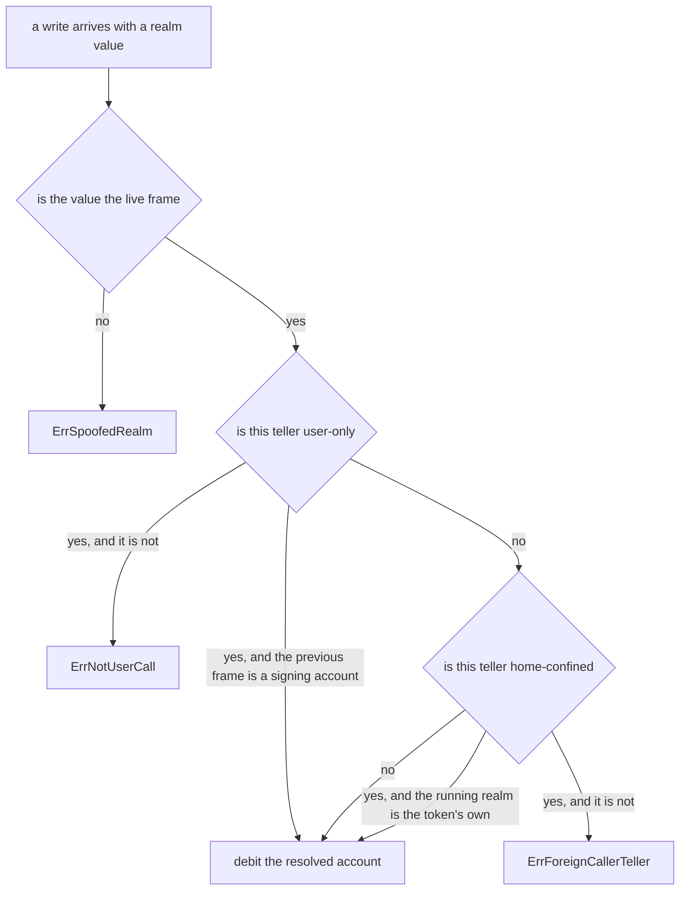

# Letting a signing user move GRC20 tokens with a plain contract call

An explainer for [gnolang/gno#6123](https://github.com/gnolang/gno/pull/6123),
written by claude-opus-5.

## TLDR

A GRC20 token keeps its balances behind a *teller*, a small object that decides
whose balance a write touches. Before this change, the one teller that answered
"whoever called me" was reachable only from the token's private ledger and
refused to work outside the token's own realm.

The change adds [`Token.UserTeller()`](https://github.com/gnolang/gno/blob/16f54a89c/examples/gno.land/p/demo/tokens/grc20/tellers.gno#L44-L56),
which answers "whoever called me, and only if that is a signing account calling
directly". It hangs off the published `*Token` pointer, takes no arguments and
needs nothing from the token realm, so any realm holding that pointer can build
one. The token registry
[`grc20reg`](https://github.com/gnolang/gno/blob/16f54a89c/examples/gno.land/r/demo/defi/grc20reg/grc20reg.gno#L145-L158)
is the first consumer, gaining `UserTransfer`, `UserApprove` and
`UserTransferFrom`.

## Concepts

**The two ways a user reaches a contract.** `gnokey maketx call` sends a
`MsgCall`, which names a package, a function and a list of string arguments. A
wallet can show all three before the user signs. `gnokey maketx run` sends a
`MsgRun`, which carries a whole Gno source file instead, so the same wallet can
only show that a program is about to execute. `gnokey maketx addpkg` sends a
`MsgAddPackage`, which carries source too and runs that source's `init` in the
same transaction.

**Who the caller is.** Every function a transaction enters receives a `realm`
value describing the frame that called it. When the transaction is a `MsgCall`
landing directly on that function, the calling frame is the signing account and
its package path is empty, which is what
[`IsUserCall()`](https://github.com/gnolang/gno/blob/16f54a89c/gnovm/stdlibs/chain/runtime/frame.gno#L105-L107)
tests. When another contract sits in between, the path is that contract's, and
`IsUserCall()` is false. A `MsgRun` script runs inside a throwaway package at
`gno.land/e/<address>/run`, so it is false there too.

**The teller kinds.** The account a write debits comes from the teller, not from
an argument, so the choice of teller is the whole access-control decision. The
right-hand column is what decides who can build one.

| Teller | Debits | Reachable from |
| --- | --- | --- |
| [`CallerTeller`](https://github.com/gnolang/gno/blob/16f54a89c/examples/gno.land/p/demo/tokens/grc20/tellers.gno#L24-L36) | whoever called the realm holding it, and only inside the token's own realm | the private ledger only |
| [`UserTeller`](https://github.com/gnolang/gno/blob/16f54a89c/examples/gno.land/p/demo/tokens/grc20/tellers.gno#L44-L56) | whoever called the realm holding it, refused unless that is a signing account | the published `*Token` |
| [`RealmTeller`](https://github.com/gnolang/gno/blob/16f54a89c/examples/gno.land/p/demo/tokens/grc20/tellers.gno#L79-L95) | the contract that built the teller | the published `*Token` |
| [`RealmSubTeller`](https://github.com/gnolang/gno/blob/16f54a89c/examples/gno.land/p/demo/tokens/grc20/tellers.gno#L102-L118) | a subaccount of the contract that built the teller | the published `*Token` |
| [`ImpersonateTeller`](https://github.com/gnolang/gno/blob/16f54a89c/examples/gno.land/p/demo/tokens/grc20/tellers.gno#L133-L144) | an address fixed at construction | the private ledger only |
| [`ReadonlyTeller`](https://github.com/gnolang/gno/blob/16f54a89c/examples/gno.land/p/demo/tokens/grc20/tellers.gno#L59-L68) | nothing, every write fails | the published `*Token` |

**The home guard.** A teller that resolves its account from the calling frame is
only meaningful inside the token's own realm, so before this change every such
teller also compared the running realm against the token's creating realm. That
comparison is now
[`CallerTeller`'s alone](https://github.com/gnolang/gno/blob/16f54a89c/examples/gno.land/p/demo/tokens/grc20/tellers.gno#L156-L161).
`UserTeller` resolves its account from the calling frame and carries no such
comparison, so it works in any realm.

## The decision a write makes

After the change. Both the `ErrNotUserCall` branch and the absence of a home
comparison on the user path are new; the rest is the previous `guardHome`,
renamed to
[`guardWrite`](https://github.com/gnolang/gno/blob/16f54a89c/examples/gno.land/p/demo/tokens/grc20/tellers.gno#L149-L163).

## Who gets served

After the change. Rows measured by copying each scripted chain under the
review's `tests/` directory into `gno.land/pkg/integration/testdata/` and
running it, plus the branch's own
[`grc20_registry_user_relay.txtar`](https://github.com/gnolang/gno/blob/16f54a89c/gno.land/pkg/integration/testdata/grc20_registry_user_relay.txtar).

| The teller is built and used by | `CallerTeller` | `UserTeller` |
| --- | --- | --- |
| the token's own realm, serving a direct `MsgCall` | debits the signer | debits the signer |
| the token's own realm, serving another realm's cross-call | debits that realm | `ErrNotUserCall` |
| any other realm, serving a direct `MsgCall` | cannot build one, and a leaked value gives `ErrForeignCallerTeller` | debits the signer |
| any other realm, serving another realm's cross-call | same | `ErrNotUserCall` |
| a `MsgRun` script | same | `ErrNotUserCall` |
| a new package's `init` under `MsgAddPackage` | same | debits the deploying account |
| a non-crossing helper handed a realm's live `cur` | same | debits that realm's own direct caller |

Row three is the new capability, and rows six and seven are it reached without
the user naming the realm that spends. The bottom cells of the `CallerTeller`
column are what makes a teller safe to publish: the value can be handed to
anyone and stays inert.

## Where the wrapped-GNOT token sits

[`wugnot`](https://github.com/gnolang/gno/blob/16f54a89c/examples/gno.land/r/gnoland/wugnot/wugnot.gno#L89-L102)
is the in-tree token with a full user-facing surface, and the change adds a
scripted check for it without editing it. It keeps `CallerTeller` for its own
three wrappers, so the first column above is what those wrappers do. It also
[publishes its `*Token` and registers it](https://github.com/gnolang/gno/blob/16f54a89c/examples/gno.land/r/gnoland/wugnot/wugnot.gno#L15-L29),
which is what puts it in the second column as well.

## Review files

[Review files for this PR](https://github.com/samouraiworld/gno-agent-workspace/tree/main/reviews/pr/6xxx/6123-grc20-eoa-writes)
