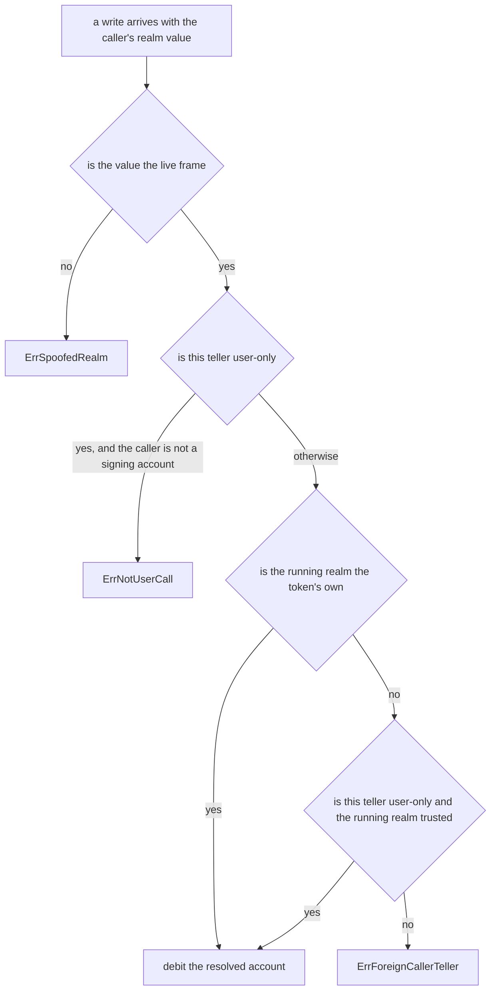

# Letting a signing user move GRC20 tokens with a plain contract call

An explainer for [gnolang/gno#6123](https://github.com/gnolang/gno/pull/6123),
written by claude-opus-5.

## TLDR

A GRC20 token keeps its balances behind a *teller*, a small object that decides
whose balance a write touches. The existing tellers each answer that question a
different way, and none of them says "whoever signed this transaction, and only
if they called me directly".

The branch adds one that does, [`UserTeller`](https://github.com/gnolang/gno/blob/e014175d2/examples/gno.land/p/demo/tokens/grc20/tellers.gno#L42-L55),
and a second mechanism on top of it: a token can name other realms it will let
relay its users' writes, through
[`TrustHost`](https://github.com/gnolang/gno/blob/e014175d2/examples/gno.land/p/demo/tokens/grc20/tellers.gno#L60-L66)
and [`UserTellerTrusted`](https://github.com/gnolang/gno/blob/e014175d2/examples/gno.land/p/demo/tokens/grc20/tellers.gno#L84-L97).
The token registry [`grc20reg`](https://github.com/gnolang/gno/blob/e014175d2/examples/gno.land/r/demo/defi/grc20reg/grc20reg.gno#L152-L167)
is the first consumer, gaining `UserTransfer`, `UserApprove` and
`UserTransferFrom`.

## Concepts

**The two ways a user reaches a contract.** `gnokey maketx call` sends a
`MsgCall`, which names a package, a function and a list of string arguments. A
wallet can show all three before the user signs. `gnokey maketx run` sends a
`MsgRun`, which carries a whole Gno source file instead, so the same wallet can
only show that a program is about to execute.

**Who the caller is.** Every function a transaction enters receives a `realm`
value describing the frame that called it. When the transaction is a `MsgCall`
landing directly on that function, the calling frame is the signing account and
its package path is empty, which is what
[`IsUserCall()`](https://github.com/gnolang/gno/blob/e014175d2/gnovm/stdlibs/chain/runtime/frame.gno#L105-L107)
tests. When another contract sits in between, the path is that contract's, and
`IsUserCall()` is false. A `MsgRun` script runs inside a throwaway package at
`gno.land/e/<address>/run`, so it is false there too.

**The teller kinds.** The account a write debits comes from the teller, not from
an argument, so the choice of teller is the whole access-control decision.

| Teller | Debits | Reachable from |
| --- | --- | --- |
| `CallerTeller` | whoever called the token realm | the private ledger only |
| `UserTeller` | whoever called the token realm, refused unless that is a signing account | the private ledger only |
| `UserTellerTrusted` | same as `UserTeller` | the published `*Token` |
| `RealmTeller` | the contract that built the teller | the published `*Token` |
| `ImpersonateTeller` | an address fixed at construction | the private ledger only |
| `ReadonlyTeller` | nothing, every write fails | the published `*Token` |

**The home guard.** A teller that resolves its account from the calling frame is
only meaningful inside the token's own realm, so every such teller also checks
where it is running. Before this branch that check was one comparison against
the token's creating realm. Now it also consults the token's trusted set.

## The decision the branch changes

The `ErrNotUserCall` branch and the trusted branch are new. Everything else is
the previous `guardHome`, renamed to
[`guardWrite`](https://github.com/gnolang/gno/blob/e014175d2/examples/gno.land/p/demo/tokens/grc20/tellers.gno#L223-L238).

## Who gets served

Rows measured by running the branch's own package tests and two extra scripted
chains, one per new mechanism, both listed under the review's `tests/` directory.

| Caller reaches the token by | `CallerTeller` | `UserTeller` | `UserTellerTrusted` from a trusted realm |
| --- | --- | --- | --- |
| `MsgCall` straight onto the token realm | debits the signer | debits the signer | debits the signer |
| `MsgCall` onto another contract, which calls the token realm | debits that contract | refused | refused |
| `MsgRun` script | debits the signer, whose address the throwaway package shares | refused | refused |
| `MsgCall` straight onto a trusted relay | refused | refused | debits the signer |
| any route, from a realm that is neither the token nor trusted | refused | refused | refused |

The last column is the new capability. The bottom-left cells are what makes a
teller safe to publish: the value can be handed to anyone and stays inert.

## Where the wrapped-GNOT token sits

[`wugnot`](https://github.com/gnolang/gno/blob/e014175d2/examples/gno.land/r/gnoland/wugnot/wugnot.gno#L89-L102)
is the in-tree token with a full user-facing surface, and the branch adds a
scripted check for it without changing it. It keeps `CallerTeller`, so the first
column of the table above is its behaviour today.

## Review files

[Review files for this PR](https://github.com/samouraiworld/gno-agent-workspace/tree/main/reviews/pr/6xxx/6123-grc20-eoa-writes)
