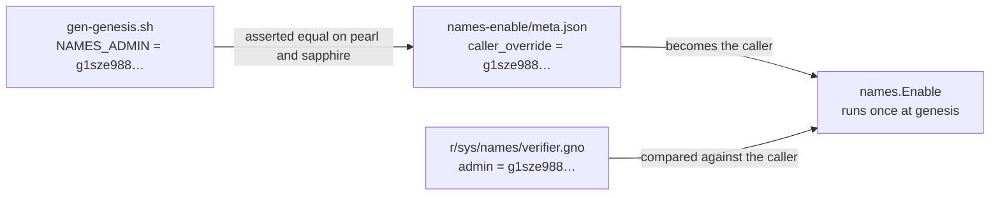

# The GovDAO T1 multisig address, and what depends on it

Model: claude-opus-5

## TLDR

One account owns five gno.land realms outright. Its address is written into
those realms as a plain string, so when the multisig's signer set changes the
address changes with it and every copy of the string in the repository has to
move together. This change moves 393 of the 407 copies. The other 14 sit under
`misc/deployments/` and describe chains that already ran.

## Why an address moves at all

A multisig account has no key of its own. Its address is computed from the
sorted list of its members' public keys, so swapping one member for another
produces a different address for the same logical account. The
[pull request description](https://github.com/gnolang/gno/pull/6131) records the
member swap that caused this one.

Nothing on a running chain follows the account. The old address keeps whatever
balance and whatever on-chain ownership it had; the new address starts empty.
Only source that has not yet been deployed can be repointed.

## Where the address is written down

Five places are the real ones. Everything else is a fixture that has to agree
with them or a test breaks.

| File | Symbol | What it gates |
| --- | --- | --- |
| [`r/sys/names/verifier.gno`](https://github.com/gnolang/gno/blob/f2bdb07b0/examples/gno.land/r/sys/names/verifier.gno#L59) | `admin` | the one call that turns namespace enforcement on |
| [`r/gnoland/boards2/v1/boards.gno`](https://github.com/gnolang/gno/blob/f2bdb07b0/examples/gno.land/r/gnoland/boards2/v1/boards.gno#L47) | `gPerms` | every moderation action on the boards realm |
| [`r/gnoland/blog/admin.gno`](https://github.com/gnolang/gno/blob/f2bdb07b0/examples/gno.land/r/gnoland/blog/admin.gno#L20) | `adminAddr` | posting and moderating on the gno.land blog |
| [`r/gnoland/home/home.gno`](https://github.com/gnolang/gno/blob/f2bdb07b0/examples/gno.land/r/gnoland/home/home.gno#L16) | `Admin` | editing the gno.land landing page |
| [`r/demo/defi/foo20/foo20.gno`](https://github.com/gnolang/gno/blob/f2bdb07b0/examples/gno.land/r/demo/defi/foo20/foo20.gno#L18) | `Ownable` | minting the demo token |

## The one that cannot be redone

[`names.Enable`](https://github.com/gnolang/gno/blob/f2bdb07b0/examples/gno.land/r/sys/names/verifier.gno#L117)
compares its caller against `admin` and, on success, flips a flag that has no
off switch and no second call. It runs once, as part of building a new chain's
genesis. A chain cut with the wrong `admin` there cannot be repaired by a later
transaction, only by cutting the chain again.

The three unlaunched deployment scripts reach that gate by writing the admin
address into the transaction's caller field:

Nothing checks `NAMES_ADMIN` against `verifier.gno`. The link between them is a
comment.

## Every copy in the tree

Counted at `f2bdb07b0` and at its merge base. Each area's old count equals its
new count, so no area was half-swapped.

| Area | Old, before | New, after | Old, still there |
| --- | ---: | ---: | ---: |
| `r/gnoland/boards2/v1/filetests/` | 348 | 348 | 0 |
| `examples/quarantined/` | 14 | 14 | 0 |
| `r/gnoland/blog/` | 9 | 9 | 0 |
| `gno.land/pkg/integration/testdata/` | 6 | 6 | 0 |
| `r/demo/defi/foo20/` | 3 | 3 | 0 |
| `r/gnoland/home/` | 2 | 2 | 0 |
| `gno.land/genesis/` | 2 | 2 | 0 |
| `r/gnoland/boards2/v1/` | 1 | 1 | 0 |
| `r/sys/names/` | 1 | 1 | 0 |
| `p/gnoland/boards/` | 1 | 1 | 0 |
| `misc/deployments/pearl.gno.land/` | 2 | 2 | 0 |
| `misc/deployments/sapphire.gno.land/` | 2 | 2 | 0 |
| `misc/deployments/topaz.gno.land/` | 2 | 2 | 0 |
| `misc/deployments/test13.gno.land/` | 13 | 0 | 13 |
| `misc/deployments/gnoland1/` | 1 | 0 | 1 |
| **Total** | **407** | **393** | **14** |

## Why the last two rows stay put

`gnoland1` is the live chain and `test13` is a fork of its history. Both hold
records of transactions that already executed under the old address.

The constraint that makes test13 harder than a search and replace

`test13` replays gnoland1's transaction stream against packages taken from the
current `examples/` tree, which is why
[nine of its patches](https://github.com/gnolang/gno/blob/f2bdb07b0/misc/deployments/test13.gno.land/README.md?plain=1#L102)
exist at all: a change to `boards2/v1` in the repository broke historical
operations, and the patches rewrite those transactions' callers to an address
the current `boards2/v1` still accepts.

Its two post-replay calls pick the multisig as caller for a second reason. The
[script says](https://github.com/gnolang/gno/blob/f2bdb07b0/misc/deployments/test13.gno.land/gen-genesis.sh#L1535)
it is the only account that replayed history has left with a balance, and those
calls pay a fee. So the caller has to be both funded, which the old address is,
and equal to the realm admin, which after this change only the new address is.
No single value satisfies both.

## Concepts

**Genesis package set.** The list of realms a chain deploys before it accepts
its first outside transaction. It is read from `examples/` when the genesis is
built, so a source change lands on every chain cut afterwards and on none cut
before.

**Quarantined example.** A realm under `examples/quarantined/`. It compiles and
its tests run, and the docs record that these
[are not yet deployed on public networks](https://github.com/gnolang/gno/blob/f2bdb07b0/docs/resources/community-packages.md?plain=1#L16-L18).

**Filetest golden.** A `.gno` file whose expected output is written into the
file as a comment, as in
[`z_ui_board_00_filetest.gno`](https://github.com/gnolang/gno/blob/f2bdb07b0/examples/gno.land/r/gnoland/boards2/v1/filetests/z_ui_board_00_filetest.gno#L40-L42).
An address appearing in rendered output appears again in the golden, which is
why one constant costs 348 edits across that directory.

## Review files

[reviews/pr/6xxx/6131-govdao-t1-multisig-address](https://github.com/samouraiworld/gno-agent-workspace/tree/main/reviews/pr/6xxx/6131-govdao-t1-multisig-address)
