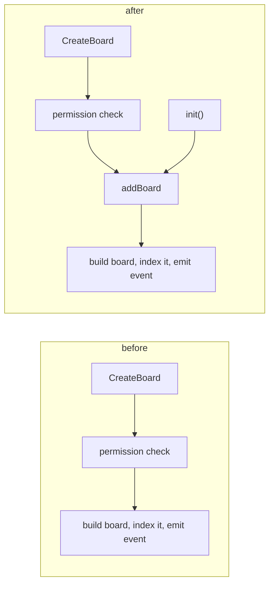

# Seeding boards2 with a board nobody has to ask for

Generated by claude-opus-5.

## TLDR

[Boards2](https://github.com/gnolang/gno/blob/02ac71476/examples/gno.land/r/gnoland/boards2/v1/README.md?plain=1#L3)
is gno.land's forum realm. Every board inside it is created by
[`CreateBoard`](https://github.com/gnolang/gno/blob/02ac71476/examples/gno.land/r/gnoland/boards2/v1/public.gno#L135),
which only the realm's owner or an admin may call, and on a fresh chain the sole
owner is the GovDAO multisig. So a fresh chain starts with zero boards and the
first one costs a multisig transaction. [PR
6132](https://github.com/gnolang/gno/pull/6132) adds an
[`init()`](https://github.com/gnolang/gno/blob/02ac71476/examples/gno.land/r/gnoland/boards2/v1/boards.gno#L68-L70)
that creates one board, `OpenDiscussions`, at the moment the realm is deployed.

## The problem it solves

A realm's `init()` runs once, inside the deploy transaction, before anyone can
call it. Anything `init()` writes is part of the realm from its first block. That
makes it the only place a board can appear without somebody first assembling
multisig signatures.

`CreateBoard` cannot simply be called from `init()`. It reads the caller's
address off the live call frame, and during a deploy there is no caller to read.
It also asks the user registry realm whether the board name belongs to somebody
else, in
[`checkBoardNameBelongsToAddress`](https://github.com/gnolang/gno/blob/02ac71476/examples/gno.land/r/gnoland/boards2/v1/permissions_validators_basic.gno#L148-L155),
and one realm calling another during its own deployment is a shape the change
avoids rather than tests.

## The shape of the change

The board-building half of `CreateBoard` moves into a new unexported helper,
[`addBoard`](https://github.com/gnolang/gno/blob/02ac71476/examples/gno.land/r/gnoland/boards2/v1/public.gno#L157),
which takes the creator's address as a plain argument instead of reading it from
the frame and performs no checks of its own.

`CreateBoard` keeps every check it had; the two callers differ only in what
happens before `addBoard` runs.

| caller | who the creator is | name checked | permission checked |
| --- | --- | --- | --- |
| `CreateBoard` | the address on the call frame | yes | yes |
| `init()` | a constant in the source | no, the name is a literal | no, there is no caller |

## What the board is

`init()` asks for a board that is *listed* and *open*.

- **Listed** puts it on the realm's front page. An unlisted board is reachable
  only by its name.
- **Open** means anyone may start a thread or reply, rather than only people who
  were invited. Non-members pay for that with a balance requirement: the realm
  refuses a thread or a reply from an account holding less than
  [`RequiredAccountAmount`](https://github.com/gnolang/gno/blob/02ac71476/examples/gno.land/r/gnoland/boards2/v1/boards.gno#L25),
  which starts at 3,000,000,000 ugnot.

Units: one GNOT is 1,000,000 ugnot, so the requirement is 3,000 GNOT.

| account balance | start a thread | reply to one | repost one |
| --- | --- | --- | --- |
| under 3,000 GNOT, not invited | refused | refused | allowed |
| at or above 3,000 GNOT | allowed | allowed | allowed |
| invited member under 3,000 GNOT | refused unless owner or admin | allowed | allowed |

A repost carries a title and a body its author chooses, so the third column is
another way to put text on the board.

Three cells are runs of the realm's own filetest harness against the branch,
committed in
[`tests/`](https://github.com/samouraiworld/gno-agent-workspace/tree/main/reviews/pr/6xxx/6132-boards2-opendiscussions-board/2-02ac71476/tests):
the first column on each side of the threshold, and the top of the third
column, which is the cell where the other two refuse. The remaining cells read
[`validateOpenThreadCreate`](https://github.com/gnolang/gno/blob/02ac71476/examples/gno.land/r/gnoland/boards2/v1/permissions_validators_open.gno#L111-L127)
and
[`validateOpenReplyCreate`](https://github.com/gnolang/gno/blob/02ac71476/examples/gno.land/r/gnoland/boards2/v1/permissions_validators_open.gno#L138-L154)
against the realm's own `z_create_reply_15_filetest.gno`.

## Why 42 files change for a ten-line feature

The change touches 42 files. Two carry the feature; the other 40 are filetests,
whose expected output is compared byte for byte.

All 40 change for one reason. Board identifiers come from a counter that starts
at one, `init()` takes the first one, so a board a test creates afterwards is
numbered one higher than before, and the realm's front page is no longer empty.

> [!NOTE]
> A realm's source cannot be replaced once deployed. `init()` therefore takes
> effect on a chain launched from this source, and never on one where
> `gno.land/r/gnoland/boards2/v1` is already live.

## Concepts

- **Realm**: a gno package holding state that survives between transactions,
  addressed by a path such as `gno.land/r/gnoland/boards2/v1`.
- **Genesis**: the first block of a chain. The realms in
  [`examples/`](https://github.com/gnolang/gno/tree/master/examples) are
  deployed there, so a change to one of them reaches a chain only at its launch.
- **GovDAO T1 multisig**: the account that owns several gno.land realms.
  Calling an owner-only function from it needs signatures from several people.
- **Filetest**: a `.gno` file whose expected output sits in a trailing comment.
  The suite fails when a byte of real output differs.

Review files:
[reviews/pr/6xxx/6132-boards2-opendiscussions-board](https://github.com/samouraiworld/gno-agent-workspace/tree/main/reviews/pr/6xxx/6132-boards2-opendiscussions-board)
