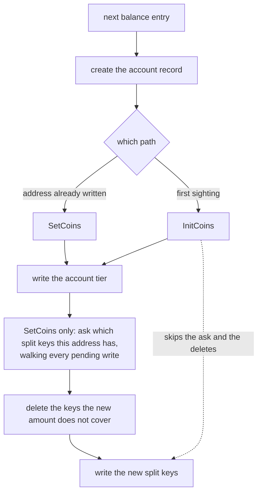

# Genesis balance loading stopped being quadratic

An explainer for [gnolang/gno#6134](https://github.com/gnolang/gno/pull/6134),
written by claude-opus-5.

## TLDR

Starting a chain from a genesis file writes every listed balance into the store,
one address at a time. Each write first asked the store which coins that address
already holds, and the store answers that kind of question by scanning
everything written so far. At 100,000 addresses the scanning comes to five
billion comparisons, and a load that took four seconds took seven minutes.

The branch gives the genesis loader a second way to write a balance,
[`InitCoins`](https://github.com/gnolang/gno/blob/fix/genesis-balance-loading-quadratic/tm2/pkg/sdk/bank/keeper.go#L526),
which skips the question. It may skip it because an address the loader has not
yet reached cannot be holding anything. An address it has already written goes
down the old path, which still asks.

## Concepts

**The two places a balance lives.** A gno account holds some of its coins inside
the account record and the rest in one store key per coin type. The first group
is the account tier, the second the split tier. The split lets an ordinary
transfer touch one key instead of rewriting the whole balance set. It also means
that replacing an address's entire balance involves finding and deleting the
split keys the new amount does not cover.

**The cache store.** Everything a block writes lands in an in-memory layer first
and reaches the database at commit. That layer keeps pending writes in one
unsorted bag. Asked for a range of keys, it walks the whole bag, keeps the keys
falling inside the range and puts the rest back, at
[`store.go:414-423`](https://github.com/gnolang/gno/blob/fix/genesis-balance-loading-quadratic/tm2/pkg/store/cache/store.go#L414-L423).
When the range is one address's own prefix and the bag holds every other address
written so far, nothing matches and the walk was for nothing.

## The loop

The ask is a prefix range query. Before the branch every entry made it, and it
matched nothing every time, because the loader had never written that address.

## What the cost looks like

Counted from the shape of the loop: entry *k* walks the *k* pending writes that
came before it, so the total is the sum from 0 to *n* minus 1. The right-hand
column is the work the operator asked for.

| Balances in the file | Keys walked by the ask | Balances written |
| ---: | ---: | ---: |
| 1,000 | 499,500 | 1,000 |
| 10,000 | 49,995,000 | 10,000 |
| 100,000 | 4,999,950,000 | 100,000 |
| 1,000,000 | 499,999,500,000 | 1,000,000 |
| 3,262,505 | 5,321,967,806,260 | 3,262,505 |

The last row is the balance count of the genesis file that
[issue 6133](https://github.com/gnolang/gno/issues/6133) was opened against.
`InitCoins` drops the middle column to zero for every address the loader has not
seen before.

## Measured, at the store layer

The branch adds
[`benchAccountLoad`](https://github.com/gnolang/gno/blob/fix/genesis-balance-loading-quadratic/tm2/pkg/store/cache/bench_quadratic_test.go#L16-L35),
which reproduces the loop against the cache store alone, with no bank and no
genesis. The times below come from running that benchmark, not from a model of
it, on a 6-core AMD EPYC with `-benchtime 1x`. The last two columns are the
count from the table above and the time divided by it.

| Balances | Time | Growth | Keys walked | Per key |
| ---: | ---: | ---: | ---: | ---: |
| 1,000 | 32.79 ms | | 499,500 | 65.6 ns |
| 2,000 | 139.72 ms | 4.26x | 1,999,000 | 69.9 ns |
| 4,000 | 632.30 ms | 4.53x | 7,998,000 | 79.1 ns |
| 8,000 | 2.92 s | 4.63x | 31,996,000 | 91.4 ns |
| 16,000 | 22.47 s | 7.68x | 127,992,000 | 175.5 ns |

Doubling the input roughly quadruples the time, which is what a squared term
does. The cost of walking one key is flat to 8,000 and then doubles once the bag
outgrows the processor cache, so the real curve is worse than squared at the
sizes that matter. The control in the same file, the same 16,000 writes with no
ask at all, runs in **21.38 ms**.

## What the branch changes

`InitCoins` is
[`SetCoins`](https://github.com/gnolang/gno/blob/fix/genesis-balance-loading-quadratic/tm2/pkg/sdk/bank/keeper.go#L487)
with the ask and the deletions removed. Both write the account tier through the
same call and the split tier through the shared helper at
[`keeper.go:542-546`](https://github.com/gnolang/gno/blob/fix/genesis-balance-loading-quadratic/tm2/pkg/sdk/bank/keeper.go#L542-L546),
so the two cannot drift in how they store a balance. The loader picks between
them per entry at
[`app.go:804-807`](https://github.com/gnolang/gno/blob/fix/genesis-balance-loading-quadratic/gno.land/pkg/gnoland/app.go#L804-L807).

| Entry | Can it hold a stale split key | Path taken |
| --- | --- | --- |
| Address seen for the first time | No. The store held no balances when genesis started, and this loop is the only thing that writes them. | `InitCoins`, no ask |
| Address already named earlier in the file | Yes. The earlier entry wrote keys the new amount may not cover. | `SetCoins`, unchanged |

"Seen before" is read off the account store at
[`app.go:785`](https://github.com/gnolang/gno/blob/fix/genesis-balance-loading-quadratic/gno.land/pkg/gnoland/app.go#L785).
The loader creates an account record for every entry, so an address with no
account record is an address this loop has not reached.

## End to end

Figures the author published in the pull request and in
[issue 6133](https://github.com/gnolang/gno/issues/6133), from
`gnogenesis fork test` on a balance-only genesis, same file across builds,
measured on their machine and not reproduced here.

| Balances | Before the regression | master | This branch |
| ---: | ---: | ---: | ---: |
| 100,000 | 4.13 s | 413.99 s | 4.74 s |
| 1,000,000 | 55.12 s | | 66.87 s |

## What is left open

The store still answers every range query by walking all pending writes, so any
future code interleaving writes with narrow range queries meets the same curve.
The branch says so and leaves that to
[issue 6133](https://github.com/gnolang/gno/issues/6133), keeping the
store-level benchmark in the tree so whoever takes it has the measurement ready.

Review files:
[reviews/pr/6xxx/6134-genesis-balance-loading-quadratic](https://github.com/samouraiworld/gno-agent-workspace/tree/main/reviews/pr/6xxx/6134-genesis-balance-loading-quadratic)
