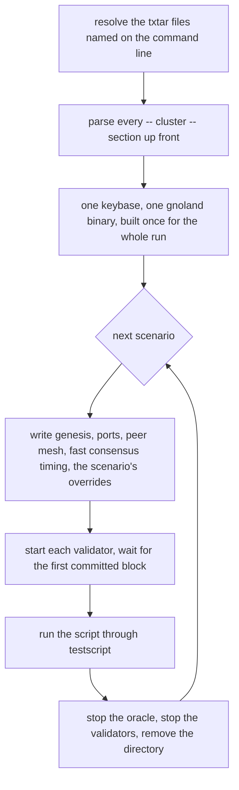

# A txtar harness that runs real gnoland clusters

An explainer for [gnolang/gno#6135](https://github.com/gnolang/gno/pull/6135),
written by claude-opus-5.

## TLDR

gno already has a txtar test lane,
[`gno.land/pkg/integration`](https://github.com/gnolang/gno/blob/ddc5acfb9/gno.land/pkg/integration/doc.go#L7),
and it runs one in-memory node. Two claims cannot be written against it:
that the chain keeps committing when a validator disappears, and
that a program outside the chain reacts to what the chain committed. The
package-approver oracle in
[`contribs/gpao`](https://github.com/gnolang/gno/blob/ddc5acfb9/contribs/gpao/main.go#L40)
is made entirely of the second kind, an off-chain daemon polling the chain once
a second. No test drives that daemon against a chain: the one gpao test that
boots a node,
[`TestEstimateEnableAgainstARealChain`](https://github.com/gnolang/gno/blob/ddc5acfb9/contribs/gpao/endtoend_test.go#L34),
covers the gas estimate for `MsgEnablePackage` and not the daemon's own
guarantees.

This branch adds [`misc/gnoe2e`](https://github.com/gnolang/gno/blob/ddc5acfb9/misc/gnoe2e/go.mod#L1),
a Go module of its own that boots one to sixteen real `gnoland` processes per
scenario, built from the enclosing checkout, and drives a txtar script against
them. Three files outside `misc/gnoe2e` change: a new CI workflow, one
comment in
[`ci-dir-misc.yml`](https://github.com/gnolang/gno/blob/ddc5acfb9/.github/workflows/ci-dir-misc.yml#L33-L34),
and `misc/gnoe2e/` added to the root
[`Makefile`'s `fix` loop](https://github.com/gnolang/gno/blob/ddc5acfb9/Makefile#L95-L101),
whose comment is reworded to say so. The two edited files come to +5 -3.

## Concepts

**A txtar scenario.** One file holding a script and the files it needs, in
sections marked `-- name --`. The script is the comment block at the top; a
verb per line, then `stdout` or `stderr` lines matching what the verb printed.
The dialect is the same one the in-process lane already uses, so a reader who
has written one of those can read one of these.

**The `-- cluster --` section.** The one thing new about the dialect. A script
states the chain it needs, and the harness builds that chain from genesis
before the script runs:

```
-- cluster --
validators: 4
code-submission-policy: inert
block-max-gas: 200000000
config.moniker: tour
genesis.vm.chain_domain: tour.gno.land
```

Four named keys plus two open families. `config.<key>` is any path
[`gnoland config set`](https://github.com/gnolang/gno/blob/ddc5acfb9/gno.land/cmd/gnoland/config_set.go#L21)
accepts, `genesis.<key>` any path `gnogenesis params set` accepts, both
resolved by struct tag through
[`resolveField`](https://github.com/gnolang/gno/blob/ddc5acfb9/misc/gnoe2e/internal/cluster/override.go#L52).
Three node-config keys are refused, listed at
[`clusterspec.go:52`](https://github.com/gnolang/gno/blob/ddc5acfb9/misc/gnoe2e/internal/integration/clusterspec.go#L52):
the harness assigns each node its listen ports and its peer list, and a
scenario setting the peer list would hand every validator the same one and
reach no quorum.

**An inert chain.** Under
[`CodeSubmissionPolicyInert`](https://github.com/gnolang/gno/blob/ddc5acfb9/gno.land/pkg/sdk/vm/params.go#L30-L33)
a package submitted after genesis is stored without typechecking and becomes
callable only once an approver sends `MsgEnablePackage`. Until then a
[`vm/qfile`](https://github.com/gnolang/gno/blob/ddc5acfb9/gno.land/pkg/sdk/vm/keeper.go#L1812)
read of it fails too. That is what gives the oracle something to do, and what a
scenario parks a package under while it waits.

## The verbs

| Verb | What it does | Negatable |
| --- | --- | --- |
| `gnokey ...` | runs gnokey in-process against the cluster, with `-home` and `-remote` injected | yes |
| `validator stop\|restart N` | takes one validator down or brings it back, by index | restart only |
| `gpao start\|stop\|restart` | runs the oracle beside the chain, stopped again at teardown | start only |
| `http_get <url> [regex]` | fetches a URL, writes the body to stdout, gates on the body | yes |
| `eventually [timeout [interval]] [-stdout regex] <cmd>` | reruns a verb until it succeeds | no |
| `repeat [-all] N <cmd>` | runs a verb N times | yes |
| `sleep <duration>` | waits | no |

`eventually` exists because no chain event announces that a package went live,
so every assertion about the oracle is a poll. Its `-stdout` gate is for the
query that answers empty and exits zero: `vm/qinertpaths` on a node that has
not applied the height yet lists nothing and succeeds, so the exit status alone
would end the wait before the value arrives.

## What a run does



Every section is parsed before anything boots, so a misspelled key fails while
the files are being read rather than partway through a suite. Each scenario gets
a chain built from genesis and thrown away after: a chain carries deployed
packages, balances and a height, so two scenarios sharing one would make the
second's result depend on which ran first.

## The three scenarios

| File | The claim |
| --- | --- |
| [`testdata/tour.txtar`](https://github.com/gnolang/gno/blob/ddc5acfb9/misc/gnoe2e/testdata/tour.txtar#L7-L17) | every verb and every exported variable on one four-validator inert chain, each setting read back out of the chain rather than assumed |
| [`testdata/oracle/first_light.txtar`](https://github.com/gnolang/gno/blob/ddc5acfb9/misc/gnoe2e/testdata/oracle/first_light.txtar#L1-L3) | a package submitted after genesis parks, the oracle activates it, and all three validators serve the result |
| [`testdata/oracle/patient_oracle.txtar`](https://github.com/gnolang/gno/blob/ddc5acfb9/misc/gnoe2e/testdata/oracle/patient_oracle.txtar#L1-L9) | two validators of four go down, consensus halts while the survivors keep answering queries, and the oracle waits on a frozen tip without spinning or losing its place |

The third is the one the lane was built for. A chain that answers every query
and commits nothing is a state the in-process lane cannot produce, and it is the
state that would show an oracle treating a stalled tip as an error to recover
from.

## Two routes, one implementation

`go test` and the CLI both call
[`prepareSuite`](https://github.com/gnolang/gno/blob/ddc5acfb9/misc/gnoe2e/cmd_run.go#L299)
and
[`prepareScenario`](https://github.com/gnolang/gno/blob/ddc5acfb9/misc/gnoe2e/cmd_run.go#L428),
so they cannot drift.

| | `go test` | `go run . run` |
| --- | --- | --- |
| selecting one | `-run TestScenarios/oracle/first_light` | naming the file |
| after a failure | the subtest fails, the rest run | the scenario fails, the rest run |
| output | the test log | coloured, through the CLI's own slog handler |
| what bounds it | `go test -timeout` | `run -timeout`, ten minutes by default |

## Where it runs

[`.github/workflows/ci-gnoe2e.yml`](https://github.com/gnolang/gno/blob/ddc5acfb9/.github/workflows/ci-gnoe2e.yml#L12-L29)
is a workflow of its own rather than a row in the `misc/` matrix, because the
suite exercises binaries built from `gno.land`, `gnovm`, `tm2` and
`contribs/gpao` and has to fire when any of those changes. The
[`misc/` matrix](https://github.com/gnolang/gno/blob/ddc5acfb9/.github/workflows/ci-dir-misc.yml#L10-L12)
filters on `misc/**` and cannot express that.
