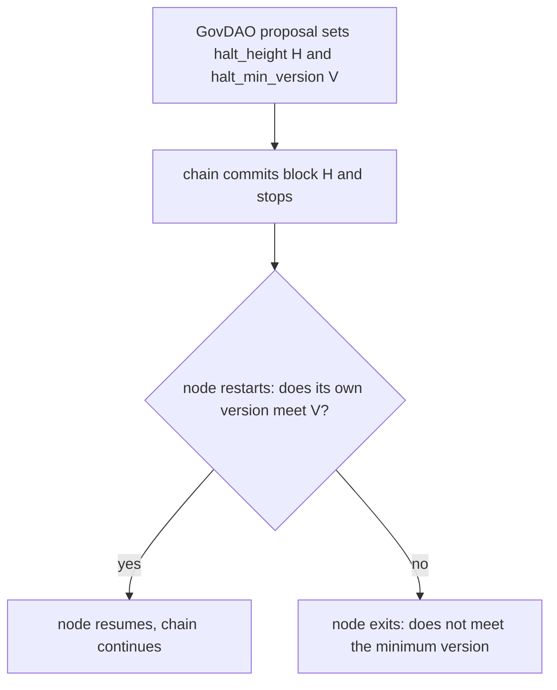

# PR 6177: making a release tag able to gate a chain upgrade

Explainer for [PR 6177](https://github.com/gnolang/gno/pull/6177), generated by
claude-opus-5, standard review.

## TLDR

A gno.land network upgrade is a coordinated stop: governance sets a block height
at which every node halts, and a minimum binary version below which a node
refuses to start again. The version half of that gate only ever understood
betanet's tag shape, so on mainnet it does the opposite of its job, refusing the
upgraded binary and leaving the chain halted. This branch teaches the gate the
`vMAJOR.MINOR.PATCH` shape, makes the release workflow compile the tag into the
binaries it publishes, and adds two scripts plus a rewritten `RELEASING.md`
around both.

## Concepts

**The halt.** Two chain parameters drive it, both set by a GovDAO proposal
through [`r/sys/params.NewSetHaltRequest`](https://github.com/gnolang/gno/blob/607942b78/examples/gno.land/r/sys/params/halt.gno#L28):

| Parameter | Meaning |
| --- | --- |
| [`p:halt_height`](https://github.com/gnolang/gno/blob/607942b78/gno.land/pkg/gnoland/node_params.go#L16) | the block after which every node stops. `0` [cancels a scheduled halt](https://github.com/gnolang/gno/blob/607942b78/examples/gno.land/r/sys/params/halt.gno#L40-L41) |
| [`p:halt_min_version`](https://github.com/gnolang/gno/blob/607942b78/gno.land/pkg/gnoland/node_params.go#L17) | the lowest binary version allowed to start once the halt is in force |

**The binary's version.** It is the package variable
[`tm2/pkg/version.Version`](https://github.com/gnolang/gno/blob/607942b78/tm2/pkg/version/version.go#L3),
which defaults to `develop` and is overwritten at link time by `-ldflags -X`.
A node cannot change it, and neither can an operator: the string is fixed when
the binary is built.

**The two checks.** On startup,
[`checkNodeStartupParams`](https://github.com/gnolang/gno/blob/607942b78/gno.land/pkg/gnoland/node_params.go#L134)
compares the two. After the halt height, a binary below the floor is refused.
Before it, a binary that already meets the floor is refused instead, so the
network does not upgrade early and fork.



## Part 1: the version comparison

[`meetsMinVersion`](https://github.com/gnolang/gno/blob/607942b78/gno.land/pkg/gnoland/node_params.go#L209) takes the binary's own version string and the governance
floor, and answers whether the node may run.

Before this branch, the parser took one prefix and the caller stripped it:

```go
// before
const prefix = "chain/gnoland"     // node_params.go, merge base
// anything else falls through to:
return binaryVersion == minVersion
```

After it, two shapes parse into one ordering, and byte equality is the fallback
for neither shape matching:

```go
// after
//	vMAJOR.MINOR.PATCH        the current shape, e.g. "v1.2.0"
//	chain/gnolandMAJOR.MINOR  betanet's retired shape, e.g. "chain/gnoland1.1"
```

The asymmetry the branch documents is worth stating plainly: an unparseable
**binary** version satisfying nothing is correct, since an ad-hoc `develop`
build must not clear an upgrade gate. An unparseable **floor** is the trap,
because byte equality then refuses every binary including the upgraded one.

Measured at the reviewed head, by calling `meetsMinVersion` from a test inside
`gno.land/pkg/gnoland`:

| Binary reports | Floor is | Answer | Why |
| --- | --- | --- | --- |
| `v1.2.0` | `chain/gnoland1.1` | true | the two shapes are one number line, and 1.2.0 is above 1.1 |
| `chain/gnoland1.1` | `v1.2.0` | false | betanet's last tag is below the v-line release |
| `v1.3.0` | `v1.3.0-rc.1` | true | a release outranks the candidate it followed |
| `v1.3.0-rc.2` | `v1.3.0-rc.1` | true | candidates order by their suffix |
| `v1.3.0-rc.10` | `v1.3.0-rc.2` | false | the suffix is compared as bytes, and `rc.10` sorts below `rc.2` |
| `develop` | `v1.3.0` | false | an ad-hoc build parses as nothing and clears no floor |
| `chain/mainnet` | `v1.2.0` | false | a bare launch tag is not a version |
| `v1.2.0` | `chain/mainnet` | false | the floor parses as nothing, so byte equality decides |

The last two rows are the same mechanism read from both sides, and the fifth is
where byte comparison and version ordering part company.

## Part 2: what the release workflow publishes

[`release / chain-tag`](https://github.com/gnolang/gno/blob/607942b78/.github/workflows/release-chain-tag.yml#L13) builds
[four binaries](https://github.com/gnolang/gno/blob/607942b78/.github/workflows/release-chain-tag.yml#L74-L78) for
[four platforms](https://github.com/gnolang/gno/blob/607942b78/.github/workflows/release-chain-tag.yml#L35-L49) and attaches them to a GitHub release.

Before this branch, the tag's `chain/` prefix was stripped before it was
injected, so a `chain/gnoland1.1` build reported `gnoland1.1`, a string that
parses as neither shape. After it, the tag goes in verbatim, a `v*` tag also
triggers the workflow, `-trimpath` is added, and a new step runs each native
binary and compares what it prints against the tag:

```yaml
# after, .github/workflows/release-chain-tag.yml
- name: Assert the binaries carry the tag
  if: matrix.native
```

The branch also documents what happened to the mainnet launch release: its
binaries [carry no `-ldflags` and report `develop`](https://github.com/gnolang/gno/blob/607942b78/RELEASING.md?plain=1#L112-L114).

## Part 3: the protocol version

Six constants under `tm2/` hold one value, split across files to avoid an import
cycle. Each package's `init()` compares its own against its neighbour's and
panics on a mismatch, so a bump that misses one file panics every node at
startup rather than failing a test.

Before this branch, each `init()` compared against a hardcoded literal. After
it, they compare constants by reference, name both sides in the panic message,
and a new [`TestProtocolVersionsAgree`](https://github.com/gnolang/gno/blob/607942b78/tm2/pkg/bft/version/version_test.go#L22) lists all six in one map. No value moves
in this branch.

| Package | Constant |
| --- | --- |
| [`tm2/pkg/crypto`](https://github.com/gnolang/gno/blob/607942b78/tm2/pkg/crypto/version.go#L5) | `Version` |
| [`tm2/pkg/bft/abci/version`](https://github.com/gnolang/gno/blob/607942b78/tm2/pkg/bft/abci/version/version.go#L5) | `Version` |
| [`tm2/pkg/bft/blockchain/version`](https://github.com/gnolang/gno/blob/607942b78/tm2/pkg/bft/blockchain/version/version.go#L9) | `Version` |
| [`tm2/pkg/bft/types/version`](https://github.com/gnolang/gno/blob/607942b78/tm2/pkg/bft/types/version/version.go#L11) | `BlockVersion` |
| [`tm2/pkg/p2p/version`](https://github.com/gnolang/gno/blob/607942b78/tm2/pkg/p2p/version/version.go#L5) | `Version` |
| [`tm2/pkg/bft/version`](https://github.com/gnolang/gno/blob/607942b78/tm2/pkg/bft/version/version.go#L22) | `Version` |

The value matters to peering rather than to the halt gate: two nodes whose
protocol MAJOR differs are refused by
[`VersionSet.CompatibleWith`](https://github.com/gnolang/gno/blob/607942b78/tm2/pkg/versionset/versionset.go#L59)
and cannot gossip at all, which is why a major bump has to ride a coordinated
halt.

## The tooling this branch adds

[`misc/release/cut-release.sh`](https://github.com/gnolang/gno/blob/607942b78/misc/release/cut-release.sh#L328-L335)
creates the tag after running a preflight: the version shape parses, the tag is
free locally and on origin, the six constants agree, and a binary built the way
CI builds it reports the tag. It [warns rather than refusing](https://github.com/gnolang/gno/blob/607942b78/misc/release/cut-release.sh#L176-L180) when the
commit is not on `master`. With [`--halt-height`](https://github.com/gnolang/gno/blob/607942b78/misc/release/cut-release.sh#L340) it
also writes the GovDAO halt proposal, so the `minVersion` inside it is the tag
being cut rather than a string retyped by hand.

[`misc/release/bump-protocol-version.sh`](https://github.com/gnolang/gno/blob/607942b78/misc/release/bump-protocol-version.sh#L142-L156)
rewrites the six constants together and runs the invariant test. Neither script
publishes anything: the tag stays local without [`--push`](https://github.com/gnolang/gno/blob/607942b78/misc/release/cut-release.sh#L345-L353),
and the constant bump stops at the working tree.

## Naming, and what the branch leaves for later

`gnoland1` is betanet's chain id and `gnoland-1` is mainnet's, one hyphen apart,
so `misc/deployments/gnoland1` becomes `misc/deployments/betanet`. The chain-id
literals inside the archived configuration stay as they were, since rewriting
them would describe a chain that never ran.

The git operations sit outside the diff: the `chain/gnoland1` branch rename, the
deletion of four leftover refs in the `chain/` namespace, and the `v1.3.0` tag
for the first coordinated mainnet upgrade.

## Review files

[Review files for this PR](https://github.com/samouraiworld/gno-agent-workspace/tree/main/reviews/pr/6xxx/6177-release-tag-gates-upgrade)
