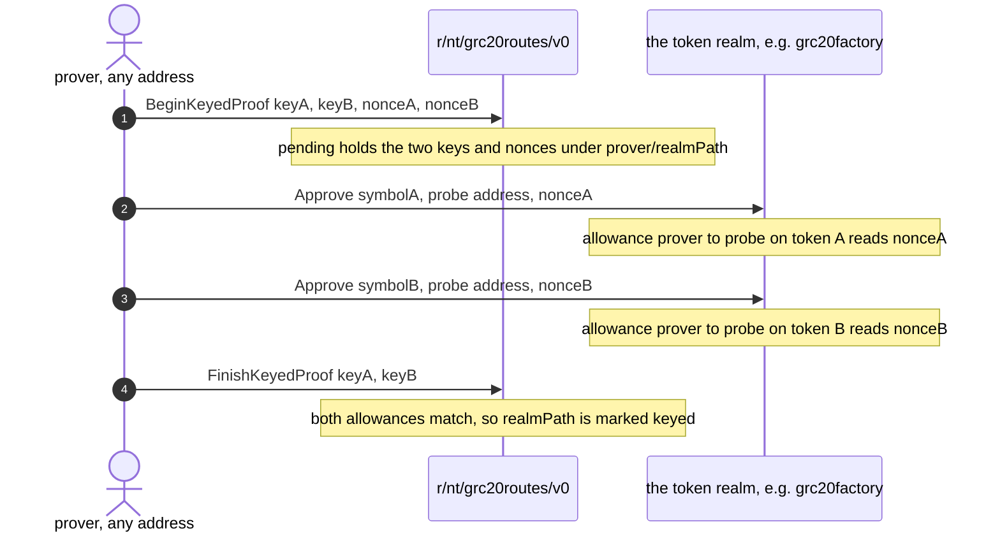

# PR 6187: finding the call that moves a user's own tokens

Explainer for [PR 6187](https://github.com/gnolang/gno/pull/6187), generated by
claude-opus-5, standard review.

## TLDR

A wallet can find any registered GRC20 token on gno.land and still not know
which call approves a spender for it:
[`wugnot`](https://github.com/gnolang/gno/blob/3aa06ef75/examples/gno.land/r/gnoland/wugnot/wugnot.gno#L94-L97)
· [↗](../../../../.worktrees/gno-review-6187/examples/gno.land/r/gnoland/wugnot/wugnot.gno#L94)
takes `Approve(cur, spender, amount)` and
[`grc20factory`](https://github.com/gnolang/gno/blob/3aa06ef75/examples/gno.land/r/demo/defi/grc20factory/grc20factory.gno#L88-L93)
· [↗](../../../../.worktrees/gno-review-6187/examples/gno.land/r/demo/defi/grc20factory/grc20factory.gno#L88)
takes `Approve(cur, symbol, spender, amount)`. This branch adds
[`r/nt/grc20routes/v0`](https://github.com/gnolang/gno/blob/3aa06ef75/examples/gno.land/r/nt/grc20routes/v0/gnomod.toml#L1)
· [↗](../../../../.worktrees/gno-review-6187/examples/gno.land/r/nt/grc20routes/v0/gnomod.toml#L1),
a realm that returns that shape in one read-only query, from the first of three
sources with something to say: the token realm's own declaration, a proof anyone
ran against a deployed realm, or the single-token convention.

## Concepts

### The registry that cannot spend for you

[`r/nt/grc20reg`](https://github.com/gnolang/gno/blob/3aa06ef75/examples/gno.land/r/nt/grc20reg/v0/grc20reg.gno#L32-L58)
· [↗](../../../../.worktrees/gno-review-6187/examples/gno.land/r/nt/grc20reg/v0/grc20reg.gno#L32)
is gno.land's GRC20 token registry. A token realm hands it a `*grc20.Token`, the
registry files that pointer under
[the key `<realmPath>.<SYMBOL>`](https://github.com/gnolang/gno/blob/3aa06ef75/examples/gno.land/r/nt/grc20reg/v0/grc20reg.gno#L40)
· [↗](../../../../.worktrees/gno-review-6187/examples/gno.land/r/nt/grc20reg/v0/grc20reg.gno#L40),
and anyone can then
[fetch the token](https://github.com/gnolang/gno/blob/3aa06ef75/examples/gno.land/r/nt/grc20reg/v0/grc20reg.gno#L60-L66)
· [↗](../../../../.worktrees/gno-review-6187/examples/gno.land/r/nt/grc20reg/v0/grc20reg.gno#L60)
and read balances from it.

A teller is the small object a GRC20 token hands out to decide whose balance a
write touches. The registry's own three wrappers
[build a `RealmTeller`](https://github.com/gnolang/gno/blob/3aa06ef75/examples/gno.land/r/nt/grc20reg/v0/grc20reg.gno#L119-L139)
· [↗](../../../../.worktrees/gno-review-6187/examples/gno.land/r/nt/grc20reg/v0/grc20reg.gno#L119),
which resolves to the contract that called the registry, so `Transfer`,
`Approve` and `TransferFrom` there cannot move a signing user's balance. The
teller answering "whoever called me" is
[`CallerTeller`](https://github.com/gnolang/gno/blob/3aa06ef75/examples/gno.land/p/nt/grc20/v0/tellers.gno#L24-L36)
· [↗](../../../../.worktrees/gno-review-6187/examples/gno.land/p/nt/grc20/v0/tellers.gno#L24),
and it is out of the registry's reach twice over: it is a method on the private
ledger a token realm never publishes, and every write through it runs
[`guardHome`](https://github.com/gnolang/gno/blob/3aa06ef75/examples/gno.land/p/nt/grc20/v0/tellers.gno#L152-L161)
· [↗](../../../../.worktrees/gno-review-6187/examples/gno.land/p/nt/grc20/v0/tellers.gno#L152),
which returns `ErrForeignCallerTeller` unless the running realm is the token's
own.

[The registry states the reason in its own source](https://github.com/gnolang/gno/blob/3aa06ef75/examples/gno.land/r/nt/grc20reg/v0/grc20reg.gno#L100-L106)
· [↗](../../../../.worktrees/gno-review-6187/examples/gno.land/r/nt/grc20reg/v0/grc20reg.gno#L100):
a hub that acted for whoever called it would let that caller pick whose balance
is debited.

### So the user-facing write goes to the token's own realm

`CallerTeller` works only at home, so the one place a signing account's own
balance moves is the token's own realm. The registry key already names that
realm, the path sitting before the dot. The shape of the call is not in the key.

`r/gnoland/wugnot` hosts one token and names none, so its entry point reads
`Approve(cur, spender, amount)`. `r/demo/defi/grc20factory` hosts every token
minted through it and
[looks each one up by symbol](https://github.com/gnolang/gno/blob/3aa06ef75/examples/gno.land/r/demo/defi/grc20factory/grc20factory.gno#L89)
· [↗](../../../../.worktrees/gno-review-6187/examples/gno.land/r/demo/defi/grc20factory/grc20factory.gno#L89),
so the symbol leads. A realm hosting several tokens has no other way to say
which one a write is for.

### Before: a hand-kept table, or a script

Before this branch, a consumer hard-coded which realms take a leading symbol, or
sent the write as a `MsgRun` script:

```gno
// before, at the merge base: the only generic path is a script
package main

import "gno.land/r/nt/grc20reg/v0"

func main(cur realm) {
	grc20reg.Approve(0, cur, "gno.land/r/demo/defi/grc20factory.FOO",
		address("g1..."), 10000000)
}
```

The script reaches the user's own allowance through an address-derivation detail
rather than an API. A `MsgRun` package sits at `gno.land/e/<signer>/run`, and
[`DerivePkgCryptoAddr` reads the signer's address straight out of that path](https://github.com/gnolang/gno/blob/3aa06ef75/gnovm/pkg/gnolang/misc.go#L185-L196)
· [↗](../../../../.worktrees/gno-review-6187/gnovm/pkg/gnolang/misc.go#L185), so
the registry's realm-only wrapper acts as the signer. A chain can also close
that path entirely:
[`RunSubmitters` is an allowlist consulted for every `MsgRun` under every code-submission policy](https://github.com/gnolang/gno/blob/3aa06ef75/gno.land/pkg/sdk/vm/params.go#L123-L148)
· [↗](../../../../.worktrees/gno-review-6187/gno.land/pkg/sdk/vm/params.go#L123).

### After: one read, then one plain call

```bash
# after, on the branch: one read-only query, then an ordinary MsgCall
gnokey query vm/qeval --data \
  'gno.land/r/nt/grc20routes/v0.JSON("gno.land/r/demo/defi/grc20factory.FOO")'

gnokey maketx call -pkgpath gno.land/r/demo/defi/grc20factory -func Approve \
    -args FOO -args $SPENDER -args 10000000 \
    -gas-fee 1000000ugnot -gas-wanted 20000000 -broadcast -chainid gnoland-1 mykey
```

[A `MsgCall` is a package path, a function name and a list of string arguments](https://github.com/gnolang/gno/blob/3aa06ef75/gno.land/pkg/sdk/vm/msgs.go#L102-L109)
· [↗](../../../../.worktrees/gno-review-6187/gno.land/pkg/sdk/vm/msgs.go#L102),
and
[`JSON`](https://github.com/gnolang/gno/blob/3aa06ef75/examples/gno.land/r/nt/grc20routes/v0/grc20routes.gno#L466-L490)
· [↗](../../../../.worktrees/gno-review-6187/examples/gno.land/r/nt/grc20routes/v0/grc20routes.gno#L466)
answers with all three: `pkg_path` is the destination, `funcs.approve` is the
function, and
[`prefix` goes in front of the operation's own arguments](https://github.com/gnolang/gno/blob/3aa06ef75/examples/gno.land/r/nt/grc20routes/v0/grc20routes.gno#L106-L108)
· [↗](../../../../.worktrees/gno-review-6187/examples/gno.land/r/nt/grc20routes/v0/grc20routes.gno#L106).
The same two lines build a three-argument call at the factory and a two-argument
call at wugnot, with no branch in the consumer.

## The three sources

[`Get`](https://github.com/gnolang/gno/blob/3aa06ef75/examples/gno.land/r/nt/grc20routes/v0/grc20routes.gno#L436-L447)
· [↗](../../../../.worktrees/gno-review-6187/examples/gno.land/r/nt/grc20routes/v0/grc20routes.gno#L436)
is the resolution the branch adds, and the order it reads the three in is the
precedence: declared, then proven, then the convention.

| Source | Written by | Keyed on | Covers | Route returned |
| --- | --- | --- | --- | --- |
| [`declared`](https://github.com/gnolang/gno/blob/3aa06ef75/examples/gno.land/r/nt/grc20routes/v0/grc20routes.gno#L439-L441) · [↗](../../../../.worktrees/gno-review-6187/examples/gno.land/r/nt/grc20routes/v0/grc20routes.gno#L439) | the token's own realm, calling [`Register`](https://github.com/gnolang/gno/blob/3aa06ef75/examples/gno.land/r/nt/grc20routes/v0/grc20routes.gno#L295-L325) · [↗](../../../../.worktrees/gno-review-6187/examples/gno.land/r/nt/grc20routes/v0/grc20routes.gno#L295) | one registry key | that one token | exactly what the realm declared, entry point names included |
| [`proven`](https://github.com/gnolang/gno/blob/3aa06ef75/examples/gno.land/r/nt/grc20routes/v0/grc20routes.gno#L442-L445) · [↗](../../../../.worktrees/gno-review-6187/examples/gno.land/r/nt/grc20routes/v0/grc20routes.gno#L442) | anyone, by running the four-call proof | a realm path | every token that realm hosts, including ones registered later | [`Keyed(symbol)`](https://github.com/gnolang/gno/blob/3aa06ef75/examples/gno.land/r/nt/grc20routes/v0/grc20routes.gno#L256-L260) · [↗](../../../../.worktrees/gno-review-6187/examples/gno.land/r/nt/grc20routes/v0/grc20routes.gno#L256): the canonical names, the token's own symbol as the single leading argument |
| [`convention`](https://github.com/gnolang/gno/blob/3aa06ef75/examples/gno.land/r/nt/grc20routes/v0/grc20routes.gno#L446) · [↗](../../../../.worktrees/gno-review-6187/examples/gno.land/r/nt/grc20routes/v0/grc20routes.gno#L446) | nobody, it is the fallback | nothing | every token the two rows above miss | [`Canonical()`](https://github.com/gnolang/gno/blob/3aa06ef75/examples/gno.land/r/nt/grc20routes/v0/grc20routes.gno#L246-L252) · [↗](../../../../.worktrees/gno-review-6187/examples/gno.land/r/nt/grc20routes/v0/grc20routes.gno#L246): `Approve`, `Transfer` and `TransferFrom`, no leading argument |

Two writable sources rather than one, because a declaration-only table would
reach new realms and nothing else.
[The package doc states the constraint](https://github.com/gnolang/gno/blob/3aa06ef75/examples/gno.land/r/nt/grc20routes/v0/grc20routes.gno#L28-L32)
· [↗](../../../../.worktrees/gno-review-6187/examples/gno.land/r/nt/grc20routes/v0/grc20routes.gno#L28):
a realm deployed before this one existed cannot call it and cannot be
redeployed, and `r/demo/defi/grc20factory` is live today and hosts most of the
registry.

### What each source answers

Rows are what the branch's own scripted chain asserts,
[`grc20routes_keyed_proof.txtar`](https://github.com/gnolang/gno/blob/3aa06ef75/gno.land/pkg/integration/testdata/grc20routes_keyed_proof.txtar#L41-L84)
· [↗](../../../../.worktrees/gno-review-6187/gno.land/pkg/integration/testdata/grc20routes_keyed_proof.txtar#L41).
Every row is on the branch, and the first two are the same token before and
after the proof.

| Token | Chain state | `JSON` answers |
| --- | --- | --- |
| `grc20factory.FOO` | [before the proof](https://github.com/gnolang/gno/blob/3aa06ef75/gno.land/pkg/integration/testdata/grc20routes_keyed_proof.txtar#L41-L43) · [↗](../../../../.worktrees/gno-review-6187/gno.land/pkg/integration/testdata/grc20routes_keyed_proof.txtar#L41) | `"prefix":[],"source":"convention"` |
| `grc20factory.FOO` | [after the proof](https://github.com/gnolang/gno/blob/3aa06ef75/gno.land/pkg/integration/testdata/grc20routes_keyed_proof.txtar#L60-L61) · [↗](../../../../.worktrees/gno-review-6187/gno.land/pkg/integration/testdata/grc20routes_keyed_proof.txtar#L60) | `"prefix":["FOO"],"source":"proven"` |
| `grc20factory.BAZ`, minted after the proof | [after the proof](https://github.com/gnolang/gno/blob/3aa06ef75/gno.land/pkg/integration/testdata/grc20routes_keyed_proof.txtar#L71-L78) · [↗](../../../../.worktrees/gno-review-6187/gno.land/pkg/integration/testdata/grc20routes_keyed_proof.txtar#L71) | `"prefix":["BAZ"],"source":"proven"` |
| `wugnot.wugnot` | [after a different realm's proof](https://github.com/gnolang/gno/blob/3aa06ef75/gno.land/pkg/integration/testdata/grc20routes_keyed_proof.txtar#L80-L84) · [↗](../../../../.worktrees/gno-review-6187/gno.land/pkg/integration/testdata/grc20routes_keyed_proof.txtar#L80) | `"prefix":[],"source":"convention"` |

Row one is the wrong answer for that realm and it is the answer a consumer has
today, so the call it builds aborts on arity at the factory. Row three is why
one proof is enough however many tokens a realm hosts: the proof covers the
realm, not the token. Row four is the same query on a realm nobody proved, where
the convention is right.

Row two in full, as the scripted chain prints it, wrapped here for reading:

```json
// after the proof: the object one query returns
{"token_key":"gno.land/r/demo/defi/grc20factory.FOO",
 "pkg_path":"gno.land/r/demo/defi/grc20factory",
 "prefix":["FOO"],"source":"proven",
 "funcs":{"approve":"Approve","transfer":"Transfer","transfer_from":"TransferFrom"}}
```

## The keyed proof

Four calls, using only entry points the target realm already exposes. Approving
a spender is something any holder may already do, so nothing in the sequence is
privileged.

The sequence, all of it new in this branch:



Step by step, after the branch. The probe an approval names is
[this realm's own address](https://github.com/gnolang/gno/blob/3aa06ef75/examples/gno.land/r/nt/grc20routes/v0/grc20routes.gno#L200-L202)
· [↗](../../../../.worktrees/gno-review-6187/examples/gno.land/r/nt/grc20routes/v0/grc20routes.gno#L200),
read back by
[`ProbeAddress`](https://github.com/gnolang/gno/blob/3aa06ef75/examples/gno.land/r/nt/grc20routes/v0/grc20routes.gno#L277-L280)
· [↗](../../../../.worktrees/gno-review-6187/examples/gno.land/r/nt/grc20routes/v0/grc20routes.gno#L277).

| Step | Call | What it checks | State it leaves behind |
| --- | --- | --- | --- |
| 1 | [`BeginKeyedProof(keyA, keyB, nonceA, nonceB)`](https://github.com/gnolang/gno/blob/3aa06ef75/examples/gno.land/r/nt/grc20routes/v0/grc20routes.gno#L356-L383) · [↗](../../../../.worktrees/gno-review-6187/examples/gno.land/r/nt/grc20routes/v0/grc20routes.gno#L356) | both keys resolve in `grc20reg` to the same realm, the keys differ, both nonces are positive and different, and [neither nonce is already the prover's allowance on the probe](https://github.com/gnolang/gno/blob/3aa06ef75/examples/gno.land/r/nt/grc20routes/v0/grc20routes.gno#L373-L375) · [↗](../../../../.worktrees/gno-review-6187/examples/gno.land/r/nt/grc20routes/v0/grc20routes.gno#L373) | one entry in `pending`, keyed [`<prover>/<realmPath>`](https://github.com/gnolang/gno/blob/3aa06ef75/examples/gno.land/r/nt/grc20routes/v0/grc20routes.gno#L421-L423) · [↗](../../../../.worktrees/gno-review-6187/examples/gno.land/r/nt/grc20routes/v0/grc20routes.gno#L421) |
| 2 | `<realm>.Approve(symbolA, probe, nonceA)` | whatever the token realm itself checks, none of it this package's | the prover's allowance to the probe on token A reads `nonceA` |
| 3 | `<realm>.Approve(symbolB, probe, nonceB)` | the same | the prover's allowance to the probe on token B reads `nonceB` |
| 4 | [`FinishKeyedProof(keyA, keyB)`](https://github.com/gnolang/gno/blob/3aa06ef75/examples/gno.land/r/nt/grc20routes/v0/grc20routes.gno#L391-L419) · [↗](../../../../.worktrees/gno-review-6187/examples/gno.land/r/nt/grc20routes/v0/grc20routes.gno#L391) | a pending entry exists for this prover and realm and names these two keys, and [each allowance reads exactly its claimed nonce](https://github.com/gnolang/gno/blob/3aa06ef75/examples/gno.land/r/nt/grc20routes/v0/grc20routes.gno#L408-L413) · [↗](../../../../.worktrees/gno-review-6187/examples/gno.land/r/nt/grc20routes/v0/grc20routes.gno#L408) | the pending entry is gone and [the realm path is marked keyed](https://github.com/gnolang/gno/blob/3aa06ef75/examples/gno.land/r/nt/grc20routes/v0/grc20routes.gno#L416) · [↗](../../../../.worktrees/gno-review-6187/examples/gno.land/r/nt/grc20routes/v0/grc20routes.gno#L416) |

The step 4 check is the whole argument. It demands two different registry keys
at one realm, each carrying the exact allowance claimed for it, and an `Approve`
that takes no leading argument reaches one token per call, so it cannot produce
both.
[The branch's unit test asserts that failure directly](https://github.com/gnolang/gno/blob/3aa06ef75/examples/gno.land/r/nt/grc20routes/v0/grc20routes_test.gno#L211-L223)
· [↗](../../../../.worktrees/gno-review-6187/examples/gno.land/r/nt/grc20routes/v0/grc20routes_test.gno#L211),
and
[another asserts one proof covering a third token the proof never named](https://github.com/gnolang/gno/blob/3aa06ef75/examples/gno.land/r/nt/grc20routes/v0/grc20routes_test.gno#L183-L206)
· [↗](../../../../.worktrees/gno-review-6187/examples/gno.land/r/nt/grc20routes/v0/grc20routes_test.gno#L183).

The four calls need not share one transaction: the open proof is held against
the prover, and only the prover can change the prover's own allowances.

Five things keep the proof from being a claim anyone can write:

- The destination realm is never an argument. It is
  [the package-path half of the registry key](https://github.com/gnolang/gno/blob/3aa06ef75/examples/gno.land/r/nt/grc20routes/v0/grc20routes.gno#L514-L520)
  · [↗](../../../../.worktrees/gno-review-6187/examples/gno.land/r/nt/grc20routes/v0/grc20routes.gno#L514),
  so a route can only ever point at the token's own realm.
- The prover names nothing. The proven path returns `Keyed(symbol)` built from
  the canonical constants and the registry symbol, so
  [the validator the declared path runs](https://github.com/gnolang/gno/blob/3aa06ef75/examples/gno.land/r/nt/grc20routes/v0/grc20routes.gno#L536-L571)
  · [↗](../../../../.worktrees/gno-review-6187/examples/gno.land/r/nt/grc20routes/v0/grc20routes.gno#L536)
  has nothing to reach there.
- A pre-existing allowance cannot stand in for one the proof caused, which is
  what the nonce check at step 1 rules out.
- Nothing can spend the probe allowance. This realm holds no teller and calls no
  `TransferFrom`, and a prover may set the allowance back to zero afterwards.
- A single-token realm cannot be marked keyed at all, because the second token
  has to be one that realm registered in `grc20reg` itself.

[The package doc names the residual](https://github.com/gnolang/gno/blob/3aa06ef75/examples/gno.land/r/nt/grc20routes/v0/grc20routes.gno#L62-L66)
· [↗](../../../../.worktrees/gno-review-6187/examples/gno.land/r/nt/grc20routes/v0/grc20routes.gno#L62):
a realm hosting two tokens behind separately-named approves, `ApproveFOO` and
`ApproveBAR`, satisfies the two-token effect without routing by symbol. A
consumer then builds a call that aborts on arity. No token moves, and the realm
ends it with `Register`, which outranks any proof.

## Declaring a route

The declared path is for realms deployed from here on. `Register` writes under
[the caller's own path, taken from the VM rather than an argument](https://github.com/gnolang/gno/blob/3aa06ef75/examples/gno.land/r/nt/grc20routes/v0/grc20routes.gno#L296-L301)
· [↗](../../../../.worktrees/gno-review-6187/examples/gno.land/r/nt/grc20routes/v0/grc20routes.gno#L296)
and
[refuses any key `grc20reg` does not already hold](https://github.com/gnolang/gno/blob/3aa06ef75/examples/gno.land/r/nt/grc20routes/v0/grc20routes.gno#L305-L307)
· [↗](../../../../.worktrees/gno-review-6187/examples/gno.land/r/nt/grc20routes/v0/grc20routes.gno#L305),
so a surviving key is one the token's own realm created there.

```go
// after, on the branch: what a new token realm calls, from its own realm
grc20routes.Register(cross(cur), "wugnot", grc20routes.Canonical().
	With("deposit", "Deposit").
	With("withdraw", "Withdraw"))
```

The operation set is open rather than the GRC20 three, and
[the type's own doc gives the reason](https://github.com/gnolang/gno/blob/3aa06ef75/examples/gno.land/r/nt/grc20routes/v0/grc20routes.gno#L217-L223)
· [↗](../../../../.worktrees/gno-review-6187/examples/gno.land/r/nt/grc20routes/v0/grc20routes.gno#L217):
this realm cannot be redeployed either, so three fixed fields would be a
permanent ceiling. wugnot already exposes
[`Deposit`](https://github.com/gnolang/gno/blob/3aa06ef75/examples/gno.land/r/gnoland/wugnot/wugnot.gno#L31)
· [↗](../../../../.worktrees/gno-review-6187/examples/gno.land/r/gnoland/wugnot/wugnot.gno#L31)
and
[`Withdraw`](https://github.com/gnolang/gno/blob/3aa06ef75/examples/gno.land/r/gnoland/wugnot/wugnot.gno#L45)
· [↗](../../../../.worktrees/gno-review-6187/examples/gno.land/r/gnoland/wugnot/wugnot.gno#L45),
which a wallet offering to wrap GNOT has to find the same way it finds
`Approve`.
[`approve`, `transfer` and `transfer_from`](https://github.com/gnolang/gno/blob/3aa06ef75/examples/gno.land/r/nt/grc20routes/v0/grc20routes.gno#L172-L178)
· [↗](../../../../.worktrees/gno-review-6187/examples/gno.land/r/nt/grc20routes/v0/grc20routes.gno#L172)
stay the only operations with special treatment: they are what `Canonical` fills
in and what the proven path implies.

## Why the JSON needs no escaping

[The object is concatenated without escaping](https://github.com/gnolang/gno/blob/3aa06ef75/examples/gno.land/r/nt/grc20routes/v0/grc20routes.gno#L470-L488)
· [↗](../../../../.worktrees/gno-review-6187/examples/gno.land/r/nt/grc20routes/v0/grc20routes.gno#L470),
so the validation at the door is what keeps a quote or a backslash out of the
answer. Only the declared path reaches that validation:
[operation names are lowercase snake_case](https://github.com/gnolang/gno/blob/3aa06ef75/examples/gno.land/r/nt/grc20routes/v0/grc20routes.gno#L600-L612)
· [↗](../../../../.worktrees/gno-review-6187/examples/gno.land/r/nt/grc20routes/v0/grc20routes.gno#L600),
[function names are exported identifiers](https://github.com/gnolang/gno/blob/3aa06ef75/examples/gno.land/r/nt/grc20routes/v0/grc20routes.gno#L615-L630)
· [↗](../../../../.worktrees/gno-review-6187/examples/gno.land/r/nt/grc20routes/v0/grc20routes.gno#L615),
[prefix arguments are held to alphanumerics plus `_-./`](https://github.com/gnolang/gno/blob/3aa06ef75/examples/gno.land/r/nt/grc20routes/v0/grc20routes.gno#L558-L570)
· [↗](../../../../.worktrees/gno-review-6187/examples/gno.land/r/nt/grc20routes/v0/grc20routes.gno#L558),
and
[symbols to alphanumerics plus `_-`](https://github.com/gnolang/gno/blob/3aa06ef75/examples/gno.land/r/nt/grc20routes/v0/grc20routes.gno#L583-L595)
· [↗](../../../../.worktrees/gno-review-6187/examples/gno.land/r/nt/grc20routes/v0/grc20routes.gno#L583).
The proven path emits the canonical constants and a registry symbol, neither of
which a caller picks.

## Review files

[Review files for this PR](https://github.com/samouraiworld/gno-agent-workspace/tree/main/reviews/pr/6xxx/6187-grc20routes-route-table)
