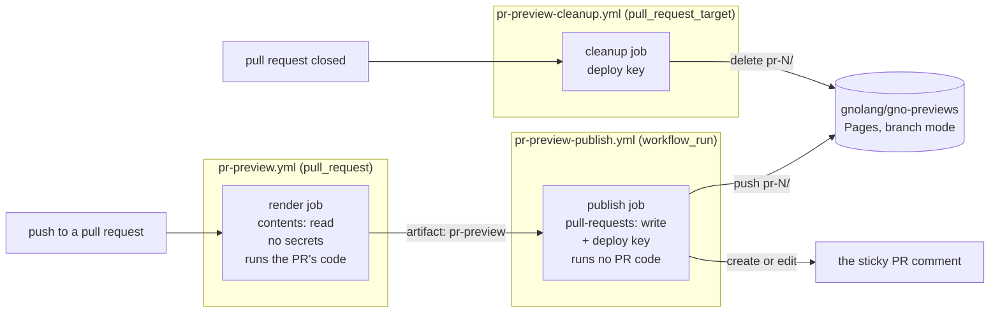
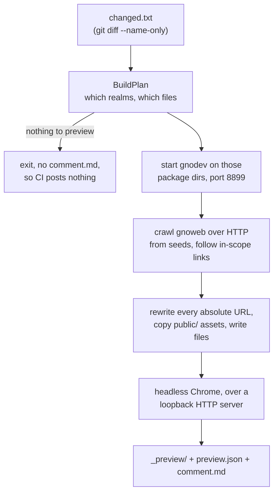

# A rendered web page for every pull request that changes one

claude-opus-5, high effort

## TLDR

Reviewing a change to a gno.land contract today means reading its `Render()`
function and imagining the page, or checking the branch out and running a local
node. This change renders the page in CI and publishes it, so the pull request
carries a link to the thing it changed. The rendering job runs the pull
request's own code, so a second job with the write credentials does the
publishing and never executes anything the first one produced.

## What it is for

A **realm** is a gno.land smart contract that keeps state, and most of them
export a `Render(path string) string` function returning markdown.
[gnoweb](https://github.com/gnolang/gno/blob/ecf7af0/gno.land/pkg/gnoweb)
·
[↗](../../../../.worktrees/gno-review-6194/gno.land/pkg/gnoweb)
is the web server that turns that markdown into the pages at `gno.land/r/...`.

So a pull request that edits a realm changes a web page, and nothing in the
review shows that page. The reviewer reads the source and pictures the output.
The same holds the other way round: a pull request that edits gnoweb changes
every realm's page at once, and the diff is CSS and Go templates.

## How it works today

Before this change, seeing the page means building the branch and serving it
locally. `gnodev` is the development node that does it: it starts a fresh
chain in memory, loads the packages it is pointed at, runs their `init()`, and
serves gnoweb on `127.0.0.1:8888`.

```sh
# before: what a reviewer runs today
gh pr checkout 6194 -R gnolang/gno
cd contribs/gnodev && go build -o /tmp/gnodev .
/tmp/gnodev local ./examples/gno.land/r/gnoland/home
# then open http://127.0.0.1:8888/r/gnoland/home
```

The repository already publishes one GitHub Pages site,
[`deploy-pages.yml`](https://github.com/gnolang/gno/blob/ecf7af0/.github/workflows/deploy-pages.yml#L1-L3)
·
[↗](../../../../.worktrees/gno-review-6194/.github/workflows/deploy-pages.yml#L1-L3),
which regenerates the Go documentation mirror at `gnolang.github.io/gno` on
every push to `master`. That workflow is not touched. Before and after this
change it publishes the same site the same way.

## What the change does

Everything the change adds is new: the merge-base checkout has no
`misc/gnopreview` directory and no preview workflow. There is no before to
compare a line against.

### The three workflows, and why there are three

A pull request from a fork must not get write credentials, because the job
would be running the fork's own code, including the fork's own copy of the
workflow file. GitHub's answer is two events. `pull_request` runs the fork's
code with a read-only token. `workflow_run` fires when that first workflow
finishes, runs the *base branch's* copy of its own file, and may hold secrets.
The rendering and the publishing are split across exactly that line.

> After. The trust boundary is the artifact: everything left of it runs code
> the pull request controls, everything right of it holds credentials and runs
> only code from `master`.



The publishing job takes the pull request number from the `workflow_run`
payload and never from the artifact, by
[looking the open pull request up from the head branch](https://github.com/gnolang/gno/blob/ecf7af0/.github/workflows/pr-preview-publish.yml#L67-L94)
·
[↗](../../../../.worktrees/gno-review-6194/.github/workflows/pr-preview-publish.yml#L67-L94).
It also stands down when the head has moved on since the render, and when no
open pull request matches. The comment body the untrusted job wrote is passed
to the API
[as a file](https://github.com/gnolang/gno/blob/ecf7af0/.github/workflows/pr-preview-publish.yml#L174)
·
[↗](../../../../.worktrees/gno-review-6194/.github/workflows/pr-preview-publish.yml#L174),
so no part of it reaches a shell.

Previews go to a separate repository, `gnolang/gno-previews`, served from a
branch rather than built by Actions. A Pages site built by Actions uploads the
whole site on every deploy; a branch-published site takes only the bytes that
changed. The three jobs there push, comment, and delete a directory named after
the pull request number.

The whole feature is off unless the repository variable
`GNOWEB_PREVIEW_BASE_URL` is set, which is
[the condition on every job](https://github.com/gnolang/gno/blob/ecf7af0/.github/workflows/pr-preview.yml#L43)
·
[↗](../../../../.worktrees/gno-review-6194/.github/workflows/pr-preview.yml#L43).
A fork gets nothing and pays for nothing.

### The tool

[`misc/gnopreview`](https://github.com/gnolang/gno/blob/ecf7af0/misc/gnopreview)
·
[↗](../../../../.worktrees/gno-review-6194/misc/gnopreview)
is a new Go program with its own module. It has two commands, `plan` and
`render`, and both start from a list of changed file paths.

> After. What `render` does between reading the changed-file list and writing
> the directory the artifact carries.



**Choosing what to render.**
[`BuildPlan`](https://github.com/gnolang/gno/blob/ecf7af0/misc/gnopreview/plan.go#L193-L278)
·
[↗](../../../../.worktrees/gno-review-6194/misc/gnopreview/plan.go#L193-L278)
walks `examples/` once, parses the import block of every `.gno` file with
`go/parser`, and builds the reverse import graph. Then:

| The diff touches | What is rendered | Where that is decided |
|---|---|---|
| a realm under `examples/gno.land/r/**` | that realm | [`plan.go:229-235`](https://github.com/gnolang/gno/blob/ecf7af0/misc/gnopreview/plan.go#L229-L235) · [↗](../../../../.worktrees/gno-review-6194/misc/gnopreview/plan.go#L229-L235) |
| a package under `examples/gno.land/p/**` | every realm that transitively imports it | [`dependents`](https://github.com/gnolang/gno/blob/ecf7af0/misc/gnopreview/plan.go#L295-L315) · [↗](../../../../.worktrees/gno-review-6194/misc/gnopreview/plan.go#L295-L315) |
| `gno.land/pkg/gnoweb/**`, `gno.land/cmd/gnoweb/**`, `contribs/gnodev/**` | four fixed sample realms, plus screenshots | [`gnowebSeedRealms`](https://github.com/gnolang/gno/blob/ecf7af0/misc/gnopreview/plan.go#L37-L42) · [↗](../../../../.worktrees/gno-review-6194/misc/gnopreview/plan.go#L37-L42) |
| anything else | nothing: no artifact, no comment, no job | [`Plan.Empty`](https://github.com/gnolang/gno/blob/ecf7af0/misc/gnopreview/plan.go#L91) · [↗](../../../../.worktrees/gno-review-6194/misc/gnopreview/plan.go#L91) |

Test files, filetests, `examples/quarantined/**` and packages marked
`ignore = true` never count as a change, since none of them can alter what a
realm renders. Realms under `gno.land/r/tests/` count when edited directly and
are never pulled in as importers of a changed package.

**Crawling.** gnodev is started as a child process in its own process group, on
a port derived from the flag, with its log captured and a channel carrying its
exit so a node that dies fails in seconds instead of at the readiness timeout.
The crawler seeds each realm's render page, its `$source` and `$help` tabs, and
the directory pages above it, then follows links that stay inside the selected
realms.

**Writing.** gnoweb puts both the tab and the render arguments in the URL path,
so a URL can carry `$`, `:` and `&`. Those characters survive a URL but not
every static host, so
[`urlToFile`](https://github.com/gnolang/gno/blob/ecf7af0/misc/gnopreview/crawl.go#L486-L506)
·
[↗](../../../../.worktrees/gno-review-6194/misc/gnopreview/crawl.go#L486-L506)
maps each URL to a directory holding an `index.html`, with the tab under `_t/`
and the render arguments under `_a/`, each slugged.

> After. Produced by calling `urlToFile` from the head's own package, in a copy
> of it, with the inputs below. The digest suffix is what keeps three different
> URLs off one file, and what keeps `:..` from folding onto the realm's own
> page.

| gnoweb URL | file written in the snapshot |
|---|---|
| `/r/gnoland/home` | `r/gnoland/home/index.html` |
| `/r/gnoland/home/` | `r/gnoland/home/_dir/index.html` |
| `/r/gnoland/home$source` | `r/gnoland/home/_t/source/index.html` |
| `/r/gnoland/home$source&file=home.gno` | `r/gnoland/home/_t/source-file-home.gno-7a0d5a89/index.html` |
| `/r/gnoland/blog:p/hello` | `r/gnoland/blog/_a/p-hello-13cc55eb/index.html` |
| `/r/gnoland/blog:p/a/b` | `r/gnoland/blog/_a/p-a-b-69f995cb/index.html` |
| `/r/gnoland/blog:p/a&b` | `r/gnoland/blog/_a/p-a-b-1d5aa200/index.html` |
| `/r/x/y:..` | `r/x/y/_a/5ec1f7e7/index.html` |

Every absolute link in a captured page is then rewritten: to a relative path
when the target was captured, and to `https://gno.land/...` when it was not, so
a link leaving the preview lands on the live site rather than a 404. The same
rewriting runs inside the copied JavaScript and CSS, because
[`index.ts:7`](https://github.com/gnolang/gno/blob/ecf7af0/gno.land/pkg/gnoweb/frontend/js/index.ts#L7)
·
[↗](../../../../.worktrees/gno-review-6194/gno.land/pkg/gnoweb/frontend/js/index.ts#L7)
builds its dynamic `import()` specifiers from a hardcoded
`/public/js/controller-` prefix, which resolves only at a site root.

**Search engines.** gnoweb's layout emits
[`<meta name="robots" content="index, follow" />`](https://github.com/gnolang/gno/blob/ecf7af0/gno.land/pkg/gnoweb/components/layouts/head.html#L38)
·
[↗](../../../../.worktrees/gno-review-6194/gno.land/pkg/gnoweb/components/layouts/head.html#L38)
on every page. A snapshot is a near-duplicate of a real gno.land page, so
[`setNoindex`](https://github.com/gnolang/gno/blob/ecf7af0/misc/gnopreview/crawl.go#L370-L378)
·
[↗](../../../../.worktrees/gno-review-6194/misc/gnopreview/crawl.go#L370-L378)
replaces that tag with `noindex, nofollow` rather than adding a second one.

**Pictures.** For a gnoweb change, four fixed pages are photographed with
headless Chrome. For a realm change, up to two changed realms are photographed
twice: once from a checkout of the merge base and once from the head, both
rendered by the head's gnodev binary and the head's assets, so the pair differs
by the realm change alone. A realm missing from the merge-base tree is labelled
new instead of being given a fake before. Chrome is pointed at a loopback HTTP
server rather than at `file://`, since Chrome refuses to load ES modules over
`file://` and the shot would silently be the no-JavaScript rendering.

**Bounds.** Every one of these is in the after; there is no before to compare
them with.

| Bound | Value | Where |
|---|---|---|
| realms rendered | 25, changed realms kept first | [`defaultMaxRealms`](https://github.com/gnolang/gno/blob/ecf7af0/misc/gnopreview/main.go#L29) · [↗](../../../../.worktrees/gno-review-6194/misc/gnopreview/main.go#L29) |
| pages crawled | 400 | [`defaultMaxPages`](https://github.com/gnolang/gno/blob/ecf7af0/misc/gnopreview/main.go#L30) · [↗](../../../../.worktrees/gno-review-6194/misc/gnopreview/main.go#L30) |
| per-file `$source` pages | only the files the pull request touched, plus 2 per realm when gnoweb changed | [`GnowebFileBudget`](https://github.com/gnolang/gno/blob/ecf7af0/misc/gnopreview/crawl.go#L218) · [↗](../../../../.worktrees/gno-review-6194/misc/gnopreview/crawl.go#L218) |
| before/after pairs | 2 realms | [`maxPairs`](https://github.com/gnolang/gno/blob/ecf7af0/misc/gnopreview/shots.go#L31) · [↗](../../../../.worktrees/gno-review-6194/misc/gnopreview/shots.go#L31) |
| snapshot size | 40 MiB, the publish fails above it | [`MAX_PREVIEW_MIB`](https://github.com/gnolang/gno/blob/ecf7af0/.github/workflows/pr-preview-publish.yml#L120) · [↗](../../../../.worktrees/gno-review-6194/.github/workflows/pr-preview-publish.yml#L120) |
| gnodev readiness | 5 minutes | [`-timeout`](https://github.com/gnolang/gno/blob/ecf7af0/misc/gnopreview/main.go#L76) · [↗](../../../../.worktrees/gno-review-6194/misc/gnopreview/main.go#L76) |
| artifact retention | 3 days | [`retention-days`](https://github.com/gnolang/gno/blob/ecf7af0/.github/workflows/pr-preview.yml#L122) · [↗](../../../../.worktrees/gno-review-6194/.github/workflows/pr-preview.yml#L122) |
| publish retries | 5, each replaying onto the latest `main` | [`pr-preview-publish.yml:135-155`](https://github.com/gnolang/gno/blob/ecf7af0/.github/workflows/pr-preview-publish.yml#L135-L155) · [↗](../../../../.worktrees/gno-review-6194/.github/workflows/pr-preview-publish.yml#L135-L155) |

Some URL shapes are skipped whatever the caps say, because they enumerate the
chain rather than describe it:
[`explosiveArgs`](https://github.com/gnolang/gno/blob/ecf7af0/misc/gnopreview/crawl.go#L160-L171)
·
[↗](../../../../.worktrees/gno-review-6194/misc/gnopreview/crawl.go#L160-L171)
drops `$state`, its `oid=` and `tid=` drill-downs, `$help&func=X` and
`$download`.

### What a reviewer sees

| | Before | After |
|---|---|---|
| A realm changed | read `Render()`, or check out and run gnodev | a link per changed realm, plus a before and after picture of up to two of them |
| A package a realm imports changed | find the importers by hand | every importing realm listed and rendered, capped at 25 |
| gnoweb changed | check out and run gnodev | a link to the snapshot homepage and four screenshots |
| Anything else | nothing | nothing: no comment at all, not an empty one |

The comment is sticky: it carries the marker
[`<!-- gnoweb-pr-preview -->`](https://github.com/gnolang/gno/blob/ecf7af0/misc/gnopreview/comment.go#L12)
·
[↗](../../../../.worktrees/gno-review-6194/misc/gnopreview/comment.go#L12),
and the publishing job edits the existing one rather than adding a new comment
per push. It matches on the bot's own authorship as well as the marker, so a
comment somebody else posts containing the marker is not adopted.

The snapshot has no chain behind it. Transactions, the faucet and search do not
work, and every realm shows the state it holds right after `init()`.

## Concepts

**Realm and package.** Under `examples/gno.land/`, `r/` holds realms, which are
stateful contracts with a `Render()` function, and `p/` holds packages, which
are stateless libraries with no page of their own. That asymmetry is why a
change to one package fans out to every realm importing it.

**gnoweb's URL grammar.** The tab and the render arguments live in the path,
not in a query string.
[`splitURL`](https://github.com/gnolang/gno/blob/ecf7af0/misc/gnopreview/crawl.go#L275-L283)
·
[↗](../../../../.worktrees/gno-review-6194/misc/gnopreview/crawl.go#L275-L283)
is the reader for it: `$` opens the tab query and `:` opens the render
arguments, so `/r/x/y:p/about$source` is the `$source` tab of the page
`/r/x/y` rendered with the argument `p/about`. The trailing slash carries
meaning too: `/r/x/y` renders the realm and `/r/x/y/` lists the directory, and
they are different pages.

**The pwn request.** A workflow triggered by `pull_request` from a fork gets a
read-only token precisely because it runs code the fork wrote. Giving that job
write access, or checking out the fork's code in a job that has it, hands the
repository to whoever opens a pull request. `workflow_run` and
`pull_request_target` are the two events that carry credentials, and both run
the base branch's copy of the workflow file. This change uses the first to
publish and the second to clean up, and neither ever checks out the pull
request.

**Pages in branch mode.** A GitHub Pages site can be built by an Actions
workflow, which uploads the entire site as one artifact on every deploy, or
served straight from a branch, where a push of a few files publishes a few
files. Previews use the second, in a repository of their own, so publishing a
preview neither waits on nor breaks the documentation site.

**Deploy key.** An SSH key registered on one repository, with write access to
that repository and nothing else. The publishing job uses one to push to
`gnolang/gno-previews`, so the credential it holds cannot reach `gnolang/gno`,
does not expire, and is not tied to a person.
