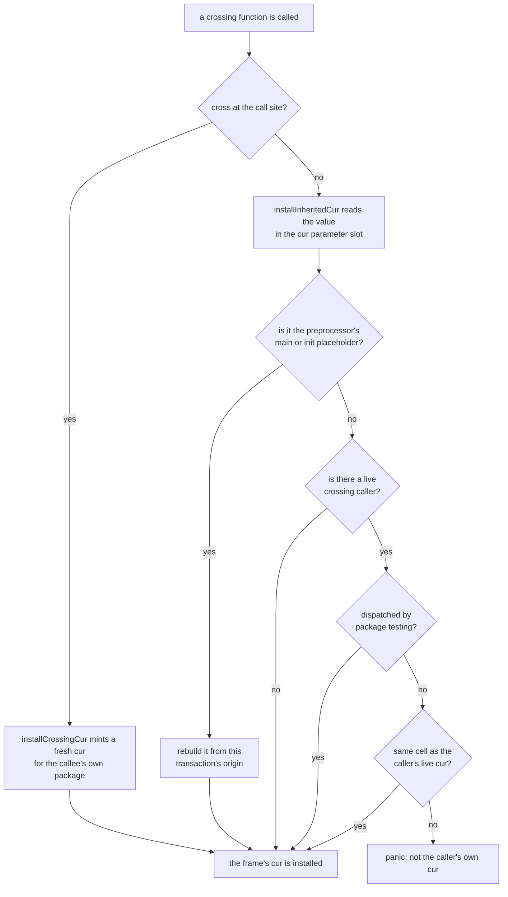

# PR 6196: the holes left by freezing the `cur` binding

Explainer for [PR 6196](https://github.com/gnolang/gno/pull/6196), generated by
claude-opus-5, effort xhigh.

## TLDR

A crossing function's `cur` parameter names the realm its frame is executing
as. [PR 6193](https://github.com/gnolang/gno/pull/6193) froze that binding:
three compile-time rules refuse to write it, and one run-time check refuses a
value that is not the caller's own. The rules matched on the name `cur` plus
the type `realm`. That missed the `:=` spelling of a rebind, and it refused
three bindings that only share the name. This change resolves the name to its
declaration instead, exempts the test harness from the run-time check, and
names a function literal in the panic that check raises.

## What `cur` is

[`realm`](https://github.com/gnolang/gno/blob/6d88deba7/gnovm/pkg/gnolang/uverse.go#L110-L113)
is a built-in interface type. A function whose first declared parameter
carries that type is a crossing function,
[`FuncType.IsCrossing`](https://github.com/gnolang/gno/blob/6d88deba7/gnovm/pkg/gnolang/types.go#L1393-L1400),
and the preprocessor requires that parameter to be
[named `cur`](https://github.com/gnolang/gno/blob/6d88deba7/gnovm/pkg/gnolang/preprocess.go#L2828).

The value behind the name is a pointer to one allocated cell holding the
realm's address, its package path, and a pointer to the realm it was entered
from,
[`NewConcreteRealm`](https://github.com/gnolang/gno/blob/6d88deba7/gnovm/pkg/gnolang/uverse.go#L460-L466).
Identity is that cell. `cur.IsCurrent()` is true when the value points at the
same cell as the innermost live crossing frame's own cur,
[`realmIsCurrentOnMachine`](https://github.com/gnolang/gno/blob/6d88deba7/gnovm/pkg/gnolang/uverse.go#L595-L615).
Copying the value keeps that identity. Minting a new one replaces it.

## How a crossing function gets its `cur`

Two entry paths, decided by whether the call site wrote `cross`. The shape at
this branch's head:

[`installCrossingCur`](https://github.com/gnolang/gno/blob/6d88deba7/gnovm/pkg/gnolang/op_call.go#L92-L109)
mints a cur for the callee's own package with the caller's realm recorded as
its previous, so the callee runs as itself.
[`installInheritedCur`](https://github.com/gnolang/gno/blob/6d88deba7/gnovm/pkg/gnolang/op_call.go#L416-L526)
takes the other path. The callee runs as whatever its caller was running as,
and the identity it takes is the `cur` argument the caller handed it. Three
things happen there before that identity settles.

The `cur` parameter's block slot is at index 0, or at index 1 when the callee
is a method, since a receiver occupies the first slot either way. A `cur`
captured by a nested closure is heap-promoted, so the slot holds a wrapper
rather than the realm value, and the wrapper is unwrapped before the value
reaches the frame.

[`curUsesPreprocessOrigin`](https://github.com/gnolang/gno/blob/6d88deba7/gnovm/pkg/gnolang/op_call.go#L124-L154)
answers whether the value is still the placeholder the preprocessor bakes into
the synthesized call for `main(cur realm)` and `init(cur realm)`. It answers by
pointer identity against the one package-level placeholder rather than by
shape, because a query and the test harness both mint an origin whose address
is empty and would satisfy a shape test too. A value that is the placeholder
gets rebuilt with the transaction's real origin address, and a rebuilt cur
skips the identity check.

[`topCrossingCur`](https://github.com/gnolang/gno/blob/6d88deba7/gnovm/pkg/gnolang/op_call.go#L202-L217)
walks the frames down to the nearest crossing frame whose cur is set, which is
the caller's. The value in the slot has to point at that same cell,
[op_call.go:513](https://github.com/gnolang/gno/blob/6d88deba7/gnovm/pkg/gnolang/op_call.go#L513).
A mismatch means the frame would run as a realm its caller is not in, so it
panics.

## What the write rules refuse

PR 6193 added three preprocess rules, all of them on both sides of this change.
What moved is which bindings they reach.

| Source shape | Rule |
| --- | --- |
| `cur = rlm` | [preprocess.go:3009-3015](https://github.com/gnolang/gno/blob/6d88deba7/gnovm/pkg/gnolang/preprocess.go#L3009-L3015) |
| `&cur` | [preprocess.go:2583-2585](https://github.com/gnolang/gno/blob/6d88deba7/gnovm/pkg/gnolang/preprocess.go#L2583-L2585) |
| `for _, cur = range xs` | [preprocess.go:3113-3121](https://github.com/gnolang/gno/blob/6d88deba7/gnovm/pkg/gnolang/preprocess.go#L3113-L3121) |

An older rule decides the matching question on the read side: whether a bare
`cur` may be forwarded to a crossing function without `cross`. It resolves the
name to its declaring node and requires a crossing `FuncDecl` or `FuncLitExpr`,
[preprocess.go:2154-2177](https://github.com/gnolang/gno/blob/6d88deba7/gnovm/pkg/gnolang/preprocess.go#L2154-L2177).

## What this change does

**The write rules resolve the declaration.** New
[`isCrossingCurParam`](https://github.com/gnolang/gno/blob/6d88deba7/gnovm/pkg/gnolang/preprocess.go#L6111-L6122)
takes the written name's block path, reads the node that declares it, and
answers true only for a crossing `FuncDecl` or `FuncLitExpr`. The forwarding
rule already made that test, so a binding may be cur-called exactly when it may
not be written. A package-level `var cur realm`, a named result `(cur realm)`
and a block-scoped shadow stay writable, and
[`zrealm_cur_other_legal.gno`](https://github.com/gnolang/gno/blob/6d88deba7/gnovm/tests/files/zrealm_cur_other_legal.gno)
pins them.

**The assignment rule moved below the DEFINE branch.** A `:=` whose name is
already a local of the same block assigns that slot instead of declaring a new
one,
[preprocess.go:3365-3367](https://github.com/gnolang/gno/blob/6d88deba7/gnovm/pkg/gnolang/preprocess.go#L3365-L3367).
So `cur, x := cur.Previous(), 1` at the function body's own level rebinds the
parameter, and the old rule skipped every `:=` wholesale. Running the rule
after the branch lets the resolved declaration decide, which still leaves an
inner-block shadow alone.
[`zrealm_cur_reassign_define.gno`](https://github.com/gnolang/gno/blob/6d88deba7/gnovm/tests/files/zrealm_cur_reassign_define.gno)
pins the rejection, and
[`zrealm_cur_closure.gno`](https://github.com/gnolang/gno/blob/6d88deba7/gnovm/tests/files/zrealm_cur_closure.gno)
pins that a crossing function literal's own `cur` is refused the same way.

**The run-time check exempts the test harness.**
[`harnessSeedsCur`](https://github.com/gnolang/gno/blob/6d88deba7/gnovm/pkg/gnolang/op_call.go#L558-L561)
reads the frame that made the call and skips the check when it belongs to
package `testing`.
[`t.Run`](https://github.com/gnolang/gno/blob/6d88deba7/gnovm/tests/stdlibs/testing/testing.gno#L171-L176)
hands a crossing sub-test the top-level test's cur on purpose. The live
crossing frame is whichever helper the test crossed into first, so the two
cells differ by design. `testing` exists only under
[`gnovm/tests/stdlibs/`](https://github.com/gnolang/gno/tree/6d88deba7/gnovm/tests/stdlibs),
which the test machine loads and a chain VM does not, so the exemption cannot
be reached from deployed code.
[`cur_subtest_test.gno`](https://github.com/gnolang/gno/blob/6d88deba7/gnovm/tests/stdlibs/testing/cur_subtest_test.gno)
is the regression, and
[`TestHarnessSeedsCur`](https://github.com/gnolang/gno/blob/6d88deba7/gnovm/pkg/gnolang/op_call_test.go#L82-L107)
pins the predicate itself.

**The panic names a function literal.**
[`funcDisplayName`](https://github.com/gnolang/gno/blob/6d88deba7/gnovm/pkg/gnolang/op_call.go#L567-L576)
falls back to the literal's source file and line, then to `<func literal>`. The
old message interpolated an empty name, so the sub-test failure rendered as
`crossing function testing_test. was entered without cross()`, naming nothing
the reader could act on.

`curUsesPreprocessOrigin`'s doc header was rewritten to state the
pointer-identity semantics. Its code is unchanged.

One gap is left open on purpose. The frame walk `installInheritedCur` runs is
not metered, while
[`doOpEnterCrossing`](https://github.com/gnolang/gno/blob/6d88deba7/gnovm/pkg/gnolang/op_call.go#L290)
charges `OpCPUSlopeEnterCrossing` per frame for the same traversal. Adding the
matching charge moves gas for every no-cross crossing entry, changing what
every node replaying a block computes, so a
[NOTE](https://github.com/gnolang/gno/blob/6d88deba7/gnovm/pkg/gnolang/op_call.go#L448-L452)
at the call site points at separate tracking instead. The
[ADR](https://github.com/gnolang/gno/blob/6d88deba7/gnovm/adr/prxxxx_cur_binding_followups.md?plain=1)
records that decision and the four alternatives weighed against it.

## Behaviour, before and after

Before is master with PR 6193 merged. After is this branch's head. Each row was
run on both trees, as a filetest or as the `testing` stdlib suite.

| Source shape | Before | After |
| --- | --- | --- |
| `cur = cur.Previous()` in a crossing function | preprocess error | unchanged |
| `cur, x := cur.Previous(), 1` at the body's own level | compiles, then panics at the next `f(cur)` | preprocess error |
| package-level `var cur realm`, written | preprocess error | compiles |
| named result `func F(x int) (cur realm)`, written | preprocess error | compiles |
| `cur := cur` in an inner block, then rebound or addressed | preprocess error | compiles |
| a crossing sub-test reached through `t.Run` after `cross` | panic, aborting the whole `gno test` run | runs |

Row one is the shape the freeze was written for, and it does not move. Row two
is the hole it left. Rows three and four are collateral: code that compiled
before PR 6193 and stopped compiling after it. Row five is the shadow the old
rules refused on purpose, and
[`zrealm_cur_shadow.gno`](https://github.com/gnolang/gno/blob/6d88deba7/gnovm/tests/files/zrealm_cur_shadow.gno)
flips from pinning the rejection to pinning that it compiles. A shadow still
cannot be cur-called, which the read-side rule refuses and
[`zrealm_cur_shadow_call.gno`](https://github.com/gnolang/gno/blob/6d88deba7/gnovm/tests/files/zrealm_cur_shadow_call.gno)
keeps pinning.

## Review files

[Review files for this PR](https://github.com/samouraiworld/gno-agent-workspace/tree/main/reviews/pr/6xxx/6196-cur-binding-holes)
