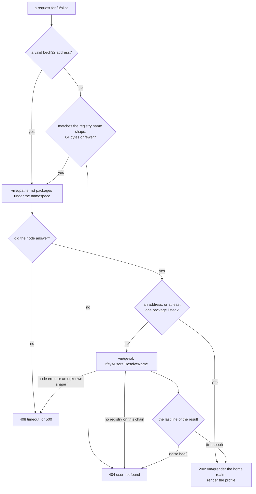

# PR 6206: who gets a page at `/u/<name>`

Explainer for [PR 6206](https://github.com/gnolang/gno/pull/6206), written by
claude-opus-5, effort high, standard review.

## TLDR

[gnoweb](https://github.com/gnolang/gno/tree/876762bdf2ea6635b27e2b0a42f26f9fdc54af24/gno.land/pkg/gnoweb)
answered every `/u/<segment>` with a profile page at HTTP 200, so `/u/mou1`
rendered like `/u/moul`. This change makes
[`GetUserView`](https://github.com/gnolang/gno/blob/876762bdf2ea6635b27e2b0a42f26f9fdc54af24/gno.land/pkg/gnoweb/handler_http.go#L603)
serve a page only for an address, for a namespace that already holds packages,
or for a name the on-chain user registry resolves. Everything else is a 404,
and a node that could not answer gives an error instead.

## What `/u/<name>` is

gnoweb is the web front end for a gno.land chain. It turns an HTTP path into
read-only queries against a node, then renders the answer. Three path prefixes
carry meaning, and
[`reGnolandPath`](https://github.com/gnolang/gno/blob/876762bdf2ea6635b27e2b0a42f26f9fdc54af24/gno.land/pkg/gnoweb/weburl/url.go#L265)
recognises them: `/r/` for a realm, `/p/` for a pure package, `/u/` for a user.

A user page is a profile. It shows a display name, `Gnome moul`, a count of
packages and realms, the list of everything deployed under that name, and the
render of the user's own home realm at `/r/<name>/home`. The segment after
`/u/` is read by
[`Username`](https://github.com/gnolang/gno/blob/876762bdf2ea6635b27e2b0a42f26f9fdc54af24/gno.land/pkg/gnoweb/weburl/url.go#L289-L296),
which returns the rest of the path, and an empty string where the path is not a
user path.

A name is an identity on gno.land, so an `@mention` written inside a realm
links here. Every such page is crawlable, so a page that should not exist
becomes a search result.

## Where a name comes from

Two system realms decide what a name means on chain. Both ship in the
repository under `examples/`.

[`r/sys/users`](https://github.com/gnolang/gno/blob/876762bdf2ea6635b27e2b0a42f26f9fdc54af24/examples/gno.land/r/sys/users/users.gno#L5-L33)
is the registry. It maps a name to a user record and an address to the same
record.
[`ResolveName`](https://github.com/gnolang/gno/blob/876762bdf2ea6635b27e2b0a42f26f9fdc54af24/examples/gno.land/r/sys/users/users.gno#L6-L18)
returns the record and a boolean. The pair separates three states:

| What the name is | `ResolveName` returns |
| --- | --- |
| never registered, or the user deleted themselves | `nil, false` |
| an old name the user has since renamed away from | the record, `false` |
| the user's current name | the record, `true` |

The third row is the only one that means "this is a live user, under the name
you asked about". The registry also fixes the shape of a name: a lowercase
letter, then alphanumerics, with single `_` or `-` separators between them,
[`reName`](https://github.com/gnolang/gno/blob/876762bdf2ea6635b27e2b0a42f26f9fdc54af24/examples/gno.land/r/sys/users/store.gno#L27),
capped at
[64 bytes](https://github.com/gnolang/gno/blob/876762bdf2ea6635b27e2b0a42f26f9fdc54af24/examples/gno.land/r/sys/users/store.gno#L30).
That expression mirrors the VM's own package-name shape,
[`Re_name`](https://github.com/gnolang/gno/blob/876762bdf2ea6635b27e2b0a42f26f9fdc54af24/gnovm/pkg/gnolang/mempackage.go#L70).

[`r/sys/names`](https://github.com/gnolang/gno/blob/876762bdf2ea6635b27e2b0a42f26f9fdc54af24/examples/gno.land/r/sys/names/verifier.gno#L1)
is the deploy gate. Before a package is added under `gno.land/r/<ns>/...` or
`gno.land/p/<ns>/...`, it asks whether the deployer owns that namespace. Two
shapes pass:
[the deployer's own address, or a registered name whose current owner is the deployer](https://github.com/gnolang/gno/blob/876762bdf2ea6635b27e2b0a42f26f9fdc54af24/examples/gno.land/r/sys/names/verifier.gno#L3-L14).
The lookup it uses for the second shape is the same `isCurrent` boolean,
[`resolveCurrentName`](https://github.com/gnolang/gno/blob/876762bdf2ea6635b27e2b0a42f26f9fdc54af24/examples/gno.land/r/sys/names/verifier.gno#L102-L107).

One consequence matters here. That gate runs from block 1 onward, and it does
not retro-register the packages a chain shipped in its genesis state. A
namespace can therefore hold packages while `ResolveName` answers `false` for
it. Those pages must keep working.

## The queries a user page makes

A node exposes read-only endpoints over ABCI. gnoweb calls three of them here.

[`vm/qpaths`](https://github.com/gnolang/gno/blob/876762bdf2ea6635b27e2b0a42f26f9fdc54af24/gno.land/pkg/sdk/vm/handler.go#L104)
lists deployed package paths under a prefix. A prefix starting with `@` means a
namespace rather than a literal path: the node splits the rest at the first
slash and
[lists both the `p/` and the `r/` side](https://github.com/gnolang/gno/blob/876762bdf2ea6635b27e2b0a42f26f9fdc54af24/gno.land/pkg/sdk/vm/keeper.go#L1694-L1722).
So `@moul` finds everything under `gno.land/p/moul/` and `gno.land/r/moul/`,
while `@moul/addrset` narrows to that one sub-prefix. The result is
[newline-joined](https://github.com/gnolang/gno/blob/876762bdf2ea6635b27e2b0a42f26f9fdc54af24/gno.land/pkg/sdk/vm/handler.go#L233),
so an empty result is an empty payload, and the client's
[`strings.Split`](https://github.com/gnolang/gno/blob/876762bdf2ea6635b27e2b0a42f26f9fdc54af24/gno.land/pkg/gnoweb/client.go#L231)
turns that into a slice of one empty string rather than an empty slice.

[`vm/qeval`](https://github.com/gnolang/gno/blob/876762bdf2ea6635b27e2b0a42f26f9fdc54af24/gno.land/pkg/sdk/vm/handler.go#L98)
evaluates a read-only Gno expression inside a package and renders the result as
text. The payload is one string, `gno.land/r/sys/users.ResolveName("alice")`,
and the node
[cuts the package path from the expression at the first dot after the domain](https://github.com/gnolang/gno/blob/876762bdf2ea6635b27e2b0a42f26f9fdc54af24/gno.land/pkg/sdk/vm/handler.go#L289-L302).
Each return value gets
[its own line](https://github.com/gnolang/gno/blob/876762bdf2ea6635b27e2b0a42f26f9fdc54af24/gno.land/pkg/sdk/vm/keeper.go#L1833-L1838),
written as the value followed by its type inside parentheses,
[`WriteProtected`](https://github.com/gnolang/gno/blob/876762bdf2ea6635b27e2b0a42f26f9fdc54af24/gnovm/pkg/gnolang/values_string_stream.go#L637-L639).
A two-value return therefore looks like this, which is the after shape the
handler parses:

```text
(&(struct{("g1manfred47kzduec920z88wfr64ylksmdcedlf5" .uverse.address),("alice" string),(false bool)} gno.land/r/sys/users.UserData) *gno.land/r/sys/users.UserData)
(true bool)
```

The record on the first line carries a `(false bool)` field of its own, so only
the last line answers the question.

`vm/qrender` is the third. It calls a realm's `Render` function and returns
markdown, and it is what draws the home tab of the profile.

## How gnoweb resolved `/u/<name>` before

Before this change, at the merge base, the handler asked nothing. It took the
path segment, fetched the home realm, listed the namespace, and returned 200
whatever came back:

```go
// Before, gno.land/pkg/gnoweb/handler_http.go:564-584 at the merge base
func (h *HTTPHandler) GetUserView(ctx context.Context, gnourl *weburl.GnoURL) (int, *components.View) {
	username := strings.TrimPrefix(gnourl.Path, "/u/")

	var content bytes.Buffer

	// Render user profile realm
	raw, err := h.Client.Realm(ctx, "/r/"+username+"/home", "")
	if err == nil {
		_, err = h.Renderer.RenderRealm(&content, gnourl, raw, RealmRenderContext{...})
	}

	if content.Len() == 0 {
		h.Logger.Debug("unable to fetch user realm", "username", username, "error", err)
	}

	// Build contributions
	contribs, realmCount, err := h.buildContributions(ctx, username)
	...
}
```

The full before version is
[`GetUserView` at the merge base](https://github.com/gnolang/gno/blob/7916d1dd65f326efe46b5ad105412ce028768c4d/gno.land/pkg/gnoweb/handler_http.go#L564-L613).
A name nobody owns produced an empty home tab and an empty contributions list.
A freshly registered user with no packages produced the same page. Two `TODO`
comments in that function asked for the missing check.

## What the change does

The new
[`GetUserView`](https://github.com/gnolang/gno/blob/876762bdf2ea6635b27e2b0a42f26f9fdc54af24/gno.land/pkg/gnoweb/handler_http.go#L603-L627)
decides before it renders. One shape check runs first, then three rules in
order, and the first rule that holds serves the page.

**The shape check.** The segment now comes from
[`Username`](https://github.com/gnolang/gno/blob/876762bdf2ea6635b27e2b0a42f26f9fdc54af24/gno.land/pkg/gnoweb/handler_http.go#L604)
rather than a prefix trim, and a segment that is not an address must match
[a name expression and a 64-byte cap](https://github.com/gnolang/gno/blob/876762bdf2ea6635b27e2b0a42f26f9fdc54af24/gno.land/pkg/gnoweb/handler_http.go#L606-L610).
gnoweb compiles that expression from
[`gno.Re_name`](https://github.com/gnolang/gno/blob/876762bdf2ea6635b27e2b0a42f26f9fdc54af24/gno.land/pkg/gnoweb/handler_http.go#L546),
the VM's own package-name rule, which the registry mirrors in a literal of its
own. A segment failing this check reaches no query at all.

**Rule 1, an address.**
[`crypto.AddressFromBech32`](https://github.com/gnolang/gno/blob/876762bdf2ea6635b27e2b0a42f26f9fdc54af24/tm2/pkg/crypto/bech32.go#L19-L25)
requires the `g` prefix and
[exactly 20 bytes](https://github.com/gnolang/gno/blob/876762bdf2ea6635b27e2b0a42f26f9fdc54af24/tm2/pkg/crypto/crypto.go#L53-L57).
An address is a namespace by construction, so it skips both the shape check and
the registry lookup. The same call now backs
[`CreateUsernameFromBech32`](https://github.com/gnolang/gno/blob/876762bdf2ea6635b27e2b0a42f26f9fdc54af24/gno.land/pkg/gnoweb/handler_http.go#L580-L586),
which shortens the header to `g1ma...dlf5`.

**Rule 2, a namespace with packages.** The contributions listing moves
[ahead of the render](https://github.com/gnolang/gno/blob/876762bdf2ea6635b27e2b0a42f26f9fdc54af24/gno.land/pkg/gnoweb/handler_http.go#L612-L616)
and doubles as the second rule. The page needed that query anyway. It is also
the rule that keeps a genesis namespace working, and the only proof available
on a local dev chain where nobody registers a name. An empty `vm/qpaths` result
arrives as one blank line, so the count is taken over parsed contributions, and
[the blank line is skipped](https://github.com/gnolang/gno/blob/876762bdf2ea6635b27e2b0a42f26f9fdc54af24/gno.land/pkg/gnoweb/handler_http.go#L513-L517).

**Rule 3, a registered name.**
[`userExists`](https://github.com/gnolang/gno/blob/876762bdf2ea6635b27e2b0a42f26f9fdc54af24/gno.land/pkg/gnoweb/handler_http.go#L554-L577)
asks `r/sys/users` through the new
[`Eval`](https://github.com/gnolang/gno/blob/876762bdf2ea6635b27e2b0a42f26f9fdc54af24/gno.land/pkg/gnoweb/client.go#L159-L166)
adapter method and reads
[the last line only](https://github.com/gnolang/gno/blob/876762bdf2ea6635b27e2b0a42f26f9fdc54af24/gno.land/pkg/gnoweb/handler_http.go#L566-L576).
`(true bool)` serves the page and `(false bool)` is a 404. A chain with no
registry deployed answers `false`: gnoweb turns the node's missing-package
error into
[`ErrClientPackageNotFound`](https://github.com/gnolang/gno/blob/876762bdf2ea6635b27e2b0a42f26f9fdc54af24/gno.land/pkg/gnoweb/client.go#L371-L377),
and `userExists` reads that as "no such user".

Two failures are not 404s. A node that times out surfaces as
[408](https://github.com/gnolang/gno/blob/876762bdf2ea6635b27e2b0a42f26f9fdc54af24/gno.land/pkg/gnoweb/handler_http.go#L1052-L1053),
and a last line of some unexpected shape surfaces as
[500](https://github.com/gnolang/gno/blob/876762bdf2ea6635b27e2b0a42f26f9fdc54af24/gno.land/pkg/gnoweb/handler_http.go#L1056-L1058)
rather than deleting every registered user's page in silence.

The decision path after the change:



## What each path renders

Every row except the address depends on what the chain holds. The condition
sits in the second column, so a reader can check a row against any chain.

| Path | What the segment is | Before | After |
| --- | --- | --- | --- |
| `/u/g1manfred47kzduec920z88wfr64ylksmdcedlf5` | a bech32 address | 200, header `g1ma...dlf5` | 200, unchanged, and no registry lookup |
| `/u/moul` | a name whose namespace holds packages | 200, profile and contributions | 200, unchanged, by rule 2 |
| `/u/mou1` | a lookalike: no packages, not registered | 200, `Gnome mou1`, zero contributions | 404, `user not found` |
| `/u/foo/bar` | two segments, which `vm/qpaths` reads as a sub-prefix | 200, `Gnome foo/bar`, listing `gno.land/p/foo/bar` and its siblings | 404, refused before any query |
| `/u/docs` | the target of the [`/docs` alias](https://github.com/gnolang/gno/blob/876762bdf2ea6635b27e2b0a42f26f9fdc54af24/gno.land/pkg/gnoweb/app.go#L30) | 200, an empty profile where nothing is deployed under `docs` | 200 where `r/docs/...` or `p/docs/...` exists, 404 where neither does |

## Queries per request

Both columns count the read-only queries one `GET /u/<name>` sends to the node.

| The request | Before | After |
| --- | --- | --- |
| an address | `qrender` + `qpaths` | `qpaths` + `qrender` |
| a namespace holding packages | `qrender` + `qpaths` | `qpaths` + `qrender` |
| a registered name with no packages | `qrender` + `qpaths` | `qpaths` + `qeval` + `qrender` |
| an unknown name | `qrender` + `qpaths` | `qpaths` + `qeval` |
| a segment that cannot be a name | `qrender` + `qpaths` | none |

The one extra query falls on a registered user who has deployed nothing. Every
other case sends the same number or fewer.

## Concepts

| Term | What it means |
| --- | --- |
| [namespace](https://github.com/gnolang/gno/blob/876762bdf2ea6635b27e2b0a42f26f9fdc54af24/examples/gno.land/r/sys/names/verifier.gno#L16-L17) | the path segment after `/r/` or `/p/` that a deployer owns. Owning `moul` grants both `r/moul/...` and `p/moul/...` |
| [bech32 address](https://github.com/gnolang/gno/blob/876762bdf2ea6635b27e2b0a42f26f9fdc54af24/tm2/pkg/crypto/bech32.go#L19-L25) | an account identifier such as `g1manfred47kzduec920z88wfr64ylksmdcedlf5`: the prefix `g`, then 20 bytes |
| [realm](https://github.com/gnolang/gno/blob/876762bdf2ea6635b27e2b0a42f26f9fdc54af24/gno.land/pkg/gnoweb/weburl/url.go#L240-L242) | a package with persistent state, served under `/r/`. A pure package under `/p/` has none |
| [current name](https://github.com/gnolang/gno/blob/876762bdf2ea6635b27e2b0a42f26f9fdc54af24/examples/gno.land/r/sys/users/users.gno#L17) | the name a user answers to now. A name they renamed away from still resolves to their record, with the boolean `false` |
| [`vm/qpaths`](https://github.com/gnolang/gno/blob/876762bdf2ea6635b27e2b0a42f26f9fdc54af24/gno.land/pkg/sdk/vm/keeper.go#L1667-L1722) | lists deployed package paths under a prefix. `@name` means the namespace, both the `p/` and the `r/` side |
| [`vm/qeval`](https://github.com/gnolang/gno/blob/876762bdf2ea6635b27e2b0a42f26f9fdc54af24/gno.land/pkg/sdk/vm/keeper.go#L1816-L1845) | evaluates a read-only expression in a package and renders each return value on its own line |
| [`vm/qrender`](https://github.com/gnolang/gno/blob/876762bdf2ea6635b27e2b0a42f26f9fdc54af24/gno.land/pkg/gnoweb/client.go#L149-L156) | calls a realm's `Render` and returns the markdown it produces |
| [`ClientAdapter`](https://github.com/gnolang/gno/blob/876762bdf2ea6635b27e2b0a42f26f9fdc54af24/gno.land/pkg/gnoweb/client.go#L73) | the interface gnoweb reads a chain through. [`Eval`](https://github.com/gnolang/gno/blob/876762bdf2ea6635b27e2b0a42f26f9fdc54af24/gno.land/pkg/gnoweb/client.go#L115-L119) is the method this change adds to it |
| [gnodev](https://github.com/gnolang/gno/tree/876762bdf2ea6635b27e2b0a42f26f9fdc54af24/contribs/gnodev) | the local development chain. It loads `examples/` and registers no names, so rule 2 is the only rule that fires there |

## The decision on record

The change ships its own decision record,
[`gno.land/adr/pr6206_gnoweb_user_page_gate.md`](https://github.com/gnolang/gno/blob/876762bdf2ea6635b27e2b0a42f26f9fdc54af24/gno.land/adr/pr6206_gnoweb_user_page_gate.md?plain=1#L23-L109).
It records the three rules, the alternatives weighed against them, and the
consequences the author accepts.
