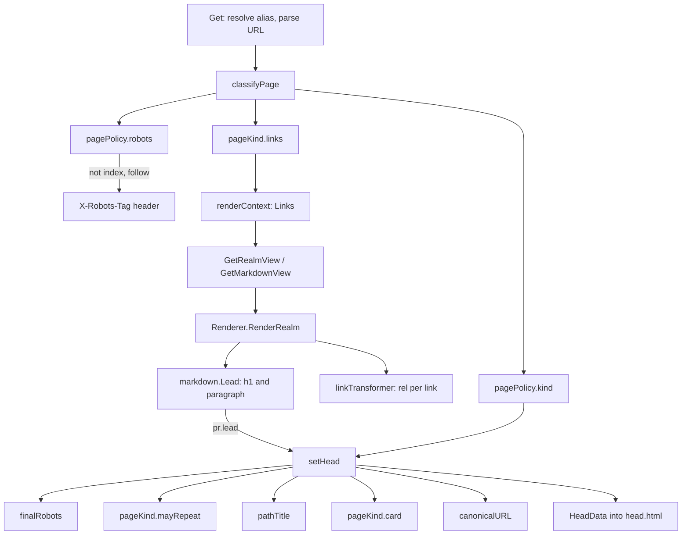

# gnoweb page metadata: `pagePolicy`, `setHead` and the link policy

Written by claude-opus-5-5, overview stage of the review pipeline, effort high.

PR: [gnolang/gno#6229](https://github.com/gnolang/gno/pull/6229)

## TLDR

Before, gnoweb titled every realm page `gno.land - <realm path>` in
[`setHeaderForRealm`][b-title], shipped `description`, `og:image` and
`og:url` with `content=""`, and told every crawler
[`index, follow`][b-robots] on every page.

After, [`classifyPage`][classify] sorts each page into one of four
`pageKind`s from its URL alone, and [`setHead`][sethead] writes the whole
head from that kind once the body is rendered: a title, a summary, a share
card, a canonical URL and a robots decision, the last also sent as an
`X-Robots-Tag` header. The same kind sets the `rel` of every link the page
renders.

It exists because gno.land is permissionless: any text a page lends its head,
or any link a crawler credits to gno.land, can be written by anyone. Only a
page under `-trusted-paths` may lend its own words to the head.

## Before and after

One row per place the behaviour reaches the reader or a crawler. The left
column is the base, the right column is the head of this pull request.

| | before | after |
|---|---|---|
| `<title>` | `gno.land - /r/gnoland/blog` for every post of the blog, through [`setHeaderForRealm`][b-title] | the leading h1 of an official page with no args or query, else the path title `blog · realm by gnoland - gno.land`, through [`setHead`][sethead-title] |
| `meta description` | always emitted, always empty, through [`head.html`][b-head] | the official page's lead paragraph, else a fixed sentence per kind, through [`pageKind.card`][card] |
| `og:image`, `twitter:image` | always emitted, always empty | `og-gnoland.png` or one of three community cards, only when `-canonical-origin` is set, through [`setHead`][sethead-image] |
| `link rel="canonical"`, `og:url` | never emitted | built from `-canonical-origin` and the path, query dropped, through [`canonicalURL`][canonical]; the canonical only on an indexed page |
| robots meta | hard-coded [`index, follow`][b-robots] in the template | decided per page by [`pagePolicy.robots`][robots], lowered by [`finalRobots`][finalrobots] on an error or an empty user page |
| `X-Robots-Tag` header | never sent | sent on every page that is not `index, follow`, markdown and download responses included, through [`classifyPage`][classify-header] |
| internal link `rel` in a rendered document | none | `nofollow ugc` unless the page's kind follows internal links, through [`GnoLink.rel`][rel] |
| external link `rel` | [`noopener nofollow ugc`][b-rel] on every page | the same, except `noopener` alone in an operator's markdown page |
| a link written after an autolink in the same paragraph | never wrapped, so it rendered with no `rel` | wrapped like every other, through the collect-then-replace walk in [`linkTransformer.Transform`][transform] |
| error page head | title [`gno.land — invalid path`][b-error] on a parse error, the realm title otherwise | fixed title by status, `Page not found` or `Invalid path`, fixed description, no canonical, og:url or card, through [`setHead`][sethead-error] |

The base head template, before, emitted every slot whether or not anything
filled it:

```html
  <!-- Meta description -->
  <meta name="description" content="{{ .Description }}" />
  ...
  <meta property="og:image" content="{{ .Image }}" />
  <meta property="og:url" content="{{ .URL }}" />
  ...
  <meta name="robots" content="index, follow" />
```

The head template after the change, from [`head.html`][head-after], emits a
slot only when `setHead` filled it, and the robots meta carries the decision:

```html
  {{ if .Description }}
  <meta name="description" content="{{ .Description }}" />
  {{ end }}
  ...
  {{ if .Image }}
  <meta property="og:image" content="{{ .Image }}" />
  <meta property="og:image:width" content="1200" />
  <meta property="og:image:height" content="630" />
  <meta property="og:image:alt" content="{{ .ImageAlt }}" />
  {{ end }}
  ...
  {{ if .Robots }}
  <meta name="robots" content="{{ .Robots }}" />
  {{ end }}
```

## The four page kinds

After the change, [`pagePolicy.kind`][kind] answers who stands behind a page.
It reads the URL, the alias table and the trusted list, and makes no RPC, so a
future sitemap can classify pages the same way.

| kind | which pages | head may repeat the document | links followed |
|---|---|---|---|
| `pageOfficial` | a `/r/`, `/p/` or `/u/` page whose package sits under a [`-trusted-paths`][trusted] entry | its leading h1 and paragraph, only with no args and no query | internal ones |
| `pageOperator` | a markdown page the operator passed to `-aliases` | its front matter, or its leading h1 and paragraph | all |
| `pageCommunity` | every other package or user page, and the zero value | nothing | none |
| `pageSite` | a view of no package, such as the bare `/r/` listing | nothing | internal ones |

Three rules sit inside `kind`, after the change:

- An alias to a realm takes the kind of the realm it serves, because
  [`Get`][get-alias] resolves the alias before it classifies.
- A user page is one name: [`/u/gnoland/anything`][kind-user] is
  `pageCommunity`, so a deeper path never borrows the trust of `gnoland`.
- An entry trusts its own path and every path below it, and `*` trusts every
  path, through [`trustedPaths.contains`][contains]. gnodev sets
  [`*`][gnodev], since every package on a local chain is the developer's own.

## How the head is decided

The diagram is the after: the request path through `Get` on the head of this
pull request. Nodes are the functions that decide.



- [`classifyPage`][classify] runs once per request, before any branch writes
  a byte, and stores the kind, the robots decision and the link policy in a
  `servedPage`.
- [`pagePolicy.robots`][robots] decides indexing from the kind, the args, the
  query, the `$` view and whether the namespace is an address.
- [`pageKind.links`][links] maps the kind to a `markdown.LinkPolicy`, which
  rides into the renderer through [`renderContext`][rctx].
- [`markdown.Lead`][lead] reads the top of the rendered document as plain
  text: a leading h1 capped at 60 characters, and the first paragraph of at
  least 40 characters before the next heading or rule, capped at
  [160][lead-limits].
- [`finalRobots`][finalrobots] lowers the decision to `noindex, nofollow` on a
  non-200 status, an empty user page, or a state page that already sent that
  header.
- [`pageKind.mayRepeat`][mayrepeat] lets the lead through only on an official
  or operator page whose link carries no args and no query, since both reach
  `Render` and a trusted realm may echo them.
- [`pathTitle`][pathtitle] names the page from its path alone when the lead
  may not, or is empty.
- [`pageKind.card`][card] gives the fallback description, the share image and
  its alt text.
- [`canonicalURL`][canonical] builds the canonical from `-canonical-origin`,
  never from the request host, so `X-Forwarded-Host` cannot redirect it.

### A worked example

These values are the after, for a deployment run with
`-canonical-origin=https://gno.land` and the default flags. The titles match
the cases of [`TestPathTitle`][pathtitle-test], which passes at the head.

| URL | kind | `<title>` | description | robots | image |
|---|---|---|---|---|---|
| `/r/gnoland/blog` | official | the blog's leading h1, or `blog · realm by gnoland - gno.land` | its lead paragraph, or the site sentence | `index, follow` | `og-gnoland.png` |
| `/r/gnoland/blog:p/my-post` | official | `blog · realm by gnoland - gno.land` | `Explore realms and packages on gno.land, the network for Gno smart contracts.` | `index, follow` | `og-gnoland.png` |
| `/r/gnoland/blog?page=2` | official | `blog · realm by gnoland - gno.land` | the site sentence | `noindex, follow` | `og-gnoland.png` |
| `/r/nym/games/chess` | community | `games/chess · realm by nym - gno.land` | `games/chess, a realm deployed on gno.land by nym.` | `index, follow` | `og-community-realm.png` |
| `/r/nym/games/chess$help` | community | `games/chess · realm by nym - gno.land` | the same | `noindex, nofollow` | `og-community-realm.png` |
| `/r/g1jg...sqf5/app` | community | `app · realm by g1jg...sqf5 - gno.land` | `app, a realm deployed on gno.land by g1jg...sqf5.` | `noindex, nofollow` | `og-community-realm.png` |
| `/u/gnoland/claim` | community | `Page not found - gno.land` | `This page is not available.` | `noindex, nofollow` | none |

The last row rests on the pull request body's statement that a deep user
path is not found; [`GetUserView`][user-404] answers 404 to a name that fails
the user-name check.

## Robots, after the change

[`pagePolicy.robots`][robots] decides; the `-index-community` value only
changes community rows. The default is [`registered`][index-default].

| page | `registered` | `none` | `all` |
|---|---|---|---|
| official: bare, with args, `$source`, `$source&file=` | index, follow | index, follow | index, follow |
| official: any query, `$help`, `$state`, any other `$` key | noindex, follow | noindex, follow | noindex, follow |
| community: bare page under a registered name | index, follow | noindex, nofollow | index, follow |
| community: address namespace, args, query, any `$` view | noindex, nofollow | noindex, nofollow | follows the official rows |
| any non-200 status, a user page with nothing to show | noindex, nofollow | noindex, nofollow | noindex, nofollow |

The `registered` rule leans on the chain: once `r/sys/names` is enabled, only
the holder of a name may deploy under it, while an address namespace costs
nothing to create. gnoweb tells the two apart from the path with
[`isGnoAddress`][registered], with no RPC.

## Links, after the change

[`GnoLink.rel`][rel] combines the document's `LinkPolicy` with the link type.

| document | internal link | external link |
|---|---|---|
| community realm, README, user page | `nofollow ugc` | `noopener nofollow ugc` |
| trusted realm or README | no `rel` | `noopener nofollow ugc` |
| operator markdown | no `rel` | `noopener` |
| doc comment, in `$help` and the source overview | `noopener nofollow ugc` | `noopener nofollow ugc` |

The zero `LinkPolicy` is [`FollowNoLinks`][linkpolicy], so a document rendered
with no policy is treated as user content. gnoweb's own header, breadcrumb and
tab links are not rendered documents and keep no `rel`.

## Read the code in this order

1. [`page_kind.go`][kind], `pagePolicy.kind`. Every other decision reads its
   answer; a page wrongly sorted as official lends realm text to the head and
   follows its links.

   ```go
   	case u.IsUser() && strings.Contains(pkg, "/"):
   		// A user is one name; a deeper path must not borrow the trust of
   		// the name it starts with.
   		return pageCommunity
   	case p.trusted.contains(pkg):
   		return pageOfficial
   ```

2. [`community_index.go`][robots], `pagePolicy.robots`. It decides what
   crawlers index; a wrong branch either drops official pages from search or
   lets throwaway realms in.

   ```go
   		case IndexRegisteredCommunity:
   			if u.Args != "" || len(u.Query) > 0 || len(u.WebQuery) > 0 || isGnoAddress(u.Namespace()) {
   				return noIndexNoFollow
   			}
   			return indexFollow
   ```

3. [`handler_http.go`][classify], `classifyPage` and `finalRobots`. They set
   the header before any branch writes and keep the header and the meta in
   agreement once the status is known.

   ```go
   	sp := servedPage{url: u, target: u, kind: h.policy.kind(u)}
   	sp.robots = h.policy.robots(sp.kind, u)
   	sp.render.links = sp.kind.links()
   ```

4. [`handler_http.go`][sethead], `setHead`. The only writer of the head; if
   `mayRepeat` lets too much through, a crafted link titles a trusted page.

   ```go
   	lead := sp.render.lead
   	if !sp.kind.mayRepeat(sp.url) {
   		lead = pageLead{}
   	}
   	if lead.title == "" {
   		lead.title = pathTitle(sp.url)
   	}
   ```

5. [`markdown/description.go`][lead], `Lead`. It decides how much of a trusted
   document counts as the page's own words; reading past the first heading
   would let a user's post below the lead name the page.

6. [`handler_http.go`][canonical], `canonicalURL`. It names the address
   crawlers keep; it drops the query and every `$` key but `source` and
   `file`, and maps an alias target to its alias, so `/r/gnoland/home` is `/`.

7. [`markdown/ext_links.go`][linkpolicy], `LinkPolicy` and `GnoLink.rel`, then
   the [collect-then-replace walk][transform] in `Transform`, which fixes the
   link left unwrapped after an autolink.

   ```go
   	// Collect first and replace after: swapping a node out mid-walk clears
   	// the sibling the walk would visit next, so a link after an autolink in
   	// the same paragraph would never be wrapped, nor given its rel.
   ```

8. [`cmd/gnoweb/main.go`][flags], the three flags, and the
   [ADR][adr] for the alternatives the author rejected.

## What a user notices

All of these are after the change, decided per URL and per deployment flags,
never per browser or per visitor.

- A browser tab shows the page's own name first and the domain last,
  `games/chess · realm by nym - gno.land`, instead of `gno.land - /r/...`.
- A link pasted into a chat app previews with a title, a summary and a card,
  where it previewed blank. A community page shows a card reading "Community
  realm", "Community package" or "Community profile". This needs
  `-canonical-origin` on the deployment.
- Search results stop listing community pages reached through args, a query,
  a `$` view or an address namespace, at the crawler's next visit.
- Every blog post of one realm shares that realm's title in the tab, because
  args never reach the title.

## Upgrading

Three `gnoweb` flags, all after the change, from [`main.go`][flags]:

| flag | default | effect |
|---|---|---|
| `-canonical-origin` | empty | the public `scheme://host[:port]`; empty emits no canonical, og:url or share image; anything but a bare `scheme://host[:port]` is refused by [`normalizeCanonicalOrigin`][origin] |
| `-index-community` | [`registered`][index-default] | `none`, `registered` or `all`, the community rows of the robots table |
| `-trusted-paths` | [`DefaultTrustedPaths`][default-trusted] | comma-separated namespaces or package paths treated as official, or `*` |

Production needs `-canonical-origin=https://gno.land`, or it keeps shipping no
canonical and no share image. A chain without `r/sys/names` lets anyone
deploy under any name, so both `-trusted-paths` and `registered` lose their
meaning there and `-index-community=none` fits.

## Words used here

| name | what it is |
|---|---|
| [`pageKind`][pagekind] | who answers for a page: `pageCommunity`, the zero value, `pageOfficial`, `pageOperator` or `pageSite` |
| [`pagePolicy`][pagepolicy] | the trusted list, the alias table and `-index-community`, built once per handler; classifies a URL with no request and no RPC |
| [`servedPage`][servedpage] | what `Get` knows about the page it serves: the URL asked for, the alias target, the kind, the robots decision and the `pageRender` |
| [`pageRender`][pagerender] | handed to the views: the link policy in, the `lead` and the `empty` flag out |
| [`pageLead`][pagelead] | a document's leading h1 and summary, before `mayRepeat` decides whether the head shows them |
| [`pathTitle`][pathtitle] | a title built from the path alone, `lib · package by nym`, capped at 60 characters |
| [`robots`][robots-type] | the robots decision: `noIndexNoFollow`, the zero value, `noIndexFollow` or `indexFollow` |
| [`CommunityIndex`][communityindex] | the `-index-community` value; its zero value `IndexNoCommunity` indexes no community page |
| [`markdown.LinkPolicy`][linkpolicy] | which links of a document crawlers may follow: `FollowNoLinks`, the zero value, `FollowInternalLinks` or `FollowAllLinks` |
| [`trustedPaths`][trusted] | the parsed `-trusted-paths`; a package is trusted when it or one of its parent paths is listed |
| `-canonical-origin` | the deployment's public origin; the only source of the canonical, og:url and image host |
| `X-Robots-Tag` | the HTTP header form of the robots meta, the only robots signal a text/markdown or download response can carry |
| `nofollow ugc` | the `rel` values telling a crawler the link is user content and passes on no ranking |
| official | a page under `-trusted-paths`; the only kind whose head may repeat its own text |
| community | a package or user page outside `-trusted-paths`; its head is built from the path |

[b-title]: https://github.com/gnolang/gno/blob/87f0357fe/gno.land/pkg/gnoweb/handler_http.go#L1347
[b-head]: https://github.com/gnolang/gno/blob/87f0357fe/gno.land/pkg/gnoweb/components/layouts/head.html#L17-L36
[b-robots]: https://github.com/gnolang/gno/blob/87f0357fe/gno.land/pkg/gnoweb/components/layouts/head.html#L42
[b-error]: https://github.com/gnolang/gno/blob/87f0357fe/gno.land/pkg/gnoweb/handler_http.go#L281
[b-rel]: https://github.com/gnolang/gno/blob/87f0357fe/gno.land/pkg/gnoweb/markdown/ext_links.go#L346-L348
[head-after]: https://github.com/gnolang/gno/blob/fedfdde13/gno.land/pkg/gnoweb/components/layouts/head.html#L17-L63
[get-alias]: https://github.com/gnolang/gno/blob/fedfdde13/gno.land/pkg/gnoweb/handler_http.go#L269-L278
[classify]: https://github.com/gnolang/gno/blob/fedfdde13/gno.land/pkg/gnoweb/handler_http.go#L418-L426
[classify-header]: https://github.com/gnolang/gno/blob/fedfdde13/gno.land/pkg/gnoweb/handler_http.go#L422-L424
[finalrobots]: https://github.com/gnolang/gno/blob/fedfdde13/gno.land/pkg/gnoweb/handler_http.go#L432-L441
[sethead]: https://github.com/gnolang/gno/blob/fedfdde13/gno.land/pkg/gnoweb/handler_http.go#L1456-L1494
[sethead-title]: https://github.com/gnolang/gno/blob/fedfdde13/gno.land/pkg/gnoweb/handler_http.go#L1465-L1472
[sethead-image]: https://github.com/gnolang/gno/blob/fedfdde13/gno.land/pkg/gnoweb/handler_http.go#L1487-L1493
[sethead-error]: https://github.com/gnolang/gno/blob/fedfdde13/gno.land/pkg/gnoweb/handler_http.go#L1459-L1463
[canonical]: https://github.com/gnolang/gno/blob/fedfdde13/gno.land/pkg/gnoweb/handler_http.go#L1424-L1443
[pagekind]: https://github.com/gnolang/gno/blob/fedfdde13/gno.land/pkg/gnoweb/page_kind.go#L15-L31
[pagelead]: https://github.com/gnolang/gno/blob/fedfdde13/gno.land/pkg/gnoweb/page_kind.go#L42
[pagepolicy]: https://github.com/gnolang/gno/blob/fedfdde13/gno.land/pkg/gnoweb/page_kind.go#L47-L53
[kind]: https://github.com/gnolang/gno/blob/fedfdde13/gno.land/pkg/gnoweb/page_kind.go#L102-L119
[kind-user]: https://github.com/gnolang/gno/blob/fedfdde13/gno.land/pkg/gnoweb/page_kind.go#L110-L113
[mayrepeat]: https://github.com/gnolang/gno/blob/fedfdde13/gno.land/pkg/gnoweb/page_kind.go#L143-L145
[pathtitle]: https://github.com/gnolang/gno/blob/fedfdde13/gno.land/pkg/gnoweb/page_kind.go#L153-L185
[links]: https://github.com/gnolang/gno/blob/fedfdde13/gno.land/pkg/gnoweb/page_kind.go#L191-L200
[pagerender]: https://github.com/gnolang/gno/blob/fedfdde13/gno.land/pkg/gnoweb/page_kind.go#L204-L213
[servedpage]: https://github.com/gnolang/gno/blob/fedfdde13/gno.land/pkg/gnoweb/page_kind.go#L216-L227
[rctx]: https://github.com/gnolang/gno/blob/fedfdde13/gno.land/pkg/gnoweb/page_kind.go#L230-L237
[card]: https://github.com/gnolang/gno/blob/fedfdde13/gno.land/pkg/gnoweb/page_kind.go#L251-L291
[pathtitle-test]: https://github.com/gnolang/gno/blob/fedfdde13/gno.land/pkg/gnoweb/page_kind_test.go#L78-L90
[communityindex]: https://github.com/gnolang/gno/blob/fedfdde13/gno.land/pkg/gnoweb/community_index.go#L12-L24
[robots-type]: https://github.com/gnolang/gno/blob/fedfdde13/gno.land/pkg/gnoweb/community_index.go#L56-L62
[robots]: https://github.com/gnolang/gno/blob/fedfdde13/gno.land/pkg/gnoweb/community_index.go#L99-L116
[registered]: https://github.com/gnolang/gno/blob/fedfdde13/gno.land/pkg/gnoweb/community_index.go#L103-L107
[trusted]: https://github.com/gnolang/gno/blob/fedfdde13/gno.land/pkg/gnoweb/trusted_paths.go#L9-L19
[contains]: https://github.com/gnolang/gno/blob/fedfdde13/gno.land/pkg/gnoweb/trusted_paths.go#L22-L37
[origin]: https://github.com/gnolang/gno/blob/fedfdde13/gno.land/pkg/gnoweb/canonical_origin.go#L34-L37
[user-404]: https://github.com/gnolang/gno/blob/fedfdde13/gno.land/pkg/gnoweb/handler_http.go#L846-L847
[default-trusted]: https://github.com/gnolang/gno/blob/fedfdde13/gno.land/pkg/gnoweb/app.go#L38
[index-default]: https://github.com/gnolang/gno/blob/fedfdde13/gno.land/pkg/gnoweb/app.go#L125
[lead]: https://github.com/gnolang/gno/blob/fedfdde13/gno.land/pkg/gnoweb/markdown/description.go#L41-L61
[lead-limits]: https://github.com/gnolang/gno/blob/fedfdde13/gno.land/pkg/gnoweb/markdown/description.go#L14-L26
[linkpolicy]: https://github.com/gnolang/gno/blob/fedfdde13/gno.land/pkg/gnoweb/markdown/ext_links.go#L69-L91
[rel]: https://github.com/gnolang/gno/blob/fedfdde13/gno.land/pkg/gnoweb/markdown/ext_links.go#L114-L126
[transform]: https://github.com/gnolang/gno/blob/fedfdde13/gno.land/pkg/gnoweb/markdown/ext_links.go#L187-L199
[flags]: https://github.com/gnolang/gno/blob/fedfdde13/gno.land/cmd/gnoweb/main.go#L170-L189
[gnodev]: https://github.com/gnolang/gno/blob/fedfdde13/contribs/gnodev/setup_web.go#L25
[adr]: https://github.com/gnolang/gno/blob/fedfdde13/gno.land/adr/pr6229_gnoweb_page_metadata.md?plain=1#L249-L295
