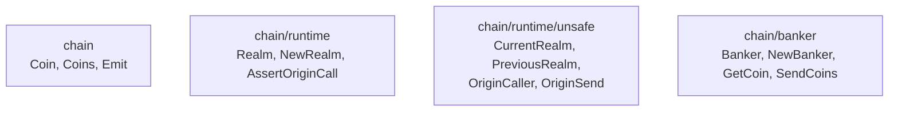

# PR 6230: the docs that show where realm and coin calls live

Generated by deepseek-v4.1-flash.

[PR 6230](https://github.com/gnolang/gno/pull/6230) edits five pages under
`docs/resources/` and no code. Those pages teach a realm author two things: how
to tell which account called the realm, and how to accept a coin payment. Gno
had moved the functions the pages named into different packages, so a reader who
copied an example got code that no longer compiles. The branch repoints every
example at the function's current package, and it rewrites examples
around the newer way to name the caller. The runtime behaviour of any realm is
the same before and after, since no `.gno` file changes.

## What it is for

`docs/resources/` is the material a new realm author reads before writing a
realm, and its code blocks are meant to be copied. Two drifts had made the
copies unusable. Gno split its standard library, so four functions the pages
used had left the packages the pages named. The payment page also showed a
caller check that a malicious user can pass while paying nothing. This branch
sets out to fix both: repoint every example at the package that now holds the
function, and teach the payment check the Gno maintainers ask for.

The change is documentation only; no `.gno` file or behaviour changes.

## How it works today

Gno's standard library grew out of one package called `std`. It is now four
packages, each with its own module boundary. The pages in this PR have to name
the right one.

After, the tree this branch documents: the four packages the split produced and
what each holds.



`chain/runtime/unsafe` is where those four functions now live. Its package
comment says they sit there because they are easy to misuse for caller and
payment checks, and a call site that reads `unsafe.PreviousRealm()` is greppable
as a site that walked the frame stack
([`unsafe.gno:1`](https://github.com/gnolang/gno/blob/7f309e62530ebe047c942e27a4ef99df2737f813/gnovm/stdlibs/chain/runtime/unsafe/unsafe.gno#L1)
· [↗](../../../../.worktrees/gno-review-6230/gnovm/stdlibs/chain/runtime/unsafe/unsafe.gno#L1)).

A realm author does not need those functions for a caller check. The current
language gives every crossing function, one whose first argument is `cur realm`,
a handle on the
realm its frame runs as. Caller identity comes from `cur.Previous()`, the realm
that was current when `cur` was minted. The two ways to reach the same identity
are documented side by side at
[`gno-interrealm.md:654`](https://github.com/gnolang/gno/blob/7f309e62530ebe047c942e27a4ef99df2737f813/docs/resources/gno-interrealm.md#L654)
· [↗](../../../../.worktrees/gno-review-6230/docs/resources/gno-interrealm.md#L654).

Before, at the base, the pages showed the frame-stack calls instead. This was
the access-control example at the base:

```go
import "chain/runtime"

func Foobar() {
	caller := runtime.PreviousRealm().Address()
	if caller != "g1xxxxx" {
		panic("permission denied")
	}
	// ...
}
```

After, the same example takes a crossing function and reads the caller off
`cur`
([`effective-gno.md:111`](https://github.com/gnolang/gno/blob/7f309e62530ebe047c942e27a4ef99df2737f813/docs/resources/effective-gno.md#L111)
· [↗](../../../../.worktrees/gno-review-6230/docs/resources/effective-gno.md#L111)):

```go
func Foobar(cur realm) {
	caller := cur.Previous().Address()
	if caller != "g1xxxxx" {
		panic("permission denied")
	}
	// ...
}
```

The two identities are not interchangeable. `cur.Previous()` names the realm
that called this frame. `unsafe.OriginCaller()` names the account that signed
the transaction, and a malicious realm in
between can act as that account against any check that trusts it. That is why
the pages now send an author to `cur.Previous()` first and reserve
`unsafe.OriginCaller()` for deliberately transaction-level uses.

## What the change does

The change repoints import paths and rewrites examples, file by file. No page
gains a new function, and page titles do not move.

Before, the four introspection functions were listed under `chain/runtime`, and
`OriginSend` sat under `chain/banker`. After, `gno-stdlibs.md` gives them a
section of their own,
[`## chain/runtime/unsafe`](https://github.com/gnolang/gno/blob/7f309e62530ebe047c942e27a4ef99df2737f813/docs/resources/gno-stdlibs.md#L673)
· [↗](../../../../.worktrees/gno-review-6230/docs/resources/gno-stdlibs.md#L673),
and names the current package in every sample, for example
[`unsafe.OriginSend()`](https://github.com/gnolang/gno/blob/7f309e62530ebe047c942e27a4ef99df2737f813/docs/resources/gno-stdlibs.md#L720)
· [↗](../../../../.worktrees/gno-review-6230/docs/resources/gno-stdlibs.md#L720).

Before, `NewBanker` took only the banker type. After, it takes the realm handle
as well, so the caller must hold the live `cur`:
[`NewBanker(bt BankerType, rlm realm)`](https://github.com/gnolang/gno/blob/7f309e62530ebe047c942e27a4ef99df2737f813/docs/resources/gno-stdlibs.md#L749)
· [↗](../../../../.worktrees/gno-review-6230/docs/resources/gno-stdlibs.md#L749).

After, the reference each page gives for a moved symbol:

| Symbol | Before, page said | After, page says |
| --- | --- | --- |
| `PreviousRealm` | `chain/runtime` | `chain/runtime/unsafe` |
| `CurrentRealm` | `chain/runtime` | `chain/runtime/unsafe` |
| `OriginCaller` | `chain/runtime` | `chain/runtime/unsafe` |
| `OriginSend` | `chain/banker` | `chain/runtime/unsafe` |
| `NewBanker` | one argument | two arguments, the second `cur` |

`AssertOriginCall` stays in `chain/runtime`, and the page says so in the payment
section
([`effective-gno.md:844`](https://github.com/gnolang/gno/blob/7f309e62530ebe047c942e27a4ef99df2737f813/docs/resources/effective-gno.md#L844)
· [↗](../../../../.worktrees/gno-review-6230/docs/resources/effective-gno.md#L844)).

After, the payment example pairs the amount check with the caller check:
[`cur.Previous().IsUserCall()`](https://github.com/gnolang/gno/blob/7f309e62530ebe047c942e27a4ef99df2737f813/docs/resources/effective-gno.md#L822)
· [↗](../../../../.worktrees/gno-review-6230/docs/resources/effective-gno.md#L822).
The page explains why `IsUserCall` and not `IsUser`
([`effective-gno.md:832`](https://github.com/gnolang/gno/blob/7f309e62530ebe047c942e27a4ef99df2737f813/docs/resources/effective-gno.md#L832)
· [↗](../../../../.worktrees/gno-review-6230/docs/resources/effective-gno.md#L832)).

Before, `effective-gno.md` captured the deployer with `runtime.OriginCaller()`
inside a plain `init()`. After, the function is a crossing `init(cur realm)` and
captures `cur.Previous().Address()`
([`effective-gno.md:161`](https://github.com/gnolang/gno/blob/7f309e62530ebe047c942e27a4ef99df2737f813/docs/resources/effective-gno.md#L161)
· [↗](../../../../.worktrees/gno-review-6230/docs/resources/effective-gno.md#L161)). Before:

```go
import (
	"chain/runtime"
	"time"
)

func init() {
	created = time.Now()
	// runtime.OriginCaller in the context of realm initialisation is,
	// of course, the publisher of the realm :)
	admin = runtime.OriginCaller()
	// ...
}
```

After:

```go
import "time"

func init(cur realm) {
	created = time.Now()
	// During initialization the previous realm is the publisher of the realm
	// (the EOA that deployed it), so capturing it here is better than
	// hardcoding an admin address as a constant.
	admin = cur.Previous().Address()
	// ...
}
```

After, `realms.md` corrects the `Realm` struct's first field to the built-in
`address` type
([`realms.md:32`](https://github.com/gnolang/gno/blob/7f309e62530ebe047c942e27a4ef99df2737f813/docs/resources/realms.md#L32)
· [↗](../../../../.worktrees/gno-review-6230/docs/resources/realms.md#L32)) and
sends the reader to `chain/runtime/unsafe` for the introspection calls
([`realms.md:68`](https://github.com/gnolang/gno/blob/7f309e62530ebe047c942e27a4ef99df2737f813/docs/resources/realms.md#L68)
· [↗](../../../../.worktrees/gno-review-6230/docs/resources/realms.md#L68)).

After, the two interrealm pages switch prose and code from `runtime.*` to
`unsafe.*`, and to `cur.Previous()` where a `cur` is in scope.
`gno-interrealm-v2.md` also repoints two implementation paths. The `realm`
interface now points at
[`gnovm/pkg/gnolang/uverse.go`](https://github.com/gnolang/gno/blob/7f309e62530ebe047c942e27a4ef99df2737f813/docs/resources/gno-interrealm-v2.md#L777)
· [↗](../../../../.worktrees/gno-review-6230/docs/resources/gno-interrealm-v2.md#L777),
and the frame-stack calls at
[`gnovm/stdlibs/chain/runtime/unsafe/unsafe.gno`](https://github.com/gnolang/gno/blob/7f309e62530ebe047c942e27a4ef99df2737f813/docs/resources/gno-interrealm-v2.md#L775)
· [↗](../../../../.worktrees/gno-review-6230/docs/resources/gno-interrealm-v2.md#L775).

## Concepts

A **package split** moved each function into the package named for the job. The
import path is part of an example, so a repointed import is the whole fix for
the compile error.

A **crossing function** declares `cur realm` as its first parameter. The runtime
hands it a **captured realm value**: a handle on the realm-context at the moment
of the call. `cur.PkgPath()` is the realm the function runs as, and
`cur.Previous()` is the realm that called it. The value cannot be stored past
the transaction, so a realm that needs to remember a caller stores its address
or path string.

**Realm-context** is who is acting. **Realm-storage-context** is who owns the
objects being written. They move together on an explicit cross-call and apart
under an implicit borrow. The docs keep the two apart because a caller check
reads the first and a write guard reads the second.

**Origin caller** is the account that signed the transaction, reachable as
`unsafe.OriginCaller()`. It is Gno's `tx.origin`. A realm called by that account
can act as it against anything that trusts the origin, so an author reaches for
it only when the whole transaction is the subject.

The **send envelope** is the coins attached at the chain root, read as
`unsafe.OriginSend()`. It is not the coins this realm received, and an
intermediary realm can spend it before the check runs. The gate that closes that
hole is `cur.Previous().IsUserCall()`, true only when the immediate caller is a
plain account and not an uploaded realm or a `maketx run` ephemeral realm. The
docs pair the two and show the bypass with `IsUser()`.

## Review files

[The review directory for this PR](https://github.com/samouraiworld/gno-agent-workspace/tree/main/reviews/pr/6xxx/6230-fix-realm-payment-imports)
holds the review's draft, claims and tests.
