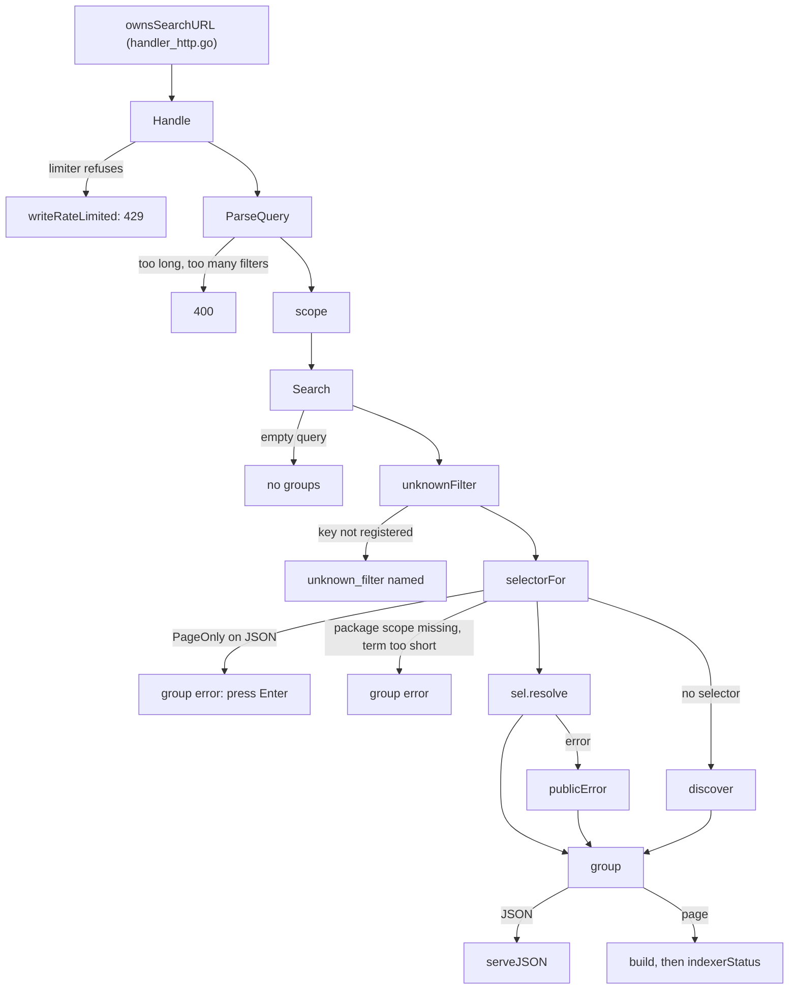

# `-indexer-url` and `feature/omnisearch`: an optional indexer backend for gnoweb search

Generated by claude-opus-5-5, effort high.

PR: [gnolang/gno#6231](https://github.com/gnolang/gno/pull/6231)

## TLDR

Before, the header search bar was a path navigator: on submit,
[`searchUrl`](https://github.com/gnolang/gno/blob/87f0357fe/gno.land/pkg/gnoweb/frontend/js/controller-searchbar.ts#L58-L75) · [↗](../../../../.worktrees/gno-review-6231-base/gno.land/pkg/gnoweb/frontend/js/controller-searchbar.ts#L58)
called `preventDefault` and jumped to a path, and typing only filtered a path
list fetched once from `/search.json`. Now every `<path>$search&q=…` URL
belongs to a new feature module,
[`feature/omnisearch`](https://github.com/alexiscolin/gno/blob/dd40ef3dc/gno.land/pkg/gnoweb/feature/omnisearch/feature.go#L115-L132) · [↗](../../../../.worktrees/gno-review-6231/gno.land/pkg/gnoweb/feature/omnisearch/feature.go#L115),
which answers GitHub-style qualifiers such as `func:Vote` or `tx:<hash>` as a
server-rendered page and as JSON for the dropdown. The qualifiers that need an
index the RPC node lacks exist only when gnoweb starts with
`-indexer-url <tx-indexer GraphQL endpoint>`. Without the flag the
`Deps.Indexer` interface is nil and those qualifiers are never registered.
The change exists because the node cannot answer a transaction by hash, an
account's activity or a text search over deployed source, and an indexer is
off-chain data that must stay optional and labelled.

## What `$search` is

A search box that answers questions about the chain, scoped to the page the
reader is on. On `/r/demo/boards`, typing `func:Vote` lists the functions of
that realm whose name contains `Vote`; typing `deploys` lists the realm's
deploy history when an indexer is configured. Free text with no qualifier
searches realm and package paths. Pressing Enter opens the same answer as a
full page at `/r/demo/boards$search&q=func:Vote`, which works with JavaScript
off.

Each answer is a group of rows, and each group carries where it came from:
`chain` when the RPC node answered, `indexer` when the off-chain indexer did.
An indexer group is tagged as such, and the page footer names the indexer URL
and the last block it has indexed.

The qualifiers, from the head's registration tables. Selector order and
fields come from
[`chainSelectors`](https://github.com/alexiscolin/gno/blob/dd40ef3dc/gno.land/pkg/gnoweb/feature/omnisearch/resolve_chain.go#L17-L74) · [↗](../../../../.worktrees/gno-review-6231/gno.land/pkg/gnoweb/feature/omnisearch/resolve_chain.go#L17)
and
[`indexerSelectors`](https://github.com/alexiscolin/gno/blob/dd40ef3dc/gno.land/pkg/gnoweb/feature/omnisearch/resolve_indexer.go#L20-L129) · [↗](../../../../.worktrees/gno-review-6231/gno.land/pkg/gnoweb/feature/omnisearch/resolve_indexer.go#L20).
This table describes the after.

| Typed as | Label | Source | Needs a package scope | Page only | Minimum term |
| --- | --- | --- | --- | --- | --- |
| `render:<text>` | Rendered content | chain | no, but refuses without `author:` or `in:` | [yes](https://github.com/alexiscolin/gno/blob/dd40ef3dc/gno.land/pkg/gnoweb/feature/omnisearch/resolve_render.go#L35) | [3](https://github.com/alexiscolin/gno/blob/dd40ef3dc/gno.land/pkg/gnoweb/feature/omnisearch/resolve_render.go#L36) |
| `func:<name>` | Functions | chain | [yes](https://github.com/alexiscolin/gno/blob/dd40ef3dc/gno.land/pkg/gnoweb/feature/omnisearch/resolve_chain.go#L24) | no | 2 |
| `type:<name>` | Types | chain | [yes](https://github.com/alexiscolin/gno/blob/dd40ef3dc/gno.land/pkg/gnoweb/feature/omnisearch/resolve_chain.go#L33) | no | 2 |
| `file:<name>` | Files | chain | [yes](https://github.com/alexiscolin/gno/blob/dd40ef3dc/gno.land/pkg/gnoweb/feature/omnisearch/resolve_chain.go#L42) | no | 2 |
| `state:<name>` | State | chain | [yes](https://github.com/alexiscolin/gno/blob/dd40ef3dc/gno.land/pkg/gnoweb/feature/omnisearch/resolve_chain.go#L52) | no | 2 |
| `imports` | Imports | chain | [yes](https://github.com/alexiscolin/gno/blob/dd40ef3dc/gno.land/pkg/gnoweb/feature/omnisearch/resolve_chain.go#L66) | no | none, bare word |
| `tx:<hash>` | Transaction | indexer | [no](https://github.com/alexiscolin/gno/blob/dd40ef3dc/gno.land/pkg/gnoweb/feature/omnisearch/resolve_indexer.go#L26) | no | 2 |
| `account:<address>` | Account activity | indexer | [no](https://github.com/alexiscolin/gno/blob/dd40ef3dc/gno.land/pkg/gnoweb/feature/omnisearch/resolve_indexer.go#L39) | no | 2 |
| `block:<height>` | Block | indexer | [no](https://github.com/alexiscolin/gno/blob/dd40ef3dc/gno.land/pkg/gnoweb/feature/omnisearch/resolve_indexer.go#L52) | no | 2 |
| `activity` | Recent activity | indexer | [yes](https://github.com/alexiscolin/gno/blob/dd40ef3dc/gno.land/pkg/gnoweb/feature/omnisearch/resolve_indexer.go#L77) | no | none, bare word |
| `deploys` | Deploy history | indexer | [yes](https://github.com/alexiscolin/gno/blob/dd40ef3dc/gno.land/pkg/gnoweb/feature/omnisearch/resolve_indexer.go#L91) | no | none, bare word |
| `content:<text>` | Source code | indexer | [no](https://github.com/alexiscolin/gno/blob/dd40ef3dc/gno.land/pkg/gnoweb/feature/omnisearch/resolve_indexer.go#L107) | [yes](https://github.com/alexiscolin/gno/blob/dd40ef3dc/gno.land/pkg/gnoweb/feature/omnisearch/resolve_indexer.go#L111) | [4](https://github.com/alexiscolin/gno/blob/dd40ef3dc/gno.land/pkg/gnoweb/feature/omnisearch/resolve_indexer.go#L110) |
| `importers` | Imported by | indexer | [yes](https://github.com/alexiscolin/gno/blob/dd40ef3dc/gno.land/pkg/gnoweb/feature/omnisearch/resolve_indexer.go#L120) | [yes](https://github.com/alexiscolin/gno/blob/dd40ef3dc/gno.land/pkg/gnoweb/feature/omnisearch/resolve_indexer.go#L123) | none, bare word |

The "2" cells are the global floor,
[`MinTermLen = 2`](https://github.com/alexiscolin/gno/blob/dd40ef3dc/gno.land/pkg/gnoweb/feature/omnisearch/query.go#L23) · [↗](../../../../.worktrees/gno-review-6231/gno.land/pkg/gnoweb/feature/omnisearch/query.go#L23),
which a selector with no `MinTerm` of its own falls back to. Three narrowing
keywords refine any query without choosing what is searched:
[`author:`, `in:` and `is:`](https://github.com/alexiscolin/gno/blob/dd40ef3dc/gno.land/pkg/gnoweb/feature/omnisearch/selector.go#L35-L39) · [↗](../../../../.worktrees/gno-review-6231/gno.land/pkg/gnoweb/feature/omnisearch/selector.go#L35).

## How it works, in 6 steps

One example runs through every step: a reader on `/r/demo/boards` types
`func:Vote` into the header bar. Every step describes the after.

1. **The browser decides who answers.** The controller's
   [`isQualified`](https://github.com/alexiscolin/gno/blob/dd40ef3dc/gno.land/pkg/gnoweb/frontend/js/controller-searchbar.ts#L242-L252) · [↗](../../../../.worktrees/gno-review-6231/gno.land/pkg/gnoweb/frontend/js/controller-searchbar.ts#L242)
   sees the token `func:Vote`, whose key is a bare word, so the server has to
   answer. Plain text such as `boards` still filters the `/search.json` list
   locally with no request per keystroke. A qualified query waits
   [220 ms](https://github.com/alexiscolin/gno/blob/dd40ef3dc/gno.land/pkg/gnoweb/frontend/js/controller-searchbar.ts#L56)
   after the last keystroke, plain text
   [120 ms](https://github.com/alexiscolin/gno/blob/dd40ef3dc/gno.land/pkg/gnoweb/frontend/js/controller-searchbar.ts#L53).
2. **The browser asks the scoped URL.**
   [`fetchSearch`](https://github.com/alexiscolin/gno/blob/dd40ef3dc/gno.land/pkg/gnoweb/frontend/js/controller-searchbar.ts#L289-L309) · [↗](../../../../.worktrees/gno-review-6231/gno.land/pkg/gnoweb/frontend/js/controller-searchbar.ts#L289)
   requests `/r/demo/boards$search&q=func%3AVote&json`. A 404 sets
   `searchAvailable = false` and the controller never asks again on that page.
3. **gnoweb routes it to the feature.**
   [`ownsSearchURL`](https://github.com/alexiscolin/gno/blob/dd40ef3dc/gno.land/pkg/gnoweb/handler_http.go#L1336-L1338) · [↗](../../../../.worktrees/gno-review-6231/gno.land/pkg/gnoweb/handler_http.go#L1336)
   claims any URL carrying the `search` web flag without `state`, and the
   handler calls
   [`h.Search.Handle`](https://github.com/alexiscolin/gno/blob/dd40ef3dc/gno.land/pkg/gnoweb/handler_http.go#L383-L387) · [↗](../../../../.worktrees/gno-review-6231/gno.land/pkg/gnoweb/handler_http.go#L383).
4. **The feature parses and scopes the query.**
   [`Handle`](https://github.com/alexiscolin/gno/blob/dd40ef3dc/gno.land/pkg/gnoweb/feature/omnisearch/handler.go#L28-L55) · [↗](../../../../.worktrees/gno-review-6231/gno.land/pkg/gnoweb/feature/omnisearch/handler.go#L28)
   applies the rate limiter, runs `ParseQuery` into
   `Filters = [{Key: "func", Value: "Vote"}]`, and
   [`scope`](https://github.com/alexiscolin/gno/blob/dd40ef3dc/gno.land/pkg/gnoweb/feature/omnisearch/handler.go#L68-L86) · [↗](../../../../.worktrees/gno-review-6231/gno.land/pkg/gnoweb/feature/omnisearch/handler.go#L68)
   sets `PkgPath = "/r/demo/boards"` and
   `ChainPath = "gno.land/r/demo/boards"`. The JSON path gets a
   [3 s budget](https://github.com/alexiscolin/gno/blob/dd40ef3dc/gno.land/pkg/gnoweb/feature/omnisearch/handler.go#L23),
   the page [6 s](https://github.com/alexiscolin/gno/blob/dd40ef3dc/gno.land/pkg/gnoweb/feature/omnisearch/handler.go#L22).
5. **Exactly one selector runs.**
   [`Search`](https://github.com/alexiscolin/gno/blob/dd40ef3dc/gno.land/pkg/gnoweb/feature/omnisearch/handler.go#L118-L172) · [↗](../../../../.worktrees/gno-review-6231/gno.land/pkg/gnoweb/feature/omnisearch/handler.go#L118)
   picks `func` through `selectorFor`, and its resolver
   [`resolveFuncs`](https://github.com/alexiscolin/gno/blob/dd40ef3dc/gno.land/pkg/gnoweb/feature/omnisearch/resolve_chain.go#L127-L159) · [↗](../../../../.worktrees/gno-review-6231/gno.land/pkg/gnoweb/feature/omnisearch/resolve_chain.go#L127)
   reads the realm's `qdoc` once through a singleflight group and keeps each
   function whose name contains `vote`, case-insensitively.
6. **The answer goes back as JSON, or as a page on Enter.**
   [`serveJSON`](https://github.com/alexiscolin/gno/blob/dd40ef3dc/gno.land/pkg/gnoweb/feature/omnisearch/json.go#L61) · [↗](../../../../.worktrees/gno-review-6231/gno.land/pkg/gnoweb/feature/omnisearch/json.go#L61)
   writes the body below, and the controller draws one group, tagging rows
   whose group says `"source": "indexer"`.

The response in step 6, after the change. The keys come from the struct tags
of
[`jsonResponse`](https://github.com/alexiscolin/gno/blob/dd40ef3dc/gno.land/pkg/gnoweb/feature/omnisearch/json.go#L44-L57) · [↗](../../../../.worktrees/gno-review-6231/gno.land/pkg/gnoweb/feature/omnisearch/json.go#L44);
the values are illustrative, not captured from a running node.

```json
{
  "query": "func:Vote",
  "pkg_path": "/r/demo/boards",
  "selectors": [
    { "name": "func", "hint": "func:<name>", "label": "Functions",
      "scope": "package", "source": "chain" }
  ],
  "groups": [
    { "label": "Functions", "source": "chain",
      "results": [
        { "title": "func Vote(...)", "detail": "first line of its doc",
          "href": "<source view link to the declaration>",
          "tags": ["crossing", "action"] }
      ] }
  ]
}
```

`selectors` comes back on every response, the empty-query probe included,
so the dropdown's hint list is whatever this deployment registered: with no
indexer it never offers `tx:`.

## The parts, at a glance

Every row is a file the change adds or touches, as it stands after.

| Part | File | Job |
| --- | --- | --- |
| `-indexer-url` flag | [`cmd/gnoweb/main.go#L157-L161`](https://github.com/alexiscolin/gno/blob/dd40ef3dc/gno.land/cmd/gnoweb/main.go#L157-L161) · [↗](../../../../.worktrees/gno-review-6231/gno.land/cmd/gnoweb/main.go#L157) | Reads the endpoint; empty by default. The bearer token comes only from `GNOWEB_INDEXER_TOKEN`, [read at L309](https://github.com/alexiscolin/gno/blob/dd40ef3dc/gno.land/cmd/gnoweb/main.go#L309). |
| Guarded construction | [`app.go#L193-L196`](https://github.com/alexiscolin/gno/blob/dd40ef3dc/gno.land/pkg/gnoweb/app.go#L193-L196) · [↗](../../../../.worktrees/gno-review-6231/gno.land/pkg/gnoweb/app.go#L193) | Builds `indexer.New` only inside `if cfg.IndexerURL != ""`, so the interface stays nil otherwise. |
| `$search` dispatch | [`handler_http.go#L211-L221`](https://github.com/alexiscolin/gno/blob/dd40ef3dc/gno.land/pkg/gnoweb/handler_http.go#L211-L221) · [↗](../../../../.worktrees/gno-review-6231/gno.land/pkg/gnoweb/handler_http.go#L211) | Builds `omnisearch.New` with the shared directory, the indexer and its own rate-limit bucket. |
| Selector registry | [`feature.go#L127-L130`](https://github.com/alexiscolin/gno/blob/dd40ef3dc/gno.land/pkg/gnoweb/feature/omnisearch/feature.go#L127-L130) · [↗](../../../../.worktrees/gno-review-6231/gno.land/pkg/gnoweb/feature/omnisearch/feature.go#L127) | Registers chain selectors always, indexer selectors only when `deps.Indexer != nil`, stamping `Source` from the table. |
| Query grammar | [`query.go#L75`](https://github.com/alexiscolin/gno/blob/dd40ef3dc/gno.land/pkg/gnoweb/feature/omnisearch/query.go#L75) · [↗](../../../../.worktrees/gno-review-6231/gno.land/pkg/gnoweb/feature/omnisearch/query.go#L75) | `ParseQuery` splits qualifiers from free text and enforces `MaxQueryLen = 256` and `MaxFilters = 8`. |
| Dispatcher | [`handler.go#L118-L172`](https://github.com/alexiscolin/gno/blob/dd40ef3dc/gno.land/pkg/gnoweb/feature/omnisearch/handler.go#L118-L172) · [↗](../../../../.worktrees/gno-review-6231/gno.land/pkg/gnoweb/feature/omnisearch/handler.go#L118) | Picks one selector, applies `PageOnly`, scope and floor checks, and maps errors to fixed phrases. |
| Discovery search | [`discover.go#L16`](https://github.com/alexiscolin/gno/blob/dd40ef3dc/gno.land/pkg/gnoweb/feature/omnisearch/discover.go#L16) · [↗](../../../../.worktrees/gno-review-6231/gno.land/pkg/gnoweb/feature/omnisearch/discover.go#L16) | Answers a query with no selector from the same path listing `/search.json` uses. |
| Chain resolvers | [`resolve_chain.go`](https://github.com/alexiscolin/gno/blob/dd40ef3dc/gno.land/pkg/gnoweb/feature/omnisearch/resolve_chain.go#L17) · [↗](../../../../.worktrees/gno-review-6231/gno.land/pkg/gnoweb/feature/omnisearch/resolve_chain.go#L17), [`resolve_render.go`](https://github.com/alexiscolin/gno/blob/dd40ef3dc/gno.land/pkg/gnoweb/feature/omnisearch/resolve_render.go#L43) · [↗](../../../../.worktrees/gno-review-6231/gno.land/pkg/gnoweb/feature/omnisearch/resolve_render.go#L43) | Answer from `qdoc`, the file listing, `feature/state` and `Render` output. |
| Indexer resolvers | [`resolve_indexer.go`](https://github.com/alexiscolin/gno/blob/dd40ef3dc/gno.land/pkg/gnoweb/feature/omnisearch/resolve_indexer.go#L20) · [↗](../../../../.worktrees/gno-review-6231/gno.land/pkg/gnoweb/feature/omnisearch/resolve_indexer.go#L20) | Turn indexer transactions into rows linking the package each one touched. |
| GraphQL transport | [`indexer/client.go#L122-L139`](https://github.com/alexiscolin/gno/blob/dd40ef3dc/gno.land/pkg/gnoweb/indexer/client.go#L122-L139) · [↗](../../../../.worktrees/gno-review-6231/gno.land/pkg/gnoweb/indexer/client.go#L122) | `Query` with a breaker, 16 concurrent slots, a 4 s timeout and an 8 MiB response cap. |
| Typed queries | [`indexer/queries.go#L263`](https://github.com/alexiscolin/gno/blob/dd40ef3dc/gno.land/pkg/gnoweb/indexer/queries.go#L263) · [↗](../../../../.worktrees/gno-review-6231/gno.land/pkg/gnoweb/indexer/queries.go#L263) | `recent` walks height bands downward from the tip, since tx-indexer [takes no limit](https://github.com/gnolang/tx-indexer/blob/57b1b385c928a55df1dd71415f54d3e11f44f3b6/serve/graph/all.resolvers.go#L199). |
| Omnibar | [`controller-searchbar.ts`](https://github.com/alexiscolin/gno/blob/dd40ef3dc/gno.land/pkg/gnoweb/frontend/js/controller-searchbar.ts#L203) · [↗](../../../../.worktrees/gno-review-6231/gno.land/pkg/gnoweb/frontend/js/controller-searchbar.ts#L203) | Sends qualified queries to `$search&json`, filters plain text locally, renders groups. |
| Results page | [`templates/page.html`](https://github.com/alexiscolin/gno/blob/dd40ef3dc/gno.land/pkg/gnoweb/feature/omnisearch/templates/page.html) · [↗](../../../../.worktrees/gno-review-6231/gno.land/pkg/gnoweb/feature/omnisearch/templates/page.html) | The no-JavaScript view, with the indexer footer. |
| Design record | [`adr/pr6231_gnoweb_indexer.md`](https://github.com/alexiscolin/gno/blob/dd40ef3dc/gno.land/adr/pr6231_gnoweb_indexer.md?plain=1#L1) · [↗](../../../../.worktrees/gno-review-6231/gno.land/adr/pr6231_gnoweb_indexer.md) | States the constraints, the bounds and the rejected alternatives. |

## Before and after, in the parts gnoweb already had

One row per place existing behaviour enters. The left column is the base,
the right column the head.

| Entry | Before | After |
| --- | --- | --- |
| Pressing Enter in the header bar | The bar jumps to a path or does nothing, through [`searchUrl`](https://github.com/gnolang/gno/blob/87f0357fe/gno.land/pkg/gnoweb/frontend/js/controller-searchbar.ts#L58-L75) calling `preventDefault` first | A qualified query, or free text naming no path, opens `<path>$search&q=…`, through [`searchUrl`](https://github.com/alexiscolin/gno/blob/dd40ef3dc/gno.land/pkg/gnoweb/frontend/js/controller-searchbar.ts#L131-L137); a path still navigates |
| The header form without JavaScript | The form submits nowhere useful, through [`header.html#L14`](https://github.com/gnolang/gno/blob/87f0357fe/gno.land/pkg/gnoweb/components/layouts/header.html#L14) carrying no `method`, `action` or input `name` | The form GETs the results page with `?q=`, through [`header.html#L18-L23`](https://github.com/alexiscolin/gno/blob/dd40ef3dc/gno.land/pkg/gnoweb/components/layouts/header.html#L18-L23) and `HeaderData.SearchAction` |
| Typing a qualifier | The text filters the path list locally, through [`/search.json`](https://github.com/gnolang/gno/blob/87f0357fe/gno.land/pkg/gnoweb/frontend/js/controller-searchbar.ts#L130) | The server answers the qualifier, through [`fetchSearch`](https://github.com/alexiscolin/gno/blob/dd40ef3dc/gno.land/pkg/gnoweb/frontend/js/controller-searchbar.ts#L289-L309) |
| Path listing size | The [node's default of 1000](https://github.com/gnolang/gno/blob/87f0357fe/gno.land/pkg/sdk/vm/handler.go#L200) per kind governs, through [`ListPaths`](https://github.com/gnolang/gno/blob/87f0357fe/gno.land/pkg/gnoweb/client.go#L230-L234) dropping its `limit` | 10000 per kind is requested, through [`ListPaths`](https://github.com/alexiscolin/gno/blob/dd40ef3dc/gno.land/pkg/gnoweb/client.go#L237-L239) appending `?limit=`, and a listing at the cap reports [`Truncated`](https://github.com/alexiscolin/gno/blob/dd40ef3dc/gno.land/pkg/gnoweb/realm_directory.go#L156) |
| `$state&json` handling | JSON chrome is skipped for `state` only | JSON chrome is skipped for `state` or `search`, through [`isFeatureJSONRequest`](https://github.com/alexiscolin/gno/blob/dd40ef3dc/gno.land/pkg/gnoweb/handler_http.go#L1345-L1355) |
| Rate limit fallback | A non-positive setting falls back to [100 per minute](https://github.com/gnolang/gno/blob/87f0357fe/gno.land/pkg/gnoweb/handler_http.go#L110) | A non-positive setting falls back to [1200 per minute](https://github.com/alexiscolin/gno/blob/dd40ef3dc/gno.land/pkg/gnoweb/handler_http.go#L126); [`NewDefaultAppConfig`](https://github.com/alexiscolin/gno/blob/dd40ef3dc/gno.land/pkg/gnoweb/app.go#L116) still sets 100, and the binary starts from it at [`main.go#L295`](https://github.com/alexiscolin/gno/blob/dd40ef3dc/gno.land/cmd/gnoweb/main.go#L295) |
| Which address is rate-limited | `feature/state` extracts the address itself | Each limiter extracts it with its own trusted proxies, through [`IPLimiter.AllowRequest`](https://github.com/alexiscolin/gno/blob/dd40ef3dc/gno.land/pkg/gnoweb/feature/state/ratelimit.go#L116-L121), settable by `-trusted-proxies` |
| `Namespace()` on `/r/a/b` | Returns `"a/b"`, through [`idx > 1`](https://github.com/gnolang/gno/blob/87f0357fe/gno.land/pkg/gnoweb/weburl/url.go#L282) | Returns `"a"`, through [`idx > 0`](https://github.com/alexiscolin/gno/blob/dd40ef3dc/gno.land/pkg/gnoweb/weburl/url.go#L284) |

## How the dispatcher works

The request path through `Handle`, after the change. Each node is a function
in `feature/omnisearch` unless named otherwise.



- [`ownsSearchURL`](https://github.com/alexiscolin/gno/blob/dd40ef3dc/gno.land/pkg/gnoweb/handler_http.go#L1336-L1338) · [↗](../../../../.worktrees/gno-review-6231/gno.land/pkg/gnoweb/handler_http.go#L1336)
  decides the feature owns the URL: `search` present, `state` absent, so
  `$state&search=` stays with `feature/state`.
- [`Handle`](https://github.com/alexiscolin/gno/blob/dd40ef3dc/gno.land/pkg/gnoweb/feature/omnisearch/handler.go#L31-L33) · [↗](../../../../.worktrees/gno-review-6231/gno.land/pkg/gnoweb/feature/omnisearch/handler.go#L31)
  decides admission before any fetch, then JSON against page by the `json`
  web flag.
- [`scope`](https://github.com/alexiscolin/gno/blob/dd40ef3dc/gno.land/pkg/gnoweb/feature/omnisearch/handler.go#L76-L80) · [↗](../../../../.worktrees/gno-review-6231/gno.land/pkg/gnoweb/feature/omnisearch/handler.go#L76)
  decides the package: `in:` when given, else the URL's path when it is a
  realm or pure package.
- [`unknownFilter`](https://github.com/alexiscolin/gno/blob/dd40ef3dc/gno.land/pkg/gnoweb/feature/omnisearch/handler.go#L199-L210) · [↗](../../../../.worktrees/gno-review-6231/gno.land/pkg/gnoweb/feature/omnisearch/handler.go#L199)
  decides whether a key is a typo. With no indexer, `tx:abc` lands here and
  is reported as an unknown qualifier, never as a missing transaction.
- [`selectorFor`](https://github.com/alexiscolin/gno/blob/dd40ef3dc/gno.land/pkg/gnoweb/feature/omnisearch/handler.go#L175-L194) · [↗](../../../../.worktrees/gno-review-6231/gno.land/pkg/gnoweb/feature/omnisearch/handler.go#L175)
  decides the one selector: the first registered `key:value`, else a bare
  word such as `deploys`. With no indexer a bare `deploys` matches nothing
  and falls through to `discover` as free text.
- [`Search`](https://github.com/alexiscolin/gno/blob/dd40ef3dc/gno.land/pkg/gnoweb/feature/omnisearch/handler.go#L133-L140) · [↗](../../../../.worktrees/gno-review-6231/gno.land/pkg/gnoweb/feature/omnisearch/handler.go#L133)
  decides `PageOnly` selectors never run on the JSON path, so `render:`,
  `content:` and `importers` answer only a committed navigation.
- [`publicError`](https://github.com/alexiscolin/gno/blob/dd40ef3dc/gno.land/pkg/gnoweb/feature/omnisearch/handler.go#L253-L276) · [↗](../../../../.worktrees/gno-review-6231/gno.land/pkg/gnoweb/feature/omnisearch/handler.go#L253)
  decides what a visitor reads of a failure: one of `timed out`, `not found`,
  `response too large`, `indexer unavailable` or `chain node unavailable`.
  An `inputError` from a resolver passes through as written.
- [`indexerStatus`](https://github.com/alexiscolin/gno/blob/dd40ef3dc/gno.land/pkg/gnoweb/feature/omnisearch/handler.go#L214-L238) · [↗](../../../../.worktrees/gno-review-6231/gno.land/pkg/gnoweb/feature/omnisearch/handler.go#L214)
  decides whether to ask the indexer for its tip: only when an indexer group
  ran.

## How the indexer client bounds a query

Every indexer call goes through
[`Client.Query`](https://github.com/alexiscolin/gno/blob/dd40ef3dc/gno.land/pkg/gnoweb/indexer/client.go#L122-L139) · [↗](../../../../.worktrees/gno-review-6231/gno.land/pkg/gnoweb/indexer/client.go#L122).
These lines are the after; the package is new.

```go
func (c *Client) Query(ctx context.Context, query string, out any) error {
	if c.breakerOpen() {
		return ErrUnavailable
	}

	if err := c.acquire(ctx); err != nil {
		return err
	}
	err := c.do(ctx, query, out)
	c.release()

	// A miss, a cap and a caller giving up say nothing about the indexer's
	// health. A deadline does, and is the signal the breaker acts on.
	if !errors.Is(err, ErrNotFound) && !errors.Is(err, ErrTooLarge) && !errors.Is(err, context.Canceled) {
		c.record(err)
	}
	return err
}
```

- The breaker opens after
  [3 consecutive failures](https://github.com/alexiscolin/gno/blob/dd40ef3dc/gno.land/pkg/gnoweb/indexer/client.go#L53)
  and stays open for
  [30 s](https://github.com/alexiscolin/gno/blob/dd40ef3dc/gno.land/pkg/gnoweb/indexer/client.go#L54),
  answering `ErrUnavailable` with no request.
- [16 slots](https://github.com/alexiscolin/gno/blob/dd40ef3dc/gno.land/pkg/gnoweb/indexer/client.go#L58)
  cap requests in flight, each with a
  [4 s timeout](https://github.com/alexiscolin/gno/blob/dd40ef3dc/gno.land/pkg/gnoweb/indexer/client.go#L45)
  and a body read stopped at
  [8 MiB](https://github.com/alexiscolin/gno/blob/dd40ef3dc/gno.land/pkg/gnoweb/indexer/client.go#L49).
- The chain tip is cached for
  [5 s](https://github.com/alexiscolin/gno/blob/dd40ef3dc/gno.land/pkg/gnoweb/indexer/queries.go#L84)
  and fetched through one singleflight group.

tx-indexer's `getTransactions`
[takes no limit](https://github.com/gnolang/tx-indexer/blob/57b1b385c928a55df1dd71415f54d3e11f44f3b6/serve/graph/all.resolvers.go#L199),
only a filter and an order, so
[`recent`](https://github.com/alexiscolin/gno/blob/dd40ef3dc/gno.land/pkg/gnoweb/indexer/queries.go#L263-L323) · [↗](../../../../.worktrees/gno-review-6231/gno.land/pkg/gnoweb/indexer/queries.go#L263)
bounds each query by block height. It starts with a
[2000-block band](https://github.com/alexiscolin/gno/blob/dd40ef3dc/gno.land/pkg/gnoweb/indexer/queries.go#L245)
under the tip, multiplies the width by
[8](https://github.com/alexiscolin/gno/blob/dd40ef3dc/gno.land/pkg/gnoweb/indexer/queries.go#L246)
for each band below, and stops after
[4 bands](https://github.com/alexiscolin/gno/blob/dd40ef3dc/gno.land/pkg/gnoweb/indexer/queries.go#L248),
at genesis, once it has enough rows, or when less than
[900 ms](https://github.com/alexiscolin/gno/blob/dd40ef3dc/gno.land/pkg/gnoweb/indexer/queries.go#L252)
of the caller's deadline remains. The bands for two chain heights, after the
change. The numbers come from a Python mirror of the loop's bound arithmetic,
run against the mirrored source, not against the project's tests.

| Tip | Band 1 | Band 2 | Band 3 | Band 4 | Blocks reachable |
| --- | --- | --- | --- | --- | --- |
| 1,500,000 | 1,498,001 to 1,500,000 | 1,482,001 to 1,498,000 | 1,354,001 to 1,482,000 | 330,001 to 1,354,000 | 1,170,000 |
| 50,000 | 48,001 to 50,000 | 32,001 to 48,000 | 0 to 32,000, genesis | none | 50,001 |

A band hitting the indexer's element cap returns the rows it has, which are
the newest. A band failing after earlier bands found rows also keeps those
rows.

## Read the code in this order

1. [`app.go#L190-L196`](https://github.com/alexiscolin/gno/blob/dd40ef3dc/gno.land/pkg/gnoweb/app.go#L190-L196) · [↗](../../../../.worktrees/gno-review-6231/gno.land/pkg/gnoweb/app.go#L190).
   The whole switch. Assigning a typed nil pointer outside the branch would
   make the interface non-nil, and every indexer selector would register and
   then fail.
   ```go
   if cfg.IndexerURL != "" {
   	logger.Info("indexer enabled", "url", cfg.IndexerURL)
   	handlerCfg.Indexer = indexer.New(cfg.IndexerURL, cfg.IndexerToken)
   }
   ```
2. [`feature.go#L115-L142`](https://github.com/alexiscolin/gno/blob/dd40ef3dc/gno.land/pkg/gnoweb/feature/omnisearch/feature.go#L115-L142) · [↗](../../../../.worktrees/gno-review-6231/gno.land/pkg/gnoweb/feature/omnisearch/feature.go#L115).
   Where the nil interface becomes absent qualifiers, and where `Source` is
   stamped. A selector registered in the wrong table would claim the wrong
   provenance on every row.
   ```go
   h.register(SourceChain, chainSelectors()...)
   if deps.Indexer != nil {
   	h.register(SourceIndexer, indexerSelectors()...)
   }
   ```
3. [`handler_http.go#L1336-L1355`](https://github.com/alexiscolin/gno/blob/dd40ef3dc/gno.land/pkg/gnoweb/handler_http.go#L1336-L1355) · [↗](../../../../.worktrees/gno-review-6231/gno.land/pkg/gnoweb/handler_http.go#L1336).
   Which URLs the feature owns, and which skip the page chrome. A wrong rule
   here sends `$state&search=` to the search feature, or wraps JSON in HTML.
   ```go
   func ownsSearchURL(wq url.Values) bool {
   	return wq.Has("search") && !wq.Has("state")
   }
   ```
4. [`handler.go#L118-L172`](https://github.com/alexiscolin/gno/blob/dd40ef3dc/gno.land/pkg/gnoweb/feature/omnisearch/handler.go#L118-L172) · [↗](../../../../.worktrees/gno-review-6231/gno.land/pkg/gnoweb/feature/omnisearch/handler.go#L118).
   The dispatcher and its cost gates. A missing `PageOnly` check would run a
   fan-out selector on every debounced keystroke.
   ```go
   if sel.PageOnly && q.jsonPath {
   	// A fan-out selector costs one navigation, never one per keystroke.
   ```
5. [`indexer/client.go#L122-L139`](https://github.com/alexiscolin/gno/blob/dd40ef3dc/gno.land/pkg/gnoweb/indexer/client.go#L122-L139) · [↗](../../../../.worktrees/gno-review-6231/gno.land/pkg/gnoweb/indexer/client.go#L122)
   and
   [`indexer/queries.go#L263-L323`](https://github.com/alexiscolin/gno/blob/dd40ef3dc/gno.land/pkg/gnoweb/indexer/queries.go#L263-L323) · [↗](../../../../.worktrees/gno-review-6231/gno.land/pkg/gnoweb/indexer/queries.go#L263).
   The transport and the height bands. A breaker counting misses as failures
   would take a healthy indexer offline for 30 s after three typos.
6. [`controller-searchbar.ts#L242-L309`](https://github.com/alexiscolin/gno/blob/dd40ef3dc/gno.land/pkg/gnoweb/frontend/js/controller-searchbar.ts#L242-L309) · [↗](../../../../.worktrees/gno-review-6231/gno.land/pkg/gnoweb/frontend/js/controller-searchbar.ts#L242).
   What the browser treats as a qualifier. It must agree with the server's
   `isQualifierKey`, or Enter on a path such as `/r/gnoland/pages:p/about`
   searches instead of navigating.
   ```ts
   static isQualifierToken(token: string): boolean {
   	const at = token.indexOf(":");
   	// An object ID led by a hex letter has a bare-word key too.
   	if (at < 0 || OID_PATTERN.test(token)) return false;
   	if (token.slice(at + 1).startsWith("//")) return false;
   	return /^[a-z][a-z0-9_-]*$/.test(token.slice(0, at).toLowerCase());
   }
   ```

## What a user notices

Each effect is after the change.

- **A results page exists at `<path>$search&q=…`**, on every gnoweb whatever
  its flags. Chain qualifiers answer with no indexer configured.
- **Indexer qualifiers appear only where the deployment sets
  `-indexer-url`.** The scope is the gnoweb instance: every reader of that
  instance sees the same hint list, read from `selectors` in each response.
- **Indexer rows carry an `indexer` tag.** The results page footer names the
  indexer URL and its last indexed block, on any page where an indexer group
  ran.
- **Enter on free text opens the results page** in every browser running the
  controller. Enter on a path, a `gno.land` link or a URL still navigates,
  through
  [`isPathLike`](https://github.com/alexiscolin/gno/blob/dd40ef3dc/gno.land/pkg/gnoweb/frontend/js/controller-searchbar.ts#L143-L153) · [↗](../../../../.worktrees/gno-review-6231/gno.land/pkg/gnoweb/frontend/js/controller-searchbar.ts#L143).
- **With JavaScript off, a path typed in the bar is searched, not visited**,
  since the plain form can only GET the results page; the page then lists
  matching paths.
- **`render:`, `content:` and `importers` in the dropdown show "press
  Enter"** instead of results, per query, since `PageOnly` keeps them off the
  JSON path.
- **A 429 answers a reader over the limit**, per client address as the
  limiter resolves it: the direct peer, or the `X-Real-IP` a proxy listed in
  `-trusted-proxies` sends. The search feature keeps a bucket separate from
  the state explorer's.

## Upgrading

The change adds settings and moves one default. Each row is the after.

| Setting | Default | Effect |
| --- | --- | --- |
| [`-indexer-url`](https://github.com/alexiscolin/gno/blob/dd40ef3dc/gno.land/cmd/gnoweb/main.go#L157-L161) | empty | Empty registers no indexer qualifier and makes no outbound request beyond the RPC node. |
| [`GNOWEB_INDEXER_TOKEN`](https://github.com/alexiscolin/gno/blob/dd40ef3dc/gno.land/cmd/gnoweb/main.go#L309) | unset | Sent as a bearer credential to the indexer; environment only. |
| [`-trusted-proxies`](https://github.com/alexiscolin/gno/blob/dd40ef3dc/gno.land/cmd/gnoweb/main.go#L172-L175) | empty | Comma-separated CIDRs or IPs whose `X-Real-IP` the rate limiters believe; empty trusts nothing. |
| [`defaultRateLimitPerMinute`](https://github.com/alexiscolin/gno/blob/dd40ef3dc/gno.land/pkg/gnoweb/handler_http.go#L126) | 1200 | Applies when `StateRateLimitPerMinute` is 0 or less; [`NewDefaultAppConfig`](https://github.com/alexiscolin/gno/blob/dd40ef3dc/gno.land/pkg/gnoweb/app.go#L116) sets 100. |
| [`searchPathLimit`](https://github.com/alexiscolin/gno/blob/dd40ef3dc/gno.land/pkg/gnoweb/realm_directory.go#L47) | 10000 | Now forwarded to `vm/qpaths`, so `/search.json` can return up to 10000 paths per kind where the base returned at most 1000. |

`RealmDirectory.Paths` now returns a
[`PathsResult`](https://github.com/alexiscolin/gno/blob/dd40ef3dc/gno.land/pkg/gnoweb/realm_directory.go#L18-L28) · [↗](../../../../.worktrees/gno-review-6231/gno.land/pkg/gnoweb/realm_directory.go#L18)
struct, so a caller of the base's three-value signature no longer compiles.

## Words used here

| Name | What it is |
| --- | --- |
| `$search` | The web flag the feature owns: any gnoweb URL whose `$` part carries `search` and not `state`, such as `GET /r/demo/boards$search&q=func:Vote`. |
| `$search&json` | The same URL answering JSON for the dropdown, requested 220 ms after the last keystroke of a qualified query, and once per page with an empty query for the hint list. |
| `/search.json` | The pre-existing endpoint returning every realm and package path, fetched once per page by the controller for plain-text filtering. |
| qualifier | A whitespace token `key:value` whose key matches `^[a-z][a-z0-9_-]*$`, excluding a value starting with `//` and an object ID. |
| selector | A qualifier choosing what is searched, such as `func:` or `tx:`. One runs per query. |
| narrowing keyword | `author:`, `in:` or `is:`: refines a query, never chooses its subject. |
| bare selector | A selector typed as a word with no colon: `imports`, `activity`, `deploys`, `importers`. |
| `Source` | `chain` when the RPC node answered a group, `indexer` when the off-chain indexer did. |
| `PageOnly` | A selector field: true means the JSON path answers "press Enter" instead of running it. |
| `MinTerm` | A selector's own minimum term length; 0 falls back to `MinTermLen = 2`. |
| discovery search | The answer to a query with no selector: matching realm, package and user paths from one directory listing. |
| `Deps.Indexer` | The interface holding the indexer client; nil when `-indexer-url` is empty. |
| breaker | The client's failure switch: open after 3 consecutive failures, refusing calls for 30 s. |
| band | One height range `recent` queries, 2000 blocks wide at the tip and 8 times wider each step down. |
| tx-indexer | `gnolang/tx-indexer`, the off-chain service whose GraphQL API the client speaks. |
| `qdoc`, `qpaths` | The RPC node's queries for a package's documentation and for the list of deployed paths. |
