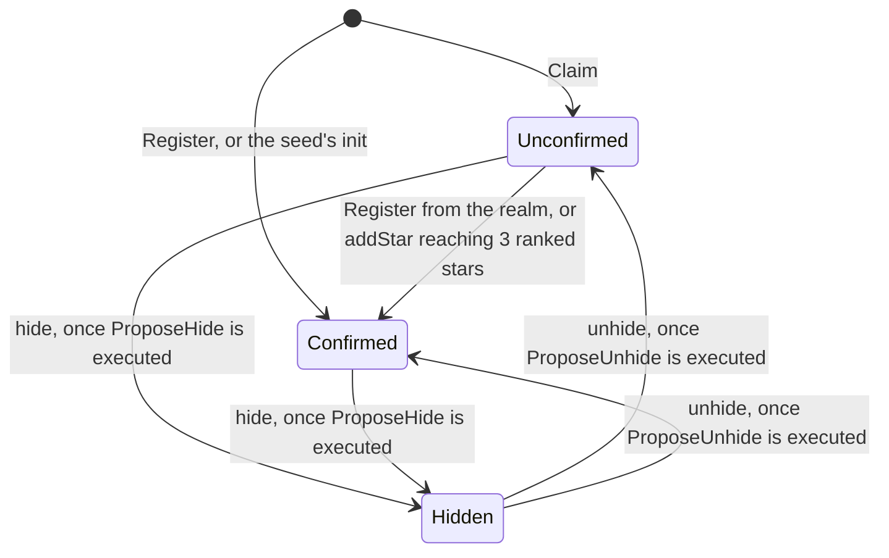
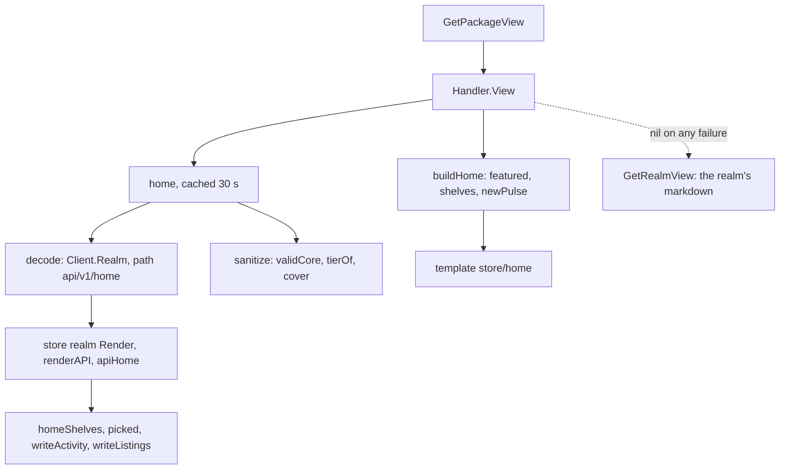

# Explore: `r/gnoland/store/v0` and gnoweb's `feature/store`
Written by claude-opus-5-5.
PR: [gnolang/gno#6273](https://github.com/gnolang/gno/pull/6273) · [Review files](https://github.com/samouraiworld/gno-agent-workspace/tree/main/reviews/pr/6xxx/6273-explore-onchain-app-directory)

## TLDR

Before, gnoweb shows the page of a path the reader already knows, and nothing
on chain lists what is built on gno.land. After, the realm
[`gno.land/r/gnoland/store/v0`](https://github.com/gnolang/gno/blob/8ee3be106cd932e3156197c4ce3a080520493eb9/examples/gno.land/r/gnoland/store/v0/store.gno#L1-L9)
keeps that list: an app lists itself with
[`Register`](https://github.com/gnolang/gno/blob/8ee3be106cd932e3156197c4ce3a080520493eb9/examples/gno.land/r/gnoland/store/v0/store.gno#L69-L82),
users [`Star`](https://github.com/gnolang/gno/blob/8ee3be106cd932e3156197c4ce3a080520493eb9/examples/gno.land/r/gnoland/store/v0/store.gno#L151-L172)
it, and GovDAO hides or features listings through proposals. The new gnoweb
flag [`-store-realm`](https://github.com/gnolang/gno/blob/8ee3be106cd932e3156197c4ce3a080520493eb9/gno.land/cmd/gnoweb/main.go#L180-L185)
turns on [`feature/store`](https://github.com/gnolang/gno/blob/8ee3be106cd932e3156197c4ce3a080520493eb9/gno.land/pkg/gnoweb/feature/store/feature.go#L1-L8),
which draws that realm's Content tab as cards and adds an Explore entry and
`/explore`. The aim, per
[ADR-004](https://github.com/gnolang/gno/blob/8ee3be106cd932e3156197c4ce3a080520493eb9/gno.land/adr/adr-004-gnoweb-store.md?plain=1#L3-L6),
is discovery that needs almost no human moderation and treats every listing
as hostile.

## What Explore is

Explore is an app directory inside gnoweb. The UI calls it Explore, and the
code calls it the store. Its front page shows, top to bottom, a title with a
"Surprise me" link, a one-line pulse of the chain, a strip of the 11
[categories](https://github.com/gnolang/gno/blob/8ee3be106cd932e3156197c4ce3a080520493eb9/examples/gno.land/r/gnoland/store/v0/taxonomy.gno#L16-L28),
one large hero card, a Spotlight of up to three cards, then a fixed run of
sections: New, Top, Trending this week, Recently updated, Rediscover and
gno.land essentials. The
[template](https://github.com/gnolang/gno/blob/8ee3be106cd932e3156197c4ce3a080520493eb9/gno.land/pkg/gnoweb/feature/store/templates/pages.html#L1-L65)
draws them in that order.

Every card links to the listing's own realm or package page. The store has no
per-app page: the realm page already runs the app, and its Source tab is the
code. A star is a transaction on the store realm, signed through gnoweb's
usual Actions page. A second view, the Build lens, lists packages and
services, and the namespaces that publish them by stars and by first listing.

Three parties write to it:

- **An app realm** lists itself by calling `Register` from its own `init`.
  Deploying the realm is the proof that its author controls it.
- **A namespace owner** lists what cannot call `Register`, a `/p/` package or
  a realm deployed before the store, with
  [`Claim`](https://github.com/gnolang/gno/blob/8ee3be106cd932e3156197c4ce3a080520493eb9/examples/gno.land/r/gnoland/store/v0/store.gno#L93-L107).
- **GovDAO** pauses the store, hides a listing or picks the hero, each through
  a proposal the store builds. There is no admin address.

What a listing may look like on a page is gnoweb's decision, never the
realm's: the operator's `-trusted-paths` list decides which apps read as
official.

## gnoweb and the examples tree today

This section is the before. None of it changes, and the store plugs into each
part.

- **A realm page renders its own markdown.**
  [`GetPackageView`](https://github.com/gnolang/gno/blob/8ee3be106cd932e3156197c4ce3a080520493eb9/gno.land/pkg/gnoweb/handler_http.go#L502-L524)
  sends `$help`, `$source`, directories and user pages to their own views, and
  every other HTML request ends in
  [`GetRealmView`](https://github.com/gnolang/gno/blob/8ee3be106cd932e3156197c4ce3a080520493eb9/gno.land/pkg/gnoweb/handler_http.go#L566).
  It asks the node for the realm's `Render(path)` output through
  [`Client.Realm`](https://github.com/gnolang/gno/blob/8ee3be106cd932e3156197c4ce3a080520493eb9/gno.land/pkg/gnoweb/handler_http.go#L546),
  the `vm/qrender` query, and turns that markdown into HTML.
- **Short URLs are aliases.**
  [`DefaultAliases`](https://github.com/gnolang/gno/blob/8ee3be106cd932e3156197c4ce3a080520493eb9/gno.land/pkg/gnoweb/app.go#L19-L27)
  maps `/` to `/r/gnoland/home` and `/about` to a page of `/r/gnoland/pages`.
- **Trust is a gnoweb flag.** `-trusted-paths` lists namespaces gnoweb trusts,
  [`gnoland`, `sys`, `gov`, `demo` and others](https://github.com/gnolang/gno/blob/8ee3be106cd932e3156197c4ce3a080520493eb9/gno.land/cmd/gnoweb/main.go#L70)
  by default. A realm page outside them carries the "Community realm" notice,
  through
  [`showRealmNotice`](https://github.com/gnolang/gno/blob/8ee3be106cd932e3156197c4ce3a080520493eb9/gno.land/pkg/gnoweb/realm_notice.go#L61-L67).
- **`examples/` is what a local chain starts with.** `gnoland start` with
  [`-lazy`](https://github.com/gnolang/gno/blob/8ee3be106cd932e3156197c4ce3a080520493eb9/gno.land/cmd/gnoland/start.go#L167-L170)
  generates a genesis that
  [deploys every package under `examples/`](https://github.com/gnolang/gno/blob/8ee3be106cd932e3156197c4ce3a080520493eb9/gno.land/cmd/gnoland/start.go#L451-L453).
  `examples/gno.land/r/gnoland/` already holds `home`, `blog`, `boards2` and
  `coins`, so the store realm sits beside them and deploys with them.

Nothing in either lists apps. Finding one means
[knowing its path or following a hand-written link](https://github.com/gnolang/gno/blob/8ee3be106cd932e3156197c4ce3a080520493eb9/gno.land/adr/adr-004-gnoweb-store.md?plain=1#L23-L27).

## How it works, in 6 steps

Every step here is the after. The steps follow one app, `gno.land/r/acme/swap`,
through a filetest written for this overview: it registers the app against
this pull request's realm, prints `Render("api/v1/home")`, and runs with
`gno test`.

1. **The app registers from its `init`.**
   ```go
   store.Register(cross(cur), "acme-swap", "Acme Swap", "Swap tokens in one click", "defi", 3)
   ```
   The store takes the listed path from
   [`cur.Previous().PkgPath()`](https://github.com/gnolang/gno/blob/8ee3be106cd932e3156197c4ce3a080520493eb9/examples/gno.land/r/gnoland/store/v0/store.gno#L71),
   never from an argument, so a realm can list only itself. The arguments are
   slug, title, tagline, category key and palette index.
2. **[`upsert`](https://github.com/gnolang/gno/blob/8ee3be106cd932e3156197c4ce3a080520493eb9/examples/gno.land/r/gnoland/store/v0/listing.gno#L169-L202)
   checks and files it.**
   [`validateListing`](https://github.com/gnolang/gno/blob/8ee3be106cd932e3156197c4ce3a080520493eb9/examples/gno.land/r/gnoland/store/v0/validate.gno#L29-L48)
   refuses a bad slug, title, tagline, category or palette, and
   [`available`](https://github.com/gnolang/gno/blob/8ee3be106cd932e3156197c4ce3a080520493eb9/examples/gno.land/r/gnoland/store/v0/listing.gno#L206-L216)
   refuses a taken slug or title, or a sixth listing in one namespace.
   `Register` never panics: a refusal
   [emits `StoreRegisterRejected`](https://github.com/gnolang/gno/blob/8ee3be106cd932e3156197c4ce3a080520493eb9/examples/gno.land/r/gnoland/store/v0/store.gno#L78-L81)
   and the app's `init` carries on. The project's
   [filetest](https://github.com/gnolang/gno/blob/8ee3be106cd932e3156197c4ce3a080520493eb9/examples/gno.land/r/gnoland/store/v0/filetests/register_rejected_filetest.gno#L9-L36)
   shows the category `casino` refused as `bad_category`.
3. **Users star it.** `Star` takes direct user calls only, one star per address
   per listing and at most
   [20 new stars per address per day](https://github.com/gnolang/gno/blob/8ee3be106cd932e3156197c4ce3a080520493eb9/examples/gno.land/r/gnoland/store/v0/store.gno#L45).
   Whether a star ranks the app is decided once, when it is given.
4. **A reader opens `/explore`.** gnoweb resolves the alias to
   `/r/gnoland/store/v0`, and the new hook in `GetPackageView` calls
   [`Handler.View`](https://github.com/gnolang/gno/blob/8ee3be106cd932e3156197c4ce3a080520493eb9/gno.land/pkg/gnoweb/feature/store/handler.go#L73-L88),
   which asks the realm for `api/v1/home`. Three fields of the filetest's
   answer, the pulse, the New shelf and the app's listing:
   ```json
   {"listed_7d":13,"stars_7d":0,"listed_30d":13,"stars_30d":0}
   {"title":"New","pinned":true,"empty":"No new app yet. List yours from a registered namespace: it opens here.","slugs":["acme-swap"],"more":[{"key":"latest","title":"New","count":8}]}
   {"slug":"acme-swap","kind":"app","path":"gno.land/r/acme/swap","title":"Acme Swap","tagline":"Swap tokens in one click","category":"defi","palette":3,"stars":0,"ranked":0,"earned":false,"icon":"","cover":""}
   ```
   The 13 listed are the 12
   [seed listings](https://github.com/gnolang/gno/blob/8ee3be106cd932e3156197c4ce3a080520493eb9/examples/gno.land/r/gnoland/store/v0/seed.gno#L12-L25)
   plus `acme-swap`. The `count` of 8 on New's list is every confirmed app:
   the 7 seed apps and `acme-swap`.
5. **gnoweb checks every field and decides a tier.**
   [`sanitize`](https://github.com/gnolang/gno/blob/8ee3be106cd932e3156197c4ce3a080520493eb9/gno.land/pkg/gnoweb/feature/store/listing.go#L65-L78)
   drops a listing with a bad core field and clears a bad image. The namespace
   `acme` is neither on the trust list nor an address, so
   [`tierOf`](https://github.com/gnolang/gno/blob/8ee3be106cd932e3156197c4ce3a080520493eb9/gno.land/pkg/gnoweb/feature/store/listing.go#L148-L157)
   gives it the registered tier. With `earned` false, its card says
   "community" by its path and shows gnoweb's generated art.
6. **gnoweb lays out the page.**
   [`featured`](https://github.com/gnolang/gno/blob/8ee3be106cd932e3156197c4ce3a080520493eb9/gno.land/pkg/gnoweb/feature/store/view.go#L289-L330)
   picks the hero and the Spotlight,
   [`shelves`](https://github.com/gnolang/gno/blob/8ee3be106cd932e3156197c4ce3a080520493eb9/gno.land/pkg/gnoweb/feature/store/view.go#L208-L246)
   turns each section into a grid of up to 8 cards, and the result is
   [cached 30 seconds](https://github.com/gnolang/gno/blob/8ee3be106cd932e3156197c4ce3a080520493eb9/gno.land/pkg/gnoweb/feature/store/cache.go#L14).

## The parts, at a glance

All of these are new in the after, except the last group, which changes
existing gnoweb files.

| Part | File | Job |
|---|---|---|
| Write entry points | [`store.gno`](https://github.com/gnolang/gno/blob/8ee3be106cd932e3156197c4ce3a080520493eb9/examples/gno.land/r/gnoland/store/v0/store.gno#L57-L209) | `Register`, `Claim`, `SubmitRich`, `Star`, `Unstar` and the store's constants |
| Listing record and indexes | [`listing.gno`](https://github.com/gnolang/gno/blob/8ee3be106cd932e3156197c4ce3a080520493eb9/examples/gno.land/r/gnoland/store/v0/listing.gno#L12-L39) | the `listing` type, `upsert`, the avl indexes, star books, `earned` |
| Governance | [`admin.gno`](https://github.com/gnolang/gno/blob/8ee3be106cd932e3156197c4ce3a080520493eb9/examples/gno.land/r/gnoland/store/v0/admin.gno#L49-L104) | the five GovDAO proposal builders and what they run |
| Sections and lists | [`front.gno`](https://github.com/gnolang/gno/blob/8ee3be106cd932e3156197c4ce3a080520493eb9/examples/gno.land/r/gnoland/store/v0/front.gno#L48-L68), [`shelves.gno`](https://github.com/gnolang/gno/blob/8ee3be106cd932e3156197c4ce3a080520493eb9/examples/gno.land/r/gnoland/store/v0/shelves.gno#L45-L58) | which apps each section holds, Trending, the Rediscover rotation |
| Pulse and feed | [`pulse.gno`](https://github.com/gnolang/gno/blob/8ee3be106cd932e3156197c4ce3a080520493eb9/examples/gno.land/r/gnoland/store/v0/pulse.gno#L55-L63) | per-day counters and the ring of the last 20 events |
| JSON API | [`api.gno`](https://github.com/gnolang/gno/blob/8ee3be106cd932e3156197c4ce3a080520493eb9/examples/gno.land/r/gnoland/store/v0/api.gno#L14-L31) | `api/v1/home`, `build`, `category/<key>/<page>`, `list/<key>/<page>` |
| Markdown store and embeds | [`render.gno`](https://github.com/gnolang/gno/blob/8ee3be106cd932e3156197c4ce3a080520493eb9/examples/gno.land/r/gnoland/store/v0/render.gno#L24-L45) | the markdown store any client reads, `Block` and `Badge` for other realms |
| Field rules | [`validate.gno`](https://github.com/gnolang/gno/blob/8ee3be106cd932e3156197c4ce3a080520493eb9/examples/gno.land/r/gnoland/store/v0/validate.gno#L125) | lengths, slug grammar, look-alike titles, `ipfs://` images |
| Taxonomy | [`taxonomy.gno`](https://github.com/gnolang/gno/blob/8ee3be106cd932e3156197c4ce3a080520493eb9/examples/gno.land/r/gnoland/store/v0/taxonomy.gno#L4-L28) | the three kinds and the 11 categories, fixed for this path |
| Seed catalogue | [`seed.gno`](https://github.com/gnolang/gno/blob/8ee3be106cd932e3156197c4ce3a080520493eb9/examples/gno.land/r/gnoland/store/v0/seed.gno#L10-L39) | 12 existing realms and packages, listed at deploy |
| Realm tests | [`store_test.gno`](https://github.com/gnolang/gno/blob/8ee3be106cd932e3156197c4ce3a080520493eb9/examples/gno.land/r/gnoland/store/v0/store_test.gno#L66), [`store_govdao.txtar`](https://github.com/gnolang/gno/blob/8ee3be106cd932e3156197c4ce3a080520493eb9/gno.land/pkg/integration/testdata/store_govdao.txtar#L1-L48) | unit tests, and a hide and a pick voted through a real GovDAO |
| gnoweb module entry | [`feature.go`](https://github.com/gnolang/gno/blob/8ee3be106cd932e3156197c4ce3a080520493eb9/gno.land/pkg/gnoweb/feature/store/feature.go#L23-L63) | `Deps` and `New` |
| Routing | [`handler.go`](https://github.com/gnolang/gno/blob/8ee3be106cd932e3156197c4ce3a080520493eb9/gno.land/pkg/gnoweb/feature/store/handler.go#L73-L88) | `View`: which render paths it draws, the 404 page |
| Fetch and cache | [`api.go`](https://github.com/gnolang/gno/blob/8ee3be106cd932e3156197c4ce3a080520493eb9/gno.land/pkg/gnoweb/feature/store/api.go#L144-L161), [`cache.go`](https://github.com/gnolang/gno/blob/8ee3be106cd932e3156197c4ce3a080520493eb9/gno.land/pkg/gnoweb/feature/store/cache.go#L48-L78) | one `vm/qrender` call per page, decoded, checked, cached |
| Tiers | [`listing.go`](https://github.com/gnolang/gno/blob/8ee3be106cd932e3156197c4ce3a080520493eb9/gno.land/pkg/gnoweb/feature/store/listing.go#L139-L169) | `sanitize`, `tierOf`, which tier may show images |
| Page model | [`view.go`](https://github.com/gnolang/gno/blob/8ee3be106cd932e3156197c4ce3a080520493eb9/gno.land/pkg/gnoweb/feature/store/view.go#L161-L190) | cards, hero, Spotlight, grids, pulse line |
| Generated art | [`cover.go`](https://github.com/gnolang/gno/blob/8ee3be106cd932e3156197c4ce3a080520493eb9/gno.land/pkg/gnoweb/feature/store/cover.go#L49) | a cover and an icon per slug and palette, as inline SVG |
| Templates and CSS | [`pages.html`](https://github.com/gnolang/gno/blob/8ee3be106cd932e3156197c4ce3a080520493eb9/gno.land/pkg/gnoweb/feature/store/templates/pages.html#L1), [`parts.html`](https://github.com/gnolang/gno/blob/8ee3be106cd932e3156197c4ce3a080520493eb9/gno.land/pkg/gnoweb/feature/store/templates/parts.html#L1), [`store.css`](https://github.com/gnolang/gno/blob/8ee3be106cd932e3156197c4ce3a080520493eb9/gno.land/pkg/gnoweb/feature/store/frontend/store.css#L1) | front, Build and paged pages; card, shelf and strip parts |
| Core touches | [`main.go`](https://github.com/gnolang/gno/blob/8ee3be106cd932e3156197c4ce3a080520493eb9/gno.land/cmd/gnoweb/main.go#L324-L338), [`handler_http.go`](https://github.com/gnolang/gno/blob/8ee3be106cd932e3156197c4ce3a080520493eb9/gno.land/pkg/gnoweb/handler_http.go#L526-L533), [`header.html`](https://github.com/gnolang/gno/blob/8ee3be106cd932e3156197c4ce3a080520493eb9/gno.land/pkg/gnoweb/components/layouts/header.html#L8-L15), [`shorten.go`](https://github.com/gnolang/gno/blob/8ee3be106cd932e3156197c4ce3a080520493eb9/gno.land/pkg/gnoweb/components/shorten.go#L9-L30) | the flag, the hook, the header entry; two helpers moved to `components` and `IsVisibleRune` exported, so the store reuses them |
| Design record | [`adr-004-gnoweb-store.md`](https://github.com/gnolang/gno/blob/8ee3be106cd932e3156197c4ce3a080520493eb9/gno.land/adr/adr-004-gnoweb-store.md?plain=1#L1) | why each part exists, the threat model, what comes later |

## How a listing moves between states

The diagram is the after. Each arrow is labelled by the function that makes
the move.



- **`Register`** sets
  [`Confirmed`](https://github.com/gnolang/gno/blob/8ee3be106cd932e3156197c4ce3a080520493eb9/examples/gno.land/r/gnoland/store/v0/store.gno#L77)
  since a realm that calls it exists. A second call updates title, tagline,
  category and palette, and keeps the slug and the creation height.
- **`Claim`** accepts a direct user call from an address that
  [owns the path's namespace](https://github.com/gnolang/gno/blob/8ee3be106cd932e3156197c4ce3a080520493eb9/examples/gno.land/r/gnoland/store/v0/store.gno#L113-L118).
  It panics on any refusal. A realm cannot ask whether a package exists, so
  the claimed path is checked for its grammar only and starts unconfirmed.
- **An unconfirmed listing** is filed in its category only, and only if it is
  an app: [`index`](https://github.com/gnolang/gno/blob/8ee3be106cd932e3156197c4ce3a080520493eb9/examples/gno.land/r/gnoland/store/v0/listing.gno#L288-L298)
  stops there. A claimed package or service shows nowhere.
- **[`addStar`](https://github.com/gnolang/gno/blob/8ee3be106cd932e3156197c4ce3a080520493eb9/examples/gno.land/r/gnoland/store/v0/listing.gno#L465-L468)**
  confirms a listing at
  [3 ranked stars](https://github.com/gnolang/gno/blob/8ee3be106cd932e3156197c4ce3a080520493eb9/examples/gno.land/r/gnoland/store/v0/store.gno#L37).
  Flooding New with fake paths therefore costs three ranked stars per path.
- **A confirmed listing** reaches the sections, the activity feed, the pulse
  and the builder rankings. One function,
  [`track`](https://github.com/gnolang/gno/blob/8ee3be106cd932e3156197c4ce3a080520493eb9/examples/gno.land/r/gnoland/store/v0/pulse.gno#L55-L63),
  gates the feed and the pulse on it.
- **[`hide`](https://github.com/gnolang/gno/blob/8ee3be106cd932e3156197c4ce3a080520493eb9/examples/gno.land/r/gnoland/store/v0/admin.gno#L193-L205)**
  removes the listing from every index and frees its slug, its title and its
  namespace slot. The record stays under its path, where `unhide` finds it.
- **[`unhide`](https://github.com/gnolang/gno/blob/8ee3be106cd932e3156197c4ce3a080520493eb9/examples/gno.land/r/gnoland/store/v0/admin.gno#L209-L223)**
  restores it to the state it had, unless its slug, its title or a slot of its
  namespace was taken meanwhile.

## How a star counts

A star always adds to the listing's total, `stars` in the API, which the card
shows in its tooltip. It also ranks the listing only when
[`Star`](https://github.com/gnolang/gno/blob/8ee3be106cd932e3156197c4ce3a080520493eb9/examples/gno.land/r/gnoland/store/v0/store.gno#L168-L170)
finds a registered name the store has known for 3 days, on an address that
does not own the listing's namespace. The table is the after.

| Who stars | Adds to `stars` | Adds to `ranked` |
|---|---|---|
| an address with no registered name | yes | no |
| a named address whose first star as a named account came less than 3 days ago | yes | no |
| a named address known for 3 days or more, owning the listing's namespace | yes | no |
| a named address known for 3 days or more, any other namespace | yes | yes |

The store learns a name's age from its own records:
[`spendStar`](https://github.com/gnolang/gno/blob/8ee3be106cd932e3156197c4ce3a080520493eb9/examples/gno.land/r/gnoland/store/v0/store.gno#L195-L209)
stores the height of an address's first star once it has a name, since
`r/sys/users` keeps no registration height. That first star only starts the
clock. The rows match the realm's own `TestSybilStars`, `TestNameMaturity` and
`TestOwnStarDoesNotRank`, and the realm's test suite passes on this pull
request's code.

Ranked stars, not the total, drive everything that orders the store: the
number on the card, Top, Trending, the milestones at
[10, 50 and 100](https://github.com/gnolang/gno/blob/8ee3be106cd932e3156197c4ce3a080520493eb9/examples/gno.land/r/gnoland/store/v0/pulse.gno#L10),
the builder rankings, confirming a claim, and earned reputation.

## Which app reaches which place

Each place on the after page has its own entry rule. In this table, "named"
means a namespace that is not a `g1…` address, and "core" means one of the
seed's listings.

| Place | Who gets in | Decided by |
|---|---|---|
| Category page | every visible app, confirmed or not, newest first | [`index`](https://github.com/gnolang/gno/blob/8ee3be106cd932e3156197c4ce3a080520493eb9/examples/gno.land/r/gnoland/store/v0/listing.gno#L288-L295) |
| New | confirmed apps of named namespaces, core ones left out, newest first | [`newApps`](https://github.com/gnolang/gno/blob/8ee3be106cd932e3156197c4ce3a080520493eb9/examples/gno.land/r/gnoland/store/v0/front.gno#L43-L45), [`namedApps`](https://github.com/gnolang/gno/blob/8ee3be106cd932e3156197c4ce3a080520493eb9/examples/gno.land/r/gnoland/store/v0/listing.gno#L301-L303) |
| Top | community apps with at least [3 ranked stars](https://github.com/gnolang/gno/blob/8ee3be106cd932e3156197c4ce3a080520493eb9/examples/gno.land/r/gnoland/store/v0/front.gno#L10) | [`topApps`](https://github.com/gnolang/gno/blob/8ee3be106cd932e3156197c4ce3a080520493eb9/examples/gno.land/r/gnoland/store/v0/front.gno#L24-L37) |
| Trending this week | apps with at least [2 ranked stars](https://github.com/gnolang/gno/blob/8ee3be106cd932e3156197c4ce3a080520493eb9/examples/gno.land/r/gnoland/store/v0/shelves.gno#L15) over the last 7 days | [`trending`](https://github.com/gnolang/gno/blob/8ee3be106cd932e3156197c4ce3a080520493eb9/examples/gno.land/r/gnoland/store/v0/shelves.gno#L142-L165) |
| Recently updated | confirmed apps whose fields really changed, moved at most [once per 7 days](https://github.com/gnolang/gno/blob/8ee3be106cd932e3156197c4ce3a080520493eb9/examples/gno.land/r/gnoland/store/v0/store.gno#L40) | [`touch`](https://github.com/gnolang/gno/blob/8ee3be106cd932e3156197c4ce3a080520493eb9/examples/gno.land/r/gnoland/store/v0/listing.gno#L244-L255) |
| Rediscover | named, non-core apps older than [14 days](https://github.com/gnolang/gno/blob/8ee3be106cd932e3156197c4ce3a080520493eb9/examples/gno.land/r/gnoland/store/v0/store.gno#L23), a window of 16 that slides by 8 each day | [`rotation`](https://github.com/gnolang/gno/blob/8ee3be106cd932e3156197c4ce3a080520493eb9/examples/gno.land/r/gnoland/store/v0/shelves.gno#L177-L196) |
| gno.land essentials | the seed's apps still shown as apps, in seed order | [`essentialApps`](https://github.com/gnolang/gno/blob/8ee3be106cd932e3156197c4ce3a080520493eb9/examples/gno.land/r/gnoland/store/v0/front.gno#L107-L115) |
| Hero and Spotlight | eligible apps: trusted tier, or registered tier with `earned`, the first 12 in section order | [`eligible`](https://github.com/gnolang/gno/blob/8ee3be106cd932e3156197c4ce3a080520493eb9/gno.land/pkg/gnoweb/feature/store/view.go#L251-L269) |
| Hero, as a pick | any app GovDAO picked, while the pick lasts | [`picked`](https://github.com/gnolang/gno/blob/8ee3be106cd932e3156197c4ce3a080520493eb9/examples/gno.land/r/gnoland/store/v0/admin.gno#L170-L175) |

The realm's reputation flag,
[`earned`](https://github.com/gnolang/gno/blob/8ee3be106cd932e3156197c4ce3a080520493eb9/examples/gno.land/r/gnoland/store/v0/listing.gno#L688-L701),
holds once the listing is 14 days old and has 5 ranked stars that are each 3
days old, with no image change waiting. gnoweb's
[`rich`](https://github.com/gnolang/gno/blob/8ee3be106cd932e3156197c4ce3a080520493eb9/gno.land/pkg/gnoweb/feature/store/listing.go#L167-L169)
reads `earned` for the registered tier only, so an app in an address
namespace never becomes eligible.

The hero is chosen in this order by `featured`, after:

1. GovDAO's pick, labelled "Picked by GovDAO".
2. Else the eligible app with the most ranked stars this week, if 5 or more,
   labelled "Trending now" when it
   [leads the Trending section](https://github.com/gnolang/gno/blob/8ee3be106cd932e3156197c4ce3a080520493eb9/gno.land/pkg/gnoweb/feature/store/view.go#L349-L358),
   else "Popular this week".
3. Else one eligible app per chain day, labelled "In the spotlight today".

The Spotlight takes the next three eligible apps of the day's window and is
left out under two. Once three apps have earned their place, the operator's
trusted apps hold
[one place at most](https://github.com/gnolang/gno/blob/8ee3be106cd932e3156197c4ce3a080520493eb9/gno.land/pkg/gnoweb/feature/store/view.go#L312-L325)
across hero and Spotlight together.

## How the front page is drawn

The diagram is the after: one page view, from the request to the HTML.



- **[`GetPackageView`](https://github.com/gnolang/gno/blob/8ee3be106cd932e3156197c4ce3a080520493eb9/gno.land/pkg/gnoweb/handler_http.go#L526-L533)**
  asks the store first, unless markdown was asked for, after every tab
  dispatch.
- **[`View`](https://github.com/gnolang/gno/blob/8ee3be106cd932e3156197c4ce3a080520493eb9/gno.land/pkg/gnoweb/feature/store/handler.go#L73-L88)**
  draws the front page, `build`, `c/<key>` and the four lists of the store
  realm, and returns nil for every other path.
- **[`cached`](https://github.com/gnolang/gno/blob/8ee3be106cd932e3156197c4ce3a080520493eb9/gno.land/pkg/gnoweb/feature/store/cache.go#L48-L78)**
  runs one load for all concurrent readers, keeps a result 30 seconds and a
  failure [5 seconds](https://github.com/gnolang/gno/blob/8ee3be106cd932e3156197c4ce3a080520493eb9/gno.land/pkg/gnoweb/feature/store/cache.go#L18).
- **[`decode`](https://github.com/gnolang/gno/blob/8ee3be106cd932e3156197c4ce3a080520493eb9/gno.land/pkg/gnoweb/feature/store/api.go#L144-L161)**
  refuses an answer over [2 MiB](https://github.com/gnolang/gno/blob/8ee3be106cd932e3156197c4ce3a080520493eb9/gno.land/pkg/gnoweb/feature/store/api.go#L22)
  or of another API version, and logs a failure once per load.
- **[`apiHome`](https://github.com/gnolang/gno/blob/8ee3be106cd932e3156197c4ce3a080520493eb9/examples/gno.land/r/gnoland/store/v0/api.gno#L33-L50)**
  answers in one call: pulse, categories with counts, every section, the pick,
  the newest 5 events and each listing they name, once.
- **[`homeShelves`](https://github.com/gnolang/gno/blob/8ee3be106cd932e3156197c4ce3a080520493eb9/examples/gno.land/r/gnoland/store/v0/front.gno#L48-L68)**
  fixes the sections and their order, sending up to
  [16 apps each](https://github.com/gnolang/gno/blob/8ee3be106cd932e3156197c4ce3a080520493eb9/examples/gno.land/r/gnoland/store/v0/front.gno#L11)
  so 8 remain once gnoweb sets aside what is shown above.
- **[`sanitize`](https://github.com/gnolang/gno/blob/8ee3be106cd932e3156197c4ce3a080520493eb9/gno.land/pkg/gnoweb/feature/store/listing.go#L65-L78)**
  runs once per cache fill, so a request only reads the tier, the short path
  and the art.
- **[`shelves`](https://github.com/gnolang/gno/blob/8ee3be106cd932e3156197c4ce3a080520493eb9/gno.land/pkg/gnoweb/feature/store/view.go#L208-L246)**
  draws New and Top even when empty, with their empty text, and gno.land
  essentials unless the hero and the Spotlight already show all its apps. It
  draws the other three only with 4 apps not already shown above.
- **The dotted arrow** is the fallback: when the API fails, `View` returns nil
  and the reader gets the realm's own markdown store, drawn by
  [`renderHome`](https://github.com/gnolang/gno/blob/8ee3be106cd932e3156197c4ce3a080520493eb9/examples/gno.land/r/gnoland/store/v0/render.gno#L47-L62).

## What GovDAO can do

Each builder in this table returns a `dao.ProposalRequest` and changes
nothing itself. Its effect runs when GovDAO votes the proposal and executes it,
through [`proposal`](https://github.com/gnolang/gno/blob/8ee3be106cd932e3156197c4ce3a080520493eb9/examples/gno.land/r/gnoland/store/v0/admin.gno#L186-L188).
The table is the after.

| Builder | Effect once executed |
|---|---|
| [`ProposePause`](https://github.com/gnolang/gno/blob/8ee3be106cd932e3156197c4ce3a080520493eb9/examples/gno.land/r/gnoland/store/v0/admin.gno#L52-L55) | `Register` is refused with reason `paused` and `Claim` panics; stars, images and hiding keep working |
| [`ProposeUnpause`](https://github.com/gnolang/gno/blob/8ee3be106cd932e3156197c4ce3a080520493eb9/examples/gno.land/r/gnoland/store/v0/admin.gno#L58-L61) | lifts the pause |
| [`ProposeHide`](https://github.com/gnolang/gno/blob/8ee3be106cd932e3156197c4ce3a080520493eb9/examples/gno.land/r/gnoland/store/v0/admin.gno#L67-L74) | hides the listing for one of [five reasons](https://github.com/gnolang/gno/blob/8ee3be106cd932e3156197c4ce3a080520493eb9/examples/gno.land/r/gnoland/store/v0/admin.gno#L36), and fails if the slug names another path by then |
| [`ProposeUnhide`](https://github.com/gnolang/gno/blob/8ee3be106cd932e3156197c4ce3a080520493eb9/examples/gno.land/r/gnoland/store/v0/admin.gno#L79-L86) | restores a hidden listing, named by its path |
| [`ProposeSpotlight`](https://github.com/gnolang/gno/blob/8ee3be106cd932e3156197c4ce3a080520493eb9/examples/gno.land/r/gnoland/store/v0/admin.gno#L94-L104) | makes a confirmed app the hero for [1 to 30 days](https://github.com/gnolang/gno/blob/8ee3be106cd932e3156197c4ce3a080520493eb9/examples/gno.land/r/gnoland/store/v0/admin.gno#L33), replacing any earlier pick |

GovDAO can pause, hide and pick, never edit or delete. A pick ends for good
when the app is hidden, stops being a shown app or is renamed, since the vote
was for the app as it stood. The
[integration test](https://github.com/gnolang/gno/blob/8ee3be106cd932e3156197c4ce3a080520493eb9/gno.land/pkg/integration/testdata/store_govdao.txtar#L24-L48)
proposes a hide and a pick, votes, executes, and reads the effect back
through `api/v1`.

## Before and after in gnoweb's core

One row per place where the change enters existing gnoweb code.

| Place | Before | After |
|---|---|---|
| Startup flags | no store flag | an operator may pass `-store-realm`, empty by default, through [`RegisterFlags`](https://github.com/gnolang/gno/blob/8ee3be106cd932e3156197c4ce3a080520493eb9/gno.land/cmd/gnoweb/main.go#L180-L185); a value that is not a realm path [stops startup](https://github.com/gnolang/gno/blob/8ee3be106cd932e3156197c4ce3a080520493eb9/gno.land/cmd/gnoweb/main.go#L326-L330) |
| Content tab of a realm | the realm's markdown renders, through `GetRealmView` | the store realm's front pages render as cards, through [`Store.View`](https://github.com/gnolang/gno/blob/8ee3be106cd932e3156197c4ce3a080520493eb9/gno.land/pkg/gnoweb/handler_http.go#L526-L533); every other path, tab and markdown request is unchanged |
| Header | the gnome logo, then the omnibar | an Explore icon sits left of the logo on every realm page, through [`setHeaderForRealm`](https://github.com/gnolang/gno/blob/8ee3be106cd932e3156197c4ce3a080520493eb9/gno.land/pkg/gnoweb/handler_http.go#L1367-L1369) and [`header.html`](https://github.com/gnolang/gno/blob/8ee3be106cd932e3156197c4ce3a080520493eb9/gno.land/pkg/gnoweb/components/layouts/header.html#L8-L15) |
| Aliases | `DefaultAliases` and `-aliases` | `/explore` also reaches the store realm, through [`withStoreAlias`](https://github.com/gnolang/gno/blob/8ee3be106cd932e3156197c4ce3a080520493eb9/gno.land/cmd/gnoweb/main.go#L390-L397), added before `-aliases` so an operator's own `/explore` wins |
| Trust list | `-trusted-paths` is loaded only while the realm notice is on | the list is loaded always, through [`setupWeb`](https://github.com/gnolang/gno/blob/8ee3be106cd932e3156197c4ce3a080520493eb9/gno.land/cmd/gnoweb/main.go#L324-L325), since it also decides the store's tiers |

## Read the code in this order

Every excerpt here is the after, copied from the pull request's head.

1. [`store.gno` `Register`](https://github.com/gnolang/gno/blob/8ee3be106cd932e3156197c4ce3a080520493eb9/examples/gno.land/r/gnoland/store/v0/store.gno#L69-L82)
   decides who a listing belongs to. Were the path taken from an argument,
   any realm could list or rewrite another's entry.
   ```go
   path := cur.Previous().PkgPath()
   kind := kindApp
   if existing := lookup(&byPath, path); existing != nil {
   	kind = existing.Kind // a service claimed by its owner stays one
   }
   l := newListing(path, slug, title, tagline, category, palette, kind)
   l.Confirmed = true // deploying the realm proves it exists
   reason := upsert(l, runtime.ChainHeight())
   if reason != "" {
   	chain.Emit("StoreRegisterRejected", "path", path, "reason", reason)
   }
   ```
2. [`listing.gno` `upsert`](https://github.com/gnolang/gno/blob/8ee3be106cd932e3156197c4ce3a080520493eb9/examples/gno.land/r/gnoland/store/v0/listing.gno#L169-L202)
   is the one write path for `Register`, `Claim` and the seed. It decides
   whether a call creates a listing or updates the one at its path, so a path
   holds one listing whatever slug a later call passes.
   ```go
   existing := lookup(&byPath, l.Path)
   if existing != nil {
   	l.Slug = existing.Slug
   }
   if reason := validateListing(l); reason != "" {
   	return reason
   }
   ```
3. [`store.gno` `Star`](https://github.com/gnolang/gno/blob/8ee3be106cd932e3156197c4ce3a080520493eb9/examples/gno.land/r/gnoland/store/v0/store.gno#L162-L171)
   decides, once, whether a star ranks. Wrong here, any fresh address would
   push an app into Top and Trending.
   ```go
   named := users.ResolveAddress(caller) != nil
   nameSeen := spendStar(addr, h, named)
   ranked := named && h-nameSeen >= nameMaturity && !ownsNamespace(caller, l.Namespace)
   l.addStar(addr, star{Height: h, Ranked: ranked})
   ```
4. [`front.gno` `homeShelves`](https://github.com/gnolang/gno/blob/8ee3be106cd932e3156197c4ce3a080520493eb9/examples/gno.land/r/gnoland/store/v0/front.gno#L48-L68)
   decides the sections and which index feeds each. gnoweb draws them in the
   order this function returns.
5. [`api.gno` `writeListing`](https://github.com/gnolang/gno/blob/8ee3be106cd932e3156197c4ce3a080520493eb9/examples/gno.land/r/gnoland/store/v0/api.gno#L277-L304)
   decides what gnoweb can learn about a listing. It serves the images in
   effect at the current height, so a change submitted with `SubmitRich`
   stays invisible for a
   [day](https://github.com/gnolang/gno/blob/8ee3be106cd932e3156197c4ce3a080520493eb9/examples/gno.land/r/gnoland/store/v0/store.gno#L25).
   ```go
   r, _ := l.effective(h)
   ```
6. [`handler_http.go`](https://github.com/gnolang/gno/blob/8ee3be106cd932e3156197c4ce3a080520493eb9/gno.land/pkg/gnoweb/handler_http.go#L526-L533)
   is the one hook in gnoweb's request path. Placed before the tab dispatch,
   it would replace the store realm's Source and Actions tabs too.
   ```go
   if h.Store != nil && !wantMarkdown {
   	if view, meta := h.Store.View(ctx, gnourl); view != nil {
   		indexData.HeadData.Title, indexData.HeadData.Description = meta.Title, meta.Description
   		return meta.Status, view
   	}
   }
   ```
7. [`handler.go` `servePage`](https://github.com/gnolang/gno/blob/8ee3be106cd932e3156197c4ce3a080520493eb9/gno.land/pkg/gnoweb/feature/store/handler.go#L116-L129)
   checks a category key or list key, and its page number, against the cached
   front page before any query. Without it, `:c/<anything>` would reach the
   node and fill the cache.
8. [`listing.go` `tierOf`](https://github.com/gnolang/gno/blob/8ee3be106cd932e3156197c4ce3a080520493eb9/gno.land/pkg/gnoweb/feature/store/listing.go#L148-L169)
   decides what a listing may show. It reads only the operator's trust list
   and the namespace's form, never a value the realm chose.
   ```go
   switch {
   case h.deps.Trusted(l.pkgPath()):
   	return tierTrusted
   case isAddress(l.namespace()):
   	return tierAnonymous
   default:
   	return tierRegistered
   }
   ```
9. [`view.go` `featured`](https://github.com/gnolang/gno/blob/8ee3be106cd932e3156197c4ce3a080520493eb9/gno.land/pkg/gnoweb/feature/store/view.go#L289-L330)
   decides the most visible places on the page. Outside a GovDAO pick it
   draws only from eligible apps, so stars alone cannot put a community app
   in the hero.
10. [`admin.gno` `hide`](https://github.com/gnolang/gno/blob/8ee3be106cd932e3156197c4ce3a080520493eb9/examples/gno.land/r/gnoland/store/v0/admin.gno#L193-L205)
    is what an executed `ProposeHide` runs. It frees the slug and the title, so
    a squatter blocks no one, and keeps the record under its path.

## What a user notices

- **An Explore icon in the header**, left of the logo, on every realm page.
  The scope is the gnoweb instance: it shows only where the operator passed
  `-store-realm`, and then to every reader of that instance.
- **`/explore` and the store realm's path show the card view.** The scope is
  the instance too. `$source`, `$help`, `$state`, other render paths and a
  request for markdown still get the realm as it is.
- **Badges.** A card reads "Core", "Established" or "community" by its path.
  The scope is the instance's `-trusted-paths` list, so one listing can read
  "Core" on one gnoweb and "community" on another.
- **The hero and the Spotlight change once per chain day** of
  [17,280 blocks](https://github.com/gnolang/gno/blob/8ee3be106cd932e3156197c4ce3a080520493eb9/gno.land/pkg/gnoweb/feature/store/view.go#L24).
  The scope is the chain: the day comes from the block height in the payload,
  so every gnoweb on one chain shows the same day's set.
- **Pages trail the chain by up to 30 seconds.** The scope is one gnoweb
  process, which holds its own cache.
- **"Surprise me" goes to a random listed app.** The scope is one page load:
  [`buildHome`](https://github.com/gnolang/gno/blob/8ee3be106cd932e3156197c4ce3a080520493eb9/gno.land/pkg/gnoweb/feature/store/view.go#L384-L386)
  draws it on every request.
- **A star costs one transaction** and shows in the card's tooltip total once
  the page cache refreshes. The scope is the starring address: its star moves the card's number
  only under the rule in *How a star counts*.
- **An app author whose `Register` was refused** still sees the deploy
  succeed. The reason is in the deploy transaction's `StoreRegisterRejected`
  event.

## Upgrading

- **A gnoweb without `-store-realm` behaves as before.** `HTTPHandler.Store`
  stays nil, so there is no icon, no alias and no hook. To turn it on, start
  gnoweb with `-store-realm /r/gnoland/store/v0` on a chain where that realm
  is deployed.
- **`-no-realm-notice` no longer skips loading `-trusted-paths`.** The list now
  loads on every start, and a malformed entry
  [logs a warning](https://github.com/gnolang/gno/blob/8ee3be106cd932e3156197c4ce3a080520493eb9/gno.land/pkg/gnoweb/handler_http.go#L156-L160)
  even with the notice off.
- **The realm's rules are fixed for its path.** A realm cannot be redeployed,
  so the thresholds, quotas and taxonomy hold for `v0` for good. A `v1` is a
  new path where
  [apps call `Register` again and stars do not carry over](https://github.com/gnolang/gno/blob/8ee3be106cd932e3156197c4ce3a080520493eb9/gno.land/adr/adr-004-gnoweb-store.md?plain=1#L186-L191).

## What ADR-004 records

The ADR is 1,623 lines. It holds the context, the prior art on gno.land, the
maintainer constraints from earlier reviews and how the design meets each,
the trust tiers, a threat model numbered T1 to T11, resource bounds, the
alternatives and a plan. Its
[plan](https://github.com/gnolang/gno/blob/8ee3be106cd932e3156197c4ce3a080520493eb9/gno.land/adr/adr-004-gnoweb-store.md?plain=1#L1516-L1554)
names what this pull request ships, the realm and chain-only gnoweb, and
what comes next. The ADR also specifies parts it marks as later, which the
code does not hold:

- the operator's `-store-deny` switch and the other
  [tier overrides](https://github.com/gnolang/gno/blob/8ee3be106cd932e3156197c4ce3a080520493eb9/gno.land/adr/adr-004-gnoweb-store.md?plain=1#L543-L544);
- flags from registered users that demote a listing;
- the indexer-backed shelves, which wait on the optional indexer backend;
- the app band on realm pages, omnibar qualifiers and the home-realm block.

## Words used here

Every name here is new with this change.

| Name | What it is |
|---|---|
| listing | one entry in the store: a path with its slug, kind, title, tagline, category and palette, keyed by path in `byPath` |
| slug | the listing's id in the API and in star links, 3 to 40 of `a-z`, `0-9` and `-`, unique among visible listings |
| kind | `app`, a realm with a `Render`; `service`, a realm other code calls; `package`, a `/p/` library |
| `Register` | crossing function an app realm calls on itself, usually from `init`; never panics |
| `Claim` | crossing function a namespace owner calls directly to list a package, a service or an older realm; panics on refusal |
| confirmed | true once the listing's own realm or the seed listed it, or it has 3 ranked stars; only confirmed listings reach the sections |
| `Star` | crossing function a user calls directly; one per address per listing, 20 new per address per day, no downvote |
| ranked star | a star from an address whose registered name the store has known for 3 days, not owning the listing's namespace |
| `stars`, `ranked` | in the API, a listing's total stars and its ranked stars |
| earned | true when the listing is 14 days old, has 5 ranked stars each 3 days old, and has no image change waiting |
| tier | gnoweb's class for a listing: trusted if on `-trusted-paths`, anonymous if its namespace is a `g1…` address, registered otherwise |
| Core, Established, community | the card's badge: trusted tier; registered tier with `earned`; every other listing |
| eligible | an app of the trusted tier, or of the registered tier with `earned`; only these can be the automatic hero or the Spotlight |
| shelf | one section of the front page or the Build lens, as the realm sends it: title, note, slugs, its list |
| pinned shelf | New, Top or gno.land essentials: drawn even when it holds no app, with its empty text; essentials is left out only when the hero and Spotlight show all its apps |
| list | the full view behind a shelf's "See all": `:latest`, `:top` and `:updated`, 24 apps per page, or `:trending`, a single page |
| hero | the one large card at the top of the front page |
| Spotlight | up to three cards under the hero, a new set each chain day |
| pick | GovDAO's choice of hero, set by an executed `ProposeSpotlight`, 1 to 30 days |
| pause | GovDAO's switch that refuses `Register` and `Claim` |
| hide | GovDAO's removal of a listing from every page, reversible with `ProposeUnhide` |
| epoch | one chain day of 17,280 blocks, the period of the counters and the rotations |
| `SubmitRich` | crossing function a listed realm calls to set its `ipfs://` icon and cover, in effect a day later |
| `api/v1` | the realm's JSON render paths: `home`, `build`, `category/<key>/<page>`, `list/<key>/<page>` |
| `Block`, `Badge` | functions any realm calls from its own `Render`: a short list of apps, or one app's ranked stars with a star link |
| `-store-realm` | gnoweb flag naming the store realm as a path; empty by default, which turns the store off |
| `feature/store` | the gnoweb package that draws the store realm's Content tab from `api/v1` |
| `Handler.View` | the store's entry from gnoweb: a view for the paths it owns, nil for any other |
