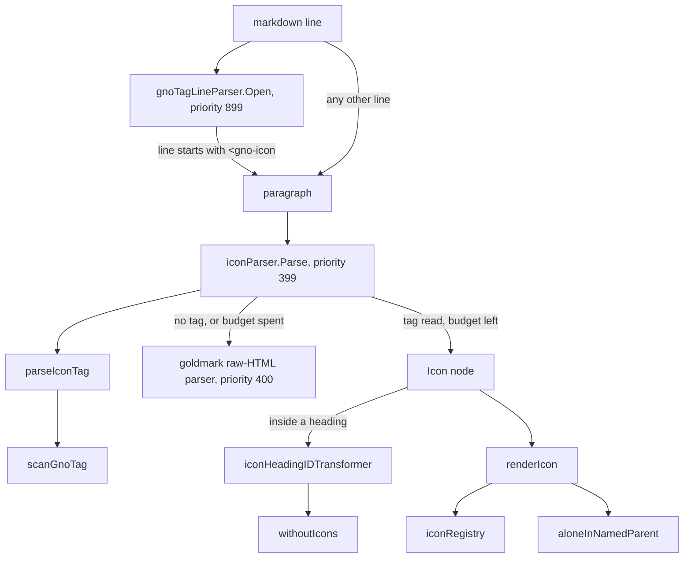
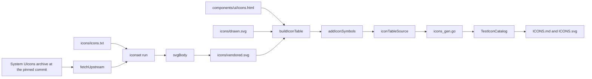

# `<gno-icon />`: the `ExtIcons` markdown extension for gnoweb
Written by claude-opus-5-5, high effort.
PR: [gnolang/gno#6297](https://github.com/gnolang/gno/pull/6297)

## TLDR

Before, gnoweb markdown had no icon syntax: a `<gno-icon … />` tag was raw
HTML, and safe mode replaced it with `<!-- raw HTML omitted -->`. After,
[`ExtIcons`](https://github.com/gnolang/gno/blob/56ff17707/gno.land/pkg/gnoweb/markdown/ext_icons.go#L332-L347)
turns `<gno-icon name="star" />` into an inline `<svg class="gno-icon">`
drawn from a generated Go table,
[`iconRegistry`](https://github.com/gnolang/gno/blob/56ff17707/gno.land/pkg/gnoweb/markdown/icons_gen.go#L6),
of 491 glyphs. The glyph takes the size and color of the text around it. The
change exists so realm authors can put a status mark, a heading glyph or a
link hint next to text without raw `<svg>`, which safe mode strips.

## What `<gno-icon />` is

A realm author writes one self-closing tag wherever inline markdown goes: a
heading, a paragraph, a list item, a table cell, a link label. The realm
docs gain a section on it at
[`markdown.gno`](https://github.com/gnolang/gno/blob/56ff17707/examples/quarantined/gno.land/r/docs/markdown/markdown.gno#L903).

```markdown
## <gno-icon name="rocket" /> Launch
- <gno-icon name="check-circle" label="Done" /> Audit
[<gno-icon name="globe" label="Website" />](https://example.com)
```

- `name` picks the glyph, matched byte for byte against `iconRegistry`.
- `label` is optional. With it, the icon is announced by a screen reader.
  Without it, the icon is decorative and hidden from one.
- No other attribute is read. There is no size, class or style.
- A wrong tag renders nothing visible and leaves an HTML comment in the page
  source saying why.

The 491 names come from three sources, counted with `grep -c '<symbol id="ico-'`
on each file and `grep -c 'iconHeadStroke,'` on the table:

| Source | Symbols | In the table | What they are |
|---|---|---|---|
| [`components/ui/icons.html`](https://github.com/gnolang/gno/blob/56ff17707/gno.land/pkg/gnoweb/components/ui/icons.html) | 65 | 57 | the icons gnoweb's own page chrome already uses, minus 8 excluded |
| [`markdown/icons/vendored.svg`](https://github.com/gnolang/gno/blob/56ff17707/gno.land/pkg/gnoweb/markdown/icons/vendored.svg) | 428 | 428 | System UIcons, a public-domain outline set |
| [`markdown/icons/drawn.svg`](https://github.com/gnolang/gno/blob/56ff17707/gno.land/pkg/gnoweb/markdown/icons/drawn.svg) | 6 | 6 | `shield`, `shield-check`, `key`, `layers`, `music`, `map`, drawn for gnoweb |

The 8 chrome symbols kept out are listed in
[`iconExcluded`](https://github.com/gnolang/gno/blob/56ff17707/gno.land/pkg/gnoweb/markdown/ext_icons_gen_test.go#L43-L53):
four third-party brand marks and the four link badges that
[`getLinkIcons`](https://github.com/gnolang/gno/blob/56ff17707/gno.land/pkg/gnoweb/markdown/ext_links.go#L305)
withholds from `<gno-foreign>` links. Every name with a picture is in
[`ICONS.md`](https://github.com/gnolang/gno/blob/56ff17707/gno.land/pkg/gnoweb/markdown/ICONS.md).

## How it works, in 5 steps

The example is one paragraph line, after the change. The output in step 5
is what the head renders, from a throwaway Go test calling
`goldmark.New(goldmark.WithParserOptions(parser.WithAutoHeadingID()),
goldmark.WithExtensions(NewGnoExtension()))`, the same options
[`render_config.go`](https://github.com/gnolang/gno/blob/56ff17707/gno.land/pkg/gnoweb/render_config.go#L36-L42)
sets.

```markdown
Status <gno-icon name="check-circle" label="Done" /> ok
```

1. **Block parse.** The line opens a paragraph. A line that *starts* with
   `<gno-icon` would otherwise be a CommonMark type-7 HTML block, so
   `gnoTagLineParser` claims it first at priority 899 and opens a plain
   paragraph instead.
2. **Inline parse.** At the `<`, `iconParser.Parse` runs at priority 399,
   one slot ahead of goldmark's raw-HTML parser at 400. It calls
   `parseIconTag`, which calls `scanGnoTag`: a byte scanner that reads at most
   512 bytes and never past the end of the line. It returns the tag's length
   and an `iconTag` with `Name` = `check-circle`, `Label` = `Done`,
   `SelfClosing` = true, both values slices of the source.
3. **Budget.** The parser takes one unit from the `iconBudget` of this
   `Convert` call. Under 1,000 it advances past the tag and returns an `Icon`
   node carrying the tag's byte range. At 1,000 it returns nil and the raw-HTML
   parser takes the tag.
4. **Heading IDs.** The node is not in a heading, so the parser leaves
   `iconInHeadingKey` unset and `iconHeadingIDTransformer` returns at once.
5. **Render.** `renderIcon` looks `check-circle` up in `iconRegistry`, gets
   an `iconGlyph` of shared head `iconHeadStroke` and its own body, and
   writes:

   ```html
   <p>Status <svg class="gno-icon" viewBox="0 0 21 21" fill="none" stroke="currentColor" stroke-width="1.3" stroke-linecap="round" stroke-linejoin="round" role="img" aria-label="Done"><g fill-rule="evenodd" transform="translate(2 2)"><circle cx="8.5" cy="8.5" r="8"/><path d="m5.5 9.5 2 2 5-5"/></g></svg> ok</p>
   ```

## The parts, at a glance

All rows are the after: every file is new or gains these lines in this change.

| Part | File | Job |
|---|---|---|
| `scanGnoTag`, `hasGnoTagPrefix` | [`utils.go:54`](https://github.com/gnolang/gno/blob/56ff17707/gno.land/pkg/gnoweb/markdown/utils.go#L54) · [↗](../../../../.worktrees/gno-review-6297/gno.land/pkg/gnoweb/markdown/utils.go#L54) | reads one `<gno-…>` tag on one line within a byte bound, without allocating |
| `gnoTagLineParser` | [`utils.go:144`](https://github.com/gnolang/gno/blob/56ff17707/gno.land/pkg/gnoweb/markdown/utils.go#L144) · [↗](../../../../.worktrees/gno-review-6297/gno.land/pkg/gnoweb/markdown/utils.go#L144) | keeps a line starting with the tag a paragraph, not an HTML block |
| `parseIconTag` | [`ext_icons.go:98`](https://github.com/gnolang/gno/blob/56ff17707/gno.land/pkg/gnoweb/markdown/ext_icons.go#L98) · [↗](../../../../.worktrees/gno-review-6297/gno.land/pkg/gnoweb/markdown/ext_icons.go#L98) | keeps the first `name` and first `label`, case-insensitive keys, raw values |
| `iconParser` | [`ext_icons.go:149`](https://github.com/gnolang/gno/blob/56ff17707/gno.land/pkg/gnoweb/markdown/ext_icons.go#L149) · [↗](../../../../.worktrees/gno-review-6297/gno.land/pkg/gnoweb/markdown/ext_icons.go#L149) | claims the tag, spends the budget, builds the `Icon` node |
| `iconHeadingIDTransformer` | [`ext_icons.go:178`](https://github.com/gnolang/gno/blob/56ff17707/gno.land/pkg/gnoweb/markdown/ext_icons.go#L178) · [↗](../../../../.worktrees/gno-review-6297/gno.land/pkg/gnoweb/markdown/ext_icons.go#L178) | rebuilds heading IDs without the tag bytes |
| `renderIcon`, `aloneInNamedParent` | [`ext_icons.go:228`](https://github.com/gnolang/gno/blob/56ff17707/gno.land/pkg/gnoweb/markdown/ext_icons.go#L228) · [↗](../../../../.worktrees/gno-review-6297/gno.land/pkg/gnoweb/markdown/ext_icons.go#L228) | writes the `<svg>` or a comment, and the missing-label hint |
| `iconRegistry` | [`icons_gen.go:6`](https://github.com/gnolang/gno/blob/56ff17707/gno.land/pkg/gnoweb/markdown/icons_gen.go#L6) · [↗](../../../../.worktrees/gno-review-6297/gno.land/pkg/gnoweb/markdown/icons_gen.go#L6) | generated map from name to glyph, one line per icon |
| table generator | [`ext_icons_gen_test.go:95`](https://github.com/gnolang/gno/blob/56ff17707/gno.land/pkg/gnoweb/markdown/ext_icons_gen_test.go#L95) · [↗](../../../../.worktrees/gno-review-6297/gno.land/pkg/gnoweb/markdown/ext_icons_gen_test.go#L95) | re-serializes every symbol through an allowlist into `icons_gen.go` |
| `iconset` command | [`main.go:55`](https://github.com/gnolang/gno/blob/56ff17707/gno.land/pkg/gnoweb/tools/cmd/iconset/main.go#L55) · [↗](../../../../.worktrees/gno-review-6297/gno.land/pkg/gnoweb/tools/cmd/iconset/main.go#L55) | downloads the pinned upstream archive and writes `vendored.svg` |
| `make icons` | [`Makefile:100`](https://github.com/gnolang/gno/blob/56ff17707/gno.land/pkg/gnoweb/Makefile#L100-L103) · [↗](../../../../.worktrees/gno-review-6297/gno.land/pkg/gnoweb/Makefile#L100) | runs `iconset`, then `TestIconTable` and `TestIconCatalog` with `-update-golden-tests` |
| `.gno-icon` style | [`06-blocks.css:2621`](https://github.com/gnolang/gno/blob/56ff17707/gno.land/pkg/gnoweb/frontend/css/06-blocks.css#L2621-L2626) · [↗](../../../../.worktrees/gno-review-6297/gno.land/pkg/gnoweb/frontend/css/06-blocks.css#L2621) | 1.15em square, `vertical-align: -0.2em` |
| foreign budget wiring | [`ext_foreign.go:396`](https://github.com/gnolang/gno/blob/56ff17707/gno.land/pkg/gnoweb/markdown/ext_foreign.go#L396) · [↗](../../../../.worktrees/gno-review-6297/gno.land/pkg/gnoweb/markdown/ext_foreign.go#L396) | hands the outer `iconBudget` to the inner `<gno-foreign>` render |

## Before and after

Each row is one markdown input. The Before column is what the merge base
renders and the After column what the head renders, both from the same
throwaway Go test with production options, deleted after the run.

| Input | Before | After |
|---|---|---|
| `Status <gno-icon name="check-circle" label="Done" /> ok` | the tag becomes `<!-- raw HTML omitted -->`, through goldmark's raw-HTML inline parser | an `<svg class="gno-icon" … role="img" aria-label="Done">`, through `iconParser` and `renderIcon` |
| `<gno-icon name="star" />` alone on a line, then `next line` | both lines become one `<!-- raw HTML omitted -->` and `next line` is lost, through goldmark's HTML block parser | a paragraph holding the decorative `<svg … aria-hidden="true">` and `next line`, through `gnoTagLineParser` |
| `## <gno-icon name="rocket" /> Launch` | `<h2 id="gno-icon-namerocket--launch">`, from goldmark's auto ID over the raw line | `<h2 id="launch">`, through `iconHeadingIDTransformer` |
| `a <gno-icon name="nope" /> b` | `<!-- raw HTML omitted -->` | `<!-- gno-icon: unknown name "nope" -->`, through `renderIcon` |
| `a <gno-icon name="star"> b` | `<!-- raw HTML omitted -->` | `<!-- gno-icon: write it self-closing, <gno-icon name="…" /> -->`, through `renderIcon` |
| `[<gno-icon name="globe" />](https://example.com)` | `<a …><!-- raw HTML omitted --></a>` | `<a …>` around the decorative `<svg>`, followed by the hint comment, through `aloneInNamedParent` |

Two edits outside the markdown package change existing output.
[`06-blocks.css:3154`](https://github.com/gnolang/gno/blob/56ff17707/gno.land/pkg/gnoweb/frontend/css/06-blocks.css#L3154)
narrows the alert-title rule from every `svg` to `svg:not(.gno-icon)`, so an
icon in an alert title keeps its inline size. The chrome sprite
`icons.html` held `ico-ddl` and `ico-warning` twice each at the base, at lines
54 and 128, 150 and 159; the head keeps one of each, 67 symbols before and 65
after.

## How a tag becomes an `<svg>`

The diagram is the after. Before, a line starting with the tag went to
goldmark's HTML block parser, and a tag inside a line went to its raw-HTML
parser; no node in this diagram existed.



- `gnoTagLineParser.Open` decides on the prefix alone, never on a tag the
  scanner accepts, so a line holding a malformed or over-long tag still
  becomes a paragraph and cannot swallow the lines after it.
- `scanGnoTag` decides where a tag ends: at `/>` or `>` outside quotes,
  within 512 bytes, on this line. It gives up at a second `<` outside a
  value, so each attempt costs one bounded scan.
- `parseIconTag` decides which attributes count: the first `name`, the first
  `label`, keys compared case-insensitively, values kept raw.
- `iconParser.Parse` decides whether the tag becomes a node: only when the
  scanner returned a length and the budget is under `MaxIconsPerConvert`.
- `iconHeadingIDTransformer` decides the heading IDs once any icon sits in a
  heading. It renumbers every heading in order with `newLinearIDs`, from
  `markdown/ids.go`, which master already carries.
- `withoutIcons` decides the ID source text: the heading's last source line
  minus the byte ranges of the `Icon` nodes, so a tag in a code span stays.
- `renderIcon` decides between the glyph and a comment: not self-closing,
  missing name and unknown name each write a comment; a label writes
  `role="img" aria-label`, its absence `aria-hidden="true" focusable="false"`.
- `aloneInNamedParent` decides the hint: a link or heading whose only
  content is unlabeled icons gets one comment after its first icon.

## How the icon table is built

Nothing is parsed at run time. `make icons` builds `icons_gen.go` from three
SVG sources, and CI holds it in sync. The diagram is the after; at the base
none of these files exist.



- `iconset` reads `icons.txt`, one `name [upstream_file]` per line, and
  pulls each file from the archive at the
  [pinned upstream commit](https://github.com/gnolang/gno/blob/56ff17707/gno.land/pkg/gnoweb/tools/cmd/iconset/main.go#L28).
  It writes each as a `<symbol>` with stroke width
  [1.3](https://github.com/gnolang/gno/blob/56ff17707/gno.land/pkg/gnoweb/tools/cmd/iconset/main.go#L35),
  the weight that matches the chrome icons at the same rendered size.
- `addIconSymbols` is the safety boundary. It keeps only the elements in
  [`iconElements`](https://github.com/gnolang/gno/blob/56ff17707/gno.land/pkg/gnoweb/markdown/ext_icons_gen_test.go#L59-L62)
  and the attributes in `iconAttrs`, drops any value containing
  [`url(`](https://github.com/gnolang/gno/blob/56ff17707/gno.land/pkg/gnoweb/markdown/ext_icons_gen_test.go#L149),
  and HTML-escapes what it keeps, whatever the source files hold. A name met
  [twice](https://github.com/gnolang/gno/blob/56ff17707/gno.land/pkg/gnoweb/markdown/ext_icons_gen_test.go#L175-L176),
  in one file or across files, is an error.
- `iconHead` gives an outline icon the shared `iconHeadStroke` and strips
  from its body every value an element would inherit anyway; the 434 outline
  entries name the constant instead of repeating it.
- [`TestIconTable`](https://github.com/gnolang/gno/blob/56ff17707/gno.land/pkg/gnoweb/markdown/ext_icons_gen_test.go#L238)
  regenerates the table on every test run and fails when the committed file
  differs, so a chrome symbol added to `icons.html` later becomes callable
  only through a visible diff to `icons_gen.go`.

## What the 1,000-icon cap does

One `Convert` call renders at most 1,000 icons, the value of
[`MaxIconsPerConvert`](https://github.com/gnolang/gno/blob/56ff17707/gno.land/pkg/gnoweb/markdown/ext_icons.go#L117).
Each icon writes up to
[2.3 KB](https://github.com/gnolang/gno/blob/56ff17707/gno.land/adr/prxxxx_gnoweb_inline_icons.md#L83), and
without a cap the ADR records
[1 MiB of tags making a 105 MB page](https://github.com/gnolang/gno/blob/56ff17707/gno.land/adr/prxxxx_gnoweb_inline_icons.md#L83-L84). The counter is one `iconBudget` per `Convert`, stored under
`iconBudgetKey`. A `<gno-foreign>` block captures it at parse time on
[`ext_foreign.go:239`](https://github.com/gnolang/gno/blob/56ff17707/gno.land/pkg/gnoweb/markdown/ext_foreign.go#L239) · [↗](../../../../.worktrees/gno-review-6297/gno.land/pkg/gnoweb/markdown/ext_foreign.go#L239)
and hands the same counter to its inner render, so icons inside foreign
content draw on the page's budget. Tag 1,001 onward is left to goldmark's
raw-HTML parser and prints `<!-- raw HTML omitted -->`, as every tag did
before.
[`TestIconBudget`](https://github.com/gnolang/gno/blob/56ff17707/gno.land/pkg/gnoweb/markdown/ext_icons_test.go#L412)
asserts 1,000 `<svg>` for a 1 MiB flood and for 500 outside plus 1,000
inside a foreign block.

## Read the code in this order

1. [`ext_icons.go:332-347`](https://github.com/gnolang/gno/blob/56ff17707/gno.land/pkg/gnoweb/markdown/ext_icons.go#L332-L347) · [↗](../../../../.worktrees/gno-review-6297/gno.land/pkg/gnoweb/markdown/ext_icons.go#L332)
   decides where the extension sits among goldmark's parsers. A priority
   past 400 would let the raw-HTML parser eat every tag first. It is loaded at
   top level on
   [`ext.go:94`](https://github.com/gnolang/gno/blob/56ff17707/gno.land/pkg/gnoweb/markdown/ext.go#L94) · [↗](../../../../.worktrees/gno-review-6297/gno.land/pkg/gnoweb/markdown/ext.go#L94)
   and inside `<gno-foreign>` too.

   ```go
   parser.WithInlineParsers(
   	util.Prioritized(&iconParser{}, 399),
   ),
   parser.WithBlockParsers(
   	util.Prioritized(newGnoTagLineParser(iconTagPrefix), 899),
   ),
   ```

2. [`utils.go:54-62`](https://github.com/gnolang/gno/blob/56ff17707/gno.land/pkg/gnoweb/markdown/utils.go#L54-L62) · [↗](../../../../.worktrees/gno-review-6297/gno.land/pkg/gnoweb/markdown/utils.go#L54)
   decides how much input one attempt may read. Wrong bounds bring back the
   long-line cost the ADR measured at
   [15 s](https://github.com/gnolang/gno/blob/56ff17707/gno.land/adr/prxxxx_gnoweb_inline_icons.md#L79).

   ```go
   func scanGnoTag(src, prefix []byte, maxLen int, attr func(key, val []byte)) (size int, selfClosing bool) {
   	if !hasGnoTagPrefix(src, prefix) {
   		return 0, false
   	}
   	n := len(prefix)
   	src = src[:min(len(src), maxLen)]
   	if eol := bytes.IndexByte(src, '\n'); eol >= 0 {
   		src = src[:eol] // a tag spans one line
   	}
   ```

   Its comments name `<gno-button />` as a second user. In this tree
   `scanGnoTag` has one caller, `parseIconTag`, and `newGnoTagLineParser` one,
   `ExtIcons`.

3. [`ext_icons.go:149-165`](https://github.com/gnolang/gno/blob/56ff17707/gno.land/pkg/gnoweb/markdown/ext_icons.go#L149-L165) · [↗](../../../../.worktrees/gno-review-6297/gno.land/pkg/gnoweb/markdown/ext_icons.go#L149)
   decides which tags become nodes and spends the budget.

   ```go
   size, tag := parseIconTag(line)
   if size == 0 {
   	return nil
   }
   budget := getIconBudget(pc)
   if budget.count >= MaxIconsPerConvert {
   	return nil
   }
   budget.count++
   block.Advance(size)
   ```

4. [`ext_icons.go:228-270`](https://github.com/gnolang/gno/blob/56ff17707/gno.land/pkg/gnoweb/markdown/ext_icons.go#L228-L270) · [↗](../../../../.worktrees/gno-review-6297/gno.land/pkg/gnoweb/markdown/ext_icons.go#L228)
   decides what reaches the page. The name goes out only inside the escaped
   comment; the label goes through goldmark's text writer, which resolves
   entities and escapes.

   ```go
   w.WriteString(`<svg class="gno-icon" `)
   w.WriteString(glyph.head)
   if len(n.Label) > 0 {
   	w.WriteString(` role="img" aria-label="`)
   	gmhtml.DefaultWriter.Write(w, n.Label)
   	w.WriteString(`">`)
   } else {
   	w.WriteString(` aria-hidden="true" focusable="false">`)
   }
   w.WriteString(glyph.body)
   ```

5. [`ext_icons.go:178-196`](https://github.com/gnolang/gno/blob/56ff17707/gno.land/pkg/gnoweb/markdown/ext_icons.go#L178-L196) · [↗](../../../../.worktrees/gno-review-6297/gno.land/pkg/gnoweb/markdown/ext_icons.go#L178)
   decides heading anchors for the whole document once one heading holds an
   icon. A wrong walk shifts the `-1`, `-2` suffixes of every later heading.

6. [`ext_icons_gen_test.go:113-191`](https://github.com/gnolang/gno/blob/56ff17707/gno.land/pkg/gnoweb/markdown/ext_icons_gen_test.go#L113-L191) · [↗](../../../../.worktrees/gno-review-6297/gno.land/pkg/gnoweb/markdown/ext_icons_gen_test.go#L113)
   decides what markup a glyph may carry. It is the only filter between a
   source SVG and every page; `renderIcon` writes `glyph.body` unescaped.

7. [`main.go:122-158`](https://github.com/gnolang/gno/blob/56ff17707/gno.land/pkg/gnoweb/tools/cmd/iconset/main.go#L122-L158) · [↗](../../../../.worktrees/gno-review-6297/gno.land/pkg/gnoweb/tools/cmd/iconset/main.go#L122)
   decides which upstream files are read. It runs only under `make icons`,
   never in gnoweb.

## What a user notices

- **A realm author** sees an icon where the tag used to vanish, on every page
  gnoweb renders through `NewGnoExtension`, realm output and `<gno-foreign>`
  bodies alike. A wrong tag shows nothing on the page and a comment in its
  source.
- **Anyone linking to a heading** that holds a tag gets a new anchor:
  `#launch` where it was `#gno-icon-namerocket--launch`. The ID is fixed by the
  heading's text, the same for every viewer.
- **A screen-reader user** hears the `label` of a labeled icon and nothing for
  a decorative one, whatever the theme or browser.
- **A page past 1,000 icons** shows the first 1,000; the scope is one render
  of one page, its foreign blocks included.
- **Content passed through `sanitize.Block` or `BlockRich`** keeps a mid-line
  icon and shows a line-start one as literal text, per the
  [sanitizer coverage table](https://github.com/gnolang/gno/blob/56ff17707/gno.land/pkg/gnoweb/markdown/SANITIZE.md?plain=1#L106-L107).
  The ADR leaves exempting the tag to a separate change, since
  `chain/markdown` runs on chain.

## Words used here

| Word | What it is |
|---|---|
| `<gno-icon />` | the tag; one line, self-closing, at most 512 bytes, attributes `name` and optional `label` |
| `ExtIcons` | the goldmark extension registering the parser, line parser, transformer and renderer; on by default in gnoweb |
| `iconRegistry` | generated `map[string]iconGlyph` of 491 names; a lookup is a map read |
| `iconGlyph` | one table entry: `head`, the `<svg>` attributes, and `body`, the shapes |
| `iconHeadStroke` | the `viewBox="0 0 21 21"` stroke head shared by the 434 outline icons |
| `scanGnoTag` | bounded scanner returning a `<gno-…>` tag's length, or 0 when it does not end on this line within the bound |
| `gnoTagLineParser` | block parser at priority 899 that opens a paragraph on a line starting with the tag name |
| type-7 HTML block | CommonMark rule: a line starting with an unknown tag opens an HTML block that runs to the next blank line |
| safe mode | goldmark without `WithUnsafe`: raw HTML prints as `<!-- raw HTML omitted -->` |
| `Convert` call | one `goldmark.Markdown.Convert`, one page render |
| `MaxIconsPerConvert` | 1,000, the icons one `Convert` call renders, foreign bodies included |
| `iconBudget` | the counter behind that cap, shared through `iconBudgetKey` |
| chrome sprite | `components/ui/icons.html`, the `<symbol>` set every gnoweb page inlines for its own buttons and badges |
| System UIcons | the public-domain outline set under the Unlicense, vendored at a pinned commit |
| `make icons` | the target regenerating `vendored.svg`, `icons_gen.go`, `ICONS.md` and `ICONS.svg` |
| `TestIconTable` | test that rebuilds `icons_gen.go` from the sources and fails when the committed file differs |
| `<gno-foreign>` | block rendering untrusted content in a separate goldmark instance |
| auto heading ID | the `id` goldmark gives a heading from its text under `WithAutoHeadingID`, which gnoweb sets |
