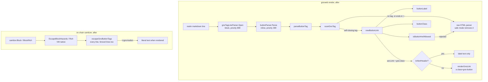

# `<gno-button />`: a link drawn as a button in realm markdown

Written by claude-opus-5-5, effort high.

PR: [gnolang/gno#6298](https://github.com/gnolang/gno/pull/6298)

## TLDR

Before, gnoweb had no button tag: `<gno-button … />` was unknown raw HTML,
and safe mode removed it. After, `ExtButtons` reads a self-closing
`<gno-button href="…" label="…" variant="…" />` anywhere on a line and emits
an ordinary link node, so the link pipeline resolves the href and the CSS
draws it as a green or alert-coloured button. Because a button looks like
the realm's own chrome, the on-chain sanitizer native `EscapeBlockHazards`
now escapes every `<gno-button`, so user text passed through `sanitize.Block`
or `BlockRich` can never render one. It supersedes
[#4481](https://github.com/gnolang/gno/pull/4481), whose `{Label | options}(url)`
shorthand and `<tag>text</tag>` form are gone.

## What the button is

A realm writes one tag, on its own line or inside a sentence, and gnoweb shows
a clickable button that navigates like a markdown link. The docs realm
documents it under
[`### Buttons`](https://github.com/gnolang/gno/blob/065ec369b/examples/quarantined/gno.land/r/docs/markdown/markdown.gno#L866) · [↗](../../../../.worktrees/gno-review-6298/examples/quarantined/gno.land/r/docs/markdown/markdown.gno#L866).

The tag after the change, as a realm writes it:

```markdown
<gno-button href="/r/gnoland/blog" label="Read the blog" />
Ready? <gno-button href="https://gno.land" label="Visit gno.land" variant="outline" />
```

- `href`, required: resolved like a markdown link destination.
- `label`, required: plain text, never parsed as markdown.
- `variant`, optional: `outline` and the six alert kinds, space-separated and
  combinable, unknown words ignored.

A tag that is not self-closing, lacks `href` or `label`, spans two lines, or
carries a rejected href stays raw HTML, which safe mode removes.

## How it works, in 5 steps

The after state, following one tag through the parser and the renderer.

1. **The line opens a paragraph.**
   [`gnoTagLineParser.Open`](https://github.com/gnolang/gno/blob/065ec369b/gno.land/pkg/gnoweb/markdown/utils.go#L157) · [↗](../../../../.worktrees/gno-review-6298/gno.land/pkg/gnoweb/markdown/utils.go#L157)
   sees `<gno-button` at the start of the line and hands it to goldmark's
   paragraph parser, at priority 899 ahead of the HTML block parser at 900.
   Without it the line would be a CommonMark type-7 HTML block and be removed
   together with every line up to the next blank one.
2. **The inline parser reads the tag.** On every `<`, `buttonParser.Parse`
   calls `parseButtonTag`, which calls `scanGnoTag`. Input
   `<gno-button href="/r/test" label="Delete" variant="outline caution" />`
   yields `size` = the tag's byte length, `href` = `/r/test`,
   `label` = `Delete`, `variant` = `outline caution`, all aliasing the source
   bytes.
3. **The tag becomes a link node.** `newButtonLink` cleans the label with
   `buttonLabel`, checks the href with `isButtonHrefAllowed`, and builds an
   `*ast.Link` whose `Destination` is `/r/test`, whose `gno:class` attribute
   is `gno-button gno-button-outline gno-button-caution`, and whose one child
   is the raw label text `Delete`.
4. **The link renderer writes the anchor.** `renderGnoLink` resolves the
   destination, adds the internal or external marker, `rel` on external
   links, and the `class` read from `gno:class`:
   `<a href="/r/test" class="gno-button gno-button-outline gno-button-caution">Delete</a>`.
5. **The CSS draws it.** The `BUTTON COMPONENT` block styles `.gno-button`;
   each variant class only sets four colour variables.

## How the parse and the escape work

The after state. The left path is gnoweb rendering realm markdown; the right
path is a realm passing user text through `sanitize.Block` before rendering it.



- `gnoTagLineParser.Open` decides whether a line starting with the tag name
  becomes a paragraph. It matches the name alone, so a tag too long or
  malformed for the scanner still never turns the line into an HTML block.
- `scanGnoTag` decides where a tag ends and what its attributes are. It reads
  one line at most, stops at `maxButtonTagLen` = 2048 bytes and at the next
  `<`, does not decode entities, and allocates nothing.
- `parseButtonTag` keeps the first `href`, `label` and `variant`, as HTML
  does, and rejects a tag ending in `>` rather than `/>`.
- `buttonLabel` decodes entities once, removes bidi, zero-width and control
  characters, turns a line break or tab into a space, then trims.
- `isButtonHrefAllowed` rejects what `IsDangerousURL` flags, every `data:`
  URI, and any control byte in the resolved destination.
- `buttonClass` emits one class per whitelisted variant word, in the fixed
  order of `buttonVariants`.
- `inAlertHeader` reduces a button in an alert title to its label, since the
  title renders as `<summary>`, which must not hold a link.
- `escapeGnoButtonTags` puts a backslash before every unescaped
  `<gno-button`, case-insensitively, anywhere on the line.

## Before and after

One row per place the tag enters. Before is the merge base; after is the head.

| Where the tag enters | Before | After |
| --- | --- | --- |
| Realm markdown, tag alone on a line | the line and every line up to the next blank one become one HTML block, removed by safe mode, through goldmark's HTML block parser | a paragraph holding a button, through `gnoTagLineParser` then `buttonParser` |
| Realm markdown, tag inside a sentence | `<!-- raw HTML omitted -->`, through goldmark's raw HTML inline parser | a button inside the sentence, through `buttonParser` |
| Inside `<gno-foreign>` | removed as raw HTML | still removed: `ExtButtons` is registered outside the foreign sandbox, through `GnoExtension.Extend` |
| Alert title | removed as raw HTML | the label as plain text, through `inAlertHeader` |
| User text through `sanitize.Block` or `BlockRich` | `<gno-button` left as written, then removed by safe mode at render | escaped to `\<gno-button` everywhere, code spans and fenced lines included, through `escapeGnoButtonTags` |
| A `<gno-…>` delimiter line indented 1 to 3 columns, through `sanitize.Block` | backslash at line start, ahead of the indent: `\  <gno-card>` | backslash after the indent, right before the `<`: `  \<gno-card>`, through `indentColumns` |
| A `<gno-…>` delimiter line indented 4 columns or more | backslash at line start | unchanged, backslash at line start, so indented code shows no backslash inside it |

## What a user notices

Each effect below is decided by the markdown a realm returns, the same for
every browser and account.

- A realm can show filled or outlined buttons, coloured like the alert kinds.
  The light and dark captures are in the pull request body.
- Hovering a button thickens its border instead of fading its fill.
- A button in user content passed through `sanitize.Block`, `BlockRich`,
  `Blockquote` or `BlockquoteRich` renders as literal text. Inside a code span
  in that content the backslash shows: `` `<gno-button />` `` reads as
  `\<gno-button />`.

The decision table below is copied from the head's golden files under
`golden/ext_buttons/` and `golden/sanitize/`, which the package tests compare
against; it shows the after state.

| Input | Rendered output, after |
| --- | --- |
| `<gno-button href="/r/test" label="Delete" variant="outline caution" />` | `<a href="/r/test" class="gno-button gno-button-outline gno-button-caution">Delete</a>` |
| `variant="caution  outline caution"` | same classes: order and duplicates are ignored |
| `href="javascript:alert(1)"`, `href="&#x6a;avascript:…"`, `href="java&#x09;script:…"` | `<!-- raw HTML omitted -->` |
| `href="vbscript:msgbox(1)"`, `href="file:///etc/passwd"` | `<!-- raw HTML omitted -->` |
| `href="&amp;#x6a;avascript:alert(1)"`, decoded once | `<a href="&amp;#x6a;avascript:alert(1)" class="gno-button">`, a relative link |
| `> [!NOTE] Read <gno-button … label="the guide" />` | `Read the guide` as text inside `<summary>` |
| tag inside `<gno-foreign>` | `<!-- raw HTML omitted -->` |
| `hi <gno-button … />` through `sanitize.Block` | `hi \<gno-button … />`, shown as text |

## Upgrading

`EscapeBlockHazards` and `EscapeBlockHazardsRich` live in
`gnovm/stdlibs/chain/markdown`, a Go native the VM calls, so their output for
any input holding `<gno-button` differs between a node built before and one
built after. Per the code, inputs without that substring and without a
`<gno-…>` delimiter line indented 1 to 3 columns return the same bytes. In the examples tree,
the one realm calling `sanitize.Block` is `r/nt/commondao/v0`, from its
`Render` path at
[`render.gno:441`](https://github.com/gnolang/gno/blob/065ec369b/examples/gno.land/r/nt/commondao/v0/render.gno#L441) · [↗](../../../../.worktrees/gno-review-6298/examples/gno.land/r/nt/commondao/v0/render.gno#L441),
where it sanitizes the stored text each time the page renders.

## Read the code in this order

1. [`ext.go:96`](https://github.com/gnolang/gno/blob/065ec369b/gno.land/pkg/gnoweb/markdown/ext.go#L96) · [↗](../../../../.worktrees/gno-review-6298/gno.land/pkg/gnoweb/markdown/ext.go#L96)
   registers the extension on the outer parser only. Registered inside
   `ExtForeign`, foreign content could draw first-party buttons.

   ```go
   	ExtButtons.Extend(m)
   ```

2. [`ext_buttons.go:184-191`](https://github.com/gnolang/gno/blob/065ec369b/gno.land/pkg/gnoweb/markdown/ext_buttons.go#L184-L191) · [↗](../../../../.worktrees/gno-review-6298/gno.land/pkg/gnoweb/markdown/ext_buttons.go#L184)
   sets the two priorities. One step later than goldmark's raw HTML parsers
   and the tag is gone before the button parser sees it.

   ```go
   		parser.WithInlineParsers(
   			util.Prioritized(&buttonParser{}, 399),
   		),
   		parser.WithBlockParsers(
   			util.Prioritized(newGnoTagLineParser(buttonTagPrefix), 899),
   		),
   ```

3. [`utils.go:54`](https://github.com/gnolang/gno/blob/065ec369b/gno.land/pkg/gnoweb/markdown/utils.go#L54) · [↗](../../../../.worktrees/gno-review-6298/gno.land/pkg/gnoweb/markdown/utils.go#L54)
   is `scanGnoTag`, the scanner shared byte for byte with
   [#6297](https://github.com/gnolang/gno/pull/6297) and
   [#6299](https://github.com/gnolang/gno/pull/6299). A wrong end offset
   eats or leaves text after the button; a missing cap makes a line of
   unclosed tags quadratic.

   ```go
   	src = src[:min(len(src), maxLen)]
   	if eol := bytes.IndexByte(src, '\n'); eol >= 0 {
   		src = src[:eol] // a tag spans one line
   	}
   ```

4. [`ext_buttons.go:115`](https://github.com/gnolang/gno/blob/065ec369b/gno.land/pkg/gnoweb/markdown/ext_buttons.go#L115) · [↗](../../../../.worktrees/gno-review-6298/gno.land/pkg/gnoweb/markdown/ext_buttons.go#L115)
   is `isButtonHrefAllowed`. It checks the bytes `resolveDestination`
   produces, the same bytes the renderer emits, so a check on the raw
   attribute would miss an entity-encoded scheme.

   ```go
   	dest := trimLeadingControlAndSpace(resolveDestination(href))
   	if bytes.ContainsFunc(dest, func(r rune) bool { return r < ' ' || r == 0x7f }) {
   		return false
   	}
   	return !mdhtml.IsDangerousURL(dest) && !(len(dest) >= 5 && bytes.EqualFold(dest[:5], []byte("data:")))
   ```

5. [`ext_links.go:352-354`](https://github.com/gnolang/gno/blob/065ec369b/gno.land/pkg/gnoweb/markdown/ext_links.go#L352-L354) · [↗](../../../../.worktrees/gno-review-6298/gno.land/pkg/gnoweb/markdown/ext_links.go#L352)
   writes the class. The attribute name `gno:class`, declared at
   [`ext_links.go:129`](https://github.com/gnolang/gno/blob/065ec369b/gno.land/pkg/gnoweb/markdown/ext_links.go#L129) · [↗](../../../../.worktrees/gno-review-6298/gno.land/pkg/gnoweb/markdown/ext_links.go#L129),
   is not one a markdown `{.class}` attribute can set.

   ```go
   		if class, ok := n.Attribute(linkClassAttr); ok {
   			attrs = append(attrs, attr{"class", class.(string)})
   		}
   ```

6. [`markdown.go:595`](https://github.com/gnolang/gno/blob/065ec369b/gnovm/stdlibs/chain/markdown/markdown.go#L595) · [↗](../../../../.worktrees/gno-review-6298/gnovm/stdlibs/chain/markdown/markdown.go#L595)
   is `escapeGnoButtonTags`, in the VM native. It skips a byte after `\`, so
   running it twice adds no second backslash. It is called on every line at
   [`markdown.go:427`](https://github.com/gnolang/gno/blob/065ec369b/gnovm/stdlibs/chain/markdown/markdown.go#L427) · [↗](../../../../.worktrees/gno-review-6298/gnovm/stdlibs/chain/markdown/markdown.go#L427)
   and on fenced lines at
   [`markdown.go:413`](https://github.com/gnolang/gno/blob/065ec369b/gnovm/stdlibs/chain/markdown/markdown.go#L413) · [↗](../../../../.worktrees/gno-review-6298/gnovm/stdlibs/chain/markdown/markdown.go#L413).
   A tag it misses renders as a live button inside sanitized user text.

   ```go
   		case '\\':
   			i++ // the next byte is escaped
   		case '<':
   			if hasCaseInsensitivePrefix(line[i:], gnoButtonTag) {
   ```

7. [`06-blocks.css:3229`](https://github.com/gnolang/gno/blob/065ec369b/gno.land/pkg/gnoweb/frontend/css/06-blocks.css#L3229) · [↗](../../../../.worktrees/gno-review-6298/gno.land/pkg/gnoweb/frontend/css/06-blocks.css#L3229)
   opens the `BUTTON COMPONENT` block. It shares no selector with gnoweb's
   own `.b-btn`, so a UI restyle leaves realm buttons alone.

The design record is the ADR at
[`prxxxx_gnoweb_button.md`](https://github.com/gnolang/gno/blob/065ec369b/gno.land/adr/prxxxx_gnoweb_button.md?plain=1#L1) · [↗](../../../../.worktrees/gno-review-6298/gno.land/adr/prxxxx_gnoweb_button.md),
and the sanitizer trade-off is written up in
[`SANITIZE.md`](https://github.com/gnolang/gno/blob/065ec369b/gno.land/pkg/gnoweb/markdown/SANITIZE.md?plain=1#L137) · [↗](../../../../.worktrees/gno-review-6298/gno.land/pkg/gnoweb/markdown/SANITIZE.md#L137).

## Words used here

| Name | What it is |
| --- | --- |
| [`ExtButtons`](https://github.com/gnolang/gno/blob/065ec369b/gno.land/pkg/gnoweb/markdown/ext_buttons.go#L184) · [↗](../../../../.worktrees/gno-review-6298/gno.land/pkg/gnoweb/markdown/ext_buttons.go#L184) | The goldmark extension that registers the button's block and inline parsers; rendering reuses the link extension. |
| [`scanGnoTag`](https://github.com/gnolang/gno/blob/065ec369b/gno.land/pkg/gnoweb/markdown/utils.go#L54) · [↗](../../../../.worktrees/gno-review-6298/gno.land/pkg/gnoweb/markdown/utils.go#L54) | Reads one `<name …>` tag at the start of a byte slice, on one line and within a byte cap, and reports its length and whether it ends in `/>`. |
| [`maxButtonTagLen`](https://github.com/gnolang/gno/blob/065ec369b/gno.land/pkg/gnoweb/markdown/ext_buttons.go#L39) · [↗](../../../../.worktrees/gno-review-6298/gno.land/pkg/gnoweb/markdown/ext_buttons.go#L39) | The scanner's cap for a button tag: 2048 bytes. |
| [`gnoTagLineParser`](https://github.com/gnolang/gno/blob/065ec369b/gno.land/pkg/gnoweb/markdown/utils.go#L144) · [↗](../../../../.worktrees/gno-review-6298/gno.land/pkg/gnoweb/markdown/utils.go#L144) | A block parser that opens a plain paragraph when a line, after leading spaces, starts with `<gno-button`. |
| type-7 HTML block | CommonMark's catch-all HTML block: a line starting with an unknown complete tag, which takes every line up to the next blank one. |
| [`buttonVariants`](https://github.com/gnolang/gno/blob/065ec369b/gno.land/pkg/gnoweb/markdown/ext_buttons.go#L33) · [↗](../../../../.worktrees/gno-review-6298/gno.land/pkg/gnoweb/markdown/ext_buttons.go#L33) | The seven accepted `variant` words: `outline`, `caution`, `warning`, `info`, `note`, `tip`, `success`. |
| [`linkClassAttr`](https://github.com/gnolang/gno/blob/065ec369b/gno.land/pkg/gnoweb/markdown/ext_links.go#L129) · [↗](../../../../.worktrees/gno-review-6298/gno.land/pkg/gnoweb/markdown/ext_links.go#L129) | The node attribute `gno:class`, which the link renderer copies into the anchor's `class`. |
| [`sanitize.Block`](https://github.com/gnolang/gno/blob/065ec369b/examples/gno.land/p/nt/markdown/sanitize/v0/sanitize.gno#L437) · [↗](../../../../.worktrees/gno-review-6298/examples/gno.land/p/nt/markdown/sanitize/v0/sanitize.gno#L437) | The strict Gno sanitizer for multi-line user text; it calls `EscapeBlockHazards`. |
| [`sanitize.BlockRich`](https://github.com/gnolang/gno/blob/065ec369b/examples/gno.land/p/nt/markdown/sanitize/v0/sanitize.gno#L615) · [↗](../../../../.worktrees/gno-review-6298/examples/gno.land/p/nt/markdown/sanitize/v0/sanitize.gno#L615) | The permissive variant that keeps headings, lists and tables; it calls `EscapeBlockHazardsRich`. |
| [`EscapeBlockHazards`](https://github.com/gnolang/gno/blob/065ec369b/gnovm/stdlibs/chain/markdown/markdown.go#L345) · [↗](../../../../.worktrees/gno-review-6298/gnovm/stdlibs/chain/markdown/markdown.go#L345) | A Go function exposed to Gno code as a VM native; its output is part of what a node computes. |
| [`indentColumns`](https://github.com/gnolang/gno/blob/065ec369b/gnovm/stdlibs/chain/markdown/markdown.go#L574) · [↗](../../../../.worktrees/gno-review-6298/gnovm/stdlibs/chain/markdown/markdown.go#L574) | The width of leading spaces and tabs, a tab advancing to the next multiple of 4; 4 or more makes the line indented code. |
| [`<gno-foreign>`](https://github.com/gnolang/gno/blob/065ec369b/gno.land/pkg/gnoweb/markdown/ext.go#L76) · [↗](../../../../.worktrees/gno-review-6298/gno.land/pkg/gnoweb/markdown/ext.go#L76) | The sandbox block for content a realm did not write; it runs its own parser without forms or buttons. |
