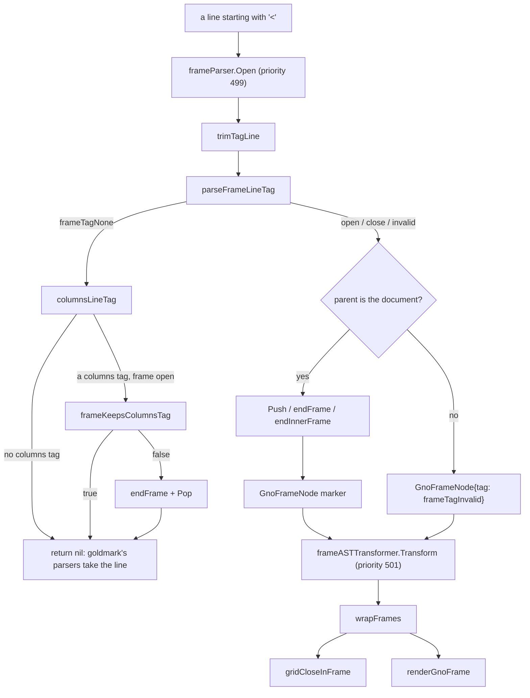

# `<gno-frame>`: `ExtFrames`, a bordered block for gnoweb markdown

Written by claude-opus-5-5, high effort.
PR: [gnolang/gno#6299](https://github.com/gnolang/gno/pull/6299)

## TLDR

Before this change, realm markdown rendered in production had no way to draw
a border around a block: safe mode strips a raw `<div class="...">`. After
it, `<gno-frame>` and `</gno-frame>`, each alone on a line, wrap the markdown
between them in `<section class="gno-frame">`, drawn as a thin rounded
border. A frame alone in a column of a `<gno-columns>` grid becomes a card
that fills the column, so cards in one row share a height. The change also
fixes a `<gno-form>` inside a blockquote, which used to open a nested quote
after the form.

## What `<gno-frame>` is

A realm author writes this in `Render` output or a static page:

```markdown
<gno-frame>
## Build on gno.land

Write your first realm in minutes. [Get started](/r/docs/home)
</gno-frame>
```

gnoweb draws a thin rounded border around the heading and the paragraph,
with padding, on a transparent background. The same tag inside a column of a
grid draws a card, which is how a page builds a grid of apps with a bold
link title and a short description each. The documentation realm gains a
"Frames" section next to Columns, in
[`markdown.gno:387`](https://github.com/alexiscolin/gno/blob/1f9bf51d8/examples/quarantined/gno.land/r/docs/markdown/markdown.gno#L387)
· [↗](../../../../.worktrees/gno-review-6299/examples/quarantined/gno.land/r/docs/markdown/markdown.gno#L387).

The rules an author meets, stated in the
[docs note](https://github.com/alexiscolin/gno/blob/1f9bf51d8/examples/quarantined/gno.land/r/docs/markdown/markdown.gno#L486)
· [↗](../../../../.worktrees/gno-review-6299/examples/quarantined/gno.land/r/docs/markdown/markdown.gno#L486):

- A frame tag takes no attributes. `<gno-frame class="x">` renders as an
  HTML comment and the content stays, unframed.
- A frame opens only at the top level of the page or of a column. Inside a
  list, a quote or an alert the tag renders as an HTML comment.
- A frame directly inside a frame is refused. The one nesting allowed is a
  card in a column of a grid that is itself inside a frame.
- A grid opened inside a frame must close before the frame does.

## How it works, in 5 steps

The example is the input above. The tags are flat markers, as for
`<gno-columns>`: the parser never treats a frame as a container, and a
transformer builds the nesting afterwards.

1. **The open line becomes a marker.** `frameParser.Open` sees the line
   `<gno-frame>` whose parent is the document. `trimTagLine` strips up to
   three leading spaces and the trailing whitespace, `parseFrameLineTag`
   returns `frameTagOpen`, `Push` raises the shared gno-* nesting depth from
   0 to 1, and the parser context records `frameOpenKey = true`. The result
   is a one-line leaf, `GnoFrameNode{tag: frameTagOpen}`.
2. **The lines between parse as ordinary top-level blocks.** goldmark routes
   `## Build on gno.land` and the paragraph by its own rules. They land as
   siblings of the marker, not as its children.
3. **The close line becomes a marker.** `</gno-frame>` yields
   `GnoFrameNode{tag: frameTagClose}`, and `endFrame` resets the frame keys
   and pops the depth back to 0.
4. **The transformer nests the blocks.** `frameASTTransformer` runs at
   priority 501, after the columns transformer at 500. `wrapFrames` moves
   each block after the open marker under it, up to the close marker, which
   it removes.

   The document's children, after parsing, step 3:
   `[GnoFrameNode(open), Heading, Paragraph, GnoFrameNode(close)]`

   The document's children, after `wrapFrames`, step 4:
   `[GnoFrameNode(open) [Heading, Paragraph]]`
5. **The renderer writes constant markup.** `renderGnoFrame` writes
   `<section class="gno-frame">` on entering and `</section>` on leaving. No
   source byte reaches the wrapper. The CSS rule `.gno-frame` draws the
   border, and `.gno-column > .gno-frame:only-child` turns a frame alone in a
   column into a card with `height: 100%`.

The output for that input, after the change, is the expected output of the
golden `golden/ext_frame/valid_basic.md.txtar`, abbreviated with `…`:

```html
<section class="gno-frame">
<h2>Build on gno.land</h2>
<p>Write <strong>realms</strong> in Gno. <a href="/r/docs/home">Get started…</a></p>
…
</section>
<p>After the frame.</p>
```

## The parts, at a glance

The table lists the code after the change.

| Part | File | Job |
| --- | --- | --- |
| `GnoFrameNode`, `KindGnoFrame` | [`ext_frame.go:26-34`](https://github.com/alexiscolin/gno/blob/1f9bf51d8/gno.land/pkg/gnoweb/markdown/ext_frame.go#L26-L34) · [↗](../../../../.worktrees/gno-review-6299/gno.land/pkg/gnoweb/markdown/ext_frame.go#L26) | The AST node: a marker while parsing, the container after the transformer. `inner` marks a card in a framed grid. |
| `parseFrameLineTag` | [`ext_frame.go:70-88`](https://github.com/alexiscolin/gno/blob/1f9bf51d8/gno.land/pkg/gnoweb/markdown/ext_frame.go#L70-L88) · [↗](../../../../.worktrees/gno-review-6299/gno.land/pkg/gnoweb/markdown/ext_frame.go#L70) | Classifies one trimmed line as open, close, invalid or no tag. |
| `frameParser` | [`ext_frame.go:197-236`](https://github.com/alexiscolin/gno/blob/1f9bf51d8/gno.land/pkg/gnoweb/markdown/ext_frame.go#L197-L236) · [↗](../../../../.worktrees/gno-review-6299/gno.land/pkg/gnoweb/markdown/ext_frame.go#L197) | Block parser at priority 499: emits markers and ends a frame on a columns tag that would split a grid. |
| `frameKeepsColumnsTag` | [`ext_frame.go:153-177`](https://github.com/alexiscolin/gno/blob/1f9bf51d8/gno.land/pkg/gnoweb/markdown/ext_frame.go#L153-L177) · [↗](../../../../.worktrees/gno-review-6299/gno.land/pkg/gnoweb/markdown/ext_frame.go#L153) | Decides whether a `<gno-columns>`, `<gno-columns-sep>` or `</gno-columns>` line stays inside the open frame. |
| `frameHTMLBlockParser` | [`ext_frame.go:256-275`](https://github.com/alexiscolin/gno/blob/1f9bf51d8/gno.land/pkg/gnoweb/markdown/ext_frame.go#L256-L275) · [↗](../../../../.worktrees/gno-review-6299/gno.land/pkg/gnoweb/markdown/ext_frame.go#L256) | goldmark's HTML block parser, wrapped at priority 899 so a frame close or columns tag ends an HTML block while a frame is open. |
| `frameASTTransformer`, `wrapFrames`, `gridCloseInFrame` | [`ext_frame.go:286-356`](https://github.com/alexiscolin/gno/blob/1f9bf51d8/gno.land/pkg/gnoweb/markdown/ext_frame.go#L286-L356) · [↗](../../../../.worktrees/gno-review-6299/gno.land/pkg/gnoweb/markdown/ext_frame.go#L286) | Nest the blocks under each open marker and pop the depth of frames left open at the end of the page. |
| `renderGnoFrame` | [`ext_frame.go:369-381`](https://github.com/alexiscolin/gno/blob/1f9bf51d8/gno.land/pkg/gnoweb/markdown/ext_frame.go#L369-L381) · [↗](../../../../.worktrees/gno-review-6299/gno.land/pkg/gnoweb/markdown/ext_frame.go#L369) | Writes `<section class="gno-frame">`, or the comment `<!-- unexpected/invalid frame tag omitted -->` for any marker that is not a valid open. |
| `ExtFrames` registration | [`ext.go:82`](https://github.com/alexiscolin/gno/blob/1f9bf51d8/gno.land/pkg/gnoweb/markdown/ext.go#L82) · [↗](../../../../.worktrees/gno-review-6299/gno.land/pkg/gnoweb/markdown/ext.go#L82), [`ext_foreign.go:444`](https://github.com/alexiscolin/gno/blob/1f9bf51d8/gno.land/pkg/gnoweb/markdown/ext_foreign.go#L444) · [↗](../../../../.worktrees/gno-review-6299/gno.land/pkg/gnoweb/markdown/ext_foreign.go#L444) | Loads the extension in the main renderer and in the `<gno-foreign>` sandbox instance. |
| `GnoColumnNode.inFrame` | [`ext_columns.go:48-50`](https://github.com/alexiscolin/gno/blob/1f9bf51d8/gno.land/pkg/gnoweb/markdown/ext_columns.go#L48-L50) · [↗](../../../../.worktrees/gno-review-6299/gno.land/pkg/gnoweb/markdown/ext_columns.go#L48), set at [`ext_columns.go:199`](https://github.com/alexiscolin/gno/blob/1f9bf51d8/gno.land/pkg/gnoweb/markdown/ext_columns.go#L199) · [↗](../../../../.worktrees/gno-review-6299/gno.land/pkg/gnoweb/markdown/ext_columns.go#L199) | Marks a grid opener that opened inside a frame, read by `gridCloseInFrame`. |
| `scanGnoTag`, `hasGnoTagPrefix`, `trimTagLine` | [`utils.go:54`](https://github.com/alexiscolin/gno/blob/1f9bf51d8/gno.land/pkg/gnoweb/markdown/utils.go#L54) · [↗](../../../../.worktrees/gno-review-6299/gno.land/pkg/gnoweb/markdown/utils.go#L54), [`utils.go:121`](https://github.com/alexiscolin/gno/blob/1f9bf51d8/gno.land/pkg/gnoweb/markdown/utils.go#L121) · [↗](../../../../.worktrees/gno-review-6299/gno.land/pkg/gnoweb/markdown/utils.go#L121), [`utils.go:219-225`](https://github.com/alexiscolin/gno/blob/1f9bf51d8/gno.land/pkg/gnoweb/markdown/utils.go#L219-L225) · [↗](../../../../.worktrees/gno-review-6299/gno.land/pkg/gnoweb/markdown/utils.go#L219) | Tag scanning without allocation, and the line trim shared with `<gno-foreign>`. |
| `.gno-frame` CSS | [`06-blocks.css:2641-2668`](https://github.com/alexiscolin/gno/blob/1f9bf51d8/gno.land/pkg/gnoweb/frontend/css/06-blocks.css#L2641-L2668) · [↗](../../../../.worktrees/gno-review-6299/gno.land/pkg/gnoweb/frontend/css/06-blocks.css#L2641) | Border, radius and padding; the card rule; the grid spacing inside a frame. |
| ADR | [`pr6299_gnoweb_frame.md`](https://github.com/alexiscolin/gno/blob/1f9bf51d8/gno.land/adr/pr6299_gnoweb_frame.md?plain=1#L1) · [↗](../../../../.worktrees/gno-review-6299/gno.land/adr/pr6299_gnoweb_frame.md) | The decision record, with the rejected container design. |

## How the frame parse works

The diagram shows the code after the change. Each node is a function; a
solid arrow is a call, a labelled arrow a branch.



- `frameParser.Open` decides whether a line is a frame marker. It returns an
  invalid leaf rather than `nil` for any refused frame tag, since `nil`
  hands the line to goldmark's type-7 HTML block parser, which takes every
  line up to the next blank one.
- `parseFrameLineTag` decides the tag kind. Text after the tag makes it no
  tag at all, so `<gno-frame> hello` stays a paragraph; an attribute or
  `/>` makes it invalid.
- `columnsLineTag` decides whether a non-frame line is a gno-columns tag,
  checking the three prefixes before calling the columns tokenizer.
- `frameKeepsColumnsTag` decides whether that columns tag stays in the
  frame. A new grid stays while the depth is under `MaxGnoNestDepth`; a
  separator or close stays only for a grid opened inside this frame. Any
  other columns tag ends the frame, so a grid is never half inside.
- `frameHTMLBlockParser.Continue` decides whether a frame close or a
  columns tag line ends an HTML block at document level. With no frame
  open, its `Open` returns `nil` and goldmark's own HTML block parser
  handles the line.
- `wrapFrames` decides which siblings each open marker takes. It stops at
  the matching close marker, which it removes, or at a columns marker whose
  grid does not close inside the frame.
- `gridCloseInFrame` decides whether a grid opened in a frame closes before
  the frame's own close. It scans forward and stops at the first outer frame
  close, which keeps the work linear.
- `renderGnoFrame` writes the wrapper for a valid open marker and a comment
  for every other marker.

The parser's core, copied from the head
[`ext_frame.go:217-235`](https://github.com/alexiscolin/gno/blob/1f9bf51d8/gno.land/pkg/gnoweb/markdown/ext_frame.go#L217-L235)
· [↗](../../../../.worktrees/gno-review-6299/gno.land/pkg/gnoweb/markdown/ext_frame.go#L217),
after the change:

```go
	reader.AdvanceToEOL()
	node := &GnoFrameNode{tag: frameTagInvalid}
	open := frameOpen(pc)
	switch {
	case !atDoc:
	case kind == frameTagOpen && !open && Push(pc): // the cap spans all gno-* blocks
		node.tag = frameTagOpen
		pc.Set(frameOpenKey, true)
	case kind == frameTagOpen && frameGrid(pc) && gridOpen(pc) && !frameInner(pc) && Push(pc):
		node.tag, node.inner = frameTagOpen, true
		pc.Set(frameInnerKey, true)
	case kind == frameTagClose && frameInner(pc):
		node.tag, node.inner = frameTagClose, true
		endInnerFrame(pc)
	case kind == frameTagClose && open:
		node.tag = frameTagClose
		endFrame(pc)
	}
	return node, parser.NoChildren
```

### Inputs and what they render to

Each row is a golden file of the PR, after the change: its input and its
expected output, abbreviated. `go test -run
'TestGnoExtension/ext_fr|TestGnoExtension/ext_forms|TestSanitizeIntegration/.*frame'`
in `gno.land/pkg/gnoweb/markdown` at the head answers `ok`.

| Golden | Input | Output |
| --- | --- | --- |
| `ext_frame/valid_in_columns` | two frames, one per column of a grid | each column holds one `<section class="gno-frame">`, drawn as a card |
| `ext_frame/valid_cards_in_framed_grid` | a frame holding a grid whose first column holds a frame | an outer section holding the grid, the card inside column 0 |
| `ext_frame/invalid_attrs_rejected` | `<gno-frame class="x" style="color:red" onclick="alert(1)">` | the comment, `<p>content</p>`, the comment |
| `ext_frame/invalid_trailing_text` | `<gno-frame> hello` | `<p><!-- raw HTML omitted --> hello …</p>` |
| `ext_frame/invalid_in_list` | the tags indented under `- item` | both tags become the comment inside the `<li>` |
| `ext_frame/html_block_before_close` | `<div class="x">` on the line before `</gno-frame>` | the div is stripped and the frame closes at its tag |
| `ext_frame/columns_open_outside_close_in_frame` | a frame opened in a column, then `</gno-columns>` before `</gno-frame>` | the frame ends at `</gno-columns>`; the later `</gno-frame>` becomes the comment |

## Before and after

This table covers the existing behaviour the PR touches outside the new tag.

| Input or place | Before | After |
| --- | --- | --- |
| `> <gno-form>` … `> </gno-form>` then `> quoted after` | the line after the form opens a second `<blockquote>` nested in the first, through `FormParser.Continue` calling `reader.AdvanceLine()` at [base `ext_forms.go:268`](https://github.com/gnolang/gno/blob/41841e92f/gno.land/pkg/gnoweb/markdown/ext_forms.go#L268) · [↗](../../../../.worktrees/gno-review-6299-base/gno.land/pkg/gnoweb/markdown/ext_forms.go#L268) | `quoted after` stays a paragraph of the same quote, through `reader.AdvanceToEOL()` at [`ext_forms.go:268-271`](https://github.com/alexiscolin/gno/blob/1f9bf51d8/gno.land/pkg/gnoweb/markdown/ext_forms.go#L268-L271) · [↗](../../../../.worktrees/gno-review-6299/gno.land/pkg/gnoweb/markdown/ext_forms.go#L268) |
| a `<gno-foreign>` body | the sandbox instance loads columns and alerts | it also loads `ExtFrames`, so a frame renders inside the sandbox |
| `<gno-foreign>` tag lines | trimmed by `trimForeignLine` in `ext_foreign.go` | trimmed by `trimTagLine` in `utils.go`, the same body under a new name |
| `.gno-columns` gap | `gap: var(--g-space-10)`, `--g-space-12` on large screens | the same two values through a `--columns-gap` variable, which the card-row margin reuses |

The before row for the form comes from rendering that input through
`NewGnoExtension` in a throwaway test at the merge base: the output held
`<blockquote>` twice. The after row is the expected output of the new golden
`golden/ext_forms/valid_form_in_blockquote.md.txtar`, a single
`<blockquote>`. The form fix is outside the frame feature; the ADR lists it
as a side fix at
[`pr6299_gnoweb_frame.md:103`](https://github.com/alexiscolin/gno/blob/1f9bf51d8/gno.land/adr/pr6299_gnoweb_frame.md?plain=1#L103)
· [↗](../../../../.worktrees/gno-review-6299/gno.land/adr/pr6299_gnoweb_frame.md#L103).

## How sanitized user content meets a frame

A realm that prints user text through `sanitize.Block` or `sanitize.BlockRich`
from `gno.land/p/nt/markdown/sanitize/v0` relies on those helpers to stop the
text from opening a gnoweb block. The PR changes nothing under `gnovm/` or
`examples/gno.land/p/`; the escape it relies on already exists, before and
after.

The existing rule is `isExtDelimiter` in the `chain/markdown` stdlib, which
both helpers call. It matches any line whose first character after spaces
and tabs is `<`, then an optional `/`, then `gno-` in any case, so a new
gno-* tag is covered without a sanitizer change. A matching line gets a
leading backslash, so it no longer starts with `<` and opens no block:
`\<gno-frame>` renders as the text `&lt;gno-frame&gt;`, and an indented
`\   <gno-frame>` renders as stripped inline HTML. The code, unchanged
by the PR, at
[`markdown.go:548-559`](https://github.com/alexiscolin/gno/blob/1f9bf51d8/gnovm/stdlibs/chain/markdown/markdown.go#L548-L559)
· [↗](../../../../.worktrees/gno-review-6299/gnovm/stdlibs/chain/markdown/markdown.go#L548),
called at
[`markdown.go:430`](https://github.com/alexiscolin/gno/blob/1f9bf51d8/gnovm/stdlibs/chain/markdown/markdown.go#L430)
· [↗](../../../../.worktrees/gno-review-6299/gnovm/stdlibs/chain/markdown/markdown.go#L430):

```go
func isExtDelimiter(line string) bool {
	trim := strings.TrimLeft(line, " \t")
	if len(trim) == 0 || trim[0] != '<' {
		return false
	}
	rest := trim[1:]
	// Optional `/` for close tags.
	if len(rest) > 0 && rest[0] == '/' {
		rest = rest[1:]
	}
	return hasCaseInsensitivePrefix(rest, "gno-")
}
```

A frame tag after `> ` or `- ` never opens a frame: the frame parser only
opens one at the top level, so it renders as the invalid-tag comment.

The PR adds 11 sanitize fixtures under `golden/sanitize/`, each rendering the
helper's output inside a realm template that holds its own frame:

| Fixture | Helper | Shape tested |
| --- | --- | --- |
| `block-gno-frame-escaped` | `Block` | a bare open and close pair |
| `blockrich-gno-frame-escaped` | `BlockRich` | a bare open and close pair |
| `blockrich-gno-frame-uppercase` | `BlockRich` | the tags in upper case |
| `blockrich-gno-frame-indented` | `BlockRich` | the tags indented by three spaces |
| `blockrich-gno-frame-in-blockquote` | `BlockRich` | the tag after `> ` |
| `blockrich-gno-frame-in-list` | `BlockRich` | the tag inside a list item |
| `blockrich-gno-frame-ctx-lazy-quote` | `BlockRich` | user text in a lazy blockquote continuation |
| `blockrich-gno-frame-ctx-spoofed-close` | `BlockRich` | user text writing the realm's `</gno-frame>` |
| `blockrich-gno-frame-ctx-unclosed-comment` | `BlockRich` | an unclosed `<!--` before the realm's close |
| `blockrich-gno-frame-ctx-unclosed-div` | `BlockRich` | an unclosed `<div>` before the realm's close |
| `blockrich-gno-frame-ctx-unclosed-fence` | `BlockRich` | an unclosed code fence before the realm's close |

The coverage table in
[`SANITIZE.md:106-107`](https://github.com/alexiscolin/gno/blob/1f9bf51d8/gno.land/pkg/gnoweb/markdown/SANITIZE.md?plain=1#L106-L107)
· [↗](../../../../.worktrees/gno-review-6299/gno.land/pkg/gnoweb/markdown/SANITIZE.md#L106)
moves from 64 to 65 `Block` cases and from 30 to 40 `BlockRich` cases,
[186 to 197 in total](https://github.com/alexiscolin/gno/blob/1f9bf51d8/gno.land/pkg/gnoweb/markdown/SANITIZE.md?plain=1#L127)
· [↗](../../../../.worktrees/gno-review-6299/gno.land/pkg/gnoweb/markdown/SANITIZE.md#L127), which `TestSanitizeCoverageTableMatchesCorpus` checks
against the files.

The indented fixture, after the change, shows the escape at work:

```text
input:      "   <gno-frame>\nx\n   </gno-frame>"
BlockRich:  "\   <gno-frame>\nx\n\   </gno-frame>"
rendered:   <p>\   <!-- raw HTML omitted -->  x  \   <!-- raw HTML omitted --></p>
            inside the realm's own <section class="gno-frame">
```

## Read the code in this order

1. [`ext_frame.go:70-88`](https://github.com/alexiscolin/gno/blob/1f9bf51d8/gno.land/pkg/gnoweb/markdown/ext_frame.go#L70-L88)
   · [↗](../../../../.worktrees/gno-review-6299/gno.land/pkg/gnoweb/markdown/ext_frame.go#L70),
   `parseFrameLineTag`. It decides what counts as a tag line. Wrong here, an
   attribute slips through or a paragraph loses its text.

   ```go
   	size, selfClosing := scanGnoTag(line, prefix, len(line), func(_, _ []byte) { attrs++ })
   	switch {
   	case size == 0:
   		return frameTagNone
   	case size < len(line):
   		return frameTagNone
   	case selfClosing || attrs != 0:
   		return frameTagInvalid
   	}
   ```
2. [`utils.go:54`](https://github.com/alexiscolin/gno/blob/1f9bf51d8/gno.land/pkg/gnoweb/markdown/utils.go#L54)
   · [↗](../../../../.worktrees/gno-review-6299/gno.land/pkg/gnoweb/markdown/utils.go#L54),
   `scanGnoTag`, the scanner the line test calls. The ADR records it as
   copied byte for byte from the gno-button branch, at
   [`pr6299_gnoweb_frame.md:157`](https://github.com/alexiscolin/gno/blob/1f9bf51d8/gno.land/adr/pr6299_gnoweb_frame.md?plain=1#L157)
   · [↗](../../../../.worktrees/gno-review-6299/gno.land/adr/pr6299_gnoweb_frame.md#L157).
3. [`ext_frame.go:197-236`](https://github.com/alexiscolin/gno/blob/1f9bf51d8/gno.land/pkg/gnoweb/markdown/ext_frame.go#L197-L236)
   · [↗](../../../../.worktrees/gno-review-6299/gno.land/pkg/gnoweb/markdown/ext_frame.go#L197),
   `frameParser.Open`. It decides the document-level rule and the depth
   bookkeeping. Wrong here, a frame opens inside a quote, or the shared
   depth drifts for the gno-* blocks after it.

   ```go
   	line, _ := reader.PeekLine()
   	line = trimTagLine(line)
   	atDoc := parent.Kind() == ast.KindDocument
   ```
4. [`ext_frame.go:153-177`](https://github.com/alexiscolin/gno/blob/1f9bf51d8/gno.land/pkg/gnoweb/markdown/ext_frame.go#L153-L177)
   · [↗](../../../../.worktrees/gno-review-6299/gno.land/pkg/gnoweb/markdown/ext_frame.go#L153),
   `frameKeepsColumnsTag`, with the columns side at
   [`ext_columns.go:199`](https://github.com/alexiscolin/gno/blob/1f9bf51d8/gno.land/pkg/gnoweb/markdown/ext_columns.go#L199)
   · [↗](../../../../.worktrees/gno-review-6299/gno.land/pkg/gnoweb/markdown/ext_columns.go#L199).
   It decides which grid tags a frame keeps. Wrong here, a grid ends up half
   inside a frame.

   ```go
   	case GnoColumnTagOpen:
   		if gridOpen {
   			return frameGrid(pc)
   		}
   		if Get(pc) >= MaxGnoNestDepth {
   			return false // the frame ends so the grid can open
   		}
   		pc.Set(frameGridKey, true)
   		return true
   ```
5. [`ext_frame.go:256-275`](https://github.com/alexiscolin/gno/blob/1f9bf51d8/gno.land/pkg/gnoweb/markdown/ext_frame.go#L256-L275)
   · [↗](../../../../.worktrees/gno-review-6299/gno.land/pkg/gnoweb/markdown/ext_frame.go#L256),
   `frameHTMLBlockParser`. It decides when an HTML block yields to a frame
   close. Wrong here, a `<div>` line before `</gno-frame>` stretches the
   frame to the next blank line.

   ```go
   	if node.Parent().Kind() == ast.KindDocument && frameOpen(pc) {
   		line, _ := reader.PeekLine()
   		if tag := trimTagLine(line); parseFrameLineTag(tag) == frameTagClose || columnsLineTag(tag) != GnoColumnTagUndefined {
   			return parser.Close // the line reopens at document level
   		}
   	}
   ```
6. [`ext_frame.go:302-356`](https://github.com/alexiscolin/gno/blob/1f9bf51d8/gno.land/pkg/gnoweb/markdown/ext_frame.go#L302-L356)
   · [↗](../../../../.worktrees/gno-review-6299/gno.land/pkg/gnoweb/markdown/ext_frame.go#L302),
   `wrapFrames` and `gridCloseInFrame`. They decide the final tree. Wrong
   here, a block lands outside its frame or a scan turns quadratic.

   ```go
   		for c := frame.NextSibling(); c != nil; c = frame.NextSibling() {
   			if m, ok := c.(*GnoFrameNode); ok && m.tag == frameTagClose && m.inner == frame.inner {
   				parent.RemoveChild(parent, m)
   				break
   			}
   ```
7. [`ext_frame.go:392-407`](https://github.com/alexiscolin/gno/blob/1f9bf51d8/gno.land/pkg/gnoweb/markdown/ext_frame.go#L392-L407)
   · [↗](../../../../.worktrees/gno-review-6299/gno.land/pkg/gnoweb/markdown/ext_frame.go#L392),
   `frames.Extend`. It sets the priorities the steps above rely on: 499
   against the columns parser's 500 at
   [`ext_columns.go:330`](https://github.com/alexiscolin/gno/blob/1f9bf51d8/gno.land/pkg/gnoweb/markdown/ext_columns.go#L330)
   · [↗](../../../../.worktrees/gno-review-6299/gno.land/pkg/gnoweb/markdown/ext_columns.go#L330),
   and 501 for the transformer.
8. [`06-blocks.css:2641-2668`](https://github.com/alexiscolin/gno/blob/1f9bf51d8/gno.land/pkg/gnoweb/frontend/css/06-blocks.css#L2641-L2668)
   · [↗](../../../../.worktrees/gno-review-6299/gno.land/pkg/gnoweb/frontend/css/06-blocks.css#L2641).
   It decides the look. Wrong here, cards in a row stop sharing a height.

   ```css
   	.gno-column > .gno-frame:only-child {
   		height: 100%;
   		margin-block: 0;
   		padding: var(--g-space-5);
   	}
   ```
9. [`ext_forms.go:268-271`](https://github.com/alexiscolin/gno/blob/1f9bf51d8/gno.land/pkg/gnoweb/markdown/ext_forms.go#L268-L271)
   · [↗](../../../../.worktrees/gno-review-6299/gno.land/pkg/gnoweb/markdown/ext_forms.go#L268),
   the form fix, after the change:

   ```go
   			// AdvanceToEOL, not AdvanceLine: the next line must still go
   			// through every ancestor's Continue (in a blockquote, its `>`
   			// would otherwise open a nested quote).
   			reader.AdvanceToEOL()
   ```

## What a user notices

- A page whose markdown holds `<gno-frame>` shows a thin rounded border
  around that content. The source decides it, so every visitor sees the
  same frame, in the light and the dark theme alike.
- Frames alone in the columns of one grid row show as cards of equal
  height. The CSS decides it per grid row.
- A refused frame tag shows nothing: the comment it renders is invisible,
  and the content it surrounded renders unframed.
- A sanitized user text cannot add or end a frame at line start, whatever
  the realm.
- A form inside a quote no longer pushes the lines after it into a second,
  deeper quote. The source decides it, per page.

## Words used here

| Word | Meaning |
| --- | --- |
| `GnoFrameNode` | The AST node for a frame line: `tag` is `frameTagOpen`, `frameTagClose` or `frameTagInvalid`, and after the transformer an open node holds the frame's blocks. |
| document level | A block whose parent is the AST document: the top of the page, column content, or a `<gno-foreign>` body, and never a quote, list item or alert. |
| marker | A one-line leaf node standing for a tag, as `<gno-columns>` uses; the transformer turns the open marker into the container. |
| card | A frame alone in a column, matched by `.gno-column > .gno-frame:only-child`. |
| inner frame | A frame opened in a column of a grid inside an open frame; `GnoFrameNode.inner` is true for it and its close. |
| `frameOpenKey`, `frameGridKey`, `frameInnerKey` | Parser-context flags: a frame is open; the open grid opened inside it; an inner frame is open. `frameOpenKey` stays unset on a page with no frame tag. |
| `GnoColumnNode.inFrame` | True on a grid opener whose grid opened inside a frame. |
| `MaxGnoNestDepth` | The cap on nested gno-* blocks shared by foreign, columns, alert and frame, 4 at [`nestdepth.go:32`](https://github.com/alexiscolin/gno/blob/1f9bf51d8/gno.land/pkg/gnoweb/markdown/nestdepth.go#L32) · [↗](../../../../.worktrees/gno-review-6299/gno.land/pkg/gnoweb/markdown/nestdepth.go#L32). |
| `Push`, `Pop` | Raise and lower that shared depth; `Push` returns false at the cap, at [`nestdepth.go:57`](https://github.com/alexiscolin/gno/blob/1f9bf51d8/gno.land/pkg/gnoweb/markdown/nestdepth.go#L57) · [↗](../../../../.worktrees/gno-review-6299/gno.land/pkg/gnoweb/markdown/nestdepth.go#L57) and [`nestdepth.go:69`](https://github.com/alexiscolin/gno/blob/1f9bf51d8/gno.land/pkg/gnoweb/markdown/nestdepth.go#L69) · [↗](../../../../.worktrees/gno-review-6299/gno.land/pkg/gnoweb/markdown/nestdepth.go#L69). |
| type-7 HTML block | CommonMark's catch-all HTML block: a line starting with any complete tag, running to the next blank line. Safe mode strips it. |
| `trimTagLine` | Strips 0 to 3 leading spaces and trailing ASCII whitespace; a line indented 4 or more keeps a space and never parses as a tag. |
| `scanGnoTag` | Reads `<name …>` at the start of a byte slice without allocating, case-insensitively, calling back once per attribute. |
| `isExtDelimiter` | The `chain/markdown` stdlib test behind the sanitizer escape: a line starting with `<gno-` or `</gno-`, any case, after spaces and tabs. |
| `Block`, `BlockRich` | The sanitize helpers for user text in a block: `Block` escapes headings, quotes, lists, thematic breaks and `<gno-` lines at line start; `BlockRich` keeps headings, quotes, lists and tables, and still escapes `<gno-` lines. |
| golden | A `.txtar` file holding an input and its expected rendered output, compared by `TestGnoExtension` or `TestSanitizeIntegration`. |
